# 梆梆加固分析  

最近学车，用了驾校推荐的一款「驾考宝典」App ，虽然在流氓方面出乎了我的意料，没有强制申请写存储权限，也不强制注册登录即可使用，算是改变了我对国产 App 的一贯印象，也许是多亏了工信部的整治。然而用着不舒服的地方仍然有许多：广告还是太多，尤其是 pause 久之后 resume 必然会有 splash 广告突脸，想要通过 hook 解决一下，但是过程并不顺利。下面把我探索的过程记录一下。

## 认识敌人

包名：`com.handsgo.jiakao.android`    
加固方式：梆梆加固企业版（来自 MT 管理器）  

## 第一次尝试：注入  

首先尝试 frida 注入。我们的目标首先是 splash ，因此最好在 activity 启动前注入，于是这就需要拿出我们的 TheWorld Xposed 模块，让它在 handleLoadPackage 暂停，等待注入，这时候不会 ANR 或被 AMS 强制杀掉。

> 在 LSPosed 设置作用域的过程中出现了一些小插曲：首先，作用域怎么都找不到这个 app ，但是取消勾选 LSP 默认隐藏的「游戏」分类就找到了，原来是这玩意在 Manifest 的 application 声明了 `isGame="true"` 。解决了作用域之后，打开 App 发现仍然显示了它的 splash （停下其他应用都是白屏），我以为模块没生效，但看 log 明明有注入，仔细一看发现确实停下了，不知道这个 splash 图片是怎么显示的，明明任何代码都没加载。

拿出我们的 frida-helper ，注入，设置 hook ，然后继续执行——

```js
Attaching...
loaded
This app is waiting for us, use `cont()` to continue
[Remote::PID::8841]-> t=trace(android.view.WindowManagerGlobal.addView)
Trace 1 overload methods!
hook void android.view.WindowManagerGlobal#addView (android.view.View, android.view.ViewGroup$LayoutParams, android.view.Display, android.view.Window, int) success
[
    "<TraceResult (0) for method void android.view.WindowManagerGlobal#addView (android.view.View, android.view.ViewGroup$LayoutParams, android.view.Display, android.view.Window, int)>"
]
[Remote::PID::8841]-> cont()
[Remote::PID::8841]-> Process terminated
```

……果不其然，进程直接寄了，看来这位不好对付。

观察 log ，发现进程退出原因是 SIGSEGV ：

```
07-12 18:56:22.231  1870  5529 I ActivityManager: Process com.handsgo.jiakao.android (pid 8841) has died: fg  TOP
07-12 18:56:22.231  1870  2229 I Process : PerfMonitor : current process killing process group. PID: 8841
07-12 18:56:22.231   756   756 I Zygote  : Process 8841 exited due to signal 11 (Segmentation fault)
```

按理来说 sigsegv 应该会触发 crash_dump ，但是 tombstone 、frida 和日志都没有（可能是 signal handler 被替换？）。

上 strace 再 frida ，结果仍然是 sigsegv ：

```
# strace -e kill -f -p 17840
strace: Process 17840 attached with 16 threads
[pid 17933] +++ exited with 0 +++
strace: Process 18050 attached
strace: Process 18051 attached
strace: Process 18052 attached
strace: Process 18053 attached
strace: Process 18054 attached
strace: Process 18056 attached
strace: Process 18057 attached
[pid 18052] --- SIGSEGV {si_signo=SIGSEGV, si_code=SEGV_MAPERR, si_addr=0x7a0} ---
[pid 18052] --- SIGSEGV {si_signo=SIGSEGV, si_code=SI_KERNEL, si_addr=NULL} ---
[pid 18056] +++ killed by SIGSEGV +++
[pid 18053] +++ killed by SIGSEGV +++
[pid 18050] +++ killed by SIGSEGV +++
```

尝试不停下直接 frida 注入已经运行的进程，同样闪退。

如果单纯只是 xposed 注入，看起来不会崩溃（不过我没有设置 hook）

为了确认这个崩溃不是 frida 搞坏了什么，而是进程故意为之，我用 GDB 附加：

```
(gdb) continue
Continuing.
[LWP 28364 exited]
BFD: warning: target:/data/app/~~Xr8RoLKyKG8j_kcnB8BCdg==/com.handsgo.jiakao.android-AuzfW4rSqgeN89DhIyqPSA==/lib/arm64/libDexHelper.so has a corrupt string table index - ignoring
[New LWP 28492]
[New LWP 28493]
[New LWP 28494]
[LWP 28493 exited]

Thread 17 ".jiakao.android" received signal SIGSEGV, Segmentation fault.
[Switching to LWP 28492]
0x00000000000007b0 in ?? ()
(gdb) info register
x0             0x7b0               1968
x1             0x7229c0b000        490326765568
x2             0x1068              4200
x3             0x1d                29
x4             0x67                103
x5             0x721d038a19        490113042969
x6             0x67                103
x7             0x73757461          1937077345
x8             0xb6a287f1          3064104945
x9             0x7b0               1968
x10            0x1400              5120
x11            0x7200000000        489626271744
x12            0x0                 0
x13            0x721d037eeb        490113040107
x14            0x72aded0be2        492544265186
x15            0x2                 2
x16            0x72adecc9b8        492544248248
x17            0x72adec103c        492544200764
x18            0x71b3180000        488335998976
x19            0x721d038a18        490113042968
x20            0x721d040798        490113075096
x21            0x15                21
x22            0x7229c0b000        490326765568
x23            0x721d038a68        490113043048
x24            0x721d038990        490113042832
x25            0x721672d000        490002894848
x26            0x721d038b68        490113043304
x27            0x721d038a69        490113043049
x28            0x721d038a40        490113043008
x29            0x721d038890        490113042576
x30            0x0                 0
sp             0x0                 0x0
pc             0x7b0               0x7b0
cpsr           0x60000000          [ EL=0 C Z ]
fpsr           0x11                17
fpcr           0x0                 0
(gdb)
(gdb) start
start   starti
(gdb) bt
#0  0x00000000000007b0 in ?? ()
#1  0x0000000000000000 in ?? ()
Backtrace stopped: previous frame identical to this frame (corrupt stack?)
```

看上去在这个线程做了一些奇怪的操作，导致 pc 和 sp 寄存器被置了一个奇怪的值和 0 ，这种情况下根本无法栈回溯。

## 第二次尝试：静态分析

先用 readelf 看一看 program header ：

```
$ readelf -l libDexHelper.so

Elf file type is DYN (Shared object file)
Entry point 0x15730
There are 5 program headers, starting at offset 64

Program Headers:
  Type           Offset             VirtAddr           PhysAddr
                 FileSiz            MemSiz              Flags  Align
  LOAD           0x0000000000000000 0x0000000000000000 0x0000000000000000
                 0x000000000012c728 0x000000000012c728  R E    0x10000
  LOAD           0x000000000012d1a8 0x000000000013d1a8 0x000000000013d1a8
                 0x000000000000a0e0 0x000000000001f4f0  RW     0x10000
  DYNAMIC        0x0000000000138ae0 0x000000000013e0e8 0x000000000013e0e8
                 0x0000000000000240 0x0000000000000240  RW     0x8
readelf: Error: no .dynamic section in the dynamic segment
  GNU_EH_FRAME   0x000000000011d11c 0x000000000011d11c 0x000000000011d11c
                 0x0000000000001bdc 0x0000000000001bdc  R      0x4
  LOAD           0x0000000000138078 0x000000000015d078 0x000000000015d078
                 0x0000000000000a54 0x0000000000000a54  R E    0x1000

 Section to Segment mapping:
  Segment Sections...
   00     ^�ELF^B^A^A
   01
   02
   03
   04
```

很奇怪，报错 `no .dynamic section in the dynamic segment` ，看不到 section 的名字。

再看看 section header ：

```
$ readelf -S libDexHelper.so
There are 4 section headers, starting at offset 0x138ca0:

Section Headers:
  [Nr] Name              Type             Address           Offset
       Size              EntSize          Flags  Link  Info  Align
  [ 0] ^�ELF^B^A^A       NULL             0000000000000000  00000000
       0000000000000000  0000000000000000           0     0     0
  [ 1] ^�ELF^B^A^A       NOBITS           0000000000000000  00000000
       0000000000138da0  0000000000000000           0     0     0
  [ 2] ^�ELF^B^A^A       STRTAB           00000000000088c0  000088c0
       0000000000006fc1  0000000000000000   A       0     0     1
  [ 3] ^�ELF^B^A^A       DYNAMIC          0000000000138ae0  00138ae0
       0000000000000240  0000000000000010  WA       2     0     8
Key to Flags:
  W (write), A (alloc), X (execute), M (merge), S (strings), I (info),
  L (link order), O (extra OS processing required), G (group), T (TLS),
  C (compressed), x (unknown), o (OS specific), E (exclude),
  D (mbind), p (processor specific)
readelf: Error: no .dynamic section in the dynamic segment
```

虽然能读出 4 个节，但是名字都异常，像是名字的偏移指向了文件的头部。

我们知道，Android linker 解析 ELF 实际上只需要知道 segment ，不需要 section 的信息，因此将其完全抹除也是没有问题的。

[Android Linker学习笔记 - 路人甲](https://wooyun.js.org/drops/Android%20Linker%E5%AD%A6%E4%B9%A0%E7%AC%94%E8%AE%B0.html)

Linker 认为的 dynamic section 实际上就是 dynamic segment ，从程序头即可读出，但是我们的 readelf 并不认识，所以动态符号也无法读取，看得出来这个加固的坑还是不少的。

既然如此，那就上更高级的分析工具，Ghidra ！

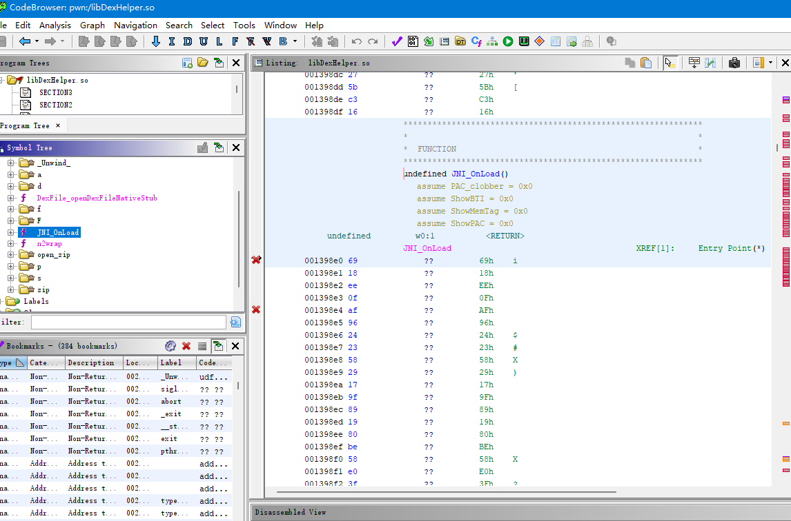

ghidra 看起来能分析出 elf 的符号，但是竟然反编译不出来。

一开始我以为 ghidra 没有正确分析出符号的位置，尝试自己分析。

先看一看 ELF Header ：


可以发现，section header 的字符串表已经被破坏，偏移为 1 ，难怪找不到节名。

于是我尝试在 section 中找 dynamic 段。

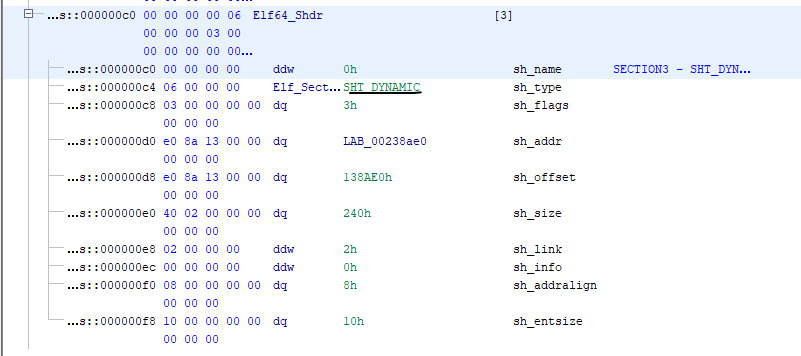

可以看到一个叫 SHT_DYNAMIC 的段，ghidra 已经贴心地给我们标好了位置，跳过去看一看：

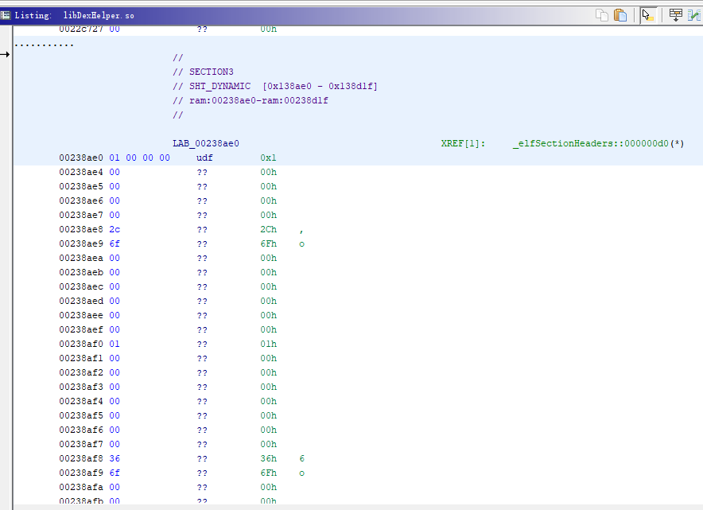

但是 ghidra 没有认为它是 dynamic 段格式，所以我自作聪明地帮它选了：

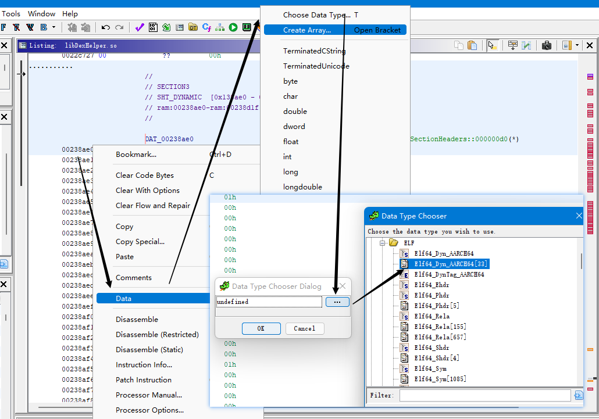

结果发现这个「dynamic section」竟然只有 7 个 DT_NEEDED，一个 SONAME ，剩下的全是 DT_NULL ！

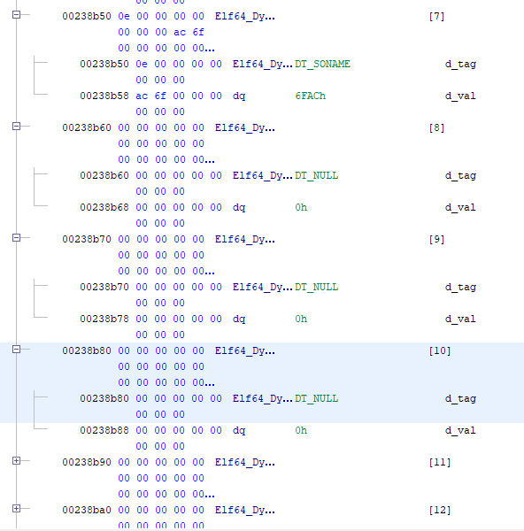

假如动态段真的只有这些内容，那不太可能运行代码，我尝试在这些 DT_NEEDED 中寻找突破口，但发现这些都是系统库，并没有引入 apk 中其他 so 作为依赖：

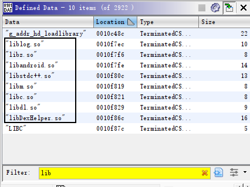

既然 dynamic 段没有东西，那 ghidra 到底怎么分析出这些符号的呢？我又看到程序头中 dynamic 段的信息：

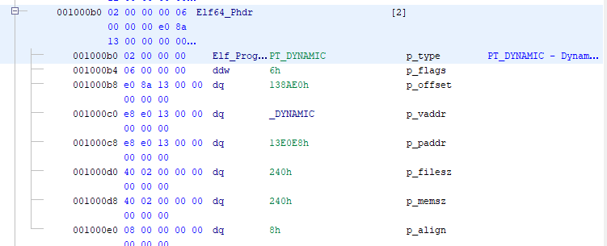

可以发现，dynamic 段位于文件偏移 `0x138ae0` 的位置，加载到地址 `0x13e0e8` 上。

回顾 section header 的信息：dynamic 节位于 `0x138ae0` ，加载地址是 `0x138ae0` 。

看上去文件偏移是一致的，但是地址却不同。

于是我跟着 ghidra 跳到 dynamic 段的位置，发现这个段才是真正的动态段，包含了我们需要的符号信息：

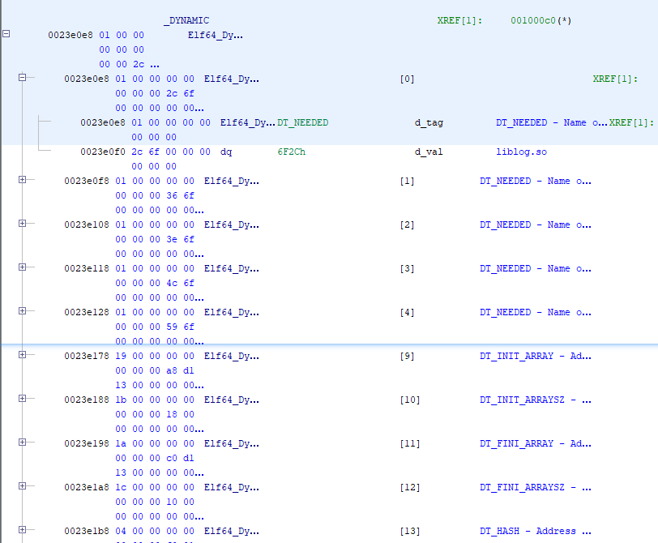

显然，这里的地址和上面是不同的。由于 ghidra 不会显示文件偏移，我们只好在其他二进制编辑器中比较它们的区别：

假「动态节」的文件偏移 `0x138ae0` ：

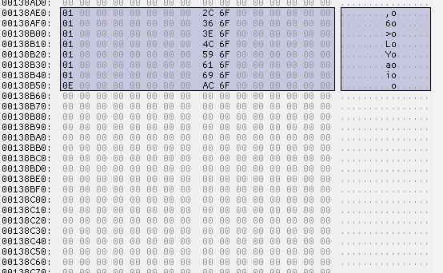

真「动态段」的文件偏移 `0x12e0e8`：

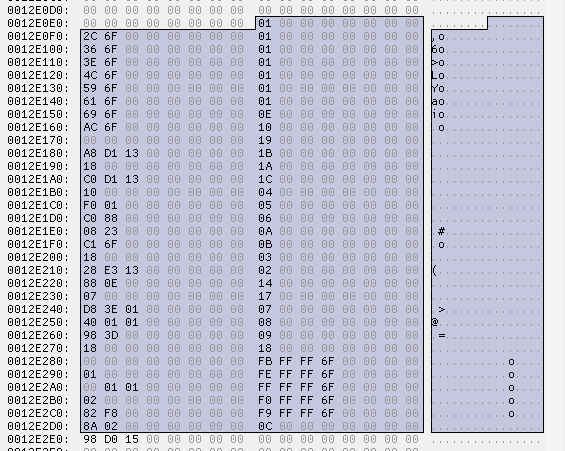

看上去，section header 和 program header 都引导我们到了一个假的动态段，那么真正的动态段的文件偏移是怎么来的呢？

分析 linker 源码发现，实际上只有 LOAD 段的文件偏移是有用的，而 DYNAMIC 段的 vaddr 就相对已 load 的部分的 vaddr ，也就是说，它的文件偏移可以不正确。

```
  Type           Offset             VirtAddr           PhysAddr
                 FileSiz            MemSiz              Flags  Align
  LOAD           0x0000000000000000 0x0000000000000000 0x0000000000000000
                 0x000000000012c728 0x000000000012c728  R E    0x10000
  LOAD[DYNAMIC]  0x000000000012d1a8 0x000000000013d1a8 0x000000000013d1a8
                 0x000000000000a0e0 0x000000000001f4f0  RW     0x10000
  DYNAMIC        0x0000000000138ae0 0x000000000013e0e8 0x000000000013e0e8
                 0x0000000000000240 0x0000000000000240  RW     0x8
  GNU_EH_FRAME   0x000000000011d11c 0x000000000011d11c 0x000000000011d11c
                 0x0000000000001bdc 0x0000000000001bdc  R      0x4
  LOAD           0x0000000000138078 0x000000000015d078 0x000000000015d078
                 0x0000000000000a54 0x0000000000000a54  R E    0x1000
```

DYNAMIC 所在的 vaddr 是 `0x13e0e8` ，位于第二个 load 段，它的 vaddr 范围是 `0x13d1a8 ~ 0x15c698` ，对应文件偏移 `0x12d1a8 ~ 0x137288`。DYNAMIC 和该 load 段的的文件偏移之差与 vaddr 之差应该相等，所以 DYNAMIC 的文件偏移就是 `0x12d1a8 + (0x13e0e8 - 0x13d1a8) = 0x12e0e8`

这么一通分析下来，发现 ghidra 的分析是没错的，至少它找对了 dynamic 段。

但是为什么 `JNI_OnLoad` 的反编译失败呢？显然是加固做了代码保护，如某种加密。

我们看一看 `DT_INIT` 指向的函数，这里是程序的入口，并没有被保护：

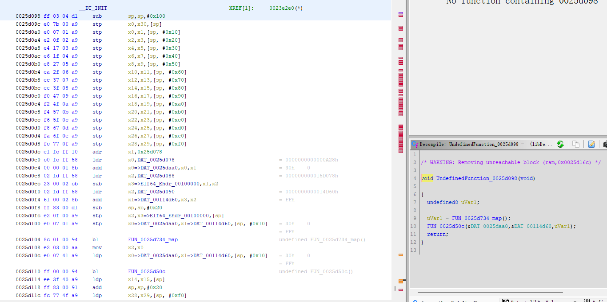

## 终极尝试：
