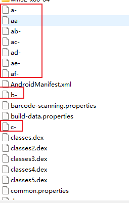
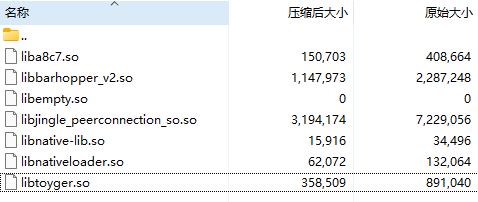
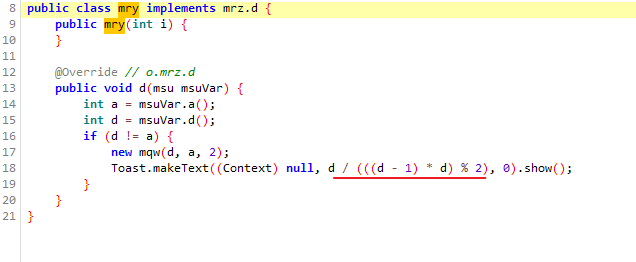
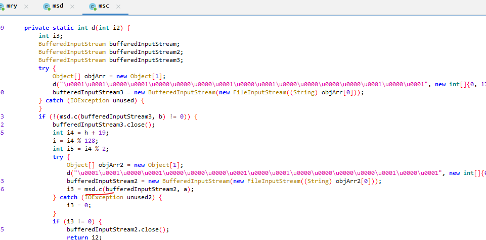
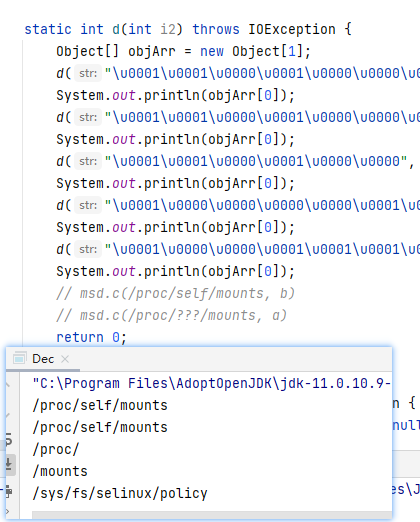

# 分析 livin

## 发现

最近 Magisk delta 作者宣称自己发现了一个 app ，疑似拥有最先进的检测手段，它可以检测到对 mount namespace 曾经的和现在的任何修改，并在检测到修改时阻止程序运行。

[New version 30/09/2022 of Livin by Madiri seems to completely defeat Magisk and any hide method · Issue #23 · HuskyDG/magisk-files](https://github.com/HuskyDG/magisk-files/issues/23)

看起来似乎是越南的某银行 app ，可以在 play 上获取最新版，包名 `id.bmri.livin` 。

`https://play.google.com/store/apps/details?id=id.bmri.livin`

delta 作者进行了多次尝试，发现如果 `magisk --stop` ，或者在 zygote 的 ns 中 umount 所有内容，app 可以正常启动（并且可以在有 riru 的情况下启动，看上去不检测代码注入？）；然而，任何对 app ns 进行操作(mount, umount)的行为都导致无法启动，包括 magisk hide ，zygisk denylist ，shamiko，SR 等。并且，试图进入(setns) app 的 mount ns 也会导致崩溃。

> 看起来目前为止只有 magisk lite 能过

刚好最近结束了 maru 的开发，抱着试一试的心态看看 maru 能不能通过，结果很悲剧，不能。

这 App 成功地激怒了我！看来这下非得把它扒得底裤不剩了。

## 猜测

在没有实际逆向之前，先从可行性上对 delta 的作者的猜测分析一下：

1. 检测到进入 ns ，有可能是利用 inotify 监听对 `/proc/self/ns/mnt` 的 access 。  
2. 检测 mount ，有可能是研究了更加深层的系统机制，比如挂载点的 id 分配机制，或者 /proc 的其他有关的信息暴露了 mount 被修改的信息（如 fdinfo 的 mnt_id）。  

## 初步观察

观察 app 注册的进程，竟然只有一个 app 主进程，没有 app zygote 或者 isolated 进程。

在我的 maru 的环境下，无论有没有对它开启 denylist 都无法启动，并且进程死亡原因都是 java 异常，发生在 Activity onCreate 的时候。

```log
10-05 16:14:54.262 15782 15782 E AndroidRuntime: Caused by: java.lang.ArithmeticException: divide by zero
10-05 16:14:54.262 15782 15782 E AndroidRuntime:        at o.mry.d(Unknown Source:21)
10-05 16:14:54.262 15782 15782 E AndroidRuntime:        at o.mrz.c(:1744)
10-05 16:14:54.262 15782 15782 E AndroidRuntime:        at o.mrz.c(:1467)
10-05 16:14:54.262 15782 15782 E AndroidRuntime:        at java.lang.reflect.Method.invoke(Native Method)
10-05 16:14:54.262 15782 15782 E AndroidRuntime:        at com.bankmandiri.md.presentation.ui.MainActivity.onCreate(Unknown Source:2693)
```

调用栈中有一些看上去是混淆的类名 `o.mr*` ，虽然 app dex 中大部分类也是被混淆成这样的名字，但这些类并未出现在 app dex 中。结合下面的反射调用，推测是从别处加载了 dex 。在 apk 的根目录下有大量命名为字母和 `-` 组成的奇怪的文件，开头是 java 类名，后面是看不出格式的二进制数据，这些有可能是被加密的 dex 。



此外，delta 作者所说的「对 zygote hide 了就可以打开 app」，在我这里也不起作用。不过可能因为他用的是他的 delta 。

app 中有 native lib ，不过是支持 x86-64 （这玩意竟然没有分包发布）；不过在 A12 的 userdebug 模拟器上也打不开，死亡原因类似，但是没有那几个混淆类的调用。



native libs 一览。其中 libtoyger 似乎是阿里的库；libempty 如其字面意思，是空的，不知道什么意图。通过 strings 寻找可读的字符串，没有 mount 的内容，proc 倒是有。

## strace

假定 app 不检测 ptrace （实际上不太可能，这个检测应该很常规），用 strace 分别抓取了全量的系统调用和单独的 read 系统调用。

首先等待 setargv0 ，然后 sigstop ， strace ，sigcont （这么粗糙的手段居然还是有用的，代码抄自 delta 作者）

```c
while ! pidof id.bmri.livin; do     sleep 0.01; done;killall -SIGSTOP id.bmri.livin
# strace -p 19425 -f -o $D/wtf.log
# strace -p 20626 -f -e read -yy -k -o $D/wtf2.log
killall -SIGCONT id.bmri.livin
```

先看看全量记录：

和 mounts 相关的：观察到在主线程打开过 /proc/self/mounts

```
19425 openat(AT_FDCWD, "/proc/self/mounts", O_RDONLY <unfinished ...>
```

整个记录只找到了两个 `mounts` ，也没有 mountinfo ，其实我不太理解 mounts 里面能有什么信息暴露的。

其他：检测了一系列 su 目录，还打开了个 shell 调用 `ps -A` ……

```c
19425 openat(AT_FDCWD, "/data/local/su", O_RDONLY|O_PATH) = -1 ENOENT (No such file or directory)
19425 openat(AT_FDCWD, "/data/local/bin/su", O_RDONLY|O_PATH) = -1 ENOENT (No such file or directory)
19425 openat(AT_FDCWD, "/data/local/xbin/su", O_RDONLY|O_PATH) = -1 ENOENT (No such file or directory)
19425 openat(AT_FDCWD, "/sbin/su", O_RDONLY|O_PATH) = -1 ENOENT (No such file or directory)
19425 openat(AT_FDCWD, "/system/bin/su", O_RDONLY|O_PATH) = -1 ENOENT (No such file or directory)
19425 openat(AT_FDCWD, "/system/bin/.ext/su", O_RDONLY|O_PATH) = -1 ENOENT (No such file or directory)
19425 openat(AT_FDCWD, "/system/bin/failsafe/su", O_RDONLY|O_PATH) = -1 ENOENT (No such file or directory)
19425 openat(AT_FDCWD, "/system/sd/xbin/su", O_RDONLY|O_PATH) = -1 ENOENT (No such file or directory)
19425 openat(AT_FDCWD, "/system/usr/we-need-root/su", O_RDONLY|O_PATH) = -1 ENOENT (No such file or directory)
19425 openat(AT_FDCWD, "/system/xbin/su", O_RDONLY|O_PATH) = -1 ENOENT (No such file or directory)
19425 openat(AT_FDCWD, "/usr/bin/su", O_RDONLY|O_PATH) = -1 ENOENT (No such file or directory)
19425 openat(AT_FDCWD, "/su/bin/su", O_RDONLY|O_PATH) = -1 ENOENT (No such file or directory)

19464 faccessat(AT_FDCWD, "/system/app/Superuser.apk", F_OK <unfinished ...>

19571 execve("/product/bin/sh", ["sh"], 0x7fedba19c0 /* 17 vars */) = -1 ENOENT (No such file or directory)
19571 execve("/apex/com.android.runtime/bin/sh", ["sh"], 0x7fedba19c0 /* 17 vars */) = -1 ENOENT (No such file or directory)
19571 execve("/apex/com.android.art/bin/sh", ["sh"], 0x7fedba19c0 /* 17 vars */) = -1 ENOENT (No such file or directory)
19571 execve("/system_ext/bin/sh", ["sh"], 0x7fedba19c0 /* 17 vars */) = -1 ENOENT (No such file or directory)
19571 execve("/system/bin/sh", ["sh"], 0x7fedba19c0 /* 17 vars */ <unfinished ...>

19425 write(78, "ps -A\n", 6 <unfinished ...>
```

然后是 read 调用，开启了 fd 解析和 stacktrace ：

```c
20626 read(79</proc/20626/mounts>, "/dev/block/dm-5 / ext4 ro,seclab"..., 8192) = 3925
 > /apex/com.android.runtime/lib64/bionic/libc.so(read+0x8) [0xd6818]
 > /apex/com.android.art/lib64/libjavacore.so(_ZL15Linux_readBytesP7_JNIEnvP8_jobjectS2_S2_ii+0x9f) [0x2a5cf]
 > /apex/com.android.art/javalib/arm64/boot-core-libart.oat(art_jni_trampoline+0xc7) [0x16d27]
 > /apex/com.android.art/javalib/arm64/boot-core-libart.oat(art_jni_trampoline+0xc7) [0x16d27]
 > /apex/com.android.art/javalib/core-oj.jar() [0x7c2b8fb6e0]
 > /apex/com.android.runtime/bin/linker64() [0xb3fffffffe98967f]
 > No DWARF information found
```

主线程调用了 read 读取 /proc/pid/mounts ，这回不是 self 而是 pid （很奇怪找不到 self 的）；此外从调用栈来看似乎来自 java 代码而非 native 。

```c
20626 read(79</proc/20626/maps>, "7c1cac2000-7c1cac4000 ---p 00000"..., 100) = 100
 > /data/app/~~FBF2lqwDb4PcfSA74OhDrw==/id.bmri.livin-iF8qk7PemqeNFnZYde2XSw==/lib/arm64/liba8c7.so() [0x17ee4]
 > /data/app/~~FBF2lqwDb4PcfSA74OhDrw==/id.bmri.livin-iF8qk7PemqeNFnZYde2XSw==/lib/arm64/liba8c7.so() [0x15e0f]
 > /data/app/~~FBF2lqwDb4PcfSA74OhDrw==/id.bmri.livin-iF8qk7PemqeNFnZYde2XSw==/lib/arm64/liba8c7.so(Java_o_mrl_a+0x6eb) [0x3216f]
 > /apex/com.android.art/lib64/libart.so(art_quick_generic_jni_trampoline+0x97) [0x13ced7]
 > /apex/com.android.art/lib64/libart.so(art_quick_invoke_static_stub+0x23b) [0x1337eb]
```

还有 native 代码在检查 maps 。

## dump dex

看起来检测 mount 的逻辑有可能在 java 层，但是直接在 app dex 搜索 mount 也一无所获，当然有可能是上了字符串加密。

但是从 app 死亡的错误调用栈也说明确实存在动态加载的 dex ，因此还是要试一试的。

注意到 app 崩溃的时候有可能出现系统的「屡次崩溃」弹窗，而这个时候 app 进程暂时还没死亡，于是直接在这个阶段找 dex （在模拟器上进行的，其实也可以考虑注入让 app 发生崩溃而不死亡）：

```
emulator64_x86_64:/ # grep dalvik-DEX /proc/3595/maps
76153690a000-76153692b000 r--p 00000000 00:00 0                          [anon:dalvik-DEX data]
76185b1f7000-76185b1fb000 r--p 00000000 00:00 0                          [anon:dalvik-DEX data]
```

找到两个看着很像 DexFile 的内存映射区域，dump 之：

```
dd if=/proc/3595/mem bs=1c count=135168 skip=129833481838592 > /data/local/tmp/a.dex
dd if=/proc/3595/mem bs=1c count=16384 skip=129846980079616 > /data/local/tmp/b.dex
```

得到一大一小两个 dex ，暂且命名为 a.dex 和 b.dex 。

在 a.dex 中果然找到了缺失的类 `o.mry`, `o.mrz` ：


不过其中的代码却令人捉摸不透：



这段代码看起来必然会 divide by zero ，但是作为 Toast 的参数又是什么意思？

也许这个 toast 只是迷惑人的，a 和 d 的值或许才是判断环境的依据。暂且抛开这些不管，我们看看这个 dex 有没有检测 mount 的逻辑。

直接搜索 mount 字符串没有任何有用的信息，我们换个思路：java 读取文件，肯定得 read 吧。搜索发现只有 `o.msd#c` 方法调用了 `BufferedInputStream.read` （读取一个字节）。

进一步跟踪，发现 `o.msd#c` 被 `o.msc#d(int)` 调用。



而方法 d 中有打开文件的行为，调用了另一个 d 方法进行了似乎是字符串解密的工作，解密的字符串被放在一个 `Object[1]` 中传给调用者。

这个字符串解密的反编译代码还算完好，而且涉及到的类不多，复制到 IDEA 简单修复一下，编译运行，得到了原文：



其中就有我们要找的 mounts ！

有了这些信息，我们就大致知道 `d(int)` 方法是在干什么了。看起来它打开了 `/proc/self/mounts` 做了一些检查，然后又列出 `/proc` 下的所有文件，打开 `/proc/pid/mounts` 做一些检查，而检查的方法就是 `o.msd#c` 。

`msd#c` 大概是一个检测字符串存在特定 hash 的函数，而 hash 的算法(`msd#a`)则是依次将字符左移 5 位，再按位异或，最后按位与 `0x3fffffff` ，实际上只能包含 6 个字节的信息。

```java
    private static long a(long n, int n2, final long n3, final char c) {
        final int n4 = msd.a + 113;
        msd.d = n4 % 128;
        final int n5 = 0;
        if (n4 % 2 != 0) {
            n = ((n << n2 ^ (long)c) & n3);
        }
        else {
            n = ((n << n2) - c ^ n3);
        }
        n2 = msd.d + 56 - 1;
        msd.a = n2 % 128;
        if (n2 % 2 != 0) {
            n2 = n5;
        }
        else {
            n2 = 1;
        }
        if (n2 != 1) {
            try {
                throw new NullPointerException();
            }
            finally {}
        }
        return n;
    }

    public static int c(final BufferedInputStream bufferedInputStream, final long[] array) {
        final int d = msd.d;
        msd.a = (d + 0x77) % 128;
        long n = 0L;
        while (true) {
            try {
                Label_0024:
                while (true) {
                    final int read = bufferedInputStream.read();
                    int n2;
                    if (read != -1) {
                        n2 = 71;
                    }
                    else {
                        n2 = 2;
                    }
                    if (n2 == 2) {
                        final int d2 = msd.d;
                        msd.a = (d2 + 0x31) % 128;
                        msd.d = (msd.a + 115) % 128;
                        return 0;
                    }
                    final int a = msd.a;
                    msd.d = (a + 0x6f) % 128;
                    final long a2 = a(n, 5, 0x3fffffffL, (char)read);
                    int n3 = 0;
                    while (true) {
                        n = a2;
                        if (n3 >= array.length) {
                            continue Label_0024;
                        }
                        if (a2 == array[n3]) {
                            break;
                        }
                        n3++;
                    }
                    final int n5 = msd.a + 121;
                    msd.d = n5 % 128;
                    int n6;
                    if (n5 % 2 == 0) {
                        n6 = 93;
                    }
                    else {
                        n6 = 10;
                    }
                    if (n6 != 10) {
                        throw new ArithmeticException("divide by zero");
                    }
                    return n3 + 1;
                }
            }
            catch (final IOException ex) {
                continue;
            }
        }
    }
```

`msc` 中有两组 hash 会传入到 c 中。

```java
        b = new long[]{472001035, -601740789};
        a = new long[]{221583250, 341780918};
```

反推这些 hash 比较困难，于是把这个函数复刻了一下，然后直接把有 magisk 的和 revert 过的 mounts 喂给它。

对比 msd#c 计算出 hash 的位置来看，`b[0]` 也就是 `472001035` 对应 `magisk` ，而 `a[0]` 也就是 `221583250` 对应 `hidepid=2` (`epid=2`) 。剩下两个暂不明确。替换掉 magisk 和 epid=2 后，无法找到剩下两个 hash 。

有 magisk 自然是意料之中，但是 `hidepid=2` 比较奇怪。这个参数是用于 procfs 的，用于向非特权进程隐藏 proc 中的 pid ，并且它的出现应该很正常。

因此我觉得这部分大概率不是重点，有可能有其他地方检测 mounts 。

而且我也不知道它还有没有其他的检测手段。考虑过 data 包名探测，直接卸载 magisk app （新的没随机包名），但是我现在的系统似乎对 API30 已经开启了 data 防护；考虑过 props ，手动 resetprop magisk 的 init.svc ，这些全都不起作用。至于有没有可能通过 keymaster 检测也未知（在模拟器上报了不少和密钥有关的错误），甚至可能还有 adb 检测，或者是干脆限制特定地区使用……这些都有可能。仅从 delta 作者的一面之词，并不能确定它就是检测到了 mount 被修改。

所以还是暂时摆烂了……
