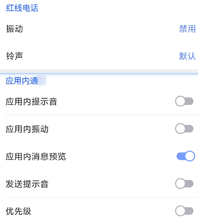
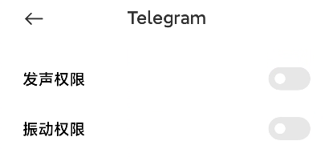
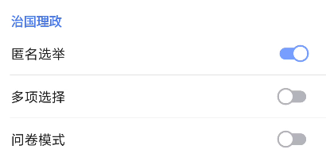

# 烦人的振动

Telegram 相比国内一众 App ，振动反馈十分充足，然而也给我带来了不少尴尬——因为深夜在宿舍刷 TG ，不小心碰到个地方都会有个振动反馈，并且我的手机振动又很「大声」，总觉得会给其他人带来不好的影响——起码我是这么认为的。

但是当我试图关闭这些振动反馈，却发现没那么简单：

首先，应用内的「振动」开关似乎全都关上了：



然后，「通知」的「振动权限」也关掉了——虽然这个是属于通知的；并且 Android 或 MIUI 似乎都没有应用的「振动权限」一说，起码设置没有。



最后，我长期晚上开着「勿扰」模式，但是也没法阻止这个振动。

就拿最常用的例子，发生振动的源头是左划消息回复，以及投票的选项。



前者是的振动时间较段，后者则较长，且幅度也更大。这两个振动都无法关掉。

尝试寻找系统服务里面有没有 vibrator ：

```
# service list|grep vib
16      android.hardware.vibrator.IVibrator/default: [android.hardware.vibrator.IVibrator]
66      external_vibrator_service: [android.os.IExternalVibratorService]
207     vibrator: [android.os.IVibratorService]
```

最后一个看上去是向应用层提供的，实现了 ShellCommand ，但是没什么对我有用的命令：

```
# cmd vibrator
Vibrator commands:
  help
    Prints this help text.

  vibrate duration [description]
    Vibrates for duration milliseconds; ignored when device is on
    DND (Do Not Disturb) mode; touch feedback strength user setting
    will be used to scale amplitude.
  waveform [-d description] [-r index] [-a] duration [amplitude] ...
    Vibrates for durations and amplitudes in list; ignored when
    device is on DND (Do Not Disturb) mode; touch feedback strength
    user setting will be used to scale amplitude.
    If -r is provided, the waveform loops back to the specified
    index (e.g. 0 loops from the beginning)
    If -a is provided, the command accepts duration-amplitude pairs;
    otherwise, it accepts durations only and alternates off/on
    Duration is in milliseconds; amplitude is a scale of 1-255.
  prebaked [-b] effect-id [description]
    Vibrates with prebaked effect; ignored when device is on DND
    (Do Not Disturb) mode; touch feedback strength user setting
    will be used to scale amplitude.
    If -b is provided, the prebaked fallback effect will be played if
    the device doesn't support the given effect-id.
  capabilities
    Prints capabilities of this device.
  cancel
    Cancels any active vibration
Common Options:
  -f - Force. Ignore Do Not Disturb setting.
```

振动虽然有个 `android.permission.VIBRATE` 的权限，但是这个应该类似于网络权限，无法 pm revoke 掉。

```
# pm revoke org.telegram.messenger android.permission.VIBRATE

Exception occurred while executing 'revoke':
java.lang.SecurityException: Permission android.permission.VIBRATE requested by org.telegram.messenger is not a changeable permission type
```

思路转移到另一个「管理权限」的东西： AppOps 。在 appops 中也有 vibrate 权限！

```
# appops get org.telegram.messenger VIBRATE
VIBRATE: allow; time=+9h57m39s866ms ago; duration=+121ms
# appops set org.telegram.messenger VIBRATE deny
```

设置之后，左划消息不再产生振动了，然而投票选项的长振动仍然存在。

观察 `dumpsys vibrator` ，发现这个振动的来源并非 telegram ，而是 Android ！

```
# 左划消息的振动
    , mAddedTime: 2022-09-17 00:51:59, effect: Waveform{mTimings=[80, 25, 15], mAmplitudes=[15, 0, 255], mRepeat=-1}, usageHint: 18, uid: 10256, opPkg: org.telegram.messenger, foreground: true
# 投票选项的振动
    , mAddedTime: 2022-09-17 10:47:37, effect: OneShot{mDuration=40, mAmplitude=-1}, usageHint: 18, uid: 1000, opPkg: android, foreground: false
```

对此，解决方法是 appops 禁用 android 的 VIBRATE 权限，不过这么一来或许某些必要的振动也无法听到了。

但是这个振动到底来自哪里呢？我们拿出祖传的 frida helper hook 一下 VibratorService 。

这个服务位于 system_server ，不过随着版本变迁改了几次名。

```js
// aidl
android.os.IVibratorService -> android.os.IVibratorManagerService
// 系统服务
com.android.server.VibratorService -> com.android.server.vibrator.VibratorManagerService
```

Android 11 用的是左边的。

```js
VS=use('com.android.server.VibratorService')
t=trace(VS.vibrate)
```

得到调用栈：

```js
  com.android.server.VibratorService.vibrate(Native Method)
  android.os.SystemVibrator.vibrate(SystemVibrator.java:245)
  android.os.Vibrator.vibrate(Vibrator.java:397)
  android.os.Vibrator.vibrate(Vibrator.java:306)
  android.os.Vibrator.vibrate(Vibrator.java:286)
  miui.util.VibrateUtils.vibrate(VibrateUtils.java:87)
  miui.util.HapticFeedbackUtil.performHapticFeedback(HapticFeedbackUtil.java:357)
  miui.util.HapticFeedbackUtil.performHapticFeedback(HapticFeedbackUtil.java:322)
  miui.util.HapticFeedbackUtil.performHapticFeedback(HapticFeedbackUtil.java:295)
  com.android.server.policy.BaseMiuiPhoneWindowManager.performHapticFeedback(BaseMiuiPhoneWindowManager.java:1945)
  com.android.server.wm.Session.performHapticFeedback(Session.java:270)
  android.view.IWindowSession$Stub.onTransact(IWindowSession.java:1050)
  com.android.server.wm.Session.onTransact(Session.java:141)
  android.os.Binder.execTransactInternal(Binder.java:1154)
  android.os.Binder.execTransact(Binder.java:1123)
```

这是来自 `IWindowSession#performHapticFeedback` ，虽然调用栈有 MIUI ，不过是原生的功能。

所谓「Haptic Feedback」，就是触摸反馈，这是 View 的一个属性。

[android - How to enable haptic feedback on button view - Stack Overflow](https://stackoverflow.com/questions/2228151/how-to-enable-haptic-feedback-on-button-view/13152567#13152567)

相关的属性和方法：

```
android.view.View:
android:hapticFeedbackEnabled
setHapticFeedbackEnabled(boolean)
performHapticFeedback
```

至于这个东西到底怎么关闭，我也很迷惑，因为「声音与振动」里面的「点按振动」就是关闭的，但是 TG 还能振。不过稍微看了一下 View 的源码，发现这个设置好像也可以被忽略。目前屏蔽振动的方法是写一个定时任务用 appops 禁用和启用 android 的 VIBRATE 权限。
