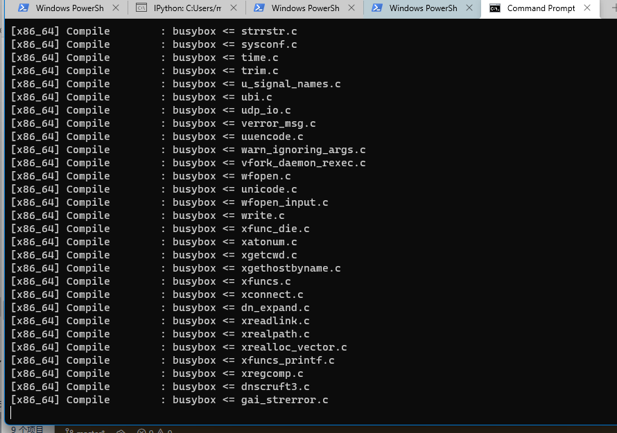
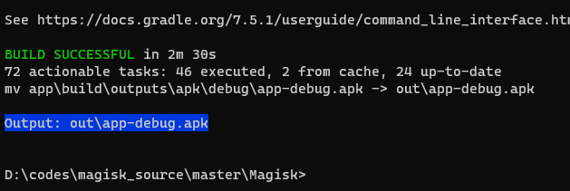

# Windows 上构建 Magisk 踩坑  

你以为 magisk 的构建只要简单的 `python build.py all` 吗？

## ONDK

一上来就报错：NDK 找不到。我以为 Magisk 用的 Android NDK ，自己的 NDK 已经下了十甚至九个版本怎么会找不到，仔细一看，发现用的是自己造的轮子 `ONDK`

[topjohnwu/ondk: Oxidized NDK - NDK repackaged with Rust toolchain](https://github.com/topjohnwu/ondk)

考虑到用 `build.py ndk` 下载可能会很慢，因此自己找对版本下载了，然后解压到 `$ANDROID_SDK_ROOT/ndk/magisk` 即可。

## jlink

构建 stub 的时候报错 jlink 找不到，原来自己系统用的 LibericaJRE-16 竟然没这个玩意。

干脆用 AS 的 JDK:

```bat
:: magiskenv.bat
@echo off
set _PATH=%PATH%
set PATH=C:\Program Files\Android\Android Studio\jre\bin;%_PATH%
set ANDROID_SDK_ROOT=C:\Users\mspri\AppData\Local\Android\Sdk
set JAVA_HOME=C:\Program Files\Android\Android Studio\jre

cmd /c%*

set PATH=%_PATH%
```

## cxx、 git symbolic link 与 Windows

stub 构建顺利通过，接下来是 native ，然而很快又出了个问题：

```
Caused by:
  process didn't exit successfully: `D:\codes\magisk_source\master\Magisk\native\src\external\cxx-rs\target\release\build\cxxbridge-cmd-983ad08e8f052e4a\build-script-build` (exit code: 1)
  --- stderr

  ~~~~~~~~~~~~~~~~~~~~~~~~~~~~~~~~~~~~~~~~~~~~~~~~~~~~~~~~~~~~~~~~~
  When building `cxx` from a git clone, git's symlink support needs
  to be enabled on platforms that have it off by default (Windows).
  Either use:

     $ git config --global core.symlinks true

  prior to cloning, or else use:

     $ git clone -c core.symlinks=true https://github.com/dtolnay/cxx

  for the clone.

  Symlinks are only required when compiling locally from a clone of
  the git repository---they are NOT required when building `cxx` as
  a Cargo-managed (possibly transitive) build dependency downloaded
  through crates.io.
  ~~~~~~~~~~~~~~~~~~~~~~~~~~~~~~~~~~~~~~~~~~~~~~~~~~~~~~~~~~~~~~~~~
error: failed to compile `cxxbridge-cmd v1.0.72 (D:\codes\magisk_source\master\Magisk\native\src\external\cxx-rs\gen\cmd)`, intermediate artifacts can be found at `D:\codes\magisk_source\master\Magisk\native\src\external\cxx-rs\target`

cxxbridge-cmd installation failed!
```

看上去是仓库里有 symbol link ，而 Windows git 由于某种原因没有正确处理，导致报这个错。进一步发现这是个子模块 `cxx` 。

[dtolnay/cxx: Safe interop between Rust and C++](https://github.com/dtolnay/cxx)

按照提示，似乎只要执行 `git config --global core.symlinks true` 就能打开 symbolic link 的支持了。

于是输入，然后重新 `git submodule update --init --recursive` ……仍然报这个错。

`git config core.symlinks` 发现仓库的 config 是 `false` ，改了，删掉 `native/src/external/cxx` 再重复，还是一样。

原仓库 `gen/build/src` 下就有符号链接，检查了一下本地的，原本该是符号链接的文件在本地只是一个包含了路径的普通文件。

一度怀疑是用的长期不更新版本 git 导致的问题，然而这个版本 `2.2.28` ，看了一下 [release notes](https://github.com/git-for-windows/build-extra/blob/main/ReleaseNotes.md) ，早就支持了。并且我单独 git clone 这个仓库是有符号链接的。

[Symbolic Links · git-for-windows/git Wiki](https://github.com/git-for-windows/git/wiki/Symbolic-Links)

最后发现 `.git\modules\$module\config` 下有对每个模块的配置文件，其中 `core.symlinks` 还是 `false` ……

手动改了一下，再次 update ，总算过了这一关。

## Duplicated symbols

过了上面那一关，还有更难的：十万甚至九万个 duplicated symbols

```
...

ld: error: duplicate symbol: unshare
>>> defined in ./obj/local/x86_64/libcompat.a(objs/compat/compat/compat.o)
>>> defined in C:\Users\mspri\AppData\Local\Android\Sdk\ndk\magisk\build\..\toolchains\llvm\prebuilt\windows-x86_64\bin/../sysroot/usr/lib/x86_64-linux-android\libc.a(syscalls-x86_64.o)

ld: error: duplicate symbol: inotify_init1
>>> defined in ./obj/local/x86_64/libcompat.a(objs/compat/compat/compat.o)
>>> defined in C:\Users\mspri\AppData\Local\Android\Sdk\ndk\magisk\build\..\toolchains\llvm\prebuilt\windows-x86_64\bin/../sysroot/usr/lib/x86_64-linux-android\libc.a(syscalls-x86_64.o)

ld: error: duplicate symbol: getline
>>> defined in ./obj/local/x86_64/libcompat.a(objs/compat/compat/compat.o)
>>> defined in C:\Users\mspri\AppData\Local\Android\Sdk\ndk\magisk\build\..\toolchains\llvm\prebuilt\windows-x86_64\bin/../sysroot/usr/lib/x86_64-linux-android\libc.a(stdio.o)
clang++: error: linker command failed with exit code 1 (use -v to see invocation)
make: *** [C:/Users/mspri/AppData/Local/Android/Sdk/ndk/magisk/build/../build/core/build-binary.mk:670: obj/local/x86_64/magiskboot] Error 1

Build binary failed!
```

仔细一看，`build.py` 的 `setup_ndk` 下载解压后还有个 patch 的步骤，而我们没做。

我自然不想再让它下载了，手动修一下把下载的步骤跳过，然后 `build.py ndk` 执行修补

```py
def setup_ndk(args):
    os_name = platform.system().lower()
    ndk_ver = config['ondkVersion']
    url = f'https://github.com/topjohnwu/ondk/releases/download/{ndk_ver}/ondk-{ndk_ver}-{os_name}.tar.gz'
    ndk_archive = url.split('/')[-1]

    header(f'* Downloading and extracting {ndk_archive}')
    '''
    with urllib.request.urlopen(url) as response:
        with tarfile.open(mode='r|gz', fileobj=response) as tar:
            tar.extractall(ndk_root)

    rm_rf(ndk_path)
    mv(op.join(ndk_root, f'ondk-{ndk_ver}'), ndk_path)'''

    header('* Patching static libs')
    for target in ['aarch64-linux-android', 'arm-linux-androideabi',
                   'i686-linux-android', 'x86_64-linux-android']:
        arch = target.split('-')[0]
        lib_dir = op.join(
            ndk_path, 'toolchains', 'llvm', 'prebuilt', f'{os_name}-x86_64',
            'sysroot', 'usr', 'lib', f'{target}', '21')
        if not op.exists(lib_dir):
            continue
        src_dir = op.join('tools', 'ndk-bins', '21', arch)
        rm(op.join(src_dir, '.DS_Store'))
        shutil.copytree(src_dir, lib_dir, copy_function=cp, dirs_exist_ok=True)
```

改好后：

> 此处开了详细信息： `build.py -v all`



## YATTAZE！

正确配置的 build 执行得不算太慢，一会就出结果了：



编译好的 Magisk apk 和 stub 输出在 out 目录下。


在 emulator 跑一下：


