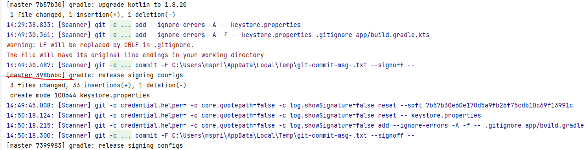
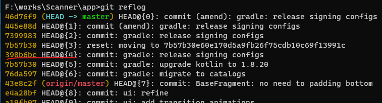
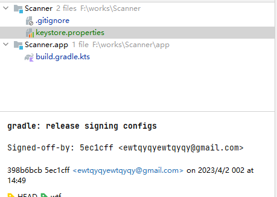
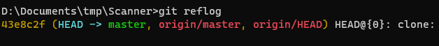

# 记年轻人的第一次 git 误提交

## 一切的开始

最近在写 android app 大作业的时候用到了 git 管理项目，今天给它加上了 release 的 signingConfigs ，方便在 gradle task 中自动签名。

我的 app 签名基本用的都是同一个 keystore 文件，里面有密码。写的时候直接从老项目复制了一个 keystore 过来。

然而我没注意创建文件的时候 keystore.properties 已经被 AS 自动 add 到缓存里面了。测试完成之后，直接提交，才发现我的 keystore 文件已经出现在了 git 的历史里面。

于是我赶紧把这个提交在 AS 的 git ui 里面给 undo 了，然后在 gitignore 补上 keystore ，重新提交——这样看起来好像就完事了。

泄露密码的危机这样就解决了吗？我想起以前看 git book 的时候有[这么一句话](https://git-scm.com/book/zh/v2/Git-%E5%9F%BA%E7%A1%80-%E6%92%A4%E6%B6%88%E6%93%8D%E4%BD%9C)：

> 记住，在 Git 中任何 **已提交** 的东西几乎总是可以恢复的。

因此事情或许没那么简单，不能这么草率地就 push 到 github 上了。

## 探究

[Git - 维护与数据恢复](https://git-scm.com/book/zh/v2/Git-%E5%86%85%E9%83%A8%E5%8E%9F%E7%90%86-%E7%BB%B4%E6%8A%A4%E4%B8%8E%E6%95%B0%E6%8D%AE%E6%81%A2%E5%A4%8D#_data_recovery)

回顾之前的操作，我们需要找到误提交那次的 hash ，由于它已经不在 master 分支上，因此找起来就麻烦了。

好在 AS 有一个 console ，里面记录了 git 命令的调用流程。



`398b6bc` 就是把 keystore 提交上去的那个 commit 。

使用 `git reflog` 查看，它果然还在：



把它 checkout 出来看看：

`git branch wtf 398b6bc`



在这个分支可以看到被提交上去的 keystore 和其中的密码。

观察到 reflogs 不仅包含了我们 undo 的那次提交，甚至还有以前 amend 的提交。那么这些 ref 到底会不会被推送到 remote 呢？

于是我从 github 上又 clone 了一份仓库下来，观察它的 reflog ，发现只有一条：



尝试 checkout 一个 amend 的提交，发现是不能的：

```
# 在原来工作的本地仓库 git reflog
073aec9 HEAD@{14}: commit (amend): generator: support share qrcode
8fe6c00 HEAD@{15}: commit: generator: support share qrcode

# 在新 clone 的本地仓库
D:\Documents\tmp\Scanner>git branch aa 8fe6c00
fatal: Not a valid object name: '8fe6c00'.

D:\Documents\tmp\Scanner>git branch aa 073aec9
```

看起来本地的 ref 并没有都推送到 remote 。

实际上，reflog 看到的是 local 仓库的 ref 记录。

[Git - git-reflog Documentation](https://git-scm.com/docs/git-reflog)

AS 中 undo commit 用的是 `reset --soft` ，那么这样推送到远程是否安全呢？查了几个回答，得到的答案都是肯定的：

[Can `git reset --soft` be used to undo secrets from a commit before pushing to a remote (Github)? - Stack Overflow](https://stackoverflow.com/questions/66129120/can-git-reset-soft-be-used-to-undo-secrets-from-a-commit-before-pushing-to-a)

从上面的实验来看，那些 amend 的提交仅存在于本地，从远程再拉回来是不存在的。这样总算可以大胆地 push 了。

## 后记

在仓库目录里面放 keystore 还是有些危险，一不小心就会出现这样的差错，好在 undo 还是有效的。

仔细想想，如果在 gradle 里面从 home 目录读取 keystore 也许会更好。
