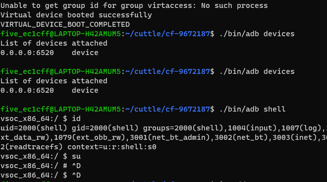
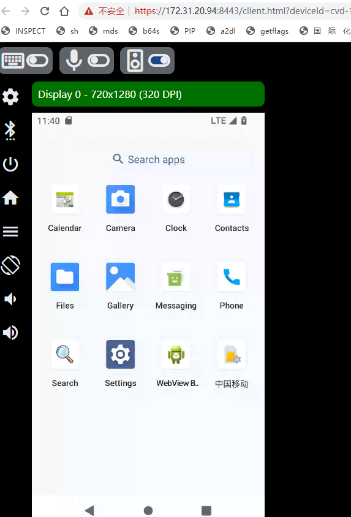
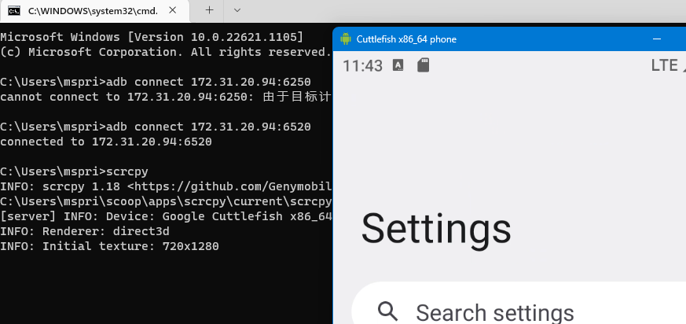
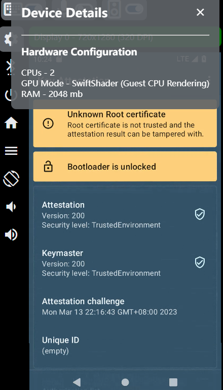
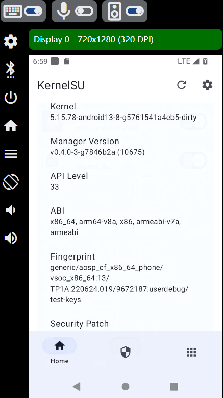
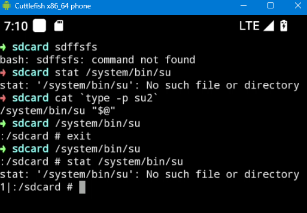

# 在 WSL 上使用 cuttlefish

## 虚拟化

本以为 wsl 没有 kvm 的，但是发现自己的 wsl 已经有了，应该是支持的。

## cuttlefish

[Use Cuttlefish to Launch an AOSP Build  |  Android Open Source Project](https://source.android.com/docs/setup/create/cuttlefish-use?hl=en)

### 下载镜像

在 http://ci.android.com/ 下载，这里我搜的是 `aosp-android13-gsi` 。

需要下载 `aosp_cf_x86_64_phone-img-xxxxxx.zip` 和 `cvd-host_package.tar.gz` 两个文件。

然后按照官方的指示操作即可，到这里看起来都还没什么大问题。

```
sudo apt install -y git devscripts config-package-dev debhelper-compat golang curl
git clone https://github.com/google/android-cuttlefish
cd android-cuttlefish
for dir in base frontend; do
  cd $dir
  debuild -i -us -uc -b -d
  cd ..
done
sudo dpkg -i ./cuttlefish-base_*_*64.deb || sudo apt-get install -f
sudo dpkg -i ./cuttlefish-user_*_*64.deb || sudo apt-get install -f
sudo usermod -aG kvm,cvdnetwork,render $USER
# WSL 没有 systemd ，没法 reboot ，所以我直接 wsl --shutdown 了
sudo reboot

mkdir cf
cd cf
tar -xvf /path/to/cvd-host_package.tar.gz
unzip /path/to/aosp_cf_x86_64_phone-img-xxxxxx.zip
```

安装完成后，可以在 cf 目录使用以下命令启动和停止 cvd：

```
# 启动
HOME=$PWD ./bin/launch_cvd --daemon
# 停止
HOME=$PWD ./bin/stop_cvd
```

接下来就是艰难的踩坑环节了……

### syslog

遇到的第一个错误。

```
launch_cvd I 03-07 18:46:44    51    51 main.cc:186] Host changed from last run: 1
assemble_cvd D 03-07 18:46:44    72    72 fetcher_config.cpp:212] Could not find file ending in kernel
assemble_cvd D 03-07 18:46:44    72    72 fetcher_config.cpp:212] Could not find file ending in initramfs.img
assemble_cvd I 03-07 18:46:44    72    72 config_flag.cpp:148] Launching CVD using --config='phone'.
assemble_cvd D 03-07 18:46:44    72    72 subprocess.cpp:335] Started (pid: 75): /home/five_ec1cff/cuttle/android-cuttlefish/cf-64-9672187/bin/extract-ikconfig
assemble_cvd D 03-07 18:46:44    72    72 subprocess.cpp:337] /home/five_ec1cff/cuttle/android-cuttlefish/cf-64-9672187/boot.img
GPU auto mode: did not detect prerequisites for accelerated rendering support, enabling --gpu_mode=guest_swiftshader.
Requested resuming a previous session (the default behavior) but the base images have changed under the overlay, making the overlay incompatible. Wiping the overlay files.
Failed to run `/home/five_ec1cff/cuttle/android-cuttlefish/cf-64-9672187/bin/crosvm create_qcow2 --backing_file=/home/five_ec1cff/cuttle/android-cuttlefish/cf-64-9672187/cuttlefish/assembly/os_composite.img /home/five_ec1cff/cuttle/android-cuttlefish/cf-64-9672187/cuttlefish/instances/cvd-1/overlay.img`
stdout:
###

###
stderr:
###
failed to initialize syslog: guess of fd for syslog connection was invalid

###
Return code: "1"
launch_cvd E 03-07 18:46:50    51    51 subprocess.cpp:160] Subprocess 72 was interrupted by a signal: 6
launch_cvd E 03-07 18:46:50    51    51 main.cc:243] assemble_cvd returned -1
```

[syslog - No logs are written to /var/log - Ask Ubuntu](https://askubuntu.com/questions/615457/no-logs-are-written-to-var-log)

WSL 的 rsyslog 服务没有自动启动，可以用下面的命令手动启动。

`sudo service rsyslog start`

### socket 长度

```
GPU auto mode: did not detect prerequisites for accelerated rendering support, enabling --gpu_mode=guest_swiftshader.
The following files contain useful debugging information:
  Serial console is disabled; use -console=true to enable it.
  Kernel log: /home/five_ec1cff/cuttle/android-cuttlefish/cf-64-9672187/cuttlefish/instances/cvd-1/kernel.log
  Logcat output: /home/five_ec1cff/cuttle/android-cuttlefish/cf-64-9672187/cuttlefish/instances/cvd-1/logs/logcat
  Point your browser to https://0.0.0.0:8443 to interact with the device.
  Launcher log: /home/five_ec1cff/cuttle/android-cuttlefish/cf-64-9672187/cuttlefish/instances/cvd-1/logs/launcher.log
  Instance configuration: /home/five_ec1cff/cuttle/android-cuttlefish/cf-64-9672187/cuttlefish/instances/cvd-1/cuttlefish_config.json
  Instance environment: /home/five_ec1cff/cuttle/android-cuttlefish/cf-64-9672187/.cuttlefish.sh
Unable to get group id for group virtaccess: No such process
Check failed: namelen <= sizeof(dest->sun_path) (namelen=111, sizeof(dest->sun_path)=108) MakeAddress failed. Name=/home/five_ec1cff/cuttle/android-cuttlefish/cf-64-9672187/cuttlefish/instances/cvd-1/internal/audio_server.sock is longer than allowed.
launch_cvd E 03-07 18:51:48   536   536 subprocess.cpp:160] Subprocess 911 was interrupted by a signal: 6
launch_cvd E 03-07 18:51:48   536   536 main.cc:271] run_cvd returned -1
```

稍微搜了一下源码，`Unable to get group id for group virtaccess` 没有问题。

下面的 socket 创建失败，仔细一看，是 socket 名字的长度超出了 unix 的限制(108 字节)

应该是我的路径太长了，移动到上级目录解决。

### kvm 权限

daemon 启动后，adb 没有设备，访问 8443 也是黑屏。

查看日志 `/home/five_ec1cff/cuttle/cf-9672187/cuttlefish/instances/cvd-1/logs/launcher.log` ，发现竟然有 800 多 M 。

```
config_server E 03-07 19:10:50 14132 14132 host_device_config.cpp:143] Unable to obtain the network configuration
config_server F 03-07 19:10:50 14132 14132 main.cpp:35] Check failed: device_config_helper Could not open device config
openwrt D 03-07 19:10:50  1581  1581 log_tee.cpp:75] `--seccomp-policy-dir=/home/five_ec1cff/cuttle/cf-9672187/usr/share/cuttlefish/x86_64-linux-gnu/seccomp` is deprecated, please use `--seccomp-policy-dir /home/five_ec1cff/cuttle/cf-9672187/usr/share/cuttlefish/x86_64-linux-gnu/seccomp`
openwrt D 03-07 19:10:50  1581  1581 log_tee.cpp:75] [2023-03-07T19:10:50.077084673+08:00 ERROR crosvm] crosvm has exited with error: failed to create kvm: Permission denied (os error 13)
crosvm D 03-07 19:10:50  1578  1578 log_tee.cpp:75] [2023-03-07T19:10:50.077423777+08:00 ERROR crosvm] crosvm has exited with error: failed to create kvm: Permission denied (os error 13)
run_cvd I 03-07 19:10:50  1564  1564 process_monitor.cc:118] Detected unexpected exit of monitored subprocess /home/five_ec1cff/cuttle/cf-9672187/bin/crosvm
run_cvd I 03-07 19:10:50  1564  1564 process_monitor.cc:120] Subprocess /home/five_ec1cff/cuttle/cf-9672187/bin/crosvm (14127) has exited with exit code 1
```

WSL 中 kvm 权限居然是这样的：

```
$ ls /dev/kvm -l
crw------- 1 root root 10, 232 Mar  7 18:34 /dev/kvm
```

手动修改，不过下次启动估计就没了，要研究一下怎么在开机的时候自动修改。

### 网络接口

日志里面有 `Unable to obtain the network configuration`

```
https://cs.android.com/android/platform/superproject/+/master:device/google/cuttlefish/host/commands/assemble_cvd/flags.cc;l=1144;drc=5ca657189aac546af0aafaba11bbc9c5d889eab3
```

sudo ifconfig 并没发现 cvd 开头的接口。

检查服务，说不定是本来该有的服务没启动导致的：

```
sudo service --status-all
 [ - ]  cuttlefish-host-resources
 [ - ]  cuttlefish-operator
```

尝试启动第一个，报错缺少 nvidia-modprobe:

```
sudo service  cuttlefish-host-resources start
/etc/init.d/cuttlefish-host-resources: 296: /usr/bin/nvidia-modprobe: not found
```

安装：

```
sudo apt install nvidia-modprobe
```

再次启动，这回终于有 cvd 的网络接口了，但是系统还是没法启动

### vsock

```
crosvm D 03-07 20:04:05 23854 23854 log_tee.cpp:75] [2023-03-07T20:04:05.311805004+08:00 ERROR crosvm] crosvm has exited with error: failed to set up virtual socket device: failed to open virtual socket device: No such file or directory (os error 2)
run_cvd I 03-07 20:04:05 23837 23837 process_monitor.cc:118] Detected unexpected exit of monitored subprocess /home/five_ec1cff/cuttle/cf-9672187/bin/crosvm
run_cvd I 03-07 20:04:05 23837 23837 process_monitor.cc:120] Subprocess /home/five_ec1cff/cuttle/cf-9672187/bin/crosvm (8886) has exited with exit code 1
```

https://cs.android.com/android/platform/superproject/+/master:external/crosvm/devices/src/virtio/vhost/vsock.rs;l=37;drc=5ca657189aac546af0aafaba11bbc9c5d889eab3

`/dev/vhost-vsock` ，检查发现文件不存在。

万不得已还得自己编译 wsl 内核，加上配置 `CONFIG_VHOST_VSOCK`

[microsoft/WSL2-Linux-Kernel: The source for the Linux kernel used in Windows Subsystem for Linux 2 (WSL2)](https://github.com/microsoft/WSL2-Linux-Kernel)

[如何让WSL2使用自己编译的内核 - 知乎](https://zhuanlan.zhihu.com/p/324530180)

[Advanced settings configuration in WSL | Microsoft Learn](https://learn.microsoft.com/en-us/windows/wsl/wsl-config#configure-global-options-with-wslconfig)

编译完成后把 `arch/x86/boot/bzImage` 拉出来，创建 `%UserProfile%\.wslconfig` ，添加如下配置即可使用自定义内核启动：

```
[wsl2]
kernel=path\\to\\wsl
```

这样 `/dev` 下就有 `vhost-vsock` 了，不过和 `/dev/kvm` 一样，也要记得修改用户组和权限。

### minijail

```
crosvm D 03-07 21:25:59  4897  4897 log_tee.cpp:75] crosvm[1]: libminijail[1]: cannot mount '/usr/lib' as '/var/empty/usr/lib' with flags 0x1001: Invalid argument
crosvm D 03-07 21:25:59  4897  4897 log_tee.cpp:75] crosvm[1]: libminijail[1]: mount_one failed with /dev at '(null)'
crosvm D 03-07 21:25:59  4897  4897 log_tee.cpp:75] [2023-03-07T21:25:59.518552751+08:00 INFO  devices::acpi] Listening on acpi_mc_group of acpi_event family
crosvm D 03-07 21:25:59  4897  4897 log_tee.cpp:75] [2023-03-07T21:25:59.628342254+08:00 ERROR crosvm::crosvm::platform] child pcivirtio-gpu (pid 5025) died: signo 17, status 251, code 1
crosvm D 03-07 21:25:59  4897  4897 log_tee.cpp:75] [2023-03-07T21:25:59.632154845+08:00 ERROR devices::proxy] failed write to child device process pcivirtio-gpu: failed to send packet: Broken pipe (os error 32)
crosvm D 03-07 21:25:59  4897  4897 log_tee.cpp:75] [2023-03-07T21:25:59.632389102+08:00 ERROR devices::proxy] failed to read result of Shutdown from child device process pcivirtio-gpu: tube was disconnected
webRTC E 03-07 21:25:59  4907  5023 server.cpp:375] Client closed the connection
webRTC E 03-07 21:25:59  4907  4930 server.cpp:375] Client closed the connection
webRTC E 03-07 21:25:59  4907  5022 server.cpp:375] Client closed the connection
crosvm D 03-07 21:26:00  4897  4897 log_tee.cpp:75] [2023-03-07T21:26:00.308153485+08:00 INFO  crosvm] crosvm has exited normally
run_cvd I 03-07 21:26:00  4879  4879 process_monitor.cc:118] Detected unexpected exit of monitored subprocess /home/five_ec1cff/cuttle/cf-9672187/bin/crosvm
run_cvd I 03-07 21:26:00  4879  4879 process_monitor.cc:120] Subprocess /home/five_ec1cff/cuttle/cf-9672187/bin/crosvm (5018) has exited with exit code 0
```

strace ：

```
[pid 23377] mount("/usr/lib", "/var/empty/usr/lib", 0x55d56e610be0, MS_RDONLY|MS_BIND, NULL <unfinished ...>
[pid 23377] <... mount resumed>)        = -1 EINVAL (Invalid argument)
```

源码大概在这里(AOSP)：

```
external/minijail/libminijail.c
external/crosvm/ 
```

这个进程会 unshare ns 然后 remount `MS_REC|MS_PRIVATE` ，然后绑定挂载一些目录。不知道为什么这个 mount 失败了。

本来打算用 gdb 抓一下看看到底是什么问题，网都铺好了：

[linux - gdb catch syscall condition and string comparisson - Stack Overflow](https://stackoverflow.com/questions/37743596/gdb-catch-syscall-condition-and-string-comparisson)

[Set Catchpoints (Debugging with GDB)](https://sourceware.org/gdb/onlinedocs/gdb/Set-Catchpoints.html)

[Forks (Debugging with GDB)](https://sourceware.org/gdb/onlinedocs/gdb/Forks.html)

```
set detach-on-fork off
catch syscall mount
condition 1 $_streq((char *)$rdi, "/usr/lib")
attach ${run_cvd}
```

但是根本等不到断点，仔细一看，竟然正常启动了。日志中也没再出现那个 mount 失败的记录。

不知道到底是什么魔法，难道我一用 gdb 威胁它就正常了？

既然现在能用了，我也暂时不深究，还是体验一下这个所谓的 cuttlefish 。



桌面甚至有个中国移动的 SIM 卡应用，不知道它怎么出现的。

WebRTC:



手感不是很好，非常卡，在主机用 scrcpy 看看：



也是一样卡，就比 WebRTC 好那么一点点。

## 体验

为了方便，写了一段自动准备 cuttlefish 运行所需环境的脚本（当然内核还是得自己编译的）

```sh
if [ "$(id -u)" != "0" ]; then
  echo "run as root"
  sudo $0 $*
  exit
fi

abort() {
  echo "failed: $1"
  exit 1
}

set_perm() {
  path=$1
  echo "changing permission of $path ..."
  chown root:kvm "$path" || abort "chown"
  chmod 660 "$path" || abort "chmod"
}

echo "Starting rsyslog ..."
service rsyslog start || abort "rsyslog"
echo "Starting cuttlefish host resource ..."
service cuttlefish-host-resources start || abort

set_perm /dev/kvm
set_perm /dev/vhost-vsock
```

说来也怪，自从上次成功启动后，这次的启动也正常了，没有再遇到 mount 的问题。

虽然之前觉得 WebRTC 卡，不过用久了还是能习惯的，毕竟 AVD 其实也没好到哪里去。

系统的配置默认是双核 2G 内存，里面甚至还有 TEE 环境。



## KernelSU

折腾 Cuttlefish 的目的其实也是为了方便研究 KernelSU 和其他内核相关的东西，那么现在就来装一个 ksu 吧！

但是 KSU 好像也没有提供 cuttlefish 的镜像，因此我们需要自己编译。

### 确定版本

按照以前的经验，首先的想法是找到当前内核在 android 仓库的的同一个提交，不然内核模块没法兼容。

/proc/version:

```
Linux version 5.15.78-android13-8-00014-gaa272796660e-ab9611439 (build-user@build-host) (Android (8508608, based on r450784e) clang version 14.0.7 (https://android.googlesource.com/toolchain/llvm-project 4c603efb0cca074e9238af8b4106c30add4418f6), LLD 14.0.7) #1 SMP PREEMPT Wed Feb 15 16:10:20 UTC 2023
```

版本号的 g 后面应该就是 commit hash 。

[android13-5.15 发布 build  |  Android 开源项目  |  Android Open Source Project](https://source.android.com/docs/core/architecture/kernel/gki-android13-5_15-release-builds?hl=zh-cn)

在历史记录里面确实有这个 commit (aa272796660e9fd9903bc6b13ffa25de53d99a8c)： https://android.googlesource.com/kernel/common/+/aa272796660e

不过现在是 GKI 内核，根据官方文档，其实不需要 commit 一致，只要 KMI 版本一致即可确保内核模块兼容（？）。

[GKI 版本控制  |  Android 开源项目  |  Android Open Source Project](https://source.android.com/docs/core/architecture/kernel/gki-versioning?hl=zh-cn)

那么我们的 KMI 版本应该是 `5.15-android13-8`

内核的 Version 和 PatchLevel 可以在 `common/Makefile` 看到，比如： https://android.googlesource.com/kernel/common/+/f4559cb66624fae88cdc34154c21979e58ce7c36/Makefile

但是我们怎么从内核源码知道当前的 Kmi Generation 呢？搜索 `KMI_GENERATION` ，发现在 `common/build.config.common` 里面。

例如 common-android13-5.15: https://android.googlesource.com/kernel/common/+/f4559cb66624fae88cdc34154c21979e58ce7c36/build.config.common

KMI_GENERATION 是 8 ，和我们的内核一致。

### 下载内核

[构建内核  |  Android 开源项目  |  Android Open Source Project](https://source.android.com/docs/setup/build/building-kernels?hl=zh-cn)

[Repo 命令参考资料  |  Android 开源项目  |  Android Open Source Project](https://source.android.com/docs/setup/create/repo?hl=zh-cn#init)

下载 repo ：

[repo](https://gerrit.googlesource.com/git-repo/+/HEAD/README.md)

```sh
mkdir -p ~/.bin
PATH="${HOME}/.bin:${PATH}"
curl https://storage.googleapis.com/git-repo-downloads/repo > ~/.bin/repo
chmod a+rx ~/.bin/repo
```

首次使用会先 clone repo 自己的源码

```
repo init -u https://android.googlesource.com/kernel/manifest -b common-android13-5.15
repo sync
```

经过漫长的等待……最后还是没下完，已经烧了 5G 梯子流量了。

参考 KernelSU gh actions workflow ，发现 repo 其实也可以指定 clone depth：

https://github.com/tiann/KernelSU/blob/5dd430e6a6cc7ca7e479d438354fb95abb3aafc8/.github/workflows/gki-kernel.yml

```
      - name: Setup kernel source
        run: |
          cd $GITHUB_WORKSPACE
          git clone https://gerrit.googlesource.com/git-repo
          mkdir android-kernel && cd android-kernel
          ../git-repo/repo init --depth=1 --u https://android.googlesource.com/kernel/manifest -b common-${{ inputs.tag }}
          ../git-repo/repo sync -j$(nproc --all)
```

### build

官方文档提到 A13 开始用 bazel 替代 build/build.sh ，不过没看明白怎么用。

ksu 的 ci 就是用 build.sh 的，因此直接抄过来。

https://github.com/tiann/KernelSU/blob/main/.github/workflows/gki-kernel.yml#L129

需要注意加上环境变量 `LTO=thin` ，如果不开，最后 LTO vmlinux 的时候会 OOM ，起码我的设备是这样的。

```sh
CCACHE=/usr/bin/ccache CCACHE_NOHASHDIR=true CCACHE_MAXSIZE=2G CCACHE_HARDLINK=true LTO=thin BUILD_CONFIG=common/build.config.gki.x86_64 build/build.sh
```

构建完成后产生了 `out/android13-5.15/dist/boot.img` ，直接拿到 cuttlefish 启动试试。

等了大约两分钟启动才成功（两分钟前内核日志都出来了），因此跑 cvd 还是太慢了。

加上 KernelSU 再编译，也能成功启动，ksu 成功激活。



### misc

另外很奇怪的一件事是，stat /system/bin/su 竟然找不到，按理来说授予权限后应该得到和 /system/bin/sh 一样的结果。不过 su 还是能正常执行的，包括 shell 和 app （下图为 MT 管理器）。



发现 zygisksu 的 zygiskd 挂了

```
03-14 19:19:12.524   550   550 I zygisksu: Start watchdog
03-14 19:19:12.694   541   541 I zygiskwd: zygiskd::watchdog: Start zygisksu watchdog
03-14 19:19:12.695   541   541 I zygiskwd: zygiskd::watchdog: Check permission
03-14 19:19:12.695   541   541 I zygiskwd: zygiskd::watchdog: Ensure single instance
03-14 19:19:12.695   541   541 I zygiskwd: zygiskd::watchdog: Mount module.prop
03-14 19:19:12.696   541   541 E zygiskwd: zygiskd: Crashed: No such file or directory (os error 2)
03-14 19:19:12.696   541   541 E zygiskwd: disabled backtrace
```

> 由于上面的 bug ，/system/bin/su 无法正常 stat ，导致 adb 也无法正常启动 ksu 的 sh ，系统的 su 又不支持 -c ，所以跑 installKsu task 总是失败，还得手动安装……

webrtc 的键盘输入也有 bug ，默认关闭，打开之后连触屏都不行了。

编译 zygisksu debug 版，上面的问题又没了，zygiskd 正常工作，但是 zygote 收不到 fd 。检查 logcat avc ：

```
03-14 20:12:19.020 10080 10080 W main    : type=1400 audit(0.0:424): avc: denied { read write } for path=/memfd:jit-cache (deleted) dev="tmpfs" ino=570 scontext=u:r:zygote:s0 tcontext=u:object_r:appdomain_tmpfs:s0 tclass=file permissive=0
```

少了 `appdomain_tmpfs` 规则，不知道为什么不加上去

```
allow zygote appdomain_tmpfs file *
allow zygote appdomain_tmpfs dir *
```

> 群里提过 https://t.me/KernelSU_group/3249/32373

### ccache

[ccache使用简介 - 掘金](https://juejin.cn/post/7165510954850418719#heading-6)

昨天多次编译的时候观察到 ccache 看起来并没有用到，今天检查发现确实如此，没有任何缓存：

```sh
~/cuttle/kernel$ ccache -s
cache directory                     /home/five_ec1cff/.ccache
primary config                      /home/five_ec1cff/.ccache/ccache.conf
secondary config      (readonly)    /etc/ccache.conf
cache hit (direct)                     0
cache hit (preprocessed)               0
cache miss                             0
cache hit rate                      0.00 %
cleanups performed                     0
files in cache                         0
cache size                           0.0 kB
max cache size                       5.0 GB
```

编译命令的那个 CCACHE 环境变量让我很迷惑，因为 build 目录下没有任何用到这个环境变量的。

仔细研究了 ksu 的 actions ，发现原来还有个 patch ，增加了 ccache 支持：

https://github.com/tiann/KernelSU/blob/5dd430e6a6cc7ca7e479d438354fb95abb3aafc8/.github/workflows/gki-kernel.yml

```
cd $GKI_ROOT/common/ && git apply $GITHUB_WORKSPACE/KernelSU/.github/patches/$PATCH_PATH/*.patch
```

https://github.com/tiann/KernelSU/blob/5dd430e6a6cc7ca7e479d438354fb95abb3aafc8/.github/patches/5.15/0001-Makefile-Use-CCACHE-for-faster-compilation.patch

实际上就是在 CC 等命令前面加上 ccache ，让 ccache 包装它们。

那我们也手动 patch 一下：

```
~/cuttle/kernel/common$ git apply ~/KernelSU/.github/patches/5.15/0001-Makefile-Use-CCACHE-for-faster-compilation.patch
```

这样 build 的时候就可以缓存了。

但是 hit 的概率很低：

```
secondary config      (readonly)    /etc/ccache.conf
stats updated                       Wed Mar 15 12:31:35 2023
cache hit (direct)                   275
cache hit (preprocessed)              50
cache miss                          6137
cache hit rate                      5.03 %
called for link                     5345
called for preprocessing            3132
compiler produced empty output      1924
ccache internal error                  4
preprocessor error                   136
cache file missing                     4
unsupported source language            8
unsupported code directive            12
no input file                       1044
cleanups performed                     4
files in cache                     17488
cache size                           1.8 GB
max cache size                       5.0 GB
```

对比 ksu 的 CI ：

```
  Summary:
    Hits:            3026 / 3044 (99.41 %)
      Direct:        3010 / 4049 (74.34 %)
      Preprocessed:    16 /  983 (1.63 %)
    Misses:            18
      Direct:        1039
      Preprocessed:   967
    Uncacheable:     3023
  Primary storage:
    Hits:            6044 / 8042 (75.16 %)
    Misses:          1998
    Cache size (GB): 0.93 / 2.00 (46.42 %)
```

### sucompat stat kprobes 问题

```
[    2.073023] KernelSU: sucompat: execve_kp: 0
[    2.111204] KernelSU: sucompat: newfstatat_kp: -2
[    2.201399] KernelSU: sucompat: faccessat_kp: 0
```

sucompat 中，对于内核版本大于 4.11 ，hook stat 用的是 `vfs_statx` 这个符号

而系统中的 vfs_statx 却被加上了这个后缀：

```
vsoc_x86_64:/ # grep statx /proc/kallsyms
0000000000000000 t vfs_statx.llvm.1981366613533052330
```

相关代码：

https://cs.android.com/android-llvm/toolchain/llvm-project/+/master:llvm/include/llvm/IR/ModuleSummaryIndex.h;l=1104;drc=2946cd701067404b99c39fb29dc9c74bd7193eb3

看了一下发现还是和 LTO （Link Time Optimize）有关，可能是 vfs_statx 被内联了。

把 `LTO=thin` 改成 `LTO=none` ，出来的符号就正常了。不过应该有更好的方法避免被内联。

### TODO: 再次运行后没有保留数据

cuttlefish 虽然和 avd 一样可以重启，并且在虚拟机运行的时候，在系统内重启，可以保留数据，但是只要 stop 后再 launch ，之前的数据都丢失了。

这样对调试很不方便，毕竟不是每次都需要全新的系统的。

> 看起来似乎是更换 boot 的时候会清空数据

### TODO: webrtc 触摸问题

经常出现在 webrtc 中触摸没反应的情况，此时出现一大堆这样的日志：

```
03-20 16:59:22.172   672   787 W InputReader: Received unexpected event (0x36, 0x38a) for slot 0 with tracking id -1
03-20 16:59:22.188   672   787 W InputReader: Received unexpected event (0x35, 0x1b5) for slot 0 with tracking id -1
03-20 16:59:22.188   672   787 W InputReader: Received unexpected event (0x36, 0x397) for slot 0 with tracking id -1
03-20 16:59:22.222   672   787 W InputReader: Received unexpected event (0x35, 0x1aa) for slot 0 with tracking id -1
03-20 16:59:22.222   672   787 W InputReader: Received unexpected event (0x36, 0x39d) for slot 0 with tracking id -1
03-20 16:59:22.255   672   787 W InputReader: Received unexpected event (0x35, 0x1b0) for slot 0 with tracking id -1
03-20 16:59:22.255   672   787 W InputReader: Received unexpected event (0x36, 0x382) for slot 0 with tracking id -1
```

本来以为开了键盘才有这种问题，现在不开也能碰到，cuttlefish 问题真的太多了，不得已要用 scrcpy ，但 scrcpy 也经常开不起来。

### build 前不执行 clean

发现 build.sh 每次编译前都默认清理了上次的产物，导致每次编译都很慢。

研究了一下，发现编译前执行的是 `make mrproper` 命令，是比 clean 级别更高的清理。

想要关闭，可以添加环境变量 `SKIP_MRPROPER=1`

