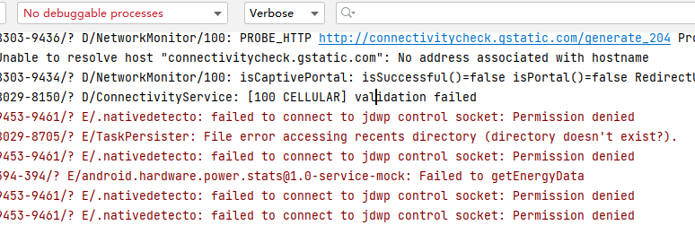
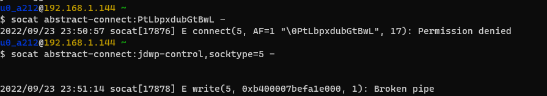
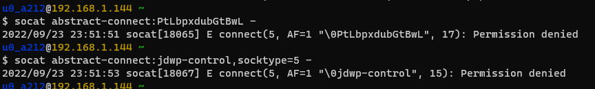
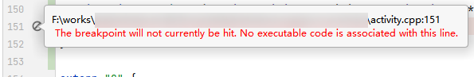
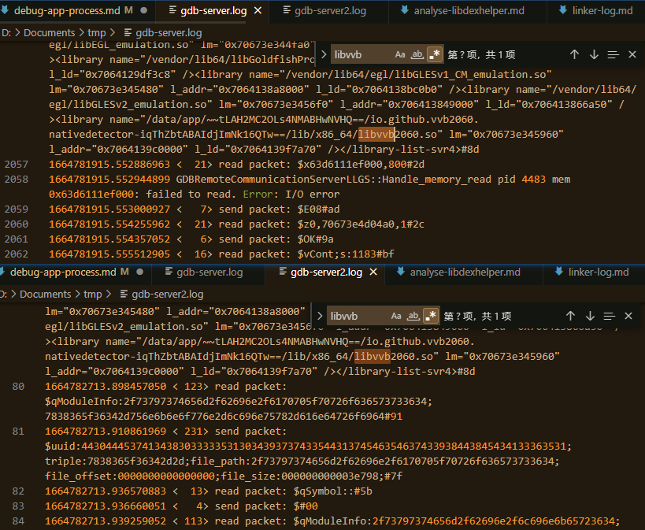
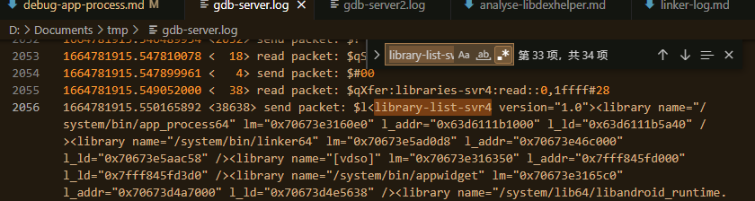
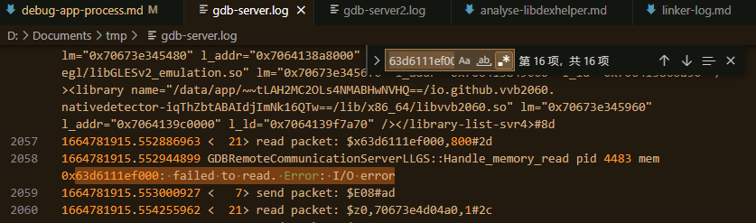
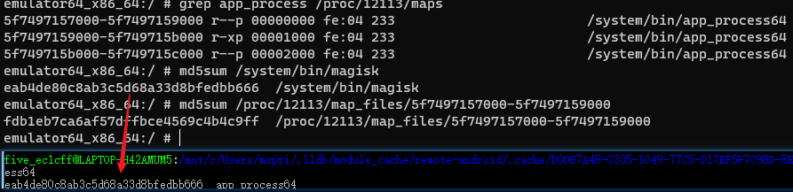

# Android app 调试

## 调试 app_process 程序

调试 app_process 程序一直是个麻烦的问题，因为官方并没有文档说明。一些知名项目也需要启动 app_process 进程，为了解决调试需求，必然有应对的方法，我们来学习一下：

### LSPosed

LSPosed 会运行一个 app_process 启动的 root daemon `lspd` ，其中还加载了原生代码。

看一看它的[启动脚本](https://github.com/LSPosed/LSPosed/blob/13d8b8abeb7e2bfef22dd1c29223d0569a3cd6ff/magisk-loader/magisk_module/daemon#L18) ：

```sh
# daemon
# magisk-loader/magisk_module/daemon
if [ $debug = "true" ]; then
  os_version=$(getprop ro.build.version.sdk)
  if [ "$os_version" -eq "27" ]; then
    java_options="$java_options -Xrunjdwp:transport=dt_android_adb,suspend=n,server=y -Xcompiler-option --debuggable"
  elif [ "$os_version" -eq "28" ]; then
    java_options="$java_options -XjdwpProvider:adbconnection -XjdwpOptions:suspend=n,server=y -Xcompiler-option --debuggable"
  else
    java_options="$java_options -XjdwpProvider:adbconnection -XjdwpOptions:suspend=n,server=y"
  fi
fi
```

提交：

[&#x5b;core&#x5d; Support debugger · LSPosed/LSPosed@409a197](https://github.com/LSPosed/LSPosed/commit/409a1974318a009994593dd8c4dae5eef89278c7)

### Scrcpy

scrcpy 的 app_process 启动逻辑写在 client app 的 [server.c](https://github.com/Genymobile/scrcpy/blob/ed84e18b1ae3e51d368f8c7bc88ba4db088e6855/app/src/server.c#L172) 里面：

```c
// app/src/server.c
#ifdef SERVER_DEBUGGER
# define SERVER_DEBUGGER_PORT "5005"
    cmd[count++] =
# ifdef SERVER_DEBUGGER_METHOD_NEW
        /* Android 9 and above */
        "-XjdwpProvider:internal -XjdwpOptions:transport=dt_socket,suspend=y,"
        "server=y,address="
# else
        /* Android 8 and below */
        "-agentlib:jdwp=transport=dt_socket,suspend=y,server=y,address="
# endif
            SERVER_DEBUGGER_PORT;
#endif
```

根据[开发者文档](https://github.com/Genymobile/scrcpy/blob/master/DEVELOP.md#debug-the-server)所述，这个调试实际上是开在 tcp 上的，并非 adb ，用起来也相当麻烦，首先要在编译的时候打开开关（还要针对 android 版本不同选择参数），启动时挂起进程，需要 adb forward 转发端口（当然在同一个子网也可以直接访问设备端口？）。

引入了这些参数的提交（其中第一个包含了讨论的 issue）：

[Fix server debugger for Android >= 9 · Genymobile/scrcpy@902b991](https://github.com/Genymobile/scrcpy/commit/902b99174df8ffc1fe7548399c19e446aa5488b6)  
[Document how to attach a debugger to the server · Genymobile/scrcpy@683f7ca](https://github.com/Genymobile/scrcpy/commit/683f7ca848ad4785557d116dcea466f1b5654ef9)  

### Shizuku

Shizuku 的用户服务也是 app_process ，和 Shizuku 服务本体一样通过 [ServiceStarter](https://github.com/RikkaApps/Shizuku/blob/234b1c8335e821e63fd5a4d923627b358ccfe11e/starter/src/main/java/moe/shizuku/starter/ServiceStarter.java#L34) 启动，其中也有调试参数：

> Shizuku UserService 进程甚至可以直接在 Android Studio 的可调试进程列表显示

```java
// starter/src/main/java/moe/shizuku/starter/ServiceStarter.java
    static {
        int sdk = Build.VERSION.SDK_INT;
        if (sdk >= 30) {
            DEBUG_ARGS = "-Xcompiler-option" + " --debuggable" +
                    " -XjdwpProvider:adbconnection" +
                    " -XjdwpOptions:suspend=n,server=y";
        } else if (sdk >= 28) {
            DEBUG_ARGS = "-Xcompiler-option" + " --debuggable" +
                    " -XjdwpProvider:internal" +
                    " -XjdwpOptions:transport=dt_android_adb,suspend=n,server=y";
        } else {
            DEBUG_ARGS = "-Xcompiler-option" + " --debuggable" +
                    " -agentlib:jdwp=transport=dt_android_adb,suspend=n,server=y";
        }
    }

    private static final String USER_SERVICE_CMD_FORMAT = "(CLASSPATH='%s' %s%s /system/bin " +
            "--nice-name='%s' moe.shizuku.starter.ServiceStarter " +
            "--token='%s' --package='%s' --class='%s' --uid=%d%s)&";

    public static String commandForUserService(String appProcess, String managerApkPath, String token, String packageName, String classname, String processNameSuffix, int callingUid, boolean debug) {
        String processName = String.format("%s:%s", packageName, processNameSuffix);
        return String.format(Locale.ENGLISH, USER_SERVICE_CMD_FORMAT,
                managerApkPath, appProcess, debug ? (" " + DEBUG_ARGS) : "",
                processName,
                token, packageName, classname, callingUid, debug ? (" " + "--debug-name=" + processName) : "");
    }
```

> Sui 的[启动](https://github.com/RikkaApps/Sui/blob/352e70efc0c6d341aeec7b3e76b36a55f4cbacf2/module/src/main/cpp/util/app_process.cpp#L57)中也有类似的逻辑，参数是一模一样的，只不过是 C++ 写的，这里就不展示了。

### libsu

Magisk 作者的 root 支持库 libsu 中也有 Root Service 功能，其中也包含了对 root 进程调试的支持。

[RootServiceManager.java](https://github.com/topjohnwu/libsu/blob/02abb7b20434a423e63aea5eebdbc6a15033ee0d/service/src/main/java/com/topjohnwu/superuser/internal/RootServiceManager.java#L81)

### 分析

我们首先观察到，对于较低版本的 android 多采用这两种参数启动调试：

`-agentlib:jdwp=` (Shizuku: android API < 28, scrcpy: Android 8)  
`-Xrunjdwp:` (LSPosed: android API == 27)  

它们后面跟着的参数形式都是一致的。

查阅资料发现，这两个参数都是 Java 官方支持的调试参数，只是版本不同。

[debugging - What are Java command line options to set to allow JVM to be remotely debugged? - Stack Overflow](https://stackoverflow.com/questions/138511/what-are-java-command-line-options-to-set-to-allow-jvm-to-be-remotely-debugged)

[Java 远程调试 - 卖程序的小歪 - 博客园](https://www.cnblogs.com/lailailai/p/4560399.html)

官方文档(`Xrunjdwp`)：

[JDWP](https://docs.oracle.com/javase/8/docs/technotes/guides/troubleshoot/introclientissues005.html)

[-X Command-line Options](https://docs.oracle.com/cd/E13150_01/jrockit_jvm/jrockit/jrdocs/refman/optionX.html#wp999539)

简单看一看参数的使用：

```
-Xrunjdwp:transport=dt_android_adb,suspend=n,server=y
```

transport 是传输方式，LSPosed 和 Shizuku 看起来都使用了 android 特有的 `dt_android_adb` ，scrcpy 则使用 `dt_socket` ，`suspend` 表示是否在启动时挂起，`server` 表示是否作为服务器等待调试器连接。

但是根据 scrcpy 那个 issue 所说，在高版本的 Android 用上面的参数不再有用。

看起来必须用 `-XjdwpProvider` 和 `-XjdwpOptions` 这两个新参数了，看上去参数的作用还是不变的，不过 provider 到底从哪里来呢？

搜索源码可以发现 `art/runtime/jdwp_provider.h` (>=9.0) 包含了一些 provider ，包括 adbConnection 和 internal 。

Android 11 后移除了 internal ，搜索还发现这个 issue ：

[JDWP provider `internal` no longer exists on Android 11 · Issue #23 · Chainfire/librootjava](https://github.com/Chainfire/librootjava/issues/23)

### 使用

于是我就稍微修改了一下 ash 脚本：

```sh
#!/system/bin/sh
if [ -n "$DEBUG" ]; then
  java_options="-XjdwpProvider:adbconnection -XjdwpOptions:suspend=y,server=y"
else
  java_options=""
fi
exec /system/bin/app_process $java_options -Djava.class.path=./ash.apk / five.ec1cff.ash.Main $*
```

运行，结果直接 abort ：

```sh
# DEBUG=1 execlog ./ash jni

07-18 21:31:35.795 15355 15355 D AndroidRuntime: >>>>>> START com.android.internal.os.RuntimeInit uid 0 <<<<<<
07-18 21:31:35.797 15355 15355 I AndroidRuntime: Using default boot image
07-18 21:31:35.797 15355 15355 I AndroidRuntime: Leaving lock profiling enabled
07-18 21:31:35.850 15355 15355 E app_process: Cannot use suspend=y with late-init jdwp.
07-18 21:31:35.850 15355 15355 F app_process: runtime.cc:1720] Plugin { library="libadbconnection.so", handle=0x0 } failed to load: Initialization of plugin failed
07-18 21:31:35.871 15355 15355 F app_process: runtime.cc:655] Runtime aborting...
07-18 21:31:35.871 15355 15355 F app_process: runtime.cc:655] Dumping all threads without mutator lock held
07-18 21:31:35.871 15355 15355 F app_process: runtime.cc:655] All threads:
07-18 21:31:35.871 15355 15355 F app_process: runtime.cc:655] DALVIK THREADS (1):
07-18 21:31:35.871 15355 15355 F app_process: runtime.cc:655] "main" prio=5 tid=1 Runnable (still starting up)
07-18 21:31:35.871 15355 15355 F app_process: runtime.cc:655]   | group="" sCount=0 dsCount=0 flags=0 obj=0x0 self=0xb400007382627c00
07-18 21:31:35.871 15355 15355 F app_process: runtime.cc:655]   | sysTid=15355 nice=0 cgrp=default sched=0/0 handle=0x7383d7b4f8
07-18 21:31:35.871 15355 15355 F app_process: runtime.cc:655]   | state=R schedstat=( 132934947 1558072 16 ) utm=7 stm=5 core=7 HZ=100
07-18 21:31:35.871 15355 15355 F app_process: runtime.cc:655]   | stack=0x7fe45bf000-0x7fe45c1000 stackSize=8192KB
```

看起来 `suspend=y` 是不允许的，但是 scrcpy 为什么可以？

既然这样，就把 suspend 改成 n ，然后我们手动调用 `Debug.waitForDebugger()` ，这样总算可以启动了，但是 AS 仍然无法识别进程。

~~注意到普通 app 权限会打出这一条 log ：~~

```
07-18 21:42:25.992 18150 18150 D AndroidRuntime: Calling main entry five.ec1cff.ash.Main
07-18 21:42:38.459 18150 18158 E app_process: failed to connect to jdwp control socket: Connection refused
```

~~看起来普通 app 权限不能用 jdwp socket ，切换到 root 就没有问题，然而 AS 还是无法识别。~~

> 2022.11.09 实际上普通 app 的权限完全可以访问 jdwp-control 。这个 Connection refused 大概是重启 adbd 的时候短时间连接不上导致的。

我又检查了 debug 构建的 shizuku demo ，它的 userservice 是可以被识别的。

Sui 启动服务：

https://github.com/RikkaApps/Sui/blob/352e70efc0c6d341aeec7b3e76b36a55f4cbacf2/module/src/main/java/rikka/sui/server/SuiUserServiceManager.java

Sui 入口： `rikka.sui.server.Starter`

https://github.com/RikkaApps/Sui/blob/352e70efc0c6d341aeec7b3e76b36a55f4cbacf2/module/src/main/java/rikka/sui/server/Starter.java

```java
    public static void main(String[] args) {
        String filesPath = null;

        for (String arg : args) {
            if (arg.equals("--debug")) {
                DdmHandleAppName.setAppName("sui", 0);
            } else if (arg.startsWith("--files-path=")) {
                filesPath = arg.substring("--files-path=".length());
                SuiUserServiceManager.setStartDex(filesPath + "/sui.dex");
            }
        }

        // ...
    }
```

难道其实是 `DdmHandleAppName` 搞的鬼？

事实证明果然如此：

```kotlin
        @JvmStatic
        fun main(args: Array<String>) {
            Thread.currentThread().uncaughtExceptionHandler =
                Thread.UncaughtExceptionHandler { thread: Thread?, throwable: Throwable -> throwable.printStackTrace() }
            // new Main().run(args);
            val d = System.getProperty("five.ec1cff.ash.debuggable")
            println(d)
            if (!TextUtils.isEmpty(d)) {
                print("Waiting for debugger...\r")
                DdmHandleAppName.setAppName("app", 0)
                Debug.waitForDebugger()
            }
            runOnActivityThread({ Main().run(args) })
        }
```

```sh
#!/system/bin/sh
if [ -n "$DEBUG" ]; then
  java_options="-XjdwpProvider:adbconnection -XjdwpOptions:suspend=n,server=y -Xcompiler-option --debuggable"
else
  java_options=""
fi
exec /system/bin/app_process $java_options -Djava.class.path=./ash.apk -Dfive.ec1cff.ash.debuggable=$DEBUG / --nice-name="five.ec1cff.ash" five.ec1cff.ash.Main $*
```

总算在 log 和 debuggable 进程看到了我们的 ash ：


现在手动选择 java 调试可以附加了：


但是 native 还不行：


观察到一个很奇怪的问题，debugger detach 后变成 system_process 了：


搜了一下 Sui 源码，发现有两处 DdmHandle ：

https://github.com/RikkaApps/Sui/blob/352e70efc0c6d341aeec7b3e76b36a55f4cbacf2/module/src/main/java/rikka/sui/server/SuiUserServiceManager.java

看上去需要把这个所谓的 「DdmHandleAppName」 设置成包名，才能和 AS 打开的项目联动。

设置成包名后，已经可以进入，但是报了另一个错误：


`Error while starting native debug session: com.intellij.execution.ExecutionException: Unsupported device. This device cannot be debugged using the native debugger. See log file for details.`

[&#x5b;原创&#x5d;让你的Android Studio能够对任意进程进行源码级native debug-Android安全-看雪论坛-安全社区|安全招聘|bbs.pediy.com](https://bbs.pediy.com/thread-270154.htm)

[necuil/android_studio_sdk_modify](https://github.com/necuil/android_studio_sdk_modify)

看上去是修改 AS 源码重新编译，增加了任意进程 attach 的实现，但这个作者写一半太监了，就留下了一个仓库，不过很久没更新，也许没法在最新版本上用。

看了一下 idea.log 的具体报错：

```log
2022-07-18 22:23:22,423 [17407080]   INFO - ild.invoker.GradleBuildInvoker - Gradle build finished in 3 s 747 ms 
2022-07-18 22:23:35,063 [17419720]   INFO - ols.idea.run.AndroidDeviceSpec - Creating spec for Xiaomi Redmi K30 5G with ABIs: [arm64-v8a, armeabi-v7a, armeabi] 
2022-07-18 22:23:35,075 [17419732]   INFO - idea.run.AndroidProcessHandler - Adding device xiaomi-redmi_k30_5g-mi5ec:5555 to monitor for launched app: five.ec1cff.ash 
2022-07-18 22:23:35,078 [17419735]   INFO - run.AndroidLogcatOutputCapture - startCapture("xiaomi-redmi_k30_5g-mi5ec:5555") 
2022-07-18 22:23:35,078 [17419735]   INFO - s.ndk.run.lldb.ConnectLLDBTask - ABIs supported by app: [arm64-v8a] 
2022-07-18 22:23:35,089 [17419746]   INFO - s.ndk.run.lldb.ConnectLLDBTask - Launching AndroidNativeAttachConfigurationType:Native native debug session on device: manufacturer=Xiaomi, model=Redmi K30 5G, API=30, codename=REL, ABIs=[arm64-v8a, armeabi-v7a, armeabi] 
2022-07-18 22:23:35,206 [17419863]   WARN - s.ndk.run.lldb.ConnectLLDBTask - run-as for the selected device appears to be broken, output was : run-as: unknown package: five.ec1cff.ash 
2022-07-18 22:23:35,210 [17419867]  ERROR - s.ndk.run.lldb.ConnectLLDBTask - Unsupported device (Non-rooted device, run-as not working, injector not supported): manufacturer=Xiaomi, model=Redmi K30 5G, API=30
Native debugging is not supported on this device.
See native debugger requirements at: https://developer.android.com/studio/debug#debug-types 
java.lang.Throwable: Unsupported device (Non-rooted device, run-as not working, injector not supported): manufacturer=Xiaomi, model=Redmi K30 5G, API=30
Native debugging is not supported on this device.
See native debugger requirements at: https://developer.android.com/studio/debug#debug-types
	at com.intellij.openapi.diagnostic.Logger.error(Logger.java:182)
	at com.android.tools.ndk.run.lldb.ConnectLLDBTask.decideStarterImplementation(ConnectLLDBTask.java:208)
	at com.android.tools.ndk.run.lldb.ConnectLLDBTask.launchDebuggerInBackground(ConnectLLDBTask.java:331)
	at com.android.tools.ndk.run.lldb.ConnectLLDBTask.lambda$launchDebugger$2(ConnectLLDBTask.java:291)
	at com.intellij.openapi.application.impl.ApplicationImpl$1.run(ApplicationImpl.java:265)
	at java.base/java.util.concurrent.Executors$RunnableAdapter.call(Executors.java:515)
	at java.base/java.util.concurrent.FutureTask.run(FutureTask.java:264)
	at java.base/java.util.concurrent.ThreadPoolExecutor.runWorker(ThreadPoolExecutor.java:1128)
	at java.base/java.util.concurrent.ThreadPoolExecutor$Worker.run(ThreadPoolExecutor.java:628)
	at java.base/java.util.concurrent.Executors$PrivilegedThreadFactory$1$1.run(Executors.java:668)
	at java.base/java.util.concurrent.Executors$PrivilegedThreadFactory$1$1.run(Executors.java:665)
	at java.base/java.security.AccessController.doPrivileged(Native Method)
	at java.base/java.util.concurrent.Executors$PrivilegedThreadFactory$1.run(Executors.java:665)
	at java.base/java.lang.Thread.run(Thread.java:829)
```

没想到竟然是没有 root …… 估计 AS 内部用了 adb root 

于是尝试了 sui 的 adb root 功能，方法是 `touch /data/adb/sui/enable_adb_root(_once)` ，然后重启（once 表示仅开启一次）


这样 `adb root` 可以成功进入 root 了，并且运行在 magisk context 下，但是 attach native 仍然有问题：


```sh
$ adb shell cat /data/local/tmp/lldb-server | sh -c 'cat > /data/data/five.ec1cff.ash/lldb/bin/lldb-server && chmod 700 /data/data/five.ec1cff.ash/lldb/bin/lldb-server'
$ adb shell cat /data/local/tmp/start_lldb_server.sh | sh -c 'cat > /data/data/five.ec1cff.ash/lldb/bin/start_lldb_server.sh && chmod 700 /data/data/five.ec1cff.ash/lldb/bin/start_lldb_server.sh'
Starting LLDB server: /data/data/five.ec1cff.ash/lldb/bin/start_lldb_server.sh /data/data/five.ec1cff.ash/lldb unix-abstract /five.ec1cff.ash-0 platform-1658198651263.sock "lldb process:gdb-remote packets"
failed to get reply to handshake packet
```

原来是调试器把目标当成 app 处理了，直接在 `/data/data` 下建目录去了 …… 看起来距离能用还有很长的路要走。

手动创建了这个目录，总算 attach 上了：


不过 native 调试似乎不认识 `Debug.waitForDebugger` ，也许 dual 模式就认识了？

### 让 AS 识别需要调试的进程  

从上面的实验来看，不仅要配置 app_process 的 jdwp 参数，而且还要调用 `DdmHandleAppName.setName` ，才能让 AS 认出我们的待调试进程（并且似乎只有 root 进程才生效？）。简单搜了一下代码发现，这玩意最终会和 `@jdwp-control` socket 通信，获得一个 agent socket 。~~普通 app 没有权限连接，需要调试的 app 可能是在 zygote 降权之前建立连接的~~。

> 2022.09.23 修正：实际上 appdomain 可以连接 `jdwp-control` ，dump selinux 规则如下：  
> `allow appdomain adbd : unix_stream_socket { ioctl read write getattr getopt shutdown connectto } ;`  
> 连接 jdwp 的工作在 `ZygoteHooks.callPostForkChildHooks` 执行，对于 debuggable 的进程，会创建一个进程维护 jdwp 的连接（确保 adbd 重启后 app 进程不需要重启仍然可以调试，参考代码：`packages/modules/adb/libs/adbconnection/adbconnection_client.cpp` ）
> 至于为何 app 权限的 app_process 无法启动调试还有待研究。  

### 修改 AS ？  

首先根据上面 stacktrace 的类名 `com.android.tools.ndk.run.lldb.ConnectLLDBTask` 试图用 cs 在 android studio 仓库里面搜索源码，但是一无所获。

在 AS 的 plugin 目录看到了 android-ndk （`%ProgramFiles%\Android\Android Studio\plugins\android-ndk\lib`），jadx 打开一看正是这个 plugin ，名字是 `com.android.tools.ndk` 。

在 cs 中搜索 `android-ndk` 只发现了这个：


看起来位于仓库 `platform/tools/vendor` 下，然而在 android.googlesource.com 看不到这个仓库，看起来是没有开源。

考察 pediy 那个修改方案，似乎也是拿这个 android-ndk.jar 和自己写的代码编译链接一下，替换掉原插件的逻辑，不过不知道会不会有签名校验。

……

## jdwp-control

jdwp-control 是一个运行在 adbd 的服务，提供了 unix socket `@jdwp-control`

源码：`packages/modules/adb/daemon/jdwp_service.cpp`

可以使用 `adb jdwp` 获取可调试进程的 pid ，并通过 `adb forward tcp: jdwp:<pid>` 与其交互。

[Android 调试原理 - 掘金](https://juejin.cn/post/6887395385589907469)

## `wrap.sh`

偶然有一天在 [LSP 群](https://t.me/c/1414270883/65622)听佬们提到了这个玩意：

[封装 Shell 脚本  |  Android NDK  |  Android Developers](https://developer.android.com/ndk/guides/wrap-script?hl=zh-cn#packaging_wrapsh)

这是 API 27 引入的功能，在 debuggable 为 true 的包中的 lib 放入 `wrap.sh` ，即可开启 zygote 的隐藏功能：fork 进程后，直接 exec 这个 sh ，进而启动一个 app_process 进程。也就是说，这样的 app 进程是从 RuntimeInit 而非 ZygoteInit 启动的。

而这个文档的下方就提到了如何为这样的进程开启调试——在 wrap.sh 中加入这样的代码：

```sh
#!/system/bin/sh

cmd=$1
shift

os_version=$(getprop ro.build.version.sdk)

if [ "$os_version" -eq "27" ]; then
  cmd="$cmd -Xrunjdwp:transport=dt_android_adb,suspend=n,server=y -Xcompiler-option --debuggable $@"
elif [ "$os_version" -eq "28" ]; then
  cmd="$cmd -XjdwpProvider:adbconnection -XjdwpOptions:suspend=n,server=y -Xcompiler-option --debuggable $@"
else
  cmd="$cmd -XjdwpProvider:adbconnection -XjdwpOptions:suspend=n,server=y $@"
fi

exec $cmd
```

和 LSPosed 的一模一样……看来最初是从这里来的。

## Sui adbd root 功能导致无法调试 app ？

之前尝试了在 adbd root 下调试 app ，主要是 App Inspector 功能在非 root 下似乎会调用 magisk 的 su ，并且频繁使用 `adb shell su` ，产生了大量 toast ，要是换成 adbd root 或许就不会这样了。然而实际用起来却发现 adbd root 下 AS 根本找不到 debuggable 的进程，只好作罢。

最近研究 selinux 规则，突然想到，这会不会是因为 adbd root 运行在 magisk domain ，而 [magisk 从 v21 引入的规则](https://github.com/topjohnwu/Magisk/commit/97b72a5941828b13839495d29c0d9138931a6598)限制了 appdomain 连接 magisk domain 的 socket （对 API 26 及以上有效）。而 jdwp-control 是 adbd 启动并降权（对于 adbd root 就是提权）后才创建的，创建的 socket 属于 magisk domain ，而上面的分析表明 app 是降权后才连接 jdwp ，因此会被拒绝连接。



下面是 adbd root 前后在 app domain 连接 magisk socket 和 jdwp 的表现：

```
socat abstract-connect:${magisk_socket} -
socat abstract-connect:jdwp-control,socktype=5 -
```

> socktype=5 是因为 jdwp 实际上是 `SOCK_SEQPACKET` 类型，不过在 selinux 看来和 `SOCK_STREAM` 一样都属于 `unix_stream_socket`

root 前：



root 后：



> 我为了截这个图重启了手机，因为在这之前发现 adbd root 下 AS 又可以找到 debuggable 的 app ，并且 app domain 可以连接到 magisk domain 的 socket 。重启后才恢复正常表现，怀疑是以前启动过 frida 之类的东西导致修改了规则。

提出一个解决思路：adbd root 提权(`setcon`)之后，将 `u:r:adbd:s0` 写入 `/proc/self/attr/sockcreate` ，确保 adbd 创建的 socket 属于 adbd domain 。既然 Sui 通过 ld_preload 注入，替换个 setcon 应该挺方便的。

给原项目提了个 issue （因为不敢 PR）：

[adbd root 无法调试 App · Issue #42 · RikkaApps/Sui](https://github.com/RikkaApps/Sui/issues/42)

**2022.10.2**

然而这样会导致 adbd 创建的所有 socket 都成为 adbd 的 domain ，导致 adb forward 无法任意转发 socket （会影响调试功能），故上面的方法太简单粗暴，我们要想一个更好的方法。

起初想 hook bind ，如果是 jdwp-control 就临时修改 sockcreate ，并且 dup2 替换原来的 fd 。

> jdwp-control 创建：packages/modules/adb/libs/adbconnection/adbconnection_server.cpp

需要注意这样不能 close 原 fd ，只能让 dup2 覆盖（因为这里使用了 unique_fd ，c 库会负责检查 close ）

此外这个操作是不在主线程的，因此需要修改 `/proc/thread-self/attr/sockcreate` （任何线程只能改自己的 sockcreate ，没有特权去修改其他线程的，即使是同一个进程）

然而这样虽然 jdwp-control 是 adbd 了，但是提供给 app client 的 socketpair 还是 magisk 的，导致 app 侧仍然连不上。因此继续这个想法就更复杂了。

问题的本质是现在我们修改使得 magisk domain 的 adbd 创建的所有 socket 都是 adbd domain 的，而这样的 socket 用来 connect magisk domain 的也会被拒绝（看来 socket 鉴权用的是 socket 的 label 而非 process 的）。所以干脆让 adbd 可以访问 magisk 的 socket 就行了，sepolicy.rule 加一句：

```
allow adbd magisk unix_stream_socket { ioctl read write create getattr setattr lock append map bind connect listen accept getopt setopt shutdown connectto }
```

这样 native 调试也没问题了。

> 如果先前用了 adbd root 进行 native 调试，那么以后不在 root 的时候如果要调试，需要先删掉 `/data/data/$pkg/lldb` 目录，否则也会出问题，因为这个目录被创建成 root 才能用了，而非 root 调试用的是 run-as 切成 debuggable app 的 uid 。

## Zygisk 破坏了 native debug 功能  

Magisk 有一个 issue ，声称 zygisk 破坏了 native debug 功能：

[Magisk Zygisk breaks NDK C++ native breakpoints · Issue #6229 · topjohnwu/Magisk](https://github.com/topjohnwu/Magisk/issues/6229)

具体表现为，开启 zygisk 的情况下，Android Studio 的 lldb 可以正常找到系统库的镜像，却无法找到 app 的，在这种情况下，app 代码的断点无法使用，console `image list` 中也不含 app 的 so 。如果关闭 zygisk 则无此问题。



还记得前段时间想要调试 native ，结果也是无法调试，当时还在纳闷什么原因，看上去真的是 zygisk 的锅。

这个 issue 至今没有回复。因为我现在用的手机换用了自己编译的 maru zygisk ，所以测试了一下，发现 native 调试功能正常。而后在模拟器测试也正常。

issue 提出者好像仅测试了 arm64 的设备，于是我在 x86-64 的模拟器上安装原版 magisk 测试，发现确实无法调试。

看起来原版 magisk 可能有问题，而 maru 不知道为什么没有这个问题。

进一步测试发现，无论是否开启排除列表，都无法调试。

issue 提出者还向 google 提了 issue ，对方竟然还回应了。google 方面的人测试了确实存在这个问题，并且是 zygisk 导致的，与 Android Studio 无关。

他们推测的原因是：

```
LLDB has a mechanism for detecting when an .so is loaded.
This is implemented by inserting a breakpoint, called a rendezvous breakpoint, into a specific location in the dynamic linker.
Enabling Zygisk seems to break this mechanism.
```

LLDB 在 linker 的某处插断点，检测 so 的加载，而 zygisk 破坏了该机制。

> 这可能还说明 app 的 so 实际上在 lldb attach 后才加载。

他们还给了一个 workaround ：

```
Possible Workaround (other than disabling Zygisk):

Start your app.
Wait until it loads your .so file(s).
Use Android Studio's Attach Debugger to Android Process.
Your breakpoints should now work.
Note that you cannot debug the startup part of your app using this technique as the app won't wait until the debugger is attached and continue running.
```

不 attach lldb 启动 App ，等到目标 so 被加载的时候再 attach 上去，这样是可以正确找到 app 的 so 的。唯一不足的一点是不能调试 so 的初始化代码。

于是我也按照上面的方法测试了一下，这样确实就能正确找到 so 了，但是为什么？

「分析日志是分析问题的最好手段」。我决定从 gdb server 的日志入手，这个日志位于 `/data/data/$pkgName/lldb/log/gdb-server.log` 。

首先 lldb attach 启动 app ，复现问题，然后 detach ，把这份日志 pull 出来（称为 gdb-server.log 或日志 1）。接着不关闭 app ，重新 attach ，此时也同样复现了上面的 workaround ，然后再 pull 日志（称为 gdb-server2.log 或日志 2）。我们来比较一下两份日志的区别。

> 同一个进程可以确保内存中 so 的地址都是一致的，更加便于分析。

首先搜索我们目标的 so ，这里 so 的名字是 `libvvb2060.so` ，搜索一下：



出乎意料的是，两个 log 都出现且仅出现了一次这个名字。



观察日志可以发现，这个 so 名字所在的行是一个 xml ，根标签是 `library-list-svr4` 。并且都以 `send packet` 开头，看上去是向远程发送包含了 so 的名字和地址的信息。

注意到日志 1 中，`library-list-svr4` 出现了 34 次，说明发送了 17 次，并且看上去每一次都是收集所有已知的 so ，全部发送。日志 2 中仅出现了 2 次，即只发送了 1 次。考虑到第一次是在进程启动的时候就 attach 的，因此这些发送应当是发生在 so 加载的时候。顺带一提，包含 `libvvb2060.so` 的 packet 是最后一个被发送的 packet 。

看起来 gdb server 是能够触发 so 加载的断点的，google 方面的猜测不成立。

既然能触发，并且 so 的信息也被发送给了远程，为什么第一次 attach 就是无法正确找到 so 呢？

继续观察日志 1 ，我们发现，除了第一次发送 packet 之外，之后发送 packet 后都有下面的错误信息：



看起来远程试图读取同一个地址，而读取都失败了。难道是这个错误导致了 so 列表未得到及时更新？

`63d6111ef000: failed to read\. Error: I/O error`

看看这个地址属于谁（来自日志 1）：

```xml
<library name="/system/bin/app_process64" lm="0x70673e3160e0" l_addr="0x63d6111b1000" l_ld="0x63d6111b5a40" />
```

l_addr 应当是 so 的基地址（与 maps 中首次出现 so 的项目的地址对应），其他的 so 地址都是 `0x7` 开头，因此只可能是这个 so 的地址有问题。

```sh
grep app_process64 /proc/4483/maps
63d6111b1000-63d6111b3000 r--p 00000000 fe:04 233                        /system/bin/app_process64
63d6111b3000-63d6111b5000 r-xp 00001000 fe:04 233                        /system/bin/app_process64
63d6111b5000-63d6111b6000 r--p 00002000 fe:04 233                        /system/bin/app_process64
grep 63d6111 /proc/4483/maps
63d6111b1000-63d6111b3000 r--p 00000000 fe:04 233                        /system/bin/app_process64
63d6111b3000-63d6111b5000 r-xp 00001000 fe:04 233                        /system/bin/app_process64
63d6111b5000-63d6111b6000 r--p 00002000 fe:04 233                        /system/bin/app_process64
```

很显然，这个地址似乎也不属于 app_proces64

起初以为是 zygisk 自卸载的问题， 于是尝试加载个模块让它不要卸载。于是用 lsposed 随便选了个模块注入，然而问题更大了，加载的时候直接在某个奇怪的线程断了下来。

……

也许应该从本地的 lldb 日志找找原因（然而并没有日志）

我们知道 zygisk 二阶段的 so 就是 app_process 本身（实际上是 bind mount 的 magisk），而二阶段的卸载发生在 specialize post ，并且是创建一个线程 dlclose 。

有没有可能是自卸载的问题呢？但是我们观察日志 1 的所有 app_process64 镜像的基址，位置都是一致的，且与 maps 相同，而 maps 指向的 inode 也是正确的；此外，maru 也有自卸载，但是 maru 就可以正常调试。

> [&#x5b;原创&#x5d;lldb/gdb通信协议研究-iOS安全-看雪论坛-安全社区|安全招聘|bbs.pediy.com](https://bbs.pediy.com/thread-215106.htm)

我们注意到，native debug 会拉取远程进程内存中的所有镜像到本地存放。

```
(lldb) image list
[  0] D0DE7A48-0335-1049-77C5-D17EF5F7C98D-8ECA3651 0x00005f7497157000 C:\Users\mspri\.lldb\module_cache\remote-android\.cache\D0DE7A48-0335-1049-77C5-D17EF5F7C98D-8ECA3651\app_process64 
```

检查 maps ，发现地址似乎是正确的：

```
emulator64_x86_64:/ # grep app_process /proc/12113/maps
5f7497157000-5f7497159000 r--p 00000000 fe:04 233                        /system/bin/app_process64
5f7497159000-5f749715b000 r-xp 00001000 fe:04 233                        /system/bin/app_process64
5f749715b000-5f749715c000 r--p 00002000 fe:04 233                        /system/bin/app_process64
```

然而实际拉取的镜像却是 magisk ，从很多方面可以证实：字符串、符号表、文件大小……说明调试器实际上是从路径拉取文件的，而这个文件刚好就是 magisk mount 上去的假的 app_process 。



另外，这个 UUID 似乎是根据路径名生成的，每次拉取的 app_process 对应的 UUID 是一样的。

尝试 denylist ，但是并无作用，得到的 app_process 仍然是 magisk 。

突然意识到拉取 so 有可能是通过 adb pull ，是全局挂载命名空间，所以 denylist 的 umount 其实没什么卵用。

干脆手动在全局 ns umount 一下： `umount -l /system/bin/app_process64` ，结果这一下果然能正常调试了！

看来问题的根源真就是这个 app_process64 ……

## wait for debugger 原理

`am start -D` 设置系统中的 debug app （和开发者选项选择要调试的 app 效果一样）。

AMS.attachApplication 会调用 AT.bindApplication ，其中有一个 debugMode flags ，如果需要等待，会添加 `DEBUG_WAIT`

```java
// frameworks/base/core/java/android/app/ActivityThread.java
    private void handleBindApplication(AppBindData data) {
        if (data.debugMode != ApplicationThreadConstants.DEBUG_OFF) {
            // XXX should have option to change the port.
            Debug.changeDebugPort(8100);
            if (data.debugMode == ApplicationThreadConstants.DEBUG_WAIT) {
                Slog.w(TAG, "Application " + data.info.getPackageName()
                      + " is waiting for the debugger on port 8100...");

                IActivityManager mgr = ActivityManager.getService();
                try {
                    mgr.showWaitingForDebugger(mAppThread, true);
                } catch (RemoteException ex) {
                    throw ex.rethrowFromSystemServer();
                }

                Debug.waitForDebugger();

                try {
                    mgr.showWaitingForDebugger(mAppThread, false);
                } catch (RemoteException ex) {
                    throw ex.rethrowFromSystemServer();
                }

            } else {
                Slog.w(TAG, "Application " + data.info.getPackageName()
                      + " can be debugged on port 8100...");
            }
```

通知 AMS 显示 waiting for debugger 对话框，并调用 `Debug.waitForDebugger()`

```java
// frameworks/base/core/java/android/os/Debug.java
    /**
     * Wait until a debugger attaches.  As soon as the debugger attaches,
     * this returns, so you will need to place a breakpoint after the
     * waitForDebugger() call if you want to start tracing immediately.
     */
    public static void waitForDebugger() {
        if (!VMDebug.isDebuggingEnabled()) {
            //System.out.println("debugging not enabled, not waiting");
            return;
        }
        if (isDebuggerConnected())
            return;

        // if DDMS is listening, inform them of our plight
        System.out.println("Sending WAIT chunk");
        byte[] data = new byte[] { 0 };     // 0 == "waiting for debugger"
        Chunk waitChunk = new Chunk(ChunkHandler.type("WAIT"), data, 0, 1);
        DdmServer.sendChunk(waitChunk);

        mWaiting = true;
        while (!isDebuggerConnected()) {
            try { Thread.sleep(SPIN_DELAY); }
            catch (InterruptedException ie) {}
        }
        mWaiting = false;

        System.out.println("Debugger has connected");

        /*
         * There is no "ready to go" signal from the debugger, and we're
         * not allowed to suspend ourselves -- the debugger expects us to
         * be running happily, and gets confused if we aren't.  We need to
         * allow the debugger a chance to set breakpoints before we start
         * running again.
         *
         * Sit and spin until the debugger has been idle for a short while.
         */
        while (true) {
            long delta = VMDebug.lastDebuggerActivity();
            if (delta < 0) {
                System.out.println("debugger detached?");
                break;
            }

            if (delta < MIN_DEBUGGER_IDLE) {
                System.out.println("waiting for debugger to settle...");
                try { Thread.sleep(SPIN_DELAY); }
                catch (InterruptedException ie) {}
            } else {
                System.out.println("debugger has settled (" + delta + ")");
                break;
            }
        }
    }
```

isDebuggerConnected 最终调用到 dalvik.system.Debug 的 native 方法。

```java
// frameworks/base/core/java/android/os/Debug.java
    public static boolean isDebuggerConnected() {
        return VMDebug.isDebuggerConnected();
    }

// libcore/dalvik/src/main/java/dalvik/system/VMDebug.java
    /**
     * Determines if a debugger is currently attached.
     *
     * @return true if (and only if) a debugger is connected
     *
     * @hide
     */
    @UnsupportedAppUsage
    @SystemApi(client = MODULE_LIBRARIES)
    @FastNative
    public static native boolean isDebuggerConnected();
```

```cpp
// art/runtime/native/dalvik_system_VMDebug.cc
static jboolean VMDebug_isDebuggerConnected(JNIEnv*, jclass) {
  // This function will be replaced by the debugger when it's connected. See
  // external/oj-libjdwp/src/share/vmDebug.c for implementation when debugger is connected.
  return false;
}
```

这个方法看起来需要被调试器替换以返回 true 。上面给了一个 debugger 的实现示例。

不过实际的源码位置在 `external/oj-libjdwp/src/share/back/vmDebug.c` ：

```c
// external/oj-libjdwp/src/share/back/vmDebug.c
// For backwards compatibility we are only considered 'connected' as far as VMDebug is concerned if
// we have gotten at least one non-ddms JDWP packet.
static jboolean
isDebuggerConnected()
{
    return transport_is_open() && atomic_load(&hasSeenDebuggerActivity);
}

void
vmDebug_initalize(JNIEnv* env)
{
    WITH_LOCAL_REFS(env, 1) {
        jclass vmdebug_class = JNI_FUNC_PTR(env,FindClass)(env, "dalvik/system/VMDebug");
        if (vmdebug_class == NULL) {
            // The VMDebug class isn't available. We don't need to do anything.
            LOG_MISC(("dalvik.system.VMDebug does not seem to be available on this runtime."));
            // Get rid of the ClassNotFoundException.
            JNI_FUNC_PTR(env,ExceptionClear)(env);
            goto finish;
        }

        JNINativeMethod methods[3];

        // Take over the implementation of these three functions.
        methods[0].name = "lastDebuggerActivity";
        methods[0].signature = "()J";
        methods[0].fnPtr = (void*)VMDebug_lastDebuggerActivity;

        methods[1].name = "isDebuggingEnabled";
        methods[1].signature = "()Z";
        methods[1].fnPtr = (void*)VMDebug_isDebuggingEnabled;

        methods[2].name = "isDebuggerConnected";
        methods[2].signature = "()Z";
        methods[2].fnPtr = (void*)VMDebug_isDebuggerConnected;

        jint res = JNI_FUNC_PTR(env,RegisterNatives)(env,
                                                     vmdebug_class,
                                                     methods,
                                                     sizeof(methods) / sizeof(JNINativeMethod));
        if (res != JNI_OK) {
            EXIT_ERROR(JVMTI_ERROR_INTERNAL,
                       "RegisterNatives returned failure for VMDebug class");
        }

        finish: ;
    } END_WITH_LOCAL_REFS(env);
}
```

看起来可能是将某个 so 注入到目标进程中，然后重新 register JNI 方法。

### 注入 agent

系统提供了机制，可以直接在启动 activity 的时候注入一个 so ，这被称为 agent 。

这个 agent 实际上是 java 的规范 jvmti。

[JVM(TM) Tool Interface 1.2.3](https://docs.oracle.com/javase/8/docs/platform/jvmti/jvmti.html)

agent 有以下接口函数：

```
Agent_OnLoad
Agent_OnAttach
Agent_OnUnload
```

……

ART 实现的 jvmti ：

```
ActivityThread.handleAttachAgent -> VMDebug.attachAgent -> Runtime::Current()->AttachAgent
art/runtime/ti/agent.cc
```

[ART TI  |  Android 开源项目  |  Android Open Source Project](https://source.android.com/docs/core/runtime/art-ti?hl=zh-cn)

上面提到的 oj-libjdwp 实际上就是一个 agent 。

`external/oj-libjdwp/src/share/back/debugInit.c`

## 调试功能的开启

上面的研究仅仅是基于实验观察的，下面我们深入源码看一看 App 是如何开启调试的。

### 从 Manifest 的 debuggable 到 Zygote

……

### Zygote runtimeFlags

Zygote 启动参数中有一个 runtimeFlags 

在 Java 中定义：

```java
// frameworks/base/core/java/com/android/internal/os/Zygote.java
public final class Zygote {
    /*
    * Bit values for "runtimeFlags" argument.  The definitions are duplicated
    * in the native code.
    */

    /** enable debugging over JDWP */
    public static final int DEBUG_ENABLE_JDWP   = 1;
    /** enable JNI checks */
    public static final int DEBUG_ENABLE_CHECKJNI   = 1 << 1;
    /** enable Java programming language "assert" statements */
    public static final int DEBUG_ENABLE_ASSERT     = 1 << 2;
    /** disable the AOT compiler and JIT */
    public static final int DEBUG_ENABLE_SAFEMODE   = 1 << 3;
    /** Enable logging of third-party JNI activity. */
    public static final int DEBUG_ENABLE_JNI_LOGGING = 1 << 4;
    // ...
```

native 中定义：

```cpp
// frameworks/base/core/jni/com_android_internal_os_Zygote.cpp
// Must match values in com.android.internal.os.Zygote.
enum RuntimeFlags : uint32_t {
    DEBUG_ENABLE_JDWP = 1,
    PROFILE_SYSTEM_SERVER = 1 << 14,
    PROFILE_FROM_SHELL = 1 << 15,
    MEMORY_TAG_LEVEL_MASK = (1 << 19) | (1 << 20),
    MEMORY_TAG_LEVEL_TBI = 1 << 19,
    MEMORY_TAG_LEVEL_ASYNC = 2 << 19,
    MEMORY_TAG_LEVEL_SYNC = 3 << 19,
    GWP_ASAN_LEVEL_MASK = (1 << 21) | (1 << 22),
    GWP_ASAN_LEVEL_NEVER = 0 << 21,
    GWP_ASAN_LEVEL_LOTTERY = 1 << 21,
    GWP_ASAN_LEVEL_ALWAYS = 2 << 21,
    NATIVE_HEAP_ZERO_INIT_ENABLED = 1 << 23,
    PROFILEABLE = 1 << 24,
};
```

其中 DEBUG_ENABLE_JDWP 就是使能调试的 flag 。

### ZygoteHooks

在 Zygote 的任何 fork 和 specialize 完成后，会调用 dalvik.system.ZygoteHooks 。

```cpp
// frameworks/base/core/jni/com_android_internal_os_Zygote.cpp
static void SpecializeCommon(/* */) {
    // ...
    env->CallStaticVoidMethod(gZygoteClass, gCallPostForkChildHooks, runtime_flags, is_system_server, is_child_zygote, managed_instruction_set);
    // ...
}
```

```java
// This function is called from native code in com_android_internal_os_Zygote.cpp
    @SuppressWarnings("unused")
    private static void callPostForkChildHooks(int runtimeFlags, boolean isSystemServer,
            boolean isZygote, String instructionSet) {
        ZygoteHooks.postForkChild(runtimeFlags, isSystemServer, isZygote, instructionSet);
    }

// libcore/dalvik/src/main/java/dalvik/system/ZygoteHooks.java
    public static void postForkChild(int runtimeFlags, boolean isSystemServer,
            boolean isChildZygote, String instructionSet) {
        nativePostForkChild(token, runtimeFlags, isSystemServer, isChildZygote, instructionSet);
        // ...
    }
```

```cpp
// art/runtime/native/dalvik_system_ZygoteHooks.cc
static void ZygoteHooks_nativePostForkChild(/* ... */) {
  // ...
  runtime_flags = EnableDebugFeatures(runtime_flags);
  // ...
}

static uint32_t EnableDebugFeatures(uint32_t runtime_flags) {
  // ...
  Dbg::SetJdwpAllowed((runtime_flags & DEBUG_ENABLE_JDWP) != 0);
  runtime_flags &= ~DEBUG_ENABLE_JDWP;
  // ...
}

// art/runtime/debugger.cc
void Dbg::SetJdwpAllowed(bool allowed) {
  gJdwpAllowed = allowed;
}

bool Dbg::IsJdwpAllowed() {
  return gJdwpAllowed;
}
```

上面设置了 gJdwpAllowed ，此外还调用了 `art::Runtime::InitNonZygoteOrPostFork`

```cpp
// art/runtime/native/dalvik_system_ZygoteHooks.cc
static void ZygoteHooks_nativePostForkChild(/* ... */) {
  if (instruction_set != nullptr && !is_system_server) {
    ScopedUtfChars isa_string(env, instruction_set);
    InstructionSet isa = GetInstructionSetFromString(isa_string.c_str());
    Runtime::NativeBridgeAction action = Runtime::NativeBridgeAction::kUnload;
    if (isa != InstructionSet::kNone && isa != kRuntimeISA) {
      action = Runtime::NativeBridgeAction::kInitialize;
    }
    runtime->InitNonZygoteOrPostFork(env, is_system_server, is_zygote, action, isa_string.c_str());
  } else {
    runtime->InitNonZygoteOrPostFork(
        env,
        is_system_server,
        is_zygote,
        Runtime::NativeBridgeAction::kUnload,
        /*isa=*/ nullptr,
        profile_system_server);
  }
}

void Runtime::InitNonZygoteOrPostFork(/* ... */) {
    // ...
    GetRuntimeCallbacks()->StartDebugger();
}
```

这个函数最终调用了一个 StartDebugger 。

> 顺带一提，InitNonZygoteOrPostFork 也会在 app_process 非 zygote 模式启动时调用，发生在 Runtime::Start

```cpp
bool Runtime::Start() {
  // ...
  if (!is_zygote_) {
    if (is_native_bridge_loaded_) {
      PreInitializeNativeBridge(".");
    }
    NativeBridgeAction action = force_native_bridge_
        ? NativeBridgeAction::kInitialize
        : NativeBridgeAction::kUnload;
    InitNonZygoteOrPostFork(self->GetJniEnv(),
        /* is_system_server= */ false,
        /* is_child_zygote= */ false,
        action,
        GetInstructionSetString(kRuntimeISA));
        // ...
  }
}
```

### AdbConnection

RuntimeCallbacks 定义了一些回调，其中有 DdmCallback  、DebuggerControlCallback

art 中的 **libadbconnection** 插件(plugin) 负责处理连接到 adbd ，并实现上面的回调接口。

> art plugin 相关代码：art/runtime/plugin.cc  
> 插件是一个 native lib ，入口函数为 `ArtPlugin_Initialize`

**Ddm**: Dalvik Debug Monitor ，DdmCallback 将 Ddm 消息发送到 DDMS 。

**DDMS** (Dalvik Debug Monitor Server) 可以理解为调试器。

通过 adbd 和 libadbconnection ，我们可以在 debuggable 进程和调试器间建立连接。(`adb forward tcp:<port> jdwp:<pid>`)

> 「DDM」和「DDMS」这两个缩写名字，似乎是 ART 还没有取代 dalvik 前的历史遗留产物。相关文档：  
> https://android.googlesource.com/platform/dalvik.git/+/android-4.2.2_r1/docs/debugger.html  
> https://developer.android.com/studio/profile/monitor  

DebuggerControlCallback 处理调试的启动和停止。

```cpp
// art/runtime/runtime_callbacks.h
class DdmCallback {
 public:
  virtual ~DdmCallback() {}
  virtual void DdmPublishChunk(uint32_t type, const ArrayRef<const uint8_t>& data)
      REQUIRES_SHARED(Locks::mutator_lock_) = 0;
};

class DebuggerControlCallback {
 public:
  virtual ~DebuggerControlCallback() {}

  // Begin running the debugger.
  virtual void StartDebugger() = 0;
  // The debugger should begin shutting down since the runtime is ending. This is just advisory
  virtual void StopDebugger() = 0;

  // This allows the debugger to tell the runtime if it is configured.
  virtual bool IsDebuggerConfigured() = 0;
};
```

```cpp
// art/runtime/runtime_callbacks.cc
```

有 DebuggerControllerCallback


```cpp
// art/adbconnection/adbconnection.h
static constexpr char kJdwpControlName[] = "\0jdwp-control";
// The default jdwp agent name.
static constexpr char kDefaultJdwpAgentName[] = "libjdwp.so";
// art/adbconnection/adbconnection.cc
static std::optional<AdbConnectionState> gState;
// 入口函数，初始化 gState AdbConnectionState
// The plugin initialization function.
extern "C" bool ArtPlugin_Initialize() {
  DCHECK(art::Runtime::Current()->GetJdwpProvider() == art::JdwpProvider::kAdbConnection);
  // TODO Provide some way for apps to set this maybe?
  gState.emplace(kDefaultJdwpAgentName);
  return ValidateJdwpOptions(art::Runtime::Current()->GetJdwpOptions());
}

// 设置 DebuggerControlCallback 回调
AdbConnectionState::AdbConnectionState(const std::string& agent_name) {
  // ...
  art::Runtime::Current()->GetRuntimeCallbacks()->AddDebuggerControlCallback(&controller_);
}
```

实现的 `DebuggerControlCallback::StartDebugger` ：

```cpp
// art/adbconnection/adbconnection.cc

// 取决于 runtime flags ，在 ZygoteHooks 设置过了
static bool IsDebuggingPossible() {
  return art::Dbg::IsJdwpAllowed();
}

// Begin running the debugger.
void AdbConnectionDebuggerController::StartDebugger() {
  // The debugger thread is started for a debuggable or profileable-from-shell process.
  // The pid will be send to adbd for adb's "track-jdwp" and "track-app" services.
  // The thread will also set up the jdwp tunnel if the process is debuggable.
  if (IsDebuggingPossible() || art::Runtime::Current()->IsProfileableFromShell()) {
    connection_->StartDebuggerThreads();
  } else {
    LOG(ERROR) << "Not starting debugger since process cannot load the jdwp agent.";
  }
}
```

这会启动线程，并连接到 jdwp-control socket ，与 adbd 建立联系。

> packages/modules/adb/libs/adbconnection/adbconnection_client.cpp

### DdmHandleAppName

ActivityThread attach -> AMS bindApplication

```java
// frameworks/base/core/java/android/app/ActivityThread.java
    private void handleBindApplication(AppBindData data) {
        // ...
        android.ddm.DdmHandleAppName.setAppName(data.processName,
            data.appInfo.packageName,
            UserHandle.myUserId());
    }


// frameworks/base/core/java/android/ddm/DdmHandleAppName.java
    public static void setAppName(String name, int userId) {
        setAppName(name, name, userId);
    }
    
    public static void setAppName(String appName, String pkgName, int userId) {
        if (appName == null || appName.isEmpty() || pkgName == null || pkgName.isEmpty()) return;

        sNames = new Names(appName, pkgName);

        // if DDMS is already connected, send the app name up
        sendAPNM(appName, pkgName, userId);
    }

    /**
     * Send an APNM (APplication NaMe) chunk.
     */
    private static void sendAPNM(String appName, String pkgName, int userId) {
        ByteBuffer out = ByteBuffer.allocate(
            4 /* appName's length */
            + appName.length() * 2 /* appName */
            + 4 /* userId */
            + 4 /* pkgName's length */
            + pkgName.length() * 2 /* pkgName */);
        out.order(ChunkHandler.CHUNK_ORDER);
        out.putInt(appName.length());
        putString(out, appName);
        out.putInt(userId);
        out.putInt(pkgName.length());
        putString(out, pkgName);

        Chunk chunk = new Chunk(CHUNK_APNM, out);
        DdmServer.sendChunk(chunk);
    }

// libcore/dalvik/src/main/java/org/apache/harmony/dalvik/ddmc/DdmServer.java
    public static void sendChunk(Chunk chunk) {
        nativeSendChunk(chunk.type, chunk.data, chunk.offset, chunk.length);
    }
```

进入 native:

```cpp
// art/runtime/native/org_apache_harmony_dalvik_ddmc_DdmServer.cc
static void DdmServer_nativeSendChunk(JNIEnv* env, jclass, jint type,
                                      jbyteArray javaData, jint offset, jint length) {
  ScopedFastNativeObjectAccess soa(env);
  ScopedByteArrayRO data(env, javaData);
  DCHECK_LE(offset + length, static_cast<int32_t>(data.size()));
  ArrayRef<const uint8_t> chunk(reinterpret_cast<const uint8_t*>(&data[offset]),
                                static_cast<size_t>(length));
  Runtime::Current()->GetRuntimeCallbacks()->DdmPublishChunk(static_cast<uint32_t>(type), chunk);
}
```

也是调用 RuntimeCallbacks ，最终发送到 AdbConnection 的 DdmCallback 中

### adbconnection

`art/adbconnection/adbconnection.cc`

adbconnection 运行了一个线程处理 socket， 处理逻辑在 `AdbConnectionState::RunPollLoop` 。

这个线程会反复尝试连接到 adbd (`SetupAdbConnection`)，确保 adbd 重启后 app 进程的调试仍然可用，连接到后会进一步进行 poll 。

AdbConnectionState 结构体包含 4 个 socket fd ，其中通过 poll 轮询 3 个 fd ，下面介绍一下：

```cpp
// art/adbconnection/adbconnection.h
  // Context which wraps the socket which we use to talk to adbd.
  std::unique_ptr<AdbConnectionClientContext, void(*)(AdbConnectionClientContext*)> control_ctx_;

  // Socket that we use to talk to the agent (if it's loaded).
  android::base::unique_fd local_agent_control_sock_;

  // The fd of the socket the agent uses to talk to us. We need to keep it around in order to clean
  // it up when the runtime goes away.
  android::base::unique_fd remote_agent_control_sock_;

  // The fd that is forwarded through adb to the client. This is guarded by the
  // adb_write_event_fd_.
  android::base::unique_fd adb_connection_socket_;
```

**control_ctx_**: libadb 提供的结构体 `AdbConnectionClientContext` ，包含了和 adbd 的 `jdwp-control` 连接的 socket 。

该 socket 连接建立后，立即向 adbd 汇报 `ProcessInfo` 。

```cpp
// packages/modules/adb/libs/adbconnection/adbconnection_client.cpp
AdbConnectionClientContext* adbconnection_client_new(/* */) {
  // ...
  sockaddr_un addr = {};
  addr.sun_family = AF_UNIX;
  memcpy(addr.sun_path, kJdwpControlName, sizeof(kJdwpControlName));
  size_t addr_len = offsetof(sockaddr_un, sun_path) + sizeof(kJdwpControlName) - 1;

  int rc = connect(ctx->control_socket_.get(), reinterpret_cast<sockaddr*>(&addr), addr_len);
  // ...
    ProcessInfo process(*pid, *debuggable, *profileable, *architecture);
  rc = TEMP_FAILURE_RETRY(write(ctx->control_socket_.get(), &process, sizeof(process)));
  if (rc != sizeof(process)) {
    PLOG(ERROR) << "failed to send JDWP process info to adbd";
  }

  return ctx.release();
}
```

**adb_connection_socket_**: 从 adbd 发送过来的 socket pair 的一端，是 adb forward 的 socket 。目前的实现是独占式的，即只允许一个 adb_connection_socket_ ，多余的会自动断开。这个 socket 存在的时候，control_ctx 上的内容不会被读取。

adb_connection_socket_ 会处理 Ddm 命令(`HandleDataWithoutAgent`)，如果无法处理，则认为此 socket 需要给 agent 使用，它的 fd 会 dup 后发送给 remote_agent_control_sock_ (`SendAgentFds`)。

**local_agent_control_sock_** 和 **remote_agent_control_sock_** ：一对 SocketPair ，用于和 agent lib （也就是 jvmti）通信。前者用于写入控制信息和 fd (`SendAgentFds`)给后者，后者的 fd 号通过参数传给 agent lib ，在 agent 中使用。

> 明明在同一个进程居然还要用 socketpair ，也挺奇怪的

`AttachJdwpAgent` 函数会附加 agent ，调用 `MakeAgentArg` 产生参数，最后使用 `art::Runtime::AttachAgent` 附加。

### adbd 的 jdwp service

packages/modules/adb/daemon/jdwp_service.cpp

packages/modules/adb/libs/adbconnection/adbconnection_server.cpp

