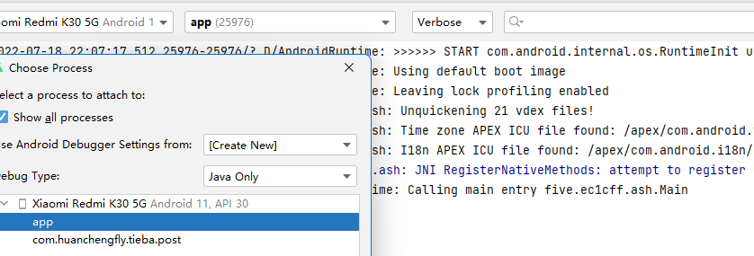
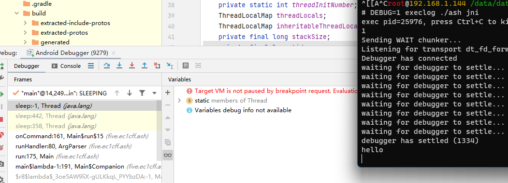
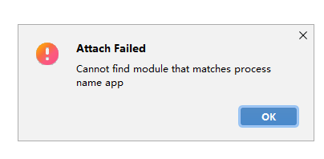
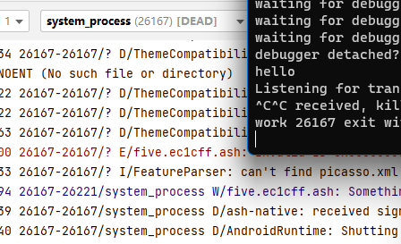
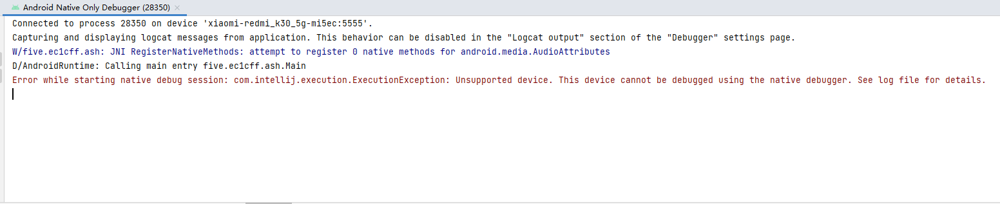
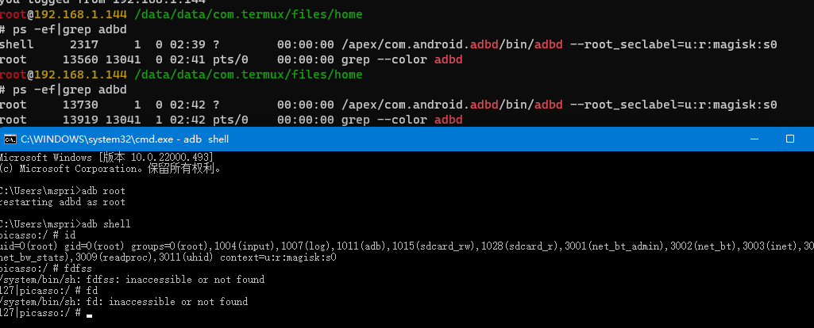
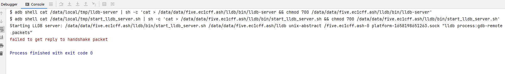
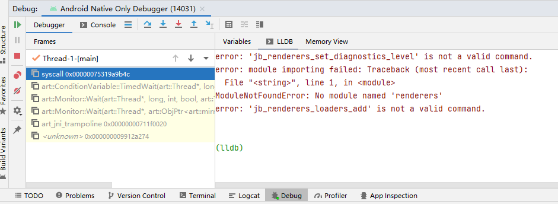
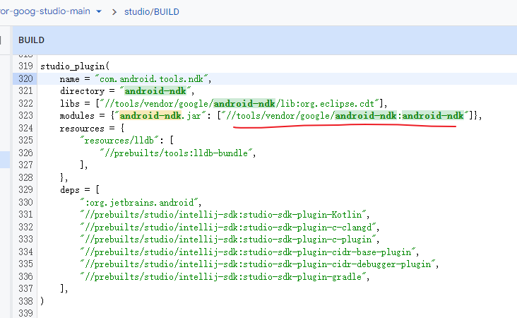

# 调试 app_process 程序

调试 app_process 程序一直是个麻烦的问题，因为官方并没有文档说明。一些知名项目也需要启动 app_process 进程，为了解决调试需求，必然有应对的方法，我们来学习一下：

## LSPosed

LSPosed 会运行一个 app_process 启动的 root daemon `lspd` ，其中还加载了原生代码。

看一看它的[启动脚本](https://github.com/LSPosed/LSPosed/blob/13d8b8abeb7e2bfef22dd1c29223d0569a3cd6ff/magisk-loader/magisk_module/daemon#L18) ：

```sh
# daemon
# magisk-loader/magisk_module/daemon
if [ $debug = "true" ]; then
  os_version=$(getprop ro.build.version.sdk)
  if [ "$os_version" -eq "27" ]; then
    java_options="$java_options -Xrunjdwp:transport=dt_android_adb,suspend=n,server=y -Xcompiler-option --debuggable"
  elif [ "$os_version" -eq "28" ]; then
    java_options="$java_options -XjdwpProvider:adbconnection -XjdwpOptions:suspend=n,server=y -Xcompiler-option --debuggable"
  else
    java_options="$java_options -XjdwpProvider:adbconnection -XjdwpOptions:suspend=n,server=y"
  fi
fi
```

提交：

[&#x5b;core&#x5d; Support debugger · LSPosed/LSPosed@409a197](https://github.com/LSPosed/LSPosed/commit/409a1974318a009994593dd8c4dae5eef89278c7)

## Scrcpy

scrcpy 的 app_process 启动逻辑写在 client app 的 [server.c](https://github.com/Genymobile/scrcpy/blob/ed84e18b1ae3e51d368f8c7bc88ba4db088e6855/app/src/server.c#L172) 里面：

```c
// app/src/server.c
#ifdef SERVER_DEBUGGER
# define SERVER_DEBUGGER_PORT "5005"
    cmd[count++] =
# ifdef SERVER_DEBUGGER_METHOD_NEW
        /* Android 9 and above */
        "-XjdwpProvider:internal -XjdwpOptions:transport=dt_socket,suspend=y,"
        "server=y,address="
# else
        /* Android 8 and below */
        "-agentlib:jdwp=transport=dt_socket,suspend=y,server=y,address="
# endif
            SERVER_DEBUGGER_PORT;
#endif
```

根据[开发者文档](https://github.com/Genymobile/scrcpy/blob/master/DEVELOP.md#debug-the-server)所述，这个调试实际上是开在 tcp 上的，并非 adb ，用起来也相当麻烦，首先要在编译的时候打开开关（还要针对 android 版本不同选择参数），启动时挂起进程，需要 adb forward 转发端口（当然在同一个子网也可以直接访问设备端口？）。

引入了这些参数的提交（其中第一个包含了讨论的 issue）：

[Fix server debugger for Android >= 9 · Genymobile/scrcpy@902b991](https://github.com/Genymobile/scrcpy/commit/902b99174df8ffc1fe7548399c19e446aa5488b6)  
[Document how to attach a debugger to the server · Genymobile/scrcpy@683f7ca](https://github.com/Genymobile/scrcpy/commit/683f7ca848ad4785557d116dcea466f1b5654ef9)  

## Shizuku

Shizuku 的用户服务也是 app_process ，和 Shizuku 服务本体一样通过 [ServiceStarter](https://github.com/RikkaApps/Shizuku/blob/234b1c8335e821e63fd5a4d923627b358ccfe11e/starter/src/main/java/moe/shizuku/starter/ServiceStarter.java#L34) 启动，其中也有调试参数：

> Shizuku UserService 进程甚至可以直接在 Android Studio 的可调试进程列表显示

```java
// starter/src/main/java/moe/shizuku/starter/ServiceStarter.java
    static {
        int sdk = Build.VERSION.SDK_INT;
        if (sdk >= 30) {
            DEBUG_ARGS = "-Xcompiler-option" + " --debuggable" +
                    " -XjdwpProvider:adbconnection" +
                    " -XjdwpOptions:suspend=n,server=y";
        } else if (sdk >= 28) {
            DEBUG_ARGS = "-Xcompiler-option" + " --debuggable" +
                    " -XjdwpProvider:internal" +
                    " -XjdwpOptions:transport=dt_android_adb,suspend=n,server=y";
        } else {
            DEBUG_ARGS = "-Xcompiler-option" + " --debuggable" +
                    " -agentlib:jdwp=transport=dt_android_adb,suspend=n,server=y";
        }
    }

    private static final String USER_SERVICE_CMD_FORMAT = "(CLASSPATH='%s' %s%s /system/bin " +
            "--nice-name='%s' moe.shizuku.starter.ServiceStarter " +
            "--token='%s' --package='%s' --class='%s' --uid=%d%s)&";

    public static String commandForUserService(String appProcess, String managerApkPath, String token, String packageName, String classname, String processNameSuffix, int callingUid, boolean debug) {
        String processName = String.format("%s:%s", packageName, processNameSuffix);
        return String.format(Locale.ENGLISH, USER_SERVICE_CMD_FORMAT,
                managerApkPath, appProcess, debug ? (" " + DEBUG_ARGS) : "",
                processName,
                token, packageName, classname, callingUid, debug ? (" " + "--debug-name=" + processName) : "");
    }
```

> Sui 的[启动](https://github.com/RikkaApps/Sui/blob/352e70efc0c6d341aeec7b3e76b36a55f4cbacf2/module/src/main/cpp/util/app_process.cpp#L57)中也有类似的逻辑，参数是一模一样的，只不过是 C++ 写的，这里就不展示了。

## libsu

Magisk 作者的 root 支持库 libsu 中也有 Root Service 功能，其中也包含了对 root 进程调试的支持。

[RootServiceManager.java](https://github.com/topjohnwu/libsu/blob/02abb7b20434a423e63aea5eebdbc6a15033ee0d/service/src/main/java/com/topjohnwu/superuser/internal/RootServiceManager.java#L81)

## 分析

我们首先观察到，对于较低版本的 android 多采用这两种参数启动调试：

`-agentlib:jdwp=` (Shizuku: android API < 28, scrcpy: Android 8)  
`-Xrunjdwp:` (LSPosed: android API == 27)  

它们后面跟着的参数形式都是一致的。

查阅资料发现，这两个参数都是 Java 官方支持的调试参数，只是版本不同。

[debugging - What are Java command line options to set to allow JVM to be remotely debugged? - Stack Overflow](https://stackoverflow.com/questions/138511/what-are-java-command-line-options-to-set-to-allow-jvm-to-be-remotely-debugged)

[Java 远程调试 - 卖程序的小歪 - 博客园](https://www.cnblogs.com/lailailai/p/4560399.html)

官方文档(`Xrunjdwp`)：

[JDWP](https://docs.oracle.com/javase/8/docs/technotes/guides/troubleshoot/introclientissues005.html)

[-X Command-line Options](https://docs.oracle.com/cd/E13150_01/jrockit_jvm/jrockit/jrdocs/refman/optionX.html#wp999539)

简单看一看参数的使用：

```
-Xrunjdwp:transport=dt_android_adb,suspend=n,server=y
```

transport 是传输方式，LSPosed 和 Shizuku 看起来都使用了 android 特有的 `dt_android_adb` ，scrcpy 则使用 `dt_socket` ，`suspend` 表示是否在启动时挂起，`server` 表示是否作为服务器等待调试器连接。

但是根据 scrcpy 那个 issue 所说，在高版本的 Android 用上面的参数不再有用。

看起来必须用 `-XjdwpProvider` 和 `-XjdwpOptions` 这两个新参数了，看上去参数的作用还是不变的，不过 provider 到底从哪里来呢？

搜索源码可以发现 `art/runtime/jdwp_provider.h` (>=9.0) 包含了一些 provider ，包括 adbConnection 和 internal 。

Android 11 后移除了 internal ，搜索还发现这个 issue ：

[JDWP provider `internal` no longer exists on Android 11 · Issue #23 · Chainfire/librootjava](https://github.com/Chainfire/librootjava/issues/23)

## 使用

于是我就稍微修改了一下 ash 脚本：

```sh
#!/system/bin/sh
if [ -n "$DEBUG" ]; then
  java_options="-XjdwpProvider:adbconnection -XjdwpOptions:suspend=y,server=y"
else
  java_options=""
fi
exec /system/bin/app_process $java_options -Djava.class.path=./ash.apk / five.ec1cff.ash.Main $*
```

运行，结果直接 abort ：

```sh
# DEBUG=1 execlog ./ash jni

07-18 21:31:35.795 15355 15355 D AndroidRuntime: >>>>>> START com.android.internal.os.RuntimeInit uid 0 <<<<<<
07-18 21:31:35.797 15355 15355 I AndroidRuntime: Using default boot image
07-18 21:31:35.797 15355 15355 I AndroidRuntime: Leaving lock profiling enabled
07-18 21:31:35.850 15355 15355 E app_process: Cannot use suspend=y with late-init jdwp.
07-18 21:31:35.850 15355 15355 F app_process: runtime.cc:1720] Plugin { library="libadbconnection.so", handle=0x0 } failed to load: Initialization of plugin failed
07-18 21:31:35.871 15355 15355 F app_process: runtime.cc:655] Runtime aborting...
07-18 21:31:35.871 15355 15355 F app_process: runtime.cc:655] Dumping all threads without mutator lock held
07-18 21:31:35.871 15355 15355 F app_process: runtime.cc:655] All threads:
07-18 21:31:35.871 15355 15355 F app_process: runtime.cc:655] DALVIK THREADS (1):
07-18 21:31:35.871 15355 15355 F app_process: runtime.cc:655] "main" prio=5 tid=1 Runnable (still starting up)
07-18 21:31:35.871 15355 15355 F app_process: runtime.cc:655]   | group="" sCount=0 dsCount=0 flags=0 obj=0x0 self=0xb400007382627c00
07-18 21:31:35.871 15355 15355 F app_process: runtime.cc:655]   | sysTid=15355 nice=0 cgrp=default sched=0/0 handle=0x7383d7b4f8
07-18 21:31:35.871 15355 15355 F app_process: runtime.cc:655]   | state=R schedstat=( 132934947 1558072 16 ) utm=7 stm=5 core=7 HZ=100
07-18 21:31:35.871 15355 15355 F app_process: runtime.cc:655]   | stack=0x7fe45bf000-0x7fe45c1000 stackSize=8192KB
```

看起来 `suspend=y` 是不允许的，但是 scrcpy 为什么可以？

既然这样，就把 suspend 改成 n ，然后我们手动调用 `Debug.waitForDebugger()` ，这样总算可以启动了，但是 AS 仍然无法识别进程。

注意到普通 app 权限会打出这一条 log ：

```
07-18 21:42:25.992 18150 18150 D AndroidRuntime: Calling main entry five.ec1cff.ash.Main
07-18 21:42:38.459 18150 18158 E app_process: failed to connect to jdwp control socket: Connection refused
```

看起来普通 app 权限不能用 jdwp socket ，切换到 root 就没有问题，然而 AS 还是无法识别。

我又检查了 debug 构建的 shizuku demo ，它的 userservice 是可以被识别的。

Sui 启动服务：

https://github.com/RikkaApps/Sui/blob/352e70efc0c6d341aeec7b3e76b36a55f4cbacf2/module/src/main/java/rikka/sui/server/SuiUserServiceManager.java

Sui 入口： `rikka.sui.server.Starter`

https://github.com/RikkaApps/Sui/blob/352e70efc0c6d341aeec7b3e76b36a55f4cbacf2/module/src/main/java/rikka/sui/server/Starter.java

```java
    public static void main(String[] args) {
        String filesPath = null;

        for (String arg : args) {
            if (arg.equals("--debug")) {
                DdmHandleAppName.setAppName("sui", 0);
            } else if (arg.startsWith("--files-path=")) {
                filesPath = arg.substring("--files-path=".length());
                SuiUserServiceManager.setStartDex(filesPath + "/sui.dex");
            }
        }

        // ...
    }
```

难道其实是 `DdmHandleAppName` 搞的鬼？

事实证明果然如此：

```kotlin
        @JvmStatic
        fun main(args: Array<String>) {
            Thread.currentThread().uncaughtExceptionHandler =
                Thread.UncaughtExceptionHandler { thread: Thread?, throwable: Throwable -> throwable.printStackTrace() }
            // new Main().run(args);
            val d = System.getProperty("five.ec1cff.ash.debuggable")
            println(d)
            if (!TextUtils.isEmpty(d)) {
                print("Waiting for debugger...\r")
                DdmHandleAppName.setAppName("app", 0)
                Debug.waitForDebugger()
            }
            runOnActivityThread({ Main().run(args) })
        }
```

```sh
#!/system/bin/sh
if [ -n "$DEBUG" ]; then
  java_options="-XjdwpProvider:adbconnection -XjdwpOptions:suspend=n,server=y -Xcompiler-option --debuggable"
else
  java_options=""
fi
exec /system/bin/app_process $java_options -Djava.class.path=./ash.apk -Dfive.ec1cff.ash.debuggable=$DEBUG / --nice-name="five.ec1cff.ash" five.ec1cff.ash.Main $*
```

总算在 log 和 debuggable 进程看到了我们的 ash ：



现在手动选择 java 调试可以附加了：



但是 native 还不行：



观察到一个很奇怪的问题，debugger detach 后变成 system_process 了：



搜了一下 Sui 源码，发现有两处 DdmHandle ：

https://github.com/RikkaApps/Sui/blob/352e70efc0c6d341aeec7b3e76b36a55f4cbacf2/module/src/main/java/rikka/sui/server/SuiUserServiceManager.java

看上去需要把这个所谓的 「DdmHandleAppName」 设置成包名，才能和 AS 打开的项目联动。

设置成包名后，已经可以进入，但是报了另一个错误：



`Error while starting native debug session: com.intellij.execution.ExecutionException: Unsupported device. This device cannot be debugged using the native debugger. See log file for details.`

[&#x5b;原创&#x5d;让你的Android Studio能够对任意进程进行源码级native debug-Android安全-看雪论坛-安全社区|安全招聘|bbs.pediy.com](https://bbs.pediy.com/thread-270154.htm)

[necuil/android_studio_sdk_modify](https://github.com/necuil/android_studio_sdk_modify)

看上去是修改 AS 源码重新编译，增加了任意进程 attach 的实现，但这个作者写一半太监了，就留下了一个仓库，不过很久没更新，也许没法在最新版本上用。

看了一下 idea.log 的具体报错：

```log
2022-07-18 22:23:22,423 [17407080]   INFO - ild.invoker.GradleBuildInvoker - Gradle build finished in 3 s 747 ms 
2022-07-18 22:23:35,063 [17419720]   INFO - ols.idea.run.AndroidDeviceSpec - Creating spec for Xiaomi Redmi K30 5G with ABIs: [arm64-v8a, armeabi-v7a, armeabi] 
2022-07-18 22:23:35,075 [17419732]   INFO - idea.run.AndroidProcessHandler - Adding device xiaomi-redmi_k30_5g-mi5ec:5555 to monitor for launched app: five.ec1cff.ash 
2022-07-18 22:23:35,078 [17419735]   INFO - run.AndroidLogcatOutputCapture - startCapture("xiaomi-redmi_k30_5g-mi5ec:5555") 
2022-07-18 22:23:35,078 [17419735]   INFO - s.ndk.run.lldb.ConnectLLDBTask - ABIs supported by app: [arm64-v8a] 
2022-07-18 22:23:35,089 [17419746]   INFO - s.ndk.run.lldb.ConnectLLDBTask - Launching AndroidNativeAttachConfigurationType:Native native debug session on device: manufacturer=Xiaomi, model=Redmi K30 5G, API=30, codename=REL, ABIs=[arm64-v8a, armeabi-v7a, armeabi] 
2022-07-18 22:23:35,206 [17419863]   WARN - s.ndk.run.lldb.ConnectLLDBTask - run-as for the selected device appears to be broken, output was : run-as: unknown package: five.ec1cff.ash 
2022-07-18 22:23:35,210 [17419867]  ERROR - s.ndk.run.lldb.ConnectLLDBTask - Unsupported device (Non-rooted device, run-as not working, injector not supported): manufacturer=Xiaomi, model=Redmi K30 5G, API=30
Native debugging is not supported on this device.
See native debugger requirements at: https://developer.android.com/studio/debug#debug-types 
java.lang.Throwable: Unsupported device (Non-rooted device, run-as not working, injector not supported): manufacturer=Xiaomi, model=Redmi K30 5G, API=30
Native debugging is not supported on this device.
See native debugger requirements at: https://developer.android.com/studio/debug#debug-types
	at com.intellij.openapi.diagnostic.Logger.error(Logger.java:182)
	at com.android.tools.ndk.run.lldb.ConnectLLDBTask.decideStarterImplementation(ConnectLLDBTask.java:208)
	at com.android.tools.ndk.run.lldb.ConnectLLDBTask.launchDebuggerInBackground(ConnectLLDBTask.java:331)
	at com.android.tools.ndk.run.lldb.ConnectLLDBTask.lambda$launchDebugger$2(ConnectLLDBTask.java:291)
	at com.intellij.openapi.application.impl.ApplicationImpl$1.run(ApplicationImpl.java:265)
	at java.base/java.util.concurrent.Executors$RunnableAdapter.call(Executors.java:515)
	at java.base/java.util.concurrent.FutureTask.run(FutureTask.java:264)
	at java.base/java.util.concurrent.ThreadPoolExecutor.runWorker(ThreadPoolExecutor.java:1128)
	at java.base/java.util.concurrent.ThreadPoolExecutor$Worker.run(ThreadPoolExecutor.java:628)
	at java.base/java.util.concurrent.Executors$PrivilegedThreadFactory$1$1.run(Executors.java:668)
	at java.base/java.util.concurrent.Executors$PrivilegedThreadFactory$1$1.run(Executors.java:665)
	at java.base/java.security.AccessController.doPrivileged(Native Method)
	at java.base/java.util.concurrent.Executors$PrivilegedThreadFactory$1.run(Executors.java:665)
	at java.base/java.lang.Thread.run(Thread.java:829)
```

没想到竟然是没有 root …… 估计 AS 内部用了 adb root 

于是尝试了 sui 的 adb root 功能，方法是 `touch /data/adb/sui/enable_adb_root(_once)` ，然后重启（once 表示仅开启一次）



这样 `adb root` 可以成功进入 root 了，并且运行在 magisk context 下，但是 attach native 仍然有问题：



```sh
$ adb shell cat /data/local/tmp/lldb-server | sh -c 'cat > /data/data/five.ec1cff.ash/lldb/bin/lldb-server && chmod 700 /data/data/five.ec1cff.ash/lldb/bin/lldb-server'
$ adb shell cat /data/local/tmp/start_lldb_server.sh | sh -c 'cat > /data/data/five.ec1cff.ash/lldb/bin/start_lldb_server.sh && chmod 700 /data/data/five.ec1cff.ash/lldb/bin/start_lldb_server.sh'
Starting LLDB server: /data/data/five.ec1cff.ash/lldb/bin/start_lldb_server.sh /data/data/five.ec1cff.ash/lldb unix-abstract /five.ec1cff.ash-0 platform-1658198651263.sock "lldb process:gdb-remote packets"
failed to get reply to handshake packet
```

原来是调试器把目标当成 app 处理了，直接在 `/data/data` 下建目录去了 …… 看起来距离能用还有很长的路要走。

手动创建了这个目录，总算 attach 上了：



不过 native 调试似乎不认识 `Debug.waitForDebugger` ，也许 dual 模式就认识了？

## 让 AS 识别需要调试的进程  

从上面的实验来看，一定要调用 `DdmHandleAppName.setName` 才能让 as 认出我们的待调试进程，并且必须是 root 。简单搜了一下代码发现，这玩意最终会和 `@jdwp-control` socket 通信，获得一个 agent socket 。普通 app 没有权限连接，需要调试的 app 可能是在 zygote 降权之前建立连接的。

## 修改 AS ？  

首先根据上面 stacktrace 的类名 `com.android.tools.ndk.run.lldb.ConnectLLDBTask` 试图用 cs 在 android studio 仓库里面搜索源码，但是一无所获。

在 AS 的 plugin 目录看到了 android-ndk （`%ProgramFiles%\Android\Android Studio\plugins\android-ndk\lib`），jadx 打开一看正是这个 plugin ，名字是 `com.android.tools.ndk` 。

在 cs 中搜索 `android-ndk` 只发现了这个：



看起来位于仓库 `platform/tools/vendor` 下，然而在 android.googlesource.com 看不到这个仓库，看起来是没有开源。

考察 pediy 那个修改方案，似乎也是拿这个 android-ndk.jar 和自己写的代码编译链接一下，替换掉原插件的逻辑，不过不知道会不会有签名校验。

……

## JDWP

JDWP 是一个运行在 adbd 的服务，提供了 unix socket `@jdwp-control`

源码：`packages/modules/adb/daemon/jdwp_service.cpp`

可以使用 `adb jdwp` 获取可调试进程的 pid ，并通过 `adb forward tcp: jdwp:<pid>` 与其交互。

[Android 调试原理 - 掘金](https://juejin.cn/post/6887395385589907469)

## `wrap.sh`

偶然有一天在 [LSP 群](https://t.me/c/1414270883/65622)听佬们提到了这个玩意：

[封装 Shell 脚本  |  Android NDK  |  Android Developers](https://developer.android.com/ndk/guides/wrap-script?hl=zh-cn#packaging_wrapsh)

这是 API 27 引入的功能，在 debuggable 为 true 的包中的 lib 放入 `wrap.sh` ，即可开启 zygote 的隐藏功能：fork 进程后，直接 exec 这个 sh ，进而启动一个 app_process 进程。也就是说，这样的 app 进程是从 RuntimeInit 而非 ZygoteInit 启动的。

而这个文档的下方就提到了如何为这样的进程开启调试——在 wrap.sh 中加入这样的代码：

```sh
#!/system/bin/sh

cmd=$1
shift

os_version=$(getprop ro.build.version.sdk)

if [ "$os_version" -eq "27" ]; then
  cmd="$cmd -Xrunjdwp:transport=dt_android_adb,suspend=n,server=y -Xcompiler-option --debuggable $@"
elif [ "$os_version" -eq "28" ]; then
  cmd="$cmd -XjdwpProvider:adbconnection -XjdwpOptions:suspend=n,server=y -Xcompiler-option --debuggable $@"
else
  cmd="$cmd -XjdwpProvider:adbconnection -XjdwpOptions:suspend=n,server=y $@"
fi

exec $cmd
```

和 LSPosed 的一模一样……看来最初是从这里来的。
