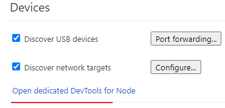
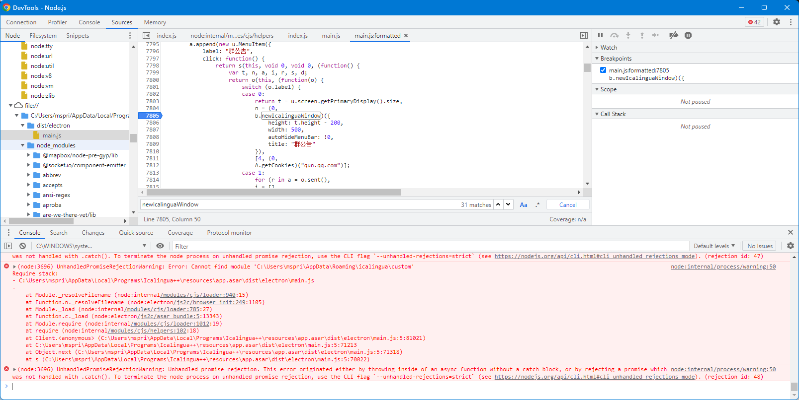
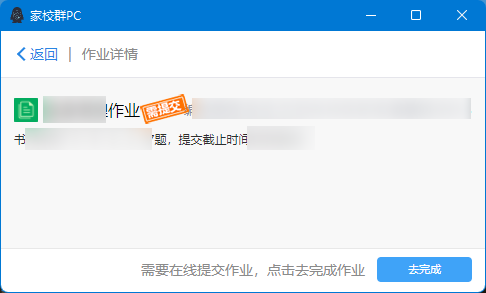
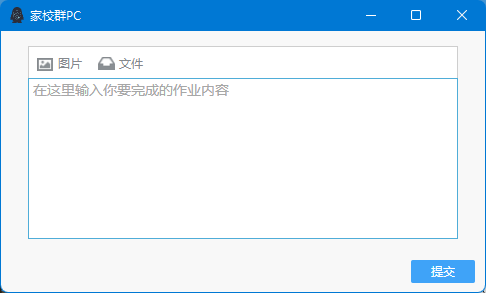
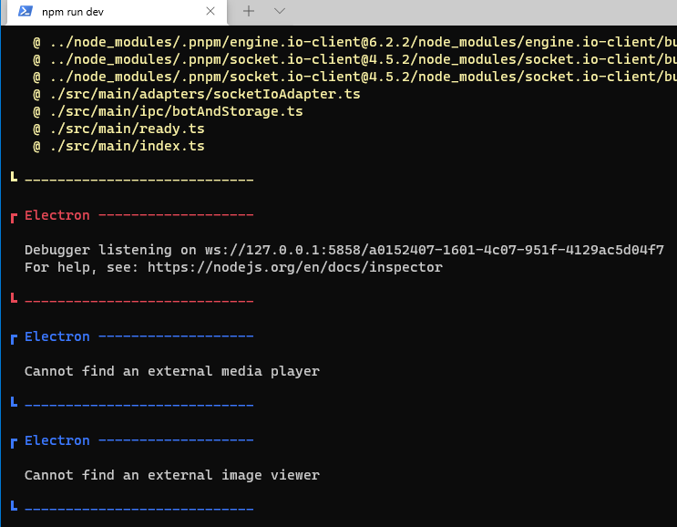
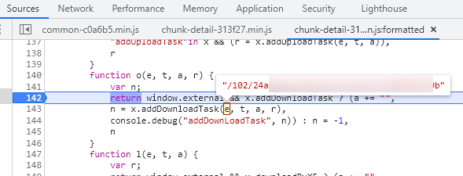

# 使用 Icalingua 打开群作业

[Icalingua-plus-plus/Icalingua-plus-plus: A client for QQ and more.](https://github.com/Icalingua-plus-plus/Icalingua-plus-plus)

菜单中可以打开群公告，而且是打开了网页，但是未提供群作业（本质上也是网页）

Icalingua 没有提供公开的 API 打开 qq url ，直接任意打开链接（或者 devtools 中 window.open）会用本地浏览器打开。

菜单的逻辑似乎不在 web 中，仅凭内置 devtools 似乎无法打开 icalingua 的浏览器窗口，而其打开的扩展窗口都没法直接访问 devtools 。

干脆 clone 源码找一找

```js
// icalingua\src\main\ipc\menuManager.ts
        menu.append(
            new MenuItem({
                label: '群公告',
                async click() {
                    const size = screen.getPrimaryDisplay().size
                    const win = newIcalinguaWindow({
                        height: size.height - 200,
                        width: 500,
                        autoHideMenuBar: true,
                        title: '群公告',
                    })
                    const cookies = await getCookies('qun.qq.com')
                    for (const i in cookies) {
                        await win.webContents.session.cookies.set({
                            url: 'https://web.qun.qq.com',
                            name: i,
                            value: cookies[i],
                        })
                    }
                    await win.loadURL('https://web.qun.qq.com/mannounce/index.html#gc=' + -room.roomId)
                },
            }),
        )
```

可以看到主要是两个步骤：获取 cookies ，打开浏览器窗口加载 url 。

由于编译起来太麻烦，因此我们直接修改现成的 icalingua 。

在命令行打开 icalingua 可以进入 repl ，但 electron 在 Windows 上不支持 repl （只能输出不能输入），所以开一个 node.js 调试

[Debugging the Main Process | Electron](https://www.electronjs.org/docs/latest/tutorial/debugging-main-process#--inspectport)

启动 `Icalingua++.exe --inspect=5858`

Chrome devtools 附加 Node.js 调试（在 `chrome://inspect`）



我们要获得 newIcalinguaWindow 和 getCookies 函数，找了一下 require ，发现并非像官方所说不能用，但是也 require 不到 icalingua 的模块。

干脆直接找到相关源码，然后断点调试，在菜单点击一下群公告就可以拿到两个函数了。

icalingua 的所有代码都被编译到 `dist/electron/main.js` 里面了。



断点停下来的时候 console 输入：

```js
_A=A;
_b=b;
```

模仿上面的逻辑：

```js
mwin=_b.newIcalinguaWindow({
    height: 300,
    width: 500,
    autoHideMenuBar: true,
    title: 'aaa',
})
cookies = await _A.getCookies('qun.qq.com')
for (const i in cookies) {
    await mwin.webContents.session.cookies.set({
        url: 'https://qun.qq.com',
        name: i,
        value: cookies[i],
    })
}
await mwin.loadURL('https://qun.qq.com/homework/features/detail.html?_wv=1027&_bid=2146#web=1&src=6&hw_id=xxx&puin=xxx&hw_type=0&need_feedback=1&gid=xxx&group_code=xxx&group_id=xxx&open_web=1')
```



可以打开群作业了，但是点击下面的「去完成」会显示「请在手机完成」的 alert

`mwin.openDevTools()` 打开 devtools 。

在 alert 下断点，发现是通过 UA 判断的，需要 startsWith `QQ/`

由于 newIcalinguaWindow 内部使用了 electron.BrowserWindow (`icalingua\src\utils\IcalinguaWindow.ts`)，我们可以在 loadURL 的时候定义 UA ：

[javascript - How to set electron UserAgent - Stack Overflow](https://stackoverflow.com/questions/35672602/how-to-set-electron-useragent)

```js
await mwin.loadURL('https://qun.qq.com/homework/features/detail.html?_wv=1027&_bid=2146#web=1&src=6&hw_id=xxx&puin=xxx&hw_type=0&need_feedback=1&gid=xxx&group_code=xxx&group_id=xxx&open_web=1', { userAgent: "QQ/114514" })
```

这样还是没法打开，进一步得知其会调用 QQ 的扩展 API `window.external.openWebWindow` ，那我们就实现一个：

```js
window.external.openWebWindow=(d)=>{console.log(d);location.href=JSON.parse(d).url;}
```



这样就可以进入提交页面了

另外我们还需要群作业的主页面，远程调试 qq 的内置浏览器得知 url 为：

```
https://qun.qq.com/homework/features/v2/index.html?_wv=1027&_bid=3089&gc=${group_id}
```

用自带的 UA 访问也会有问题，会找不到参数并疯狂请求（真不懂 QQ 这帮前端的水平……）；以下是我设备的 UA ，可以正常打开手机版的群作业：

```
Mozilla/5.0 (Linux; Android 11; Redmi K30 5G Build/RKQ1.200826.002; wv) AppleWebKit/537.36 (KHTML, like Gecko) Version/4.0 Chrome/89.0.4389.72 MQQBrowser/6.2 TBS/046209 Mobile Safari/537.36 V1_AND_SQ_8.8.50_2324_YYB_D A_8085000 QQ/8.8.50.6735 NetType/WIFI WebP/0.3.0 Pixel/1080 StatusBarHeight/96 SimpleUISwitch/0 QQTheme/1000 InMagicWin/0 StudyMode/0 CurrentMode/0 CurrentFontScale/1.0
```

精简成下面的：`Android V1_AND_SQ_8` （如果把 8 删除就是电脑版了）

如果把含 Android 的部分删除，可以打开电脑版页面：

```
AppleWebKit/537.36 (KHTML, like Gecko) Version/4.0 Chrome/89.0.4389.72 MQQBrowser/6.2 TBS/046209 Mobile Safari/537.36 V1_AND_SQ_8.8.50_2324_YYB_D A_8085000 QQ/8.8.50.6735 NetType/WIFI WebP/0.3.0 Pixel/1080 StatusBarHeight/96 SimpleUISwitch/0 QQTheme/1000 InMagicWin/0 StudyMode/0 CurrentMode/0 CurrentFontScale/1.0
```

看上去 `V1_AND_SQ_` 是关键，如果删掉就会导致打不开，而如果整个 UA 只有这个字段也是能打开的。

上面 url 的参数似乎只有 gc （群 id）有用，bid 似乎是随机的，但删除也不影响正常打开。

另外无论是 pc 还是手机页面，都没法在里面操作，看来私有 API 太多了！

代码搜索 detail.html ，发现手机版是从 `mqq.ui.openUrl` 打开的。我们添加一下：

`mqq.ui.openUrl=function(u) {location.href = u.url;}`

可以打开，但是这样出现的页面根本没法提交（提交按钮是放在内置浏览器 ui 上的，可能有别的 api）

它打开的 url 

未完成： `//qun.qq.com/homework/features/answer.html?_wv=1027#group_id=xxxxx&hw_id=xxxxx&hw_type=0`

已完成：`//qun.qq.com/homework/features/v2/feedback.html?_wv=16778243&_bid=3089&gc=xxxxx&hw_id=xxxxx&isAdmin=0&uin=xxxxx&course_name=xxxxx&originalRole=335`


再看 PC 端的，它会重定向到 `https://qun.qq.com/homework/p/features/index.html#/detail?` ，实际上是只要 UA 不含 `_SQ_` 就会重定向。

这个页面似乎参数不对，然后会疯狂请求一个 api ，不管怎么改参数都不对

……

经过反复尝试，发现作业列表实际上是 `https://qun.qq.com/homework/p/features#?gid=${group_id}` ，上面那个对应的是特定作业的页面。

这个页面上的内容就可以点开了。

因此最终思路就是：

```js
await mwin.loadURL('https://qun.qq.com/homework/p/features#?gid=xxxxx', {userAgent:"QQ/"})
// 注入 js 到 qun.qq.com 域名
window.external.openWebWindow=(d)=>{console.log(d);location.href=JSON.parse(d).url;}
```

## 开发 icalingua

npm install -g pnpm

在 icalingua 仓库目录下：

```sh
pnpm install
cd icalingua
# 启动
npm run dev
```

dev 启动会开启 inspector ，默认端口也是 5858



看上去 dev 模式下的 userData 和实际打包的不一样。

icalingua 的数据目录在 `%APPDATA%\icalingua`

dev 模式的数据目录在 `%APPDATA%\Electron`

可以通过 `require('electron').app.getPath("userData")` 获取。

直接复制安装的 icalingua 数据的 config.yml 到 dev 的数据，可以登录（密码直接写在里面）

> 但是调试热更新需要反复重启，然后 qq 就发了个登录提醒……有点害怕，可能要弄一个 [bridge](https://github.com/Icalingua-plus-plus/Icalingua-plus-plus/tree/development/icalingua-bridge-oicq) 保持登录，确保 app 反复重启也没事

作业文件下载：`window.external.addDownLoadTask`



由于没有提供完整 url ，因此暂时不知道如何下载……

## 2022.10.26

发现这个作业的文件下载和群文件是一样的，url 类似 `/102/${uuid}` ，得到 uuid 和群号后可以直接用 icalingua 的 api 下载。

不过群号没有直接从 addDownLoadTask 传入，因此我们解析 url 获得群号。

另外在菜单加了前进和后退，方便在群作业的两个页面中切换。

再提几个 BrowserWindow 相关的发现

[BrowserWindow | Electron](https://www.electronjs.org/docs/latest/api/browser-window)

`autoHideMenuBar` 控制菜单显隐，实际上隐藏的情况下按 alt 就会出现。

`webPreferences.preload` 加载外部脚本，`webPreferences.contextIsolation` 允许使用 electron api （似乎还要开了这个选项覆写 window 的对象里面的函数才能被调用，否则会被过滤掉）。

Menu 似乎对所有 browserWindow 实例都是一样的，不过 click 有个回调可以获取实际点击的 browserWindow

[Class: MenuItem | Electron](https://www.electronjs.org/docs/latest/api/menu-item#menuitemclick)

## 后记

上面的代码不久后我就 [PR](https://github.com/Icalingua-plus-plus/Icalingua-plus-plus/pull/359) 了，原仓库维护者爽快地[接受](https://github.com/Icalingua-plus-plus/Icalingua-plus-plus/commit/0d38ab6d171abbd02c4d5595f7d73f723121e9d3)了（同时那个恶臭数字 UA 也引来不少人吐槽）；尽管我的 pr 引入了一些乱七八糟的修改（比如增加了前进后退的菜单），但维护者仍然耐心地帮我改掉了，并换了更好的实现，甚至把我没实现的「下载统计数据」「查看图片」都做出来了，在这里谢谢 Icalingua 的维护者了。

# 群公告

## 确认收到

目前 icalingua 没法确认收到，但似乎只要注入 cookie 是 qun.qq.com 而非 web.qun.qq.com 就能收到了。

## 发送公告

CDP 找到 Android 发送公告的页面

`https://web.qun.qq.com/mannounce/edit.html?&_wv=5127#gc={}&role=2`

发送按钮放在了 QQ 内置浏览器的 UI 上，需要实现 api `mqq.ui.setTitleButtons`

# TODO

1. 打开群作业后过一段时间（一天以上？）有时候无法加载；发现是添加的 session cookie 出现了重复的 key ，暂时不知道什么原因。  
2. 之前发了一个「修复群公告无法确认公告」的 commit ，结果发现还是有问题（尴尬）  
