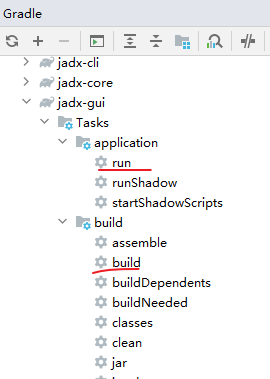
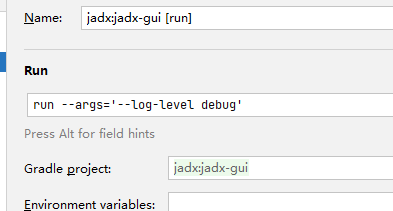
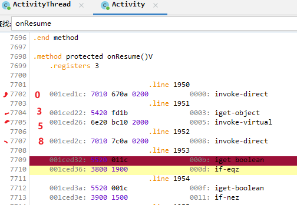

# jadx 的 smali debugger 研究

已知两个 smali debugger ，包括 [jadx](https://github.com/skylot/jadx) 和 [smalidea](https://github.com/JesusFreke/smalidea) 。

前者是知名 java 反编译器，目前仍在更新；后者是 smali 作者维护的 IDEA 插件，已经一年多未更新。

于是决定研究 jadx 。

## 构建与调试 jadx  

jadx 使用 gradle 构建。

使用 jadx-gui:run 命令可以运行和调试 jadx-gui 。



显示调试日志：run 的 configuration 添加 `--args='--log-level debug'`



## smali

[Dalvik 可执行指令格式  |  Android 开源项目  |  Android Open Source Project](https://source.android.com/docs/core/runtime/instruction-formats)

smali 指令的长度以字(16 bit)为单位（？）

## JDWP 协议

JDWP 即 Java Debugging Wire Protocol ，用于 java 调试的协议。Android 实现了 jdwp 协议。

JDWP 命令分为数个集合(command set)，每个集合下包含命令(command)，集合和命令使用数字 id 指明。

一个命令包 Command Packet 的组成：

```
Header
    length (4 bytes)
    id (4 bytes)
    flags (1 byte)
    command set (1 byte)
    command (1 byte)
data (Variable)
```

一个回应包 Reply Packet 的组成：

```
Header
    length (4 bytes)
    id (4 bytes)
    flags (1 byte)
    error code (2 bytes)
data (Variable)
```

协议相关内容的参考文档：

[Java(tm) Debug Wire Protocol](https://docs.oracle.com/en/java/javase/15/docs/specs/jdwp/jdwp-protocol.html#JDWP_VirtualMachine_AllClassesWithGeneric)

[Java Debug Wire Protocol](https://docs.oracle.com/en/java/javase/15/docs/specs/jdwp/jdwp-spec.html)

jdwp 由 jvmti 实现：

[JVM(TM) Tool Interface 15.0.0](https://docs.oracle.com/en/java/javase/15/docs/specs/jvmti.html#GetBytecodes)

ART 中的 jvmti 和 jdwp 源码：

```
art/openjdkjvmti/
external/oj-libjdwp/
```

[Android Runtime (ART)  |  Android Open Source Project](https://source.android.com/docs/core/architecture/modular-system/art?hl=en)

jadx 使用[JDWP](https://github.com/skylot/jdwp)实现协议的编解码。

整个项目就一个 java 文件：

[jdwp/JDWP.java at master · skylot/jdwp](https://github.com/skylot/jdwp/blob/master/src/main/java/io/github/skylot/jdwp/JDWP.java)

## 核心源码

1. Debugger 的实现

jadx-gui/src/main/java/jadx/gui/device/debugger/SmaliDebugger.java

2. DebugController

jadx-gui/src/main/java/jadx/gui/device/debugger/DebugController.java

3. 断点管理

jadx-gui/src/main/java/jadx/gui/device/debugger/BreakpointManager.java

## 断点

JDWP 中，[EventRequest](https://docs.oracle.com/en/java/javase/15/docs/specs/jdwp/jdwp-protocol.html#JDWP_EventRequest) 命令可以设置一些条件使得 jvm 挂起(suspend)，即暂停 vm 供我们调试。

支持的事件类型 [EventKind](https://docs.oracle.com/en/java/javase/15/docs/specs/jdwp/jdwp-protocol.html#JDWP_EventKind) 有很多，包括：

1. 单步(SINGLE_STEP)  
2. 断点(BREAKPOINT)  
3. 异常(EXCEPTION)  
4. 方法入口/退出(METHOD_ENTRY/EXIT)  
5. field 访问(FIELD_ACCESS/MODIFICATION)  
6. 类加载相关(CLASS_PREPARE/LOAD/UNLOAD)  
7. 线程相关(THREAD_START/END/DEATH)  
8. 其他

为了指定断点的位置，JDWP 使用 [`location`](https://docs.oracle.com/en/java/javase/15/docs/specs/jdwp/jdwp-spec.html#detailed-command-information) 类型描述。

> An executable location. The location is identified by one byte type tag followed by a a classID followed by a methodID followed by an unsigned eight-byte index, which identifies the location within the method. See below for details on the location index. The type tag is necessary to identify whether location's classID identifies a class or an interface. Almost all locations are within classes, but it is possible to have executable code in the static initializer of an interface.

location 包含了 classID, methodID, 以及一个代码偏移。

代码偏移指的是 smali 指令的字位置，例如下面代码的偏移：



第一条指令位于位置 0 ，字长 3 ，因此第二条指令位于位置 3 ，字长 2，第三条位于位置 3+2=5 ……

jvmti 只会处理「已加载的类」，可以用 EventRequest 设置类加载的监听； [VirtualMachine](https://docs.oracle.com/en/java/javase/15/docs/specs/jdwp/jdwp-protocol.html#JDWP_VirtualMachine) 命令集的 AllClasses 和 AllClassesWithGeneric 命令可以获取所有已加载的类。ClassesBySignature 可以根据类签名获取已加载的类（如果未加载则不会取得；如果多个类加载器有相同的类签名会返回多个）

类使用 referenceTypeID 表示（可以表示 class, interface, array），可以用[ReferenceType 命令集](https://docs.oracle.com/en/java/javase/15/docs/specs/jdwp/jdwp-protocol.html#JDWP_ReferenceType)进行操作。


