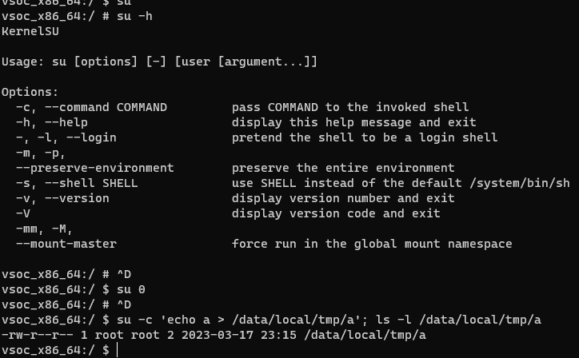
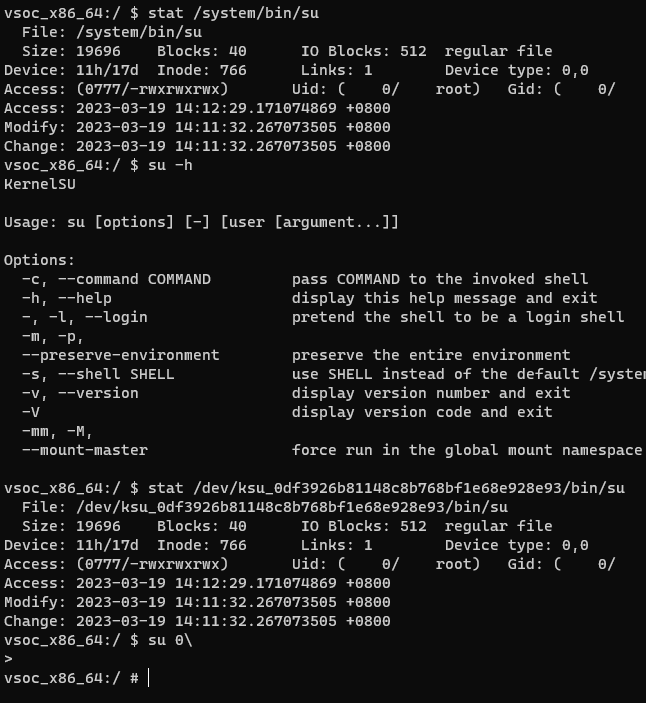
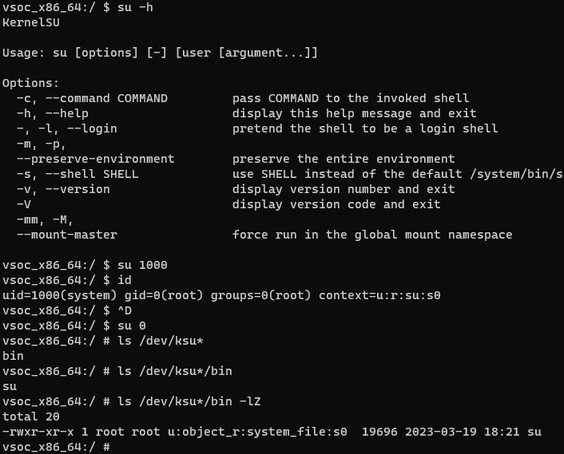

# 增强 KernelSU 的 su

## 新想法

众所周知，KSU 的 su 实际上是重定向到系统的 sh ，因此缺少了一些基本功能，比如切换 uid 、切换全局挂载命名空间等。

这样导致某些以前重度依赖 MagiskSU 的程序到了 ksu 上工作不正常。

因此我想了一个新的实现：

1. 仿照 MagiskSU 写一个 su （ksu 的 su 也只有基本功能），放在 `/data/adb/ksu/bin/su` ，execveat 重定向 `/system/bin/su` 到 `/data/adb/ksu/bin/su` 即可。由于调用 /system/bin/su 后 ksu 已经给予权限，因此可以访问这个文件。  
2. ksud install 的时候将安装 su 。  

https://github.com/5ec1cff/KernelSU

## 更进一步

看了一下 ksu 的 PR ，发现曾经有个解压 ksud 到 /dev 中的临时目录的提案。

[kernel: extract ksud to /dev by Ylarod · Pull Request #130 · tiann/KernelSU](https://github.com/tiann/KernelSU/pull/130)

PR 在内核中创建 /dev 下的临时目录，并解压内核中 embed 的 ksud 。看起来可能是为了解决低版本 /data/adb/ksud 由于 suid 问题无法被 init 执行的问题。

```
normally ksud will be started by the init process (initrc is injected to it by ksu from kernel) on boot and it handles module updates, mountings and post-fs-data or service scripts execution

ksud requires some privileges to run ofc, so it must change its selinux domain from init to su(ksu domain)

but ksud is located under /data which has the nosuid mount flag, domain transitions are restricted by selinux in such environment (only bounded transitions are allowed but it does not meet our needs), this results in the ksud not starting at all on boot and therefore the modules cannot work

bcs we didn't find a proper way to fix unbounded domain transitions under nnp/nosuid environment on kernels earlier than 4.14, u should patch ksu or kernel for now to fix the module support
```

> https://t.me/KernelSU_group/3249/40767

这个 PR 虽然暂时没有被合并，但还是给了我一些启发。

在我的方法中，su 的 execve 被重定向到 /data/adb ，但是 stat 和 faccessat 仍然重定向到 sh ，因为如果不这样，没有权限的进程无法访问 /data/adb 。

如果把 su 放在临时目录里面，execve, faccessat, stat 都重定向到这里，可以确保在 su 不存在的情况下不会被错误执行。

因此新的想法更改如下：

1. ksud install 的时候释放 su  
2. ksud 在系统启动的某个阶段把 su 放到临时目录，权限设为 system_file  
3. 临时目录的名字由内核产生，可以由内核或者 ksud 创建，但是用户空间应该有一个 API （如 prctl）拿到临时目录。  
4. 由于临时目录中的 su 已经可执行，因此不需要 sucompat 在 execve 的时候主动提权了。  

当前进度：

1. ~~new su~~  
2. ~~ksud embed su~~  
3. ~~内核重定向 su execve~~  
4. ~~实现临时目录~~  






