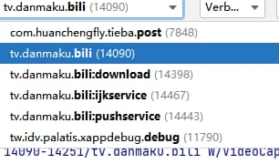
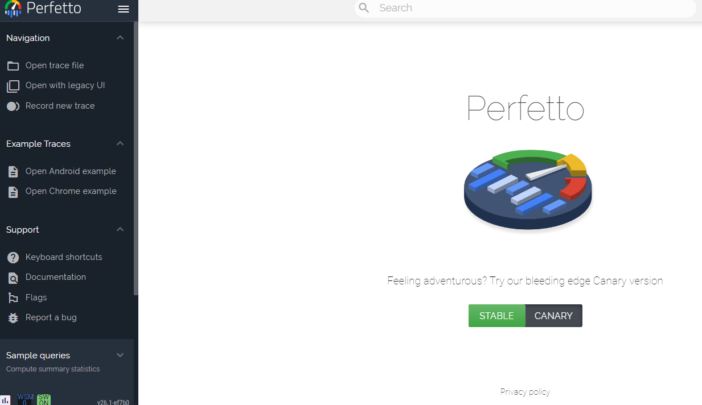
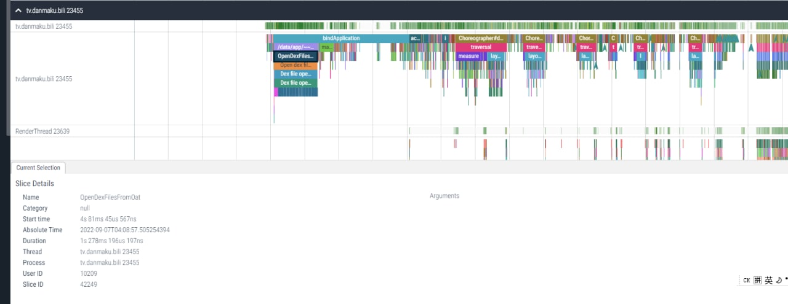

# Android 系统跟踪实战  

最近特别关心 app 的性能问题——并非自己开发的（还没到这个地步），而是手机上那些臃肿的国产 app 。虽然上一篇文章的结尾表明「一切分析皆是徒劳」，仅凭个人的力量是无法阻止这些屎山越长越大、越跑越慢的。不过我还是好奇它们究竟为何这么慢，到底慢在哪里，哪怕无法解决，也算是增长了自己的认识。

## 如何跟踪

对于我们要跟踪的目标，我们并没有它们的源码，不知道它们的行为，并且也「不可调试」它们。不过它们终究运行在 Android framework 上，要分析到底哪里慢，可以先系统关键方法插桩分析，如 `ActivityThread` 等。通过 hook 各个组件的生命周期分发方法，标记它们的起始和结束时间，通过每个生命周期的方法耗时来粗略分析。并且我们有 Xposed 等注入工具，可以直接注入到进程去分析。

思路看上去很好，但是想要凭空造一个这样的轮子却是困难的——首先要自己一个个找到生命周期的分发的方法，逐个 hook ，然后找到一种方法收集数据，最后还要将数据可视化，方便我们的分析……总之，我那微弱的产能是造不出这个轮子的。

不过我们不必自己造轮子，Android 发展那么多年怎么能没有性能分析工具呢？来看看 weishu 大神曾经写过的文章：

[手把手教你使用Systrace（一） - 知乎](https://zhuanlan.zhihu.com/p/27331842)

## systrace?

我们了解到 Android 系统有 `systrace` 这个工具进行性能分析，并且 framework 提供了 `android.os.Trace` 用于在程序的执行流程中给我们感兴趣的过程做标记 (label) 。 `Trace.beginSection` 标记开始， `Trace.endSection` 标记结束。实际上，Android framework 自身就大量使用 Trace ，在 ActivityThread 等类的关键方法都有跟踪标记。

不过这玩意的使用前提是进程是 debuggable 的——没关系，用 xposed 强开就好了。在 ~~LSP 应用市场~~ 模块仓库中就有一个为 app 强制开启 debug 的模块：XAppDebug

[Palatis/XAppDebug: toggle app debuggable](https://github.com/Palatis/XAppDebug)

粗略看了一下源码，原理就是注入 ss ， hook `PMS` 的一些方法，使得 `ApplicationInfo` 对特定 app 返回 `debuggable=true` 的字段，这允许 app 进程的 ActivityThread 在 bindApplication 的时候初始化各种 debug 功能（其中就包括 Trace）；还有 `Process.start` 中也注入了允许调试的 flags ，以便 app 进程能够连接到 adbd ，让 ddmHandle 生效。

不过这玩意把进程的 niceName 当作 packageName ，着实让我汗颜（参数明明就有 packageName——虽然不是 zygote 必需的参数）。并且使用文件系统结构存储配置（也就是文件名起名为目标包名，然后以文件是否存在作为开关……），还通过 SELinuxHelper 在 system server 访问 app 的配置，总感觉实现得特别不优雅……起码用个 XSP 罢！

总之，按照自己的需求修改了一下模块后，安装启用模块，重启手机，果然能够选择 app 开启调试了，AS 的 log 出现了原本 undebuggable app 的选项！

既然这样，那 systrace 就可以派上用场了吧？然而……

没想到这个远古老物居然需要 python 2.7 ……

在 Windows 上配置 Python 3 和 2.7 共存似乎很麻烦，我不想冒这个险。

> 此时我又想骂自己：怎么主力操作系统还不换 Linux ？非要坚守破烂 Windows 吗？就因为 OEM 预装花了几个破钱？这些钱能给你带来好的体验吗？

且慢！systrace 看上去也早就不被 Google 所重视了。查看官方文档，发现官方目前推崇一个更强的 trace 分析工具：Perfetto

## 初步探索 Perfetto

[系统跟踪概览  |  Android 开发者  |  Android Developers](https://developer.android.com/topic/performance/tracing?hl=zh-cn)

[Perfetto](https://ui.perfetto.dev/#!/)是一个 web 工具，浏览器直接访问即可（需要挂梯）。使用方法也很简单，把采集到的数据在这个页面打开即可。

> 再次感受到浏览器的强大，这玩意竟然能在浏览器上面跑。（难怪 google 都不开发桌面产品了，什么都放浏览器上）

并且，Android 9 开始内置了「系统跟踪」App ，提供了图形化界面的配置和方便的跟踪开关（可以显示为磁贴）。需要跟踪，直接点击磁贴，会产生一条通知；跟踪结束，点击通知即可分享跟踪结果。

尝试着跟踪了一下 bilibili 的启动——好家伙，跟踪文件大小高达 60M ！

打开一看，似乎记录了系统中的不少进程，当然只有 debuggable 的才会显示很密集的跟踪记录。

简单分析一下，发现启动这整个 app 花了 7s ， bindApplication 竟然长达 4s 。其中打开 apk 的过程大概 1.5s ，还有 3s 不知道在干什么。

> 这里我打开了漫游模块，所以结果可能不是很准确，因为仔细观察，发现有一些过程涉及到漫游的加载。不过曾经试过关掉模块启动 bilibili ，还是一样的慢。  

随便开了一个 debuggable 的 app 对比，启动过程不足 1s ，由此可见国产屑 app 到底有多臃肿。

继续研究了一下，发现捕获的记录似乎不怎么全面，比如 Provider 等的初始化似乎没有跟踪（有待考察源码，也许是持续时间太短了没看见？）。bilibili 的启动会拉起几个进程，不过大部分都是主进程启动完成后才启动的，也看不出其中的关系。此外，这个工具偶尔会卡 bug ，导入文件而半天显示不出可视化结果，需要刷新页面。

## 尾声

这次算是体验了一把性能分析，虽然收获甚微，并未揭开「为何国产 app 启动如此之慢」的谜底，不过我想总有一天会研究明白，并且使用这些工具的经验对将来的开发也是有帮助的。
