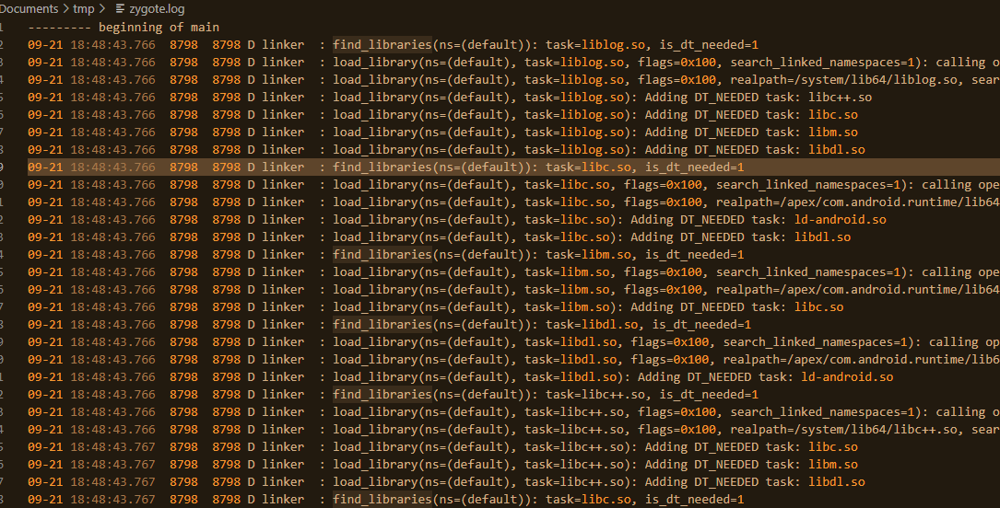
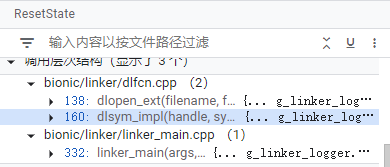
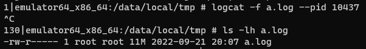
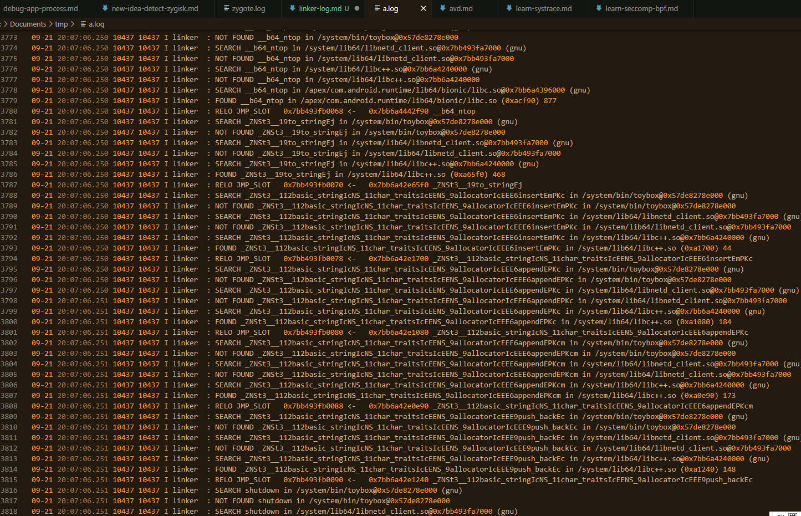

# 从日志学习 Android Linker  

我最近在研究 Linker ，在源码中不断跳转，感觉毫无头绪，而附加调试器<ruby>过于困难<rt>我不会</rt></ruby>，实际上也对整体的理解没有太大的帮助。头昏脑胀中灵光一闪：要是有它的日志就方便多了！没错，要理解一个程序的运作机制，日志是最好的导师，那么，Linker 有没有调试日志呢？

然而正常情况下 logcat 并不包含 linker 的详细日志，只是偶尔有错误日志出现，这样对理解 linker 的工作没有太大帮助。

于是乎求助万能的 google ，搜到[一篇文章](https://blog.csdn.net/chiefhsing/article/details/116757358)介绍了 linker 日志的两个开关：系统属性和环境变量。

## `debug.ld.` 属性

有两个属性，分别是对全局生效的 `debug.ld.all` 和对指定包名生效的 `debug.ld.app.${packageName}`。

这个属性指定了 log 的 flags ，开启对应日志类型的输出，取值可以为 `dlopen`, `dlsym` 或者 `dlerror` ；可以取多个值，用逗号 `,` 分隔。（dlclose 包含在 dlopen 中）

如全局输出 dlopen 和 dlerror 的日志，可以 `setprop debug.ld.all dlopen,dlerror`



观察日志，发现确实出现了大量以 `linker` 为 tag 的日志，主要是与 lib 的加载有关，被加载的 lib 本身和它的依赖项都很清楚地显示在日志中。

搜索源码，发现相关逻辑位于 `bionic/linker/linker_logger.cpp` ：

```cpp
void LinkerLogger::ResetState() {
  // The most likely scenario app is not debuggable and
  // is running on a user build, in which case logging is disabled.
  if (prctl(PR_GET_DUMPABLE, 0, 0, 0, 0) == 0) {
    return;
  }

  flags_ = 0;

  // For logging, check the flag applied to all processes first.
  static CachedProperty debug_ld_all("debug.ld.all");
  flags_ |= ParseProperty(debug_ld_all.Get());

  // Safeguard against a NULL g_argv. Ignore processes started without argv (http://b/33276926).
  if (g_argv == nullptr || g_argv[0] == nullptr) {
    return;
  }

  // Otherwise check the app-specific property too.
  // We can't easily cache the property here because argv[0] changes.
  char debug_ld_app[PROP_VALUE_MAX] = {};
  GetAppSpecificProperty(debug_ld_app);
  flags_ |= ParseProperty(debug_ld_app);
}
```

看起来能否显示日志还取决于是否 dumpable ，而 user 构建的 release app 的进程都是 undumpable 的，因此不能希望这个属性对不可调试的 app 有效。

此外，所谓的包名其实是进程名前缀，获取进程名在第一个 `:` 之前的内容作为前缀，取得相应的 `debug.ld.app.$prefix` ，设置 log flags 。

```cpp
static void GetAppSpecificProperty(char* buffer) {
  // Get process basename.
  const char* process_name_start = basename(g_argv[0]);

  // Remove ':' and everything after it. This is the naming convention for
  // services: https://developer.android.com/guide/components/services.html
  const char* process_name_end = strchr(process_name_start, ':');

  std::string process_name = (process_name_end != nullptr) ?
                             std::string(process_name_start, (process_name_end - process_name_start)) :
                             std::string(process_name_start);

  std::string property_name = std::string("debug.ld.app.") + process_name;
  __system_property_get(property_name.c_str(), buffer);
}
```



`LinkerLogger::ResetState` 除了初始化之外，似乎会在每次 dlsym 或 dlopen 的时候调用

## `LD_DEBUG` 环境变量  

这个环境变量在 linker_main 处理(`bionic/linker/linker_main.cpp`)：

```cpp
static ElfW(Addr) linker_main(KernelArgumentBlock& args, const char* exe_to_load) {
    // ...
    // Get a few environment variables.
    const char* LD_DEBUG = getenv("LD_DEBUG");
    if (LD_DEBUG != nullptr) {
      g_ld_debug_verbosity = atoi(LD_DEBUG);
    }
    // ...
}
```

在 `bionic/linker/linker_debug.h` 定义了这个环境变量的取值：

```cpp
#define LINKER_VERBOSITY_PRINT (-1)
#define LINKER_VERBOSITY_INFO   0
#define LINKER_VERBOSITY_TRACE  1
#define LINKER_VERBOSITY_DEBUG  2

__LIBC_HIDDEN__ extern int g_ld_debug_verbosity;

#define _PRINTVF(v, x...) \
    do { \
      if (g_ld_debug_verbosity > (v)) linker_log((v), x); \
    } while (0)
```

可见，只要 `LD_DEBUG` 的数大于 `LINKER_VERBOSITY_` 的值，那么这个等级的日志就会输出。而设置为 `3` 就是所有等级都可以输出（**这样会导致程序运行极度缓慢**）。

看上去这个环境变量所指示的日志范围或许比上面那个属性更广，不过修改新进程的 env 并不容易，起码没有 root 是做不到的。有 root 的情况下，我们可以修改 init.environ.rc 来注入 env，当然也可以用 zygisk 那样劫持启动的方式来注入 env。

当然，如果只是简单地了解一下 linker 的启动流程，不涉及特定进程的分析的话，直接开一个 shell 为新进程设置环境变量即可。

下面我们看一看 ls 的 linker INFO 等级的日志：

```log
emulator64_x86_64:/data/local/tmp # LD_DEBUG=1 ls &
[1] 10403
emulator64_x86_64:/data/local/tmp # Shamiko-v0.5.2-120-release.zip  app-debug.apk  busybox     magisk32  magiskboot  magiskpolicy  util_functions.sh
ap                              avd_magisk.sh  magisk.apk  magisk64  magiskinit  stack.sh      zyg
logcat --pid 10403
--------- beginning of main
09-21 19:24:10.792 10403 10403 W linker  : [ Android dynamic linker (64-bit) ]
09-21 19:24:10.793 10403 10403 W linker  : [ Linking executable "/system/bin/toybox" ]
09-21 19:24:10.793 10403 10403 W linker  : [ Linking "[vdso]" ]
09-21 19:24:10.793 10403 10403 W linker  : [ Reading linker config "/linkerconfig/ld.config.txt" ]
09-21 19:24:10.793 10403 10403 W linker  : [ Using config section "system" ]
09-21 19:24:10.794 10403 10403 W linker  : [ Linking "/system/bin/toybox" ]
09-21 19:24:10.794 10403 10403 W linker  : [ Linking "/system/lib64/libcrypto.so" ]
09-21 19:24:10.794 10403 10403 W linker  : [ Linking "/system/lib64/libz.so" ]
09-21 19:24:10.795 10403 10403 W linker  : [ Linking "/system/lib64/liblog.so" ]
09-21 19:24:10.795 10403 10403 W linker  : [ Linking "/system/lib64/libprocessgroup.so" ]
09-21 19:24:10.795 10403 10403 W linker  : [ Linking "/system/lib64/libselinux.so" ]
09-21 19:24:10.795 10403 10403 W linker  : [ Linking "/apex/com.android.runtime/lib64/bionic/libc.so" ]
09-21 19:24:10.795 10403 10403 W linker  : [ Linking "/apex/com.android.runtime/lib64/bionic/libm.so" ]
09-21 19:24:10.795 10403 10403 W linker  : [ Linking "/apex/com.android.runtime/lib64/bionic/libdl.so" ]
09-21 19:24:10.795 10403 10403 W linker  : [ Linking "/system/lib64/libc++.so" ]
09-21 19:24:10.795 10403 10403 W linker  : [ Linking "/system/lib64/libbase.so" ]
09-21 19:24:10.795 10403 10403 W linker  : [ Linking "/system/lib64/libcgrouprc.so" ]
09-21 19:24:10.795 10403 10403 W linker  : [ Linking "/system/lib64/libpcre2.so" ]
09-21 19:24:10.795 10403 10403 W linker  : [ Linking "/system/lib64/libpackagelistparser.so" ]
09-21 19:24:10.796 10403 10403 W linker  : [ Linking "/system/lib64/libnetd_client.so" ]
09-21 19:24:10.797 10403 10403 W linker  : [ CFI add 0x63f23b918000 + 0x80000  ]
09-21 19:24:10.797 10403 10403 W linker  : [ CFI add 0x7ffff517c000 + 0x1000 linux-vdso.so.1 ]
09-21 19:24:10.797 10403 10403 W linker  : [ CFI add 0x7b4242039000 + 0x18b000 libcrypto.so ]
09-21 19:24:10.797 10403 10403 W linker  : [ CFI add 0x7b4241e53000 + 0x1c000 libz.so ]
09-21 19:24:10.797 10403 10403 W linker  : [ CFI add 0x7b42427e5000 + 0x12000 liblog.so ]
09-21 19:24:10.797 10403 10403 W linker  : [ CFI add 0x7b424268a000 + 0x5b000 libprocessgroup.so ]
09-21 19:24:10.797 10403 10403 W linker  : [ CFI add 0x7b424281b000 + 0x1d000 libselinux.so ]
09-21 19:24:10.797 10403 10403 W linker  : [ CFI add 0x7b4240380000 + 0x633000 libc.so ]
09-21 19:24:10.797 10403 10403 W linker  : [ CFI add 0x7b4241eea000 + 0x4b000 libm.so ]
09-21 19:24:10.797 10403 10403 W linker  : [ CFI add 0x7b4242658000 + 0x5000 libdl.so ]
09-21 19:24:10.797 10403 10403 W linker  : [ CFI add 0x7b4241f45000 + 0xb8000 libc++.so ]
09-21 19:24:10.797 10403 10403 W linker  : [ CFI add 0x7b4242729000 + 0x42000 libbase.so ]
09-21 19:24:10.797 10403 10403 W linker  : [ CFI add 0x7b4241eaf000 + 0x6000 libcgrouprc.so ]
09-21 19:24:10.797 10403 10403 W linker  : [ CFI add 0x7b4240310000 + 0x5e000 libpcre2.so ]
09-21 19:24:10.797 10403 10403 W linker  : [ CFI add 0x7b42427b8000 + 0x4000 libpackagelistparser.so ]
09-21 19:24:10.798 10403 10403 W linker  : [ CFI add 0x7b4030272000 + 0xb000 libnetd_client.so: 0x7b4030277000 ]
09-21 19:24:10.799 10403 10403 W linker  : [ Jumping to _start (0x63f23b947280)... ]
```

比较短小，不过已经能让我们清楚地看到 linker 初始化，加载程序，最后跳转到入口执行的过程了。

再来看看 LD_DEBUG=2 的，此时已经很卡了，等了几秒才出结果，logcat 直接吐出了大量日志，这里节选了最后一小段：

```log
09-21 19:33:52.106 10411 10411 I linker  : [ DT_INIT_ARRAY[0] == 0x7b929d26ec70 ]
09-21 19:33:52.106 10411 10411 I linker  : [ Calling c-tor function @ 0x7b929d26ec70 for '/system/lib64/libprocessgroup.so' ]
09-21 19:33:52.106 10411 10411 I linker  : [ Done calling c-tor function @ 0x7b929d26ec70 for '/system/lib64/libprocessgroup.so' ]
09-21 19:33:52.106 10411 10411 I linker  : [ Done calling DT_INIT_ARRAY for '/system/lib64/libprocessgroup.so' ]
09-21 19:33:52.106 10411 10411 I linker  : [ Calling DT_INIT_ARRAY (size 1) @ 0x7b929d0b2be8 for '/system/lib64/libselinux.so' ]
09-21 19:33:52.106 10411 10411 I linker  : [ DT_INIT_ARRAY[0] == 0x7b929d0ab4f0 ]
09-21 19:33:52.106 10411 10411 I linker  : [ Calling c-tor function @ 0x7b929d0ab4f0 for '/system/lib64/libselinux.so' ]
09-21 19:33:52.106 10411 10411 I linker  : [ Done calling c-tor function @ 0x7b929d0ab4f0 for '/system/lib64/libselinux.so' ]
09-21 19:33:52.106 10411 10411 I linker  : [ Done calling DT_INIT_ARRAY for '/system/lib64/libselinux.so' ]
09-21 19:33:52.106 10411 10411 I linker  : [ Calling DT_INIT_ARRAY (size 2) @ 0x5ae6be612290 for '/system/bin/toybox' ]
09-21 19:33:52.106 10411 10411 I linker  : [ DT_INIT_ARRAY[0] == 0xffffffffffffffff ]
09-21 19:33:52.106 10411 10411 I linker  : [ DT_INIT_ARRAY[1] == 0x0 ]
09-21 19:33:52.106 10411 10411 I linker  : [ Done calling DT_INIT_ARRAY for '/system/bin/toybox' ]
09-21 19:33:52.106 10411 10411 I linker  : [ Ready to execute "/system/bin/toybox" @ 0x5ae6be5cd280 ]
09-21 19:33:52.106 10411 10411 W linker  : [ Jumping to _start (0x5ae6be5cd280)... ]
```

可以看到日志中甚至包含了调用 init array 的记录（以及地址）。从这里可以知道，程序最先被执行的代码是位于 DT_INIT_ARRAY 的函数，而后才是 `_start` 。

> [Android安全–linker加载so流程，在.init下断点](http://www.alonemonkey.com/linker-load-so.html)

顺带一提，完整的日志有 11M ：



其中多半是……



由此可见，其实 LD_DEBUG=1 足够了。