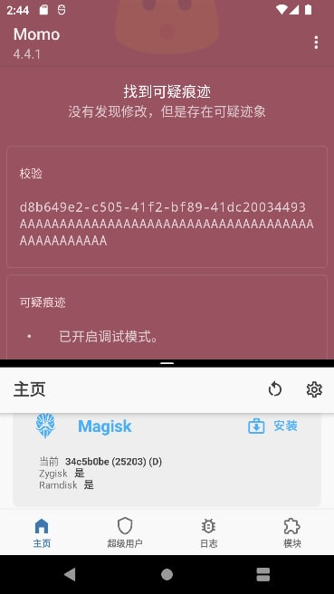
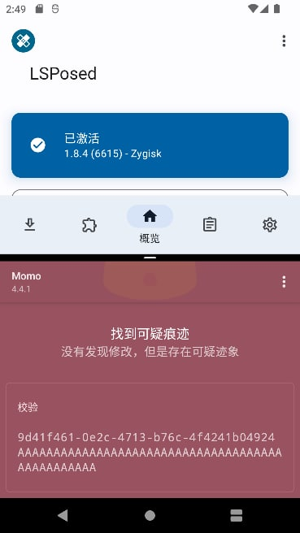

# maru：基于 Native Bridge 的 zygisk

越来越感觉到 Zygisk 目前的原理不适合隐藏，反而是 Riru 的隐藏更为简单，于是突发奇想，能不能用 Riru 的加载方式，也就是 Native Bridge ，加载 Zygisk 及其模块呢？

起初想通过一个 magisk 模块实现，但实际尝试后，考虑到下面几个原因：

1. zygisk 被禁用后 zygisk 模块都不会被 magisk 加载，导致不仅要自己加载模块的 so ，还要自己处理 mount 和 props 。  
2. magisk 引入了大量外部依赖，直接把 magisk 代码复制到另一个项目，维护起来有一定难度。  
3. magisk 内部的基础设施更加完善，操作起来比自己造的模块会更方便。  

因此觉得直接修改 magisk 源码或许会更好。

于是诞生了 maru ，名字的含义是 MAgisk + riRU 。代码开源在[这里](https://github.com/5ec1cff/Magisk/tree/maru)。

maru 仅仅是一个 PoC 。我不会发布任何 release 。如果没有新的想法，继续维护的可能性也不大。

> ~~不过似乎已经有第三方 Magisk 拿去用了？~~

maru 实现的 zygisk 理论上支持大部分 zygisk 模块。**由于修改了内部实现，因此一些依赖 zygisk 内部实现的<ruby>模块<rt>Shamiko</rt></ruby>可能无法正常使用。**

> 实际上这个修改的 magisk 已经在我的手机上运行了一个多月了，使用 LSPosed、Sui、Clipboard Whitelist 基本上没什么大问题。由于我没有其他 zygisk 模块，因此其他的模块会怎么样我就不知道了。

下面我将分析 riru 和 zygisk 的实现，以及 maru 是如何将它们~~缝合~~起来的。

## 参考资料

[topjohnwu/Magisk: The Magic Mask for Android](https://github.com/topjohnwu/Magisk)

[RikkaApps/Riru: Inject into zygote process](https://github.com/RikkaApps/Riru)

[通过系统的native bridge实现注入zygote - 残页的小博客](https://blog.canyie.top/2020/08/18/nbinjection/)

## Native Bridge 加载器  

### 加载原理

系统会在 `/system/lib(64)` 中查找名为 `ro.dalvik.vm.native.bridge` 的值的 lib 并作为 native bridge 加载。

```cpp
// art/runtime/runtime.cc
bool Runtime::Init(RuntimeArgumentMap&& runtime_options_in) {
  // ...
  // Look for a native bridge.
  //
  // The intended flow here is, in the case of a running system:
  //
  // Runtime::Init() (zygote):
  //   LoadNativeBridge -> dlopen from cmd line parameter.
  //  |
  //  V
  // Runtime::Start() (zygote):
  //   No-op wrt native bridge.
  //  |
  //  | start app
  //  V
  // DidForkFromZygote(action)
  //   action = kUnload -> dlclose native bridge.
  //   action = kInitialize -> initialize library
  //
  //
  // The intended flow here is, in the case of a simple dalvikvm call:
  //
  // Runtime::Init():
  //   LoadNativeBridge -> dlopen from cmd line parameter.
  //  |
  //  V
  // Runtime::Start():
  //   DidForkFromZygote(kInitialize) -> try to initialize any native bridge given.
  //   No-op wrt native bridge.
  {
    std::string native_bridge_file_name = runtime_options.ReleaseOrDefault(Opt::NativeBridge);
    is_native_bridge_loaded_ = LoadNativeBridge(native_bridge_file_name);
  }
  // ...
}

// art/libnativebridge/native_bridge.cc
bool LoadNativeBridge(const char* nb_library_filename,
                      const NativeBridgeRuntimeCallbacks* runtime_cbs) {
  // We expect only one place that calls LoadNativeBridge: Runtime::Init. At that point we are not
  // multi-threaded, so we do not need locking here.

  if (state != NativeBridgeState::kNotSetup) {
    // Setup has been called before. Ignore this call.
    if (nb_library_filename != nullptr) {  // Avoids some log-spam for dalvikvm.
      ALOGW("Called LoadNativeBridge for an already set up native bridge. State is %s.",
            GetNativeBridgeStateString(state));
    }
    // Note: counts as an error, even though the bridge may be functional.
    had_error = true;
    return false;
  }

  if (nb_library_filename == nullptr || *nb_library_filename == 0) {
    CloseNativeBridge(false);
    return false;
  } else {
    if (!NativeBridgeNameAcceptable(nb_library_filename)) {
      CloseNativeBridge(true);
    } else {
      // Try to open the library. We assume this library is provided by the
      // platform rather than the ART APEX itself, so use the system namespace
      // to avoid requiring a static linker config link to it from the
      // com_android_art namespace.
      void* handle = OpenSystemLibrary(nb_library_filename, RTLD_LAZY);

      if (handle != nullptr) {
        callbacks = reinterpret_cast<NativeBridgeCallbacks*>(dlsym(handle,
                                                                   kNativeBridgeInterfaceSymbol));
        if (callbacks != nullptr) {
          if (isCompatibleWith(NAMESPACE_VERSION)) {
            // Store the handle for later.
            native_bridge_handle = handle;
          } else {
            ALOGW("Unsupported native bridge API in %s (is version %d not compatible with %d)",
                  nb_library_filename, callbacks->version, NAMESPACE_VERSION);
            callbacks = nullptr;
            dlclose(handle);
          }
        } else {
          dlclose(handle);
          ALOGW("Unsupported native bridge API in %s: %s not found",
                nb_library_filename, kNativeBridgeInterfaceSymbol);
        }
      } else {
        ALOGW("Failed to load native bridge implementation: %s", dlerror());
      }

      // Two failure conditions: could not find library (dlopen failed), or could not find native
      // bridge interface (dlsym failed). Both are an error and close the native bridge.
      if (callbacks == nullptr) {
        CloseNativeBridge(true);
      } else {
        runtime_callbacks = runtime_cbs;
        state = NativeBridgeState::kOpened;
      }
    }
    return state == NativeBridgeState::kOpened;
  }
}
```

native bridge 需要一个特殊的符号 `NativeBridgeItf` ，如果 dlopen 失败或者 dlsym 这个符号失败，都会卸载我们的 native bridge ，实际上这利于我们的隐藏，因为不像 LD_PRELOAD 难以主动卸载自身。

### 实例分析：Riru

Riru 注入 zygote 是通过 native bridge 实现的，但它并不依赖 native bridge 提供的符号，仅仅是将其作为加载的工具人。下面我们来分析一下：

Riru 生成了一个 libriruloader.so ，作为 magisk 模块挂载到 `/system/lib(64)` 用于进一步加载。

Riru 中这样声明这个符号：

```cpp
// riru/src/main/cpp/loader/loader.cpp
extern "C" [[gnu::visibility("default")]] uint8_t NativeBridgeItf[
        sizeof(NativeBridgeCallbacks<__ANDROID_API_R__>) * 2]{0};
```

这个符号实际上是一个结构体 `NativeBridgeCallbacks` ，声明于 `art/libnativebridge/include/nativebridge/native_bridge.h` ，随着 Android 版本更新会逐渐升级符号版本，增加更多内容，它的第一个字段是版本号：

```cpp
// Native bridge interfaces to runtime.
struct NativeBridgeCallbacks {
  // Version number of the interface.
  uint32_t version;
```

而 riru 默认情况下直接全部填 0 ，实际上就阻止了系统调用符号中的函数，loader 会被直接卸载，不过由于 loader 是被 dlopen 的，因此 constructor 仍然会被调用，在 constructor 中可以执行任意代码，自然也可以 dlopen 其他库，并且不会被关闭。

riru 通过 socket 的方式与 rirud 守护进程通信，在 loader 中会读取原始的 native bridge ，如果存在，会尝试 dlopen 这个 native bridge ，并直接复制它的 NativeBridgeItf 给自己，这样系统就能加载原始的 native bridge 了。

### 如何读取原始的 NB ?

从 riru 的实现来看，这个 original native bridge 被 daemon 持有，而 daemon 在 post-fs-data 启动，orig nb 就是从参数传进去的。

```sh
# post-fs-data.sh
unshare -m sh -c "/system/bin/app_process -Djava.class.path=rirud.apk /system/bin --nice-name=rirud riru.Daemon $(magisk -V) $(magisk --path) $(getprop ro.dalvik.vm.native.bridge)&"
```

看看 Magisk 的加载：

post-fs-data 阶段处理模块的加载，首先会执行 `post-fs-data.sh` 然后再 magic mount ，挂载的同时处理 props 。因此我们在 `post-fs-data.sh` 可以读取原来的属性。

```cpp
// native/src/core/bootstages.cpp
void post_fs_data(int client) {
    // ...

    if (getprop("persist.sys.safemode", true) == "1" || check_key_combo()) {
        safe_mode = true;
        // Disable all modules and denylist so next boot will be clean
        disable_modules();
        disable_deny();
    } else {
        exec_common_scripts("post-fs-data");
        db_settings dbs;
        get_db_settings(dbs, ZYGISK_CONFIG);
        zygisk_enabled = dbs[ZYGISK_CONFIG];
        initialize_denylist();
        handle_modules(); // 首先执行 post-fs-data.sh
    }

early_abort:
    // We still do magic mount because root itself might need it
    magic_mount(); // magic mount 的同时加载 props
    DAEMON_STATE = STATE_POST_FS_DATA_DONE;

unblock_init:
    close(xopen(UNBLOCKFILE, O_RDONLY | O_CREAT, 0));
}

// native/src/core/module.cpp
void handle_modules() {
    prepare_modules();
    collect_modules(false);
    exec_module_scripts("post-fs-data");

    // Recollect modules (module scripts could remove itself)
    module_list->clear();
    collect_modules(true);
}

void magic_mount() {
    // ...
    LOGI("* Loading modules\n");
    for (const auto &m : *module_list) {
        const char *module = m.name.data();
        char *b = buf + sprintf(buf, "%s/" MODULEMNT "/%s/", MAGISKTMP.data(), module);

        // Read props
        strcpy(b, "system.prop");
        if (access(buf, F_OK) == 0) {
            LOGI("%s: loading [system.prop]\n", module);
            load_prop_file(buf, false);
        }
        // ...
    }
    // ...
}

// native/src/resetprop/resetprop.cpp
void load_prop_file(const char *filename, bool prop_svc) {
    auto impl = get_impl();
    LOGD("resetprop: Parse prop file [%s]\n", filename);
    parse_prop_file(filename, [=](auto key, auto val) -> bool {
        impl->setprop(key.data(), val.data(), prop_svc);
        return true;
    });
}
```

## USAP

[Android Framework | 一种新型的应用启动机制:USAP - 掘金](https://juejin.cn/post/6922704248195153927#heading-6)

如何启用：

```
getprop persist.device_config.runtime_native.usap_pool_enabled
setprop persist.device_config.runtime_native.usap_pool_enabled true
```

~~在创建 usap 之前就已经加载了 native bridge 。USAP 仅仅是 zygote 的 fork ，也就是说其中不会重启 runtime ，也不会重新加载 native bridge 。~~

（待考证）

## hook JNI  

当我们成功注入 Zygote 后，为了在 fork app 进程的时候取得关键信息，一般要 hook JNI 的 RegisterNativeMethods ，以便我们得到 `com.android.internal.os.Zygote` 等类的 native 函数指针，进而 hook 它的关键方法。

### Zygisk 的实现

Zygisk 的实现如下： 

```cpp
// native/src/zygisk/hook.cpp
#define ANDROID_RUNTIME ".*/libandroid_runtime.so$"
#define APP_PROCESS     "^/system/bin/app_process.*"

void hook_functions() {
#if MAGISK_DEBUG
    xhook_enable_debug(1);
    xhook_enable_sigsegv_protection(0);
#endif
    default_new(xhook_list);
    default_new(jni_hook_list);
    default_new(jni_method_map);

    XHOOK_REGISTER(ANDROID_RUNTIME, fork);
    XHOOK_REGISTER(ANDROID_RUNTIME, unshare);
    XHOOK_REGISTER(ANDROID_RUNTIME, jniRegisterNativeMethods);
    XHOOK_REGISTER(ANDROID_RUNTIME, selinux_android_setcontext);
    XHOOK_REGISTER_SYM(ANDROID_RUNTIME, "__android_log_close", android_log_close);
    hook_refresh();

    // Remove unhooked methods
    xhook_list->erase(
            std::remove_if(xhook_list->begin(), xhook_list->end(),
            [](auto &t) { return *std::get<2>(t) == nullptr;}),
            xhook_list->end());

    if (old_jniRegisterNativeMethods == nullptr) {
        ZLOGD("jniRegisterNativeMethods not hooked, using fallback\n");

        // android::AndroidRuntime::setArgv0(const char*, bool)
        XHOOK_REGISTER_SYM(APP_PROCESS, "_ZN7android14AndroidRuntime8setArgv0EPKcb", setArgv0);
        hook_refresh();

        // We still need old_jniRegisterNativeMethods as other code uses it
        // android::AndroidRuntime::registerNativeMethods(_JNIEnv*, const char*, const JNINativeMethod*, int)
        constexpr char sig[] = "_ZN7android14AndroidRuntime21registerNativeMethodsEP7_JNIEnvPKcPK15JNINativeMethodi";
        *(void **) &old_jniRegisterNativeMethods = dlsym(RTLD_DEFAULT, sig);
    }
}
```

首先尝试用 xhook hook `libandroid_runtime.so` 的 `jniRegisterNativeMethods` ，如果失败，还有一个 fallback 方案：hook `app_process` 的 `android::AndroidRuntime::setArgv0` 。

前者的目的比较显然，我们来分析一下后者：

```cpp
// This method is a trampoline for swizzling android::AppRuntime vtable
bool swizzled = false;
DCL_HOOK_FUNC(void, setArgv0, void *self, const char *argv0, bool setProcName) {
    if (swizzled) {
        old_setArgv0(self, argv0, setProcName);
        return;
    }

    ZLOGD("AndroidRuntime::setArgv0\n");

    // We don't know which entry is onVmCreated, so overwrite every one
    // We also don't know the size of the vtable, but 8 is more than enough
    auto new_table = new void*[8];
    new_table[0] = reinterpret_cast<void*>(&vtable_entry<0>);
    new_table[1] = reinterpret_cast<void*>(&vtable_entry<1>);
    new_table[2] = reinterpret_cast<void*>(&vtable_entry<2>);
    new_table[3] = reinterpret_cast<void*>(&vtable_entry<3>);
    new_table[4] = reinterpret_cast<void*>(&vtable_entry<4>);
    new_table[5] = reinterpret_cast<void*>(&vtable_entry<5>);
    new_table[6] = reinterpret_cast<void*>(&vtable_entry<6>);
    new_table[7] = reinterpret_cast<void*>(&vtable_entry<7>);

    // Swizzle C++ vtable to hook virtual function
    gAppRuntimeVTable = *reinterpret_cast<void***>(self); // -> 对象 -> 虚表地址
    *reinterpret_cast<void***>(self) = new_table;
    swizzled = true;

    old_setArgv0(self, argv0, setProcName);
}
```

这里是一个虚表 hook 。虚表是 C++ 用于实现多态的一种手段，一个继承了虚函数的类，它的对象的内存布局中头部一般是指向虚表的指针，而虚表中包含了虚函数的实现的地址。

`android::AndroidRuntime` 是一个抽象类，其中虚函数 onVmCreated 就是我们的目标：

```cpp
// frameworks/base/core/jni/include/android_runtime/AndroidRuntime.h
namespace android {

class AndroidRuntime
{
public:
    AndroidRuntime(char* argBlockStart, size_t argBlockSize);
    virtual ~AndroidRuntime();

    enum StartMode {
        Zygote,
        SystemServer,
        Application,
        Tool,
    };

    void setArgv0(const char* argv0, bool setProcName = false);
    // ...

    /**
     * This gets called after the VM has been created, but before we
     * run any code. Override it to make any FindClass calls that need
     * to use CLASSPATH.
     */
    virtual void onVmCreated(JNIEnv* env);
```

那么为什么要 hook setArgv0 呢？有两个原因：

1. app_process 引入了 setArgv0 这个符号。  
2. setArgv0 后就调用了 `AndroidRuntime.start` ，因此首个被调用的虚函数就是 `onVmCreated` 。  

```cpp
// frameworks/base/cmds/app_process/app_main.cpp
int main(int argc, char* const argv[])
{
    // ...

    if (!niceName.isEmpty()) {
        runtime.setArgv0(niceName.string(), true /* setProcName */);
    }

    if (zygote) {
        runtime.start("com.android.internal.os.ZygoteInit", args, zygote);
    } else if (!className.isEmpty()) {
        runtime.start("com.android.internal.os.RuntimeInit", args, zygote);
    } else {
        fprintf(stderr, "Error: no class name or --zygote supplied.\n");
        app_usage();
        LOG_ALWAYS_FATAL("app_process: no class name or --zygote supplied.");
    }
}
```

那么我们只要备份并替换对象指向的虚表指针，换成我们构造的假虚表，其中每一个表项都指向 hooker 函数，那么首次调用 onVmCreated 的时候就调用了我们的 hooker 函数，在这里我们可以用原先的备份调用原函数并处理 hook 逻辑。

```cpp
template<int N>
void vtable_entry(void *self, JNIEnv* env) {
    // The first invocation will be onVmCreated. It will also restore the vtable.
    onVmCreated(self, env);
    // Call original function
    reinterpret_cast<decltype(&onVmCreated)>(gAppRuntimeVTable[N])(self, env);
}

// This method is a trampoline for hooking JNIEnv->RegisterNatives
void onVmCreated(void *self, JNIEnv* env) {
    ZLOGD("AppRuntime::onVmCreated\n");

    // Restore virtual table
    auto new_table = *reinterpret_cast<void***>(self);
    *reinterpret_cast<void***>(self) = gAppRuntimeVTable;
    delete[] new_table;

    new_functions = new JNINativeInterface();
    memcpy(new_functions, env->functions, sizeof(*new_functions));
    new_functions->RegisterNatives = &env_RegisterNatives;

    // Replace the function table in JNIEnv to hook RegisterNatives
    old_functions = env->functions;
    env->functions = new_functions;
}
```

那么 hook onVmCreated 的目的又是什么呢？我们看上面的代码。

onVmCreated 的参数中包含了 JNIEnv 指针，系统类的 jni 函数注册都通过这个 env 注册，因此我们可以替换掉它的 `env->functions` 中的 `RegisterNatives` ，实现 hook jni 函数的注册。

### NB 加载能否使用 zygisk 的 hook 方案？

zygisk 绕了一个大弯路，总算是 hook 到 JNI 注册了，那么这个方法是否还适用于 native bridge 的注册呢？

回顾 native bridge 的加载，位于 `Runtime::Init` 。看一看如何从 `AndroidRuntime::start` 到 `Runtime::Init` 发生了什么 ：

```cpp
// frameworks/base/core/jni/AndroidRuntime.cpp
void AndroidRuntime::start(const char* className, const Vector<String8>& options, bool zygote)
{
    // ...
    JNIEnv* env;
    if (startVm(&mJavaVM, &env, zygote, primary_zygote) != 0) {
        return;
    }
    onVmCreated(env);
    // ...
}

int AndroidRuntime::startVm(JavaVM** pJavaVM, JNIEnv** pEnv, bool zygote, bool primary_zygote)
{
    // ...
    if (JNI_CreateJavaVM(pJavaVM, pEnv, &initArgs) < 0) {
        ALOGE("JNI_CreateJavaVM failed\n");
        return -1;
    }

    return 0;
}

// art/runtime/jni/java_vm_ext.cc
extern "C" jint JNI_CreateJavaVM(JavaVM** p_vm, JNIEnv** p_env, void* vm_args) {
  // ...
  if (!Runtime::Create(options, ignore_unrecognized)) {
    return JNI_ERR;
  }
  // ...
  android::InitializeNativeLoader();

  Runtime* runtime = Runtime::Current();
  bool started = runtime->Start();
  if (!started) {
    delete Thread::Current()->GetJniEnv();
    delete runtime->GetJavaVM();
    LOG(WARNING) << "CreateJavaVM failed";
    return JNI_ERR;
  }

  *p_env = Thread::Current()->GetJniEnv();
  *p_vm = runtime->GetJavaVM();
  return JNI_OK;
}

bool Runtime::Create(const RuntimeOptions& raw_options, bool ignore_unrecognized) {
  RuntimeArgumentMap runtime_options;
  return ParseOptions(raw_options, ignore_unrecognized, &runtime_options) &&
      Create(std::move(runtime_options));
}

bool Runtime::Create(RuntimeArgumentMap&& runtime_options) {
  // TODO: acquire a static mutex on Runtime to avoid racing.
  if (Runtime::instance_ != nullptr) {
    return false;
  }
  instance_ = new Runtime;
  Locks::SetClientCallback(IsSafeToCallAbort);
  if (!instance_->Init(std::move(runtime_options))) {
    // TODO: Currently deleting the instance will abort the runtime on destruction. Now This will
    // leak memory, instead. Fix the destructor. b/19100793.
    // delete instance_;
    instance_ = nullptr;
    return false;
  }
  return true;
}
```

由此可见，调用顺序是 `AndroidRuntime::setArgv0` -> `AndroidRuntime::start` -> 加载 native bridge 。由于 setArgv0 调用先于 native bridge 加载，因此使用 native bridge 加载就不能用 zygisk 的方法 hook 了。

> 实际上，native bridge 注入后可以用 `getprogname` 得到自己的名字 (`zygote`) ，riru 中就有这样的代码，因此更说明了 setArgv0 在加载 native bridge 之前调用。

### Riru 的实现

既然如此，我们看看 Riru 如何 hook 的。

Riru 本体的入口：

```cpp
// riru/src/main/cpp/entry.cpp
extern "C" [[gnu::visibility("default")]] [[maybe_unused]] void
// NOLINTNEXTLINE
init(void *handle, const char* magisk_path, const RirudSocket& rirud) {
    self_handle = handle;

    magisk::SetPath(magisk_path);
    hide::PrepareMapsHideLibrary();
    jni::InstallHooks();
    modules::Load(rirud);
}
```

关键在于 `jni::InstallHooks`

```cpp
// riru/src/main/cpp/jni_hooks.cpp
void jni::InstallHooks() {
    XHOOK_REGISTER(".*\\libandroid_runtime.so$", jniRegisterNativeMethods)

    if (xhook_refresh(0) == 0) {
        xhook_clear();
        LOGI("hook installed");
    } else {
        LOGE("failed to refresh hook");
    }

    useTableOverride = old_jniRegisterNativeMethods == nullptr;

    if (useTableOverride) {
        LOGI("no jniRegisterNativeMethods");

        SandHook::ElfImg art("libart.so");

        auto *GetJniNativeInterface = art.getSymbAddress<GetJniNativeInterface_t *>(
                "_ZN3art21GetJniNativeInterfaceEv");
        setTableOverride = art.getSymbAddress<SetTableOverride_t *>(
                "_ZN3art9JNIEnvExt16SetTableOverrideEPK18JNINativeInterface");

        if (setTableOverride != nullptr && GetJniNativeInterface != nullptr) {
            auto functions = GetJniNativeInterface();
            auto new_JNINativeInterface = new JNINativeInterface();
            memcpy(new_JNINativeInterface, functions, sizeof(JNINativeInterface));
            old_RegisterNatives = functions->RegisterNatives;
            new_JNINativeInterface->RegisterNatives = new_RegisterNative;

            setTableOverride(new_JNINativeInterface);
            LOGI("override table installed");
        } else {
            if (GetJniNativeInterface == nullptr) LOGE("cannot find GetJniNativeInterface");
            if (setTableOverride == nullptr) LOGE("cannot find setTableOverride");
        }

        auto *handle = dlopen("libnativehelper.so", 0);
        if (handle) {
            old_jniRegisterNativeMethods = reinterpret_cast<jniRegisterNativeMethods_t *>(dlsym(
                    handle,
                    "jniRegisterNativeMethods"));
        }
    }
}
```

一开始也是在 `libandroid_runtime.so` 寻找 `jniRegisterNativeMethods` 。如果失败，则会寻找 `libart.so` 的镜像，并查找下面这两个符号：

```cpp
art::GetJniNativeInterface()
art::JNIEnvExt::SetTableOverride(JNINativeInterface const*)
```

Riru 使用了 SandHook 的 ElfImg ，它会解析 maps ，并直接打开 `libart.so` 的文件，解析符号找到地址。

```
$ readelf -s /apex/com.android.art/lib64/libart.so -W | grep _ZN3art21GetJniNativeInterfaceEv
  2360: 0000000000393bd4    40 FUNC    GLOBAL PROTECTED   14 _ZN3art21GetJniNativeInterfaceEv
 24323: 0000000000393bd4    40 FUNC    GLOBAL PROTECTED   14 _ZN3art21GetJniNativeInterfaceEv
$ readelf -s /apex/com.android.art/lib64/libart.so -W | grep _ZN3art9JNIEnvExt16SetTableOverrideEPK18JNINativeInterface
  2601: 000000000038e900   232 FUNC    GLOBAL PROTECTED   14 _ZN3art9JNIEnvExt16SetTableOverrideEPK18JNINativeInterface
 24338: 000000000038e900   232 FUNC    GLOBAL PROTECTED   14 _ZN3art9JNIEnvExt16SetTableOverrideEPK18JNINativeInterface
```

这两个函数可以用于替换 JNI 函数表，声明如下：

```cpp
// art/runtime/jni/jni_internal.h
const JNINativeInterface* GetJniNativeInterface();

// art/runtime/jni/jni_env_ext.h
  // Set the function table override. This will install the override (or original table, if null)
  // to all threads.
  // Note: JNI function table overrides are sensitive to the order of operations wrt/ CheckJNI.
  //       After overriding the JNI function table, CheckJNI toggling is ignored.
  static void SetTableOverride(const JNINativeInterface* table_override)
      REQUIRES(!Locks::thread_list_lock_, !Locks::jni_function_table_lock_);
```

```cpp
// art/runtime/jni/jni_internal.cc
const JNINativeInterface* GetJniNativeInterface() {
  // The template argument is passed down through the Encode/DecodeArtMethod/Field calls so if
  // JniIdType is kPointer the calls will be a simple cast with no branches. This ensures that
  // the normal case is still fast.
  return Runtime::Current()->GetJniIdType() == JniIdType::kPointer
             ? &JniNativeInterfaceFunctions<false>::gJniNativeInterface
             : &JniNativeInterfaceFunctions<true>::gJniNativeInterface;
}

template<bool kEnableIndexIds>
struct JniNativeInterfaceFunctions {
  using JNIImpl = JNI<kEnableIndexIds>;
  static constexpr JNINativeInterface gJniNativeInterface = {
    // ...
    JNIImpl::RegisterNatives,
    // ...
  }
}

template <bool kEnableIndexIds>
class JNI {
  // ...
  static jint RegisterNatives(JNIEnv* env,
                              jclass java_class,
                              const JNINativeMethod* methods,
                              jint method_count) {
    // ...
  }
}
```

### 为什么需要 fallback

看了 Zygisk 和 Riru 的 hook ，虽然有一定差别，但大体上思路是相同的：首先尝试 plt hook `libandroid_runtime.so` 对 `jniRegisterNativeMethods` 的调用，如果失败，就尝试替换 JNIEnv 的函数表。

那么什么样的情况下会失败呢？我记得之前编译 magisk 的时候开启了详细日志，在 Android 12 的 AVD 上，直接 plt hook 是失败的。

首先，我们的主要目标是 hook Zygote 的 native methods 注册（当然 zygisk 提供了 hook 其他 jni 函数的 api），它们都在 libandroid_runtime 中：

```cpp
// libandroid_runtime.so
// frameworks/base/core/jni/com_android_internal_os_Zygote.cpp
int register_com_android_internal_os_Zygote(JNIEnv* env) {
  // ...
  RegisterMethodsOrDie(env, "com/android/internal/os/Zygote", gMethods, NELEM(gMethods));

  return JNI_OK;
}

// frameworks/base/core/jni/core_jni_helpers.h
static inline int RegisterMethodsOrDie(JNIEnv* env, const char* className, const JNINativeMethod* gMethods, int numMethods) {
    int res = AndroidRuntime::registerNativeMethods(env, className, gMethods, numMethods);
    LOG_ALWAYS_FATAL_IF(res < 0, "Unable to register native methods.");
    return res;
}

// frameworks/base/core/jni/AndroidRuntime.cpp
/*
 * Register native methods using JNI.
 */
/*static*/ int AndroidRuntime::registerNativeMethods(JNIEnv* env, const char* className, const JNINativeMethod* gMethods, int numMethods)
{
    return jniRegisterNativeMethods(env, className, gMethods, numMethods);
}
```

libandroid_runtime 调用了 `jniRegisterNativeMethods` ，这个在各个版本的 android 基本一致。进一步搜索可以发现 `jniRegisterNativeMethods` 来自 `libnativehelper.so` ，这个方法最终还是调用了 `JNIEnv` 函数表的 `RegisterNative` 进行注册。

看起来我们的 libandroid_runtime 是动态链接到 libnativehelper 的，那怎么会出现找不到的情况呢？

先来看一看 android runtime 链接的 so ：

```sh
$ readelf -d /system/lib64/libandroid_runtime.so|grep native
 0x0000000000000001 (NEEDED)             Shared library: [libnativehelper.so]
 0x0000000000000001 (NEEDED)             Shared library: [libnativebridge_lazy.so]
 0x0000000000000001 (NEEDED)             Shared library: [libnativeloader_lazy.so]
 0x0000000000000001 (NEEDED)             Shared library: [libnativedisplay.so]
 0x0000000000000001 (NEEDED)             Shared library: [libnativewindow.so]
$ readelf --dyn-syms /system/lib64/libandroid_runtime.so -W | grep jniR
    46: 0000000000000000     0 FUNC    GLOBAL DEFAULT  UND jniRegisterNativeMethods@LIBNATIVEHELPER_1 (5)
```

看上去没问题，顺带一提，这是 Android 11 。

再看看 AVD 的 Android 12 ：

```sh
$ readelf -d libandroid_runtime.so | grep native
 0x0000000000000001 (NEEDED)             Shared library: [libnativebridge_lazy.so]
 0x0000000000000001 (NEEDED)             Shared library: [libnativeloader_lazy.so]
 0x0000000000000001 (NEEDED)             Shared library: [libnativedisplay.so]
 0x0000000000000001 (NEEDED)             Shared library: [libnativewindow.so]
$ readelf --dyn-syms libandroid_runtime.so | grep jni
  2439: 00000000001de2b0    51 FUNC    GLOBAL PROTECTED   14 jniGetNioBufferBaseArrayO
  2561: 00000000001de270    51 FUNC    GLOBAL PROTECTED   14 jniGetNioBufferBaseArray
  2936: 00000000001de380    29 FUNC    GLOBAL PROTECTED   14 jniUninitializeConstants
  3486: 00000000001de2f0    76 FUNC    GLOBAL PROTECTED   14 jniGetNioBufferFields
  3724: 00000000001de340    51 FUNC    GLOBAL PROTECTED   14 jniGetNioBufferPointer
```

并没有我们要找的符号，它也没有链接到 libnativehelper 。

观察 android runtime 的构建文件 `frameworks/base/core/jni/Android.bp` ，在 Android 11 中搜索 `libnativehelper` ：

```js
    shared_libs: [
        "libbase",
        "libcutils",
        "libharfbuzz_ng",
        "libhwui",
        "liblog",
        "libminikin",
        "libnativehelper",
        "libz",
        "libziparchive",
    ],
```

Android 12 中：

```js
    static_libs: [
        "libnativehelper_lazy",
        "libziparchive_for_incfs",
    ],
```

可见，android 11 以前是动态链接，android 12 后是静态链接到一个 `_lazy` 后缀的 nativehelper 。

最早引入的提交(2021-02-16)：

[_/android/platform/frameworks/base - Android Code Search](https://cs.android.com/android/_/android/platform/frameworks/base/+/33cbf8b14c9805c86a3db7361110d7188f7ad4b6)

```
libandroid_runtime,libhwui: use libnativehelper_lazy

This change updates the dependencies of bootanimation to use a new
static library, libnativehelper_lazy, that loads libnativehelper on
demand. This means boot animation no longer depends on
libnativehelper.so. The affected frameworks libraries will load
libnativehelper lazily as-needed.

This change enables the removal of the ART APEX from the bootstrap
APEXes. The ART APEX provides libnativehelper.so and this is no longer
required during boot for bootanimation. Removing ART from the
bootstrap APEXes allows for compressing the system installed ART APEX
after an ART APEX update is applied and saves tens of megabytes of
storage.
```

大意是引入了一个 `libnativehelper_lazy` 库，确保 apex 未挂载的时候能够正常使用（`libnativehelper` 属于 `com.android.art` 这个 apex 包，apex 在 Android 10 引入。）

```cpp
// libnativehelper/Android.bp
// Lazy loading version of libnativehelper that can be used by code
// that is running before the ART APEX is mounted and
// libnativehelper.so is available.
cc_library_static {
    name: "libnativehelper_lazy",
    defaults: ["libnativehelper_defaults"],
    bootstrap: true,
    host_supported: true,
    export_include_dirs: [
        "header_only_include",
        "include",
        "include_jni",
        "include_platform",
        "include_platform_header_only",
    ],
    apex_available: ["//apex_available:platform"],
    srcs: ["libnativehelper_lazy.c"],
    target: {
        linux: {
            version_script: "libnativehelper.map.txt",
        },
    },
}
```

相关源码在 `libnativehelper_lazy.c` ，大概就是封装了一下，打开真正的 `libnativehelper` 调用里面的函数。

Riru 对该变化引入的提交(2021/3/1)：[Prepare for libnativehelper_lazy · RikkaApps/Riru@5b6113d](https://github.com/RikkaApps/Riru/commit/5b6113d59ebf8744aebede5e9382c7a3ae7ddcd1)

> riru 早期的 hook 逻辑写在 `main.cpp`，现在已经移除，因此找起来很麻烦。

可见 fallback 方案是为了适配 Android 12 以上版本。

### 总结

Zygisk 中替换 JNIEnv 的方案无法适用于 native bridge 加载，考虑改成 Riru 的方案，缺点是要打开 libart 。

## maru 实现方案讨论

### 0x01 作为 magisk 模块实现

作为 magisk 模块实现有一个问题，就是 Magisk 的 Zygisk 开关应该是开还是关。

如果关，那么 zygisk 模块不会被加载，一切都需要自己处理，这自然是很麻烦的。

因此应该开，那么我们如何阻断原先的 zygisk 执行呢？

首先 post-fs-data 先于 mount 执行，而 mount 后似乎没有什么明确的接口指示「mount 完成」。

注入 magisk 是不现实的，不过仍然有可行的方案：

我们看看 post-fs-data :

```cpp
// native/src/core/bootstages.cpp
void post_fs_data(int client) {
    // ...

    if (getprop("persist.sys.safemode", true) == "1" || check_key_combo()) {
        safe_mode = true;
        // Disable all modules and denylist so next boot will be clean
        disable_modules();
        disable_deny();
    } else {
        exec_common_scripts("post-fs-data");
        db_settings dbs;
        get_db_settings(dbs, ZYGISK_CONFIG);
        zygisk_enabled = dbs[ZYGISK_CONFIG];
        initialize_denylist();
        handle_modules();
    }

early_abort:
    // We still do magic mount because root itself might need it
    magic_mount();
    DAEMON_STATE = STATE_POST_FS_DATA_DONE;

unblock_init:
    close(xopen(UNBLOCKFILE, O_RDONLY | O_CREAT, 0));
}

// native/src/include/magisk.hpp
#define UNBLOCKFILE     "/dev/.magisk_unblock"
```

先是执行脚本，然后 magic mount ，最后创建了一个文件 `/dev/.magisk_unblock` ，这个文件是干什么用的？

再来看看 magisk 注入的 rc ：

```cpp
// native/src/init/magiskrc.inc
"on post-fs-data\n"
"    start logd\n"
"    rm " UNBLOCKFILE "\n"
"    start %2$s\n"
"    wait " UNBLOCKFILE " " str(POST_FS_DATA_WAIT_TIME) "\n"
"    rm " UNBLOCKFILE "\n"
"\n"
```

看看 [init](https://android.googlesource.com/platform/system/core/+/b2d8315f10b242daf604c24a5f1e8007b13f86fe/init/README.md) 对 `wait` 的解释：

`wait <path> [ <timeout> ]`

> Poll for the existence of the given file and return when found, or the timeout has been reached. If timeout is not specified it currently defaults to five seconds. The timeout value can be fractional seconds, specified in floating point notation.

总之，Magisk 创建了这个文件，并且是在 post-fs-data 的 mount 之后，因此我们也可以用 inotify 之类的东西 wait 这个文件，等到创建后 umount zygisk ，这样就阻止了原 zygisk 的执行。

实测发现 shell 的 inotifyd 反应速度太慢，感觉不如循环检测 app_process 的 inode ，发现不对就 umount （虽然仍然有 race ）。

init 的实现：`system/core/init/util.cpp`

```cpp
int wait_for_file(const char* filename, std::chrono::nanoseconds timeout) {
    android::base::Timer t;
    while (t.duration() < timeout) {
        struct stat sb;
        if (stat(filename, &sb) != -1) {
            LOG(INFO) << "wait for '" << filename << "' took " << t;
            return 0;
        }
        std::this_thread::sleep_for(10ms);
    }
    LOG(WARNING) << "wait for '" << filename << "' timed out and took " << t;
    return -1;
}
```

实际上也是循环 stat 。

感觉用模块代替 zygisk 还是有一定难度的。

### 0x02 修改 magisk 源码实现

主要问题：如何存放 zygisk-ld

如果像 magisk 的其他 bin 一样放在 /data/adb ，需要大量修改（构建脚本、安装脚本……）。

如果像原来一样把 zygisk-ld 存在 magisk 里面，那么挂载 zygisk loader 也麻烦。但是 magisk 内要包含所有架构的 zygisk-ld 。

> 此外直接存在 magisk 里面，也要考虑容易被内存扫描到的问题（如果要模仿 riru 行为，不卸载模块而隐藏的情况下）

……

于是决定一步一步来。zygisk-ld 先不动，仍然存放在 magisk 里面，然后在 magic mount 增加注入 zygisk lib 的逻辑，把 zygisk-ld 和 magisk 作为 libzygisk 作为内建模块挂载到 `/system/lib(64)` 上。

而 zygisk-ld 就直接从 magisk 中释放出来，具体方法是 main 增加一个入口，然后 write zygisk_ld 到指定路径，这样需要我们在 magiskd exec 执行 magisk64 和 magisk32 。

此外入口放在了 zygisk_main ，这又是一个大坑，因为 zygisk main 必须要 argv0 为空才能进入，而 magisk 源码里面没有封装直接执行的方法（唯一用到的地方是 zygiskd ，在这里有 exec 的实现，但是没封装），只好自己造了。

#### 直接使用 Riru 方案的大坑

上面分析到 zygisk 原来的 hook setArgv0 作为跳板 hook onVmCreated 的方法不适用，因此采用 Riru 方案，使用 `setTableOverride` hook JNI 函数，然而实际尝试却发现是一个大坑。

现在已经完成了 zygisk-ld 的注入和 zygisk 的加载，然而到了 jni hook 阶段就崩溃了，tombstone 如下：

```java
*** *** *** *** *** *** *** *** *** *** *** *** *** *** *** ***
Build fingerprint: 'Android/sdk_phone64_x86_64/emulator64_x86_64:12/SE1A.220203.002.A1/8151367:userdebug/test-keys'
Revision: '0'
ABI: 'x86_64'
Timestamp: 2022-09-29 13:39:36.498325900+0000
Process uptime: 0s
Cmdline: zygote64
pid: 23900, tid: 23900, name: main  >>> zygote64 <<<
uid: 0
signal 6 (SIGABRT), code -1 (SI_QUEUE), fault addr --------
Abort message: 'JNI DETECTED ERROR IN APPLICATION: java_class == null
    in call to AllocObject
    from java.lang.Object java.lang.Throwable.nativeFillInStackTrace()'
    rax 0000000000000000  rbx 0000000000005d5c  rcx 000076bfa40c85cf  rdx 0000000000000006
    r8  000076bd2d6bed51  r9  000076bd2d6bed51  r10 00007fff98fce760  r11 0000000000000217
    r12 000000000000000b  r13 0000000000000001  r14 00007fff98fce758  r15 0000000000005d5c
    rdi 0000000000005d5c  rsi 0000000000005d5c
    rbp 000076bdcd6a7870  rsp 00007fff98fce750  rip 000076bfa40c85cf


09-29 13:39:34.805 23900 23900 E linker  : "/system/lib64/libzygisk.so": ignoring DT_PREINIT_ARRAY in shared library!
09-29 13:39:34.806 23900 23900 D Magisk  : zygisk64: load success
09-29 13:39:34.818 23900 23900 D Magisk  : zygisk64: jniRegisterNativeMethods not hooked, using fallback
09-29 13:39:34.818 23900 23900 D Magisk  : found: 76bd08c00000-76bd08d7b000 r--p 00000000 fe:0f 57                         /apex/com.android.art/lib64/libart.so
09-29 13:39:34.819 23900 23900 D Magisk  : update path: /apex/com.android.art/lib64/libart.so
09-29 13:39:34.819 23900 23900 D Magisk  : get module base /apex/com.android.art/lib64/libart.so: 76bd08c00000
09-29 13:39:34.829 23900 23900 D Magisk  : found _ZN3art21GetJniNativeInterfaceEv 0x62a0c0 in /apex/com.android.art/lib64/libart.so in dynsym by gnuhash
09-29 13:39:34.829 23900 23900 D Magisk  : found _ZN3art9JNIEnvExt16SetTableOverrideEPK18JNINativeInterface 0x624900 in /apex/com.android.art/lib64/libart.so in dynsym by gnuhash
09-29 13:39:34.829 23900 23900 D Magisk  : zygisk64: override table installed
09-29 13:39:34.834 23900 23900 W nativebridge: Unsupported native bridge API in libzygisk-ld.so (is version 0 not compatible with 3)
09-29 13:39:34.846 23900 23900 E zygote64: No implementation found for java.lang.String java.lang.Class.getNameNative() (tried Java_java_lang_Class_getNameNative and Java_java_lang_Class_getNameNative__)
09-29 13:39:34.847 23900 23900 E zygote64: No implementation found for java.lang.Object java.lang.Throwable.nativeFillInStackTrace() (tried Java_java_lang_Throwable_nativeFillInStackTrace and Java_java_lang_Throwable_nativeFillInStackTrace__)
09-29 13:39:34.848 23900 23900 E zygote64: No implementation found for java.lang.Object java.lang.Throwable.nativeFillInStackTrace() (tried Java_java_lang_Throwable_nativeFillInStackTrace and Java_java_lang_Throwable_nativeFillInStackTrace__)
09-29 13:39:34.848 23900 23900 E zygote64: No implementation found for java.lang.Object java.lang.Throwable.nativeFillInStackTrace() (tried Java_java_lang_Throwable_nativeFillInStackTrace and Java_java_lang_Throwable_nativeFillInStackTrace__)
09-29 13:39:34.848 23900 23900 E zygote64: No implementation found for java.lang.Object java.lang.Throwable.nativeFillInStackTrace() (tried Java_java_lang_Throwable_nativeFillInStackTrace and Java_java_lang_Throwable_nativeFillInStackTrace__)
09-29 13:39:34.848 23900 23900 E zygote64: No implementation found for java.lang.Object java.lang.Throwable.nativeFillInStackTrace() (tried Java_java_lang_Throwable_nativeFillInStackTrace and Java_java_lang_Throwable_nativeFillInStackTrace__)
09-29 13:39:34.849 23900 23900 E zygote64: No implementation found for java.lang.Object java.lang.Throwable.nativeFillInStackTrace() (tried Java_java_lang_Throwable_nativeFillInStackTrace and Java_java_lang_Throwable_nativeFillInStackTrace__)
09-29 13:39:34.849 23900 23900 E zygote64: No implementation found for java.lang.Object java.lang.Throwable.nativeFillInStackTrace() (tried Java_java_lang_Throwable_nativeFillInStackTrace and Java_java_lang_Throwable_nativeFillInStackTrace__)
09-29 13:39:34.849 23900 23900 E zygote64: No implementation found for java.lang.Object java.lang.Throwable.nativeFillInStackTrace() (tried Java_java_lang_Throwable_nativeFillInStackTrace and Java_java_lang_Throwable_nativeFillInStackTrace__)
09-29 13:39:34.849 23900 23900 E zygote64: No implementation found for java.lang.Object java.lang.Throwable.nativeFillInStackTrace() (tried Java_java_lang_Throwable_nativeFillInStackTrace and Java_java_lang_Throwable_nativeFillInStackTrace__)
09-29 13:39:34.851 23900 23900 E zygote64: No implementation found for java.lang.Object java.lang.Throwable.nativeFillInStackTrace() (tried Java_java_lang_Throwable_nativeFillInStackTrace and Java_java_lang_Throwable_nativeFillInStackTrace__)
```

看报错，一开始是 `Class.getName` 的 native 方法找不到，而下面是一长串的 `nativeFillInStackTrace` 未注册。

检查 Zygisk 代码，发现有一个 `get_class_name` 函数，每次注册 native methods 的时候都会根据传入的 jclass 获取类名，而获取方法正是 jni 反射调用 Class.getName 。

为什么要调用 java 层的 Class.getName ？因为 JNI 没有直接获取 jclass 的类名的方法……（jclass 本质还是 jobject ，是一个 Class 对象）

因此，看上去我们 hook 了 RegisterNative ，首次调用的时候 `Class.getName`, `Throwable.nativeFillInStackTrace` 这些 native 方法甚至还没有注册，导致 jni 调用的过程中出现异常。

但是，既然 maru 和 zygisk 都是替换了 `env->RegisterNatives` ，为什么 zygisk 原来的实现没问题呢？

注意到原来的实现中，hook RegisterNative 发生在 onVmCreated ，因为只有这时候才能拿到 JNIEnv 。而我们现在的 hook 发生在 Runtime::Init 调用还未结束的时候。

看一看 framework.jar 的 native 方法什么时候 register 的：

```cpp
// art/runtime/native/java_lang_Class.cc
void register_java_lang_Class(JNIEnv* env) {
  REGISTER_NATIVE_METHODS("java/lang/Class");
}

// art/runtime/native/native_util.h
#define REGISTER_NATIVE_METHODS(jni_class_name) \
  RegisterNativeMethodsInternal(env, (jni_class_name), gMethods, arraysize(gMethods))

ALWAYS_INLINE inline void RegisterNativeMethodsInternal(JNIEnv* env, const char* jni_class_name, const JNINativeMethod* methods, jint method_count) {
  ScopedLocalRef<jclass> c(env, env->FindClass(jni_class_name));
  if (c.get() == nullptr) {
    LOG(FATAL) << "Couldn't find class: " << jni_class_name;
  }
  jint jni_result = env->RegisterNatives(c.get(), methods, method_count);
  CHECK_EQ(JNI_OK, jni_result);
}

// art/runtime/runtime.cc
void Runtime::RegisterRuntimeNativeMethods(JNIEnv* env) {
  register_dalvik_system_DexFile(env);
  register_dalvik_system_BaseDexClassLoader(env);
  register_dalvik_system_VMDebug(env);
  register_dalvik_system_VMRuntime(env);
  register_dalvik_system_VMStack(env);
  register_dalvik_system_ZygoteHooks(env);
  register_java_lang_Class(env);
  register_java_lang_Object(env);
  // ...
}

void Runtime::InitNativeMethods() {
  VLOG(startup) << "Runtime::InitNativeMethods entering";
  Thread* self = Thread::Current();
  JNIEnv* env = self->GetJniEnv();

  // Must be in the kNative state for calling native methods (JNI_OnLoad code).
  CHECK_EQ(self->GetState(), ThreadState::kNative);

  // Set up the native methods provided by the runtime itself.
  RegisterRuntimeNativeMethods(env);

  // Initialize classes used in JNI. The initialization requires runtime native
  // methods to be loaded first.
  WellKnownClasses::Init(env);
  // ...
}

bool Runtime::Start() {
  // ...
  // InitNativeMethods needs to be after started_ so that the classes
  // it touches will have methods linked to the oat file if necessary.
  {
    ScopedTrace trace2("InitNativeMethods");
    InitNativeMethods();
  }
  // ...
}
```

`Runtime::InitNativeMethods` 注册了一系列原生方法，这个方法又被 `Runtime::Start` 调用，发生在 `Runtime::Init` 之后，也就是 loadNativeBridge 之后。当然，这些都发生在 `AndroidRuntime::onVmCreated` 之前，因此 zygisk 的 hook 被调用到的时候，所有基础类都准备好了（Zygote 相关类则是在后面的过程注册的）。

那么 Riru 为什么也没事呢？因为 Riru 并不用这个方法判断是 Zygote 的类注册，它获取了一个 Zygote class 的全局引用，然后比对传入的 jclass 和这个全局引用是不是一个对象。

而 Zygisk 需要提供 hook jni RegisterNative 的 API ，因此必须收集所有注册的类名和方法，并保存在一个 map 里面，所以导致了这样的问题。

最后的解决方案，仍然采用了替换虚表的方法，此时不能再通过 setArgv0 拿到 this 了，但 AndroidRuntime 已经创建，我们可以通过 `AndroidRuntime::getRuntime` 拿到当前的 this ，同样可以替换虚表。

## 解决 Momo 的「Zygote 被注入」

目前基于 native bridge 的 zygisk 在开启了排除列表的情况下，在 Momo 4.4.1 不会报「找到 Zygisk」，但仍然会被发现「Zygote 被注入」

尝试从 native bridge 入手：

1. 设置 `ro.dalvik.vm.native.bridge` 为不存在的值，不报。  
2. Riru ，报。  
3. 用 native bridge 加载一个空实现的 so ，成功加载并卸载，不报。  
4. 用 native bridge 加载一个 so ，在其中又 dlopen （不卸载），Android 12 不报（但是 momo 进程中确实加载了这个 so），Android 11 报。  

> 但是用以前写的 native bridge + 二阶段加载，又报，无法理解。

于是怀疑是卸载的时候被检测到了痕迹，我们来尝试一下卸载。

### 自卸载？

起初怀疑是 zygisk 自卸载的问题，于是研究了一下卸载。

二阶段的 so 卸载相当麻烦，不像一阶段的 loader ，如果是 native bridge 加载的，可以被系统卸载，但是我们自己 dlopen 的只能找个跳板来卸载。

目前的实现一般是，dlopen 的时候给自己传自己的 handle ，等到要卸载的时候， pthread 创建一个线程，入口为 dlclose ，参数是自己的 handle ，然后想办法在 so 的 destructor 中 wait 一小段时间，确保二阶段 so 中代码全部执行完毕，这时候就可以被卸载了。

我们希望在进入新进程的时候 dlclose ，那么必然要 hook ，我们自己写个模块来实验一下。

由于自己的模块引入 JNI hook 不太方便，于是尝试了以下 hook 方案，均导致启动失败：

#### selinux_android_setcontext 前：

```
09-30 11:48:14.740  7938  7938 I xhook   : map refreshed
09-30 11:48:14.740  7938  7938 D maru64  : unhook success
09-30 11:48:14.741  7938  7938 E SELinux : selinux_android_setcontext:  Error setting context for system server: Operation not permitted
09-30 11:48:14.741  7938  7938 D maru64  : self unload unlock (holder destructor)
09-30 11:48:14.742  7938  7938 F zygote64: jni_internal.cc:748] JNI FatalError called: (system_server) frameworks/base/core/jni/com_android_internal_os_Zygote.cpp:1763: selinux_android_setcontext(1000, 1, "(null)", "(null)") failed
09-30 11:48:14.742  7938  7944 D maru64  : self unload lock (destructor)
09-30 11:48:14.742  7938  7944 D maru64  : self unload
```

系统服务无法启动。

#### fork 后：

```
09-30 12:01:40.892 11904 11904 E SELinux : selinux_android_setcontext:  Error setting context for app with uid 10073, seinfo default:privapp:targetSdkVersion=29:complete: Operation not permitted
09-30 12:01:40.893 11904 11904 F zygote64: jni_internal.cc:748] JNI FatalError called: (com.android.dialer) frameworks/base/core/jni/com_android_internal_os_Zygote.cpp:1763: selinux_android_setcontext(10073, 0, "default:privapp:targetSdkVersion=29:complete", "com.android.dialer") failed
09-30 12:01:40.902 11904 11904 F zygote64: runtime.cc:669] Runtime aborting...
09-30 12:01:40.902 11904 11904 F zygote64: runtime.cc:669] Dumping all threads without mutator lock held
09-30 12:01:40.902 11904 11904 F zygote64: runtime.cc:669] All threads:
09-30 12:01:40.902 11904 11904 F zygote64: runtime.cc:669] DALVIK THREADS (1):
09-30 12:01:40.902 11904 11904 F zygote64: runtime.cc:669] "main" prio=5 tid=1 Runnable
09-30 12:01:40.902 11904 11904 F zygote64: runtime.cc:669]   | group="" sCount=0 ucsCount=0 flags=0 obj=0x724fa3d8 self=0x7622ad19ebe0
09-30 12:01:40.902 11904 11904 F zygote64: runtime.cc:669]   | sysTid=11039 nice=0 cgrp=default sched=0/0 handle=0x7623f57034f8
09-30 12:01:40.902 11904 11904 F zygote64: runtime.cc:669]   | state=? schedstat=( 0 0 0 ) utm=0 stm=0 core=0 HZ=100
09-30 12:01:40.902 11904 11904 F zygote64: runtime.cc:669]   | stack=0x7ffe8734a000-0x7ffe8734c000 stackSize=8188KB
09-30 12:01:40.902 11904 11904 F zygote64: runtime.cc:669]   | held mutexes= "abort lock" "mutator lock"(shared held)
09-30 12:01:40.902 11904 11904 F zygote64: runtime.cc:669]   native: (backtrace::Unwind failed for thread 11039: Thread doesn't exist)
09-30 12:01:40.902 11904 11904 F zygote64: runtime.cc:669]   at com.android.internal.os.Zygote.nativeSpecializeAppProcess(Native method)

[ 1502.062461] type=1401 audit(1664539259.499:51): op=security_bounded_transition seresult=denied oldcontext=u:r:zygote:s0 newcontext=u:r:platform_app:s0:c512,c768
```

这回不是系统服务，似乎是其他系统 app 无法启动。

#### selinux_android_setcontext 后：

```
emulator64_x86_64:/data/local/tmp # logcat --pid 14254
--------- beginning of main
09-30 12:14:30.508 14254 14254 D maru64  : self unload lock (holder constructor)
09-30 12:14:30.509 14254 14254 D maru64  : start unload
09-30 12:14:30.509 14254 14254 I xhook   : libxhook 1.2.0 (x86_64)
09-30 12:14:30.510 14254 14254 I xhook   : init OK: /system/lib64/libandroid_runtime.so (RELA GNU_HASH PLT:59328 DYN:0 ANDROID:13507)
09-30 12:14:30.510 14254 14254 I xhook   : hooking selinux_android_setcontext in /system/lib64/libandroid_runtime.so
09-30 12:14:30.510 14254 14254 I xhook   : found selinux_android_setcontext at symidx: 2255 (GNU_HASH UNDEF)
09-30 12:14:30.510 14254 14254 I xhook   : found selinux_android_setcontext at .rela.plt offset: 0x20bda8
09-30 12:14:30.511 14254 14254 E xhook   : set addr prot failed. ret: 13
09-30 12:14:30.511 14254 14254 E xhook   : replace function failed: selinux_android_setcontext at .rela.plt
09-30 12:14:30.513 14254 14254 I xhook   : map refreshed
09-30 12:14:30.513 14254 14254 D maru64  : unhook success
09-30 12:14:30.513 14254 14254 D maru64  : self unload unlock (holder destructor)
09-30 12:14:30.514 14254 14260 D maru64  : self unload lock (destructor)
09-30 12:14:30.514 14254 14260 D maru64  : self unload
09-30 12:14:30.507 14254 14254 W main    : type=1400 audit(0.0:81): avc: denied { use } for path="/system/lib64/libandroid_runtime.so" dev="dm-4" ino=1641 scontext=u:r:system_server_startup:s0 tcontext=u:r:zygote:s0 tclass=fd permissive=0
09-30 12:14:30.515 14254 14254 F system_server: jni_internal.cc:748] JNI FatalError called: (system_server) frameworks/base/core/jni/com_android_internal_os_Zygote.cpp:1786: selinux_android_setcon(u:r:system_server:s0)
09-30 12:14:30.519 14254 14254 W system_server: sched_getscheduler(14212): Permission denied
09-30 12:14:30.519 14254 14254 W system_server: sched_getparam(14212, &sp): Permission denied
09-30 12:14:30.520 14254 14254 W system_server: sched_getscheduler(14212): Permission denied
09-30 12:14:30.520 14254 14254 W system_server: sched_getparam(14212, &sp): Permission denied
09-30 12:14:30.515 14254 14254 W system_server: type=1400 audit(0.0:83): avc: denied { getsched } for scontext=u:r:system_server_startup:s0 tcontext=u:r:zygote:s0 tclass=process permissive=0
09-30 12:14:30.523 14254 14254 F system_server: runtime.cc:669] Runtime aborting...
09-30 12:14:30.523 14254 14254 F system_server: runtime.cc:669] Dumping all threads without mutator lock held
09-30 12:14:30.523 14254 14254 F system_server: runtime.cc:669] All threads:
09-30 12:14:30.523 14254 14254 F system_server: runtime.cc:669] DALVIK THREADS (1):
09-30 12:14:30.523 14254 14254 F system_server: runtime.cc:669] "main" prio=5 tid=1 Runnable
09-30 12:14:30.523 14254 14254 F system_server: runtime.cc:669]   | group="" sCount=0 ucsCount=0 flags=0 obj=0x7339aeb8 self=0x79b2a7cd67b0
09-30 12:14:30.523 14254 14254 F system_server: runtime.cc:669]   | sysTid=14212 nice=0 cgrp=default sched=-1/-1 handle=0x79b3e79534f8
09-30 12:14:30.523 14254 14254 F system_server: runtime.cc:669]   | state=? schedstat=( 0 0 0 ) utm=0 stm=0 core=0 HZ=100
09-30 12:14:30.523 14254 14254 F system_server: runtime.cc:669]   | stack=0x7ffd36cf2000-0x7ffd36cf4000 stackSize=8188KB
09-30 12:14:30.523 14254 14254 F system_server: runtime.cc:669]   | held mutexes= "abort lock" "mutator lock"(shared held)
09-30 12:14:30.523 14254 14254 F system_server: runtime.cc:669]   native: (backtrace::Unwind failed for thread 14212: Thread doesn't exist)
09-30 12:14:30.523 14254 14254 F system_server: runtime.cc:669]   at com.android.internal.os.Zygote.nativeForkSystemServer(Native method)
```

还是系统服务无法启动。如果取消对 system_server 的 dlclose 就没问题。导致这个问题的原因似乎是 fork system_server 会两次调用 setcon （第一次进入 `u:r:system_server_startup:s0 ` ）。

可以发现，最好在 setcon 前执行 unhook ，否则新的 context 可能无法修改内存页。Zygisk 的 unhook 就是在 setcon 之前的，setcon 一般也是最后被调用的。

至于为何 setcon 前 unhook 和 dlclose 导致系统服务无法启动，怀疑可能是 dlclose 线程的存在导致的，因为我们在有特权的时候就创建了 dlclose 线程。Zygisk 的 dlclose 是发生在降权之后(specialize post)的。

不过最终的方案是 selinux_android_setcontext 后，跳过对 system_server 的 unhook ，这样似乎也没有问题，起码系统可以启动。

> `SelfUnloadGuard` 借鉴了 riru 的代码，利用 `pthread_mutex` ，在 destructor 和函数调用的时候都申请锁，可以确保在函数调用的时候不被卸载。

```cpp
int (*old_selinux_android_setcontext)(uid_t uid, int isSystemServer, const char *seinfo, const char *pkgname);

static void unload_self() {
    LOGD("start unload");
    xhook_register(".*/libandroid_runtime.so$", "selinux_android_setcontext", reinterpret_cast<void*>(old_selinux_android_setcontext), nullptr);
    if (xhook_refresh(0) == 0) {
        xhook_clear();
        LOGD("unhook success");
    } else {
        LOGE("unhook failed");
    }
    pthread_t thread;
    pthread_attr_t attr;
    pthread_attr_init(&attr);
    pthread_attr_setdetachstate(&attr, PTHREAD_CREATE_DETACHED);
    errno = pthread_create(&thread, &attr, reinterpret_cast<void *(*)(void *)>(dlclose), my_handle);
    if (errno) {
        PLOGE("pthread_create");
    }
}

static int NewSelinuxAndroidSetcontext(uid_t uid, int is_system_server, const char *seinfo, const char *pkgname) {
    int result = old_selinux_android_setcontext(uid, is_system_server, seinfo, pkgname);
    if (!is_system_server) {
        [[maybe_unused]] auto holder = self_unload_guard.hold();
        unload_self();
    }
    return result;
}

extern "C" [[gnu::visibility("default")]] [[maybe_unused]]
void Init(void *handle) {
    my_handle = handle;
    xhook_enable_debug(1);
    LOGD("loaded in zygote!my handle=%p", handle);
    xhook_register(".*/libandroid_runtime.so$", "selinux_android_setcontext",
                   (void*)NewSelinuxAndroidSetcontext, (void**)&old_selinux_android_setcontext);
    if (xhook_refresh(0) == 0) {
        xhook_clear();
        LOGD("hook success");
    } else {
        LOGE("hook failed");
    }
}
```

然而，自己写的模块的自卸载，得到的结果是不确定的，有时候有「zygote 被注入」，有时候没有。

### hook 导致页权限改变？

怀疑是这个原因，但是 xhook 的实现是：每次 hook 要写内存的时候，备份原先权限 -> 改成读写 -> 读旧值，写新值 -> 还原权限，因此不可能有问题。

### 转机

反复实验找到了这样的规律：

1. 从未开启过 zygisk 的情况下，native bridge 注入的模块都不会导致汇报「注入 Zygote」。系统重启后，如果不再开启 zygisk ，也不会被检测到。  
2. 只要曾开启过 zygisk ，那么如果关闭了 zygisk ，再重启 zygote （stop start 或者重新执行 magisk avd），则不管什么情况都会汇报注入。

因此，导致被检测到的因素，必然是某些 **「系统重启不保留」而「zygote 重启保留」** 的特征。

> 并且，在我常用的系统上用的是 zygisk + shamiko 的组合，目前已经无法阻止被 momo 「检测到 zygisk」，并且**在一段时间内**除了首次启动 momo 不会「汇报注入」，其他时候都会汇报。说明这个特征还具有时效性。

### native bridge props ？

能够跨越重启保留的有 props ，但是之前用 riru 和自己写的 native bridge 测试注入都不会报这个的。

上面和 props 有关的实验都表明 props 不是问题的关键所在。

### 日志泄露？

突然想到，能够跨 zygote 重启存在的，并且重启消失的，还有日志。

启动 zygisk 又关闭后，确实出现了「检测到 zygisk」。然后我们 `logcat -c` ，这个情况就消失了。

app 权限只能读取到自己的日志，不过可以读取同一 uid 存在于日志缓存中的任何时刻的日志，这也是「时效性」的体现。

我们知道，Zygisk 在降权后仍有可能输出日志，此时就是 android logging ，并且是以 app 的 uid 发出的。

> P.S. 在 shamiko + zygisk 的组合中，读取 momo 的日志找到了这两条：  
> ```log
> 10-01 10:08:43.170 10335 10335 E Magisk  : xhook: set addr prot failed. ret: 13
> 10-01 10:08:43.170 10335 10335 E Magisk  : xhook: replace function failed: 
> pthread_create at .rela.plt
> ```
> 看上去 shamiko 处理失败了，导致 `pthread_create` 没有被 hook （或 unhook？）

于是修改了一下，让 zygisk 在 denylist 中不输出日志，果然通过了！



模块也可以正常加载：




> 听说这个版本的 momo 还引入了短方法 inline 检测（针对 lsposed），不过此处在开启了 lsposed 的情况下重装 momo 也没发现问题。难道没有触发 dex2oat ？

## 细节

前面的工作成功地实现了使用 native bridge 加载 zygisk ，还通过了 momo 的检测。

现在该考虑一些细节问题。

### 重置 nb props  

为了隐藏修改，需要我们在 zygote 启动成功后把 nb props 还原回去，而如果 zygote 意外死亡（实际上相当常见），还要在 zygote 再次启动之前把 props 又设置成我们的 loader 。此外，如果 zygote 启动过程中反复死亡，为了确保用户正常进入系统，也要在恰当的时候还原 props 。

Riru 创建了一个 rirud 的 java root daemon 进程来实现重置 props ：开始时等待系统服务启动（轮询 getService AMS），发现启动后就调用 resetprop 命令行工具，设置回原来的 bridge 。如果检测到 zygote 死亡（实际上是系统服务死亡， linkToDeath AMS）就又把 props 设置回去。

为什么以 system server 的 AMS 为参考？因为 system server 与 zygote 的生命是相互绑定的，一个死亡其他的都会死亡（导致 zygote 重启）。并且系统服务是首个被 fork 的进程，若存在多个 zygote ，在进入 system server 之前还会等待所有 zygote 启动。因此 system server 启动就代表了所有 zygote 都启动成功。而 AMS 是 android 的关键服务，每个 app 进程都需要与 AMS 通信，不可缺少。因此 AMS 的存在即代表 system server 的存活。

现在来到 magisk ，我们没有 java daemon ；由于缺乏 API ，在 native 访问 binder 又相当麻烦，所以应该怎么实现呢？

虽然也不是不能造一个 java daemon ，但是这样又要引入额外的代码，比较麻烦。

magisk 在 init 中注入了一个 trigger ，当 zygote 重启的时候会触发执行 magisk ，连接到 daemon 执行一些处理。

```cpp
// native/src/init/magiskrc.inc
"on property:init.svc.zygote=restarting\n"
"    exec %1$s/magisk --zygote-restart\n"
"\n"

"on property:init.svc.zygote=stopped\n"
"    exec %1$s/magisk --zygote-restart\n"
"\n"
```

这个 trigger 主要是用来清理未使用的 uid 的。

```cpp
// native/src/core/bootstages.cpp
void zygote_restart(int client) {
    close(client);

    LOGI("** zygote restarted\n");
    pkg_xml_ino = 0;
    prune_su_access();
}
```

不过 magisk avd 的模拟模式并不会注入 init.rc ，因此这个如果利用这个 trigger 的话调试起来比较麻烦。并且这样会导致 zygisk 依赖 init 。

此外，我们不能总是假定 system server 可以注入，因为 denylist 是允许我们排除 system server 的。

考虑下面的方案：

检测所有 zygote 启动：

1. zygote 启动后，轮询 `service check activity` 检测 AMS 启动。  

看上去很美好，但是 `service check` 并不会通过返回值告诉你服务是否存在，所以要处理 stdout ，非常麻烦。而且依赖系统的可执行程序其实也不怎么稳定。

2. forkSystemServer 之后提供 pid ，轮询 /proc/pid/cmdline 是否变为 system_server 。

setArgv0 应该发生在 wait zygote 之后，不过实现起来比较麻烦，也不稳定（万一某些系统改了名字）。

3. 等待所有 zygote 启动（自行判断是否是「所有的」）

检测 zygote 死亡：

1. 在 zygisk 中，使用文件锁检测 zygote 死亡。  

最终方案：

在 forkSystemServer post 的时候连接到 magiskd ，发送 system server 的 pid ，在 magiskd 开启线程轮询 system_server 的 cmdline ，如果变成 `system_server` ，重置 prop ；同时从 magiskd 接收一个 RDONLY 打开的文件（context 为 system_file），fcntl SETLK 设置读锁，设置成功则通知 magiskd 打开同一个文件，开启新线程，fcntl F_SETLKW 阻塞设置写锁，这个线程一直等待，如果取得锁，说明 zygote 已经死亡，然后执行恢复 prop 。

还需要说明几点：

1. zygote 对 system_file 有 read 和 lock 权限，但是没有 write ，因此发送一个 WRONLY 的过去并设置写锁是不允许的，只好设置读锁，而 magiskd 一侧要设置写锁才能进入冲突等待的状态。 
2. 获取锁的线程设置了较高的优先级。  
3. zygote 需要持有这个锁文件，但是由于 zygote fd 泄露检测机制的存在（发生在 fork 前），无法正常产生 app 进程；因此我们让 zygote 再 fork 一个 holder 进程，由这个进程设置并持有文件锁，这样原 zygote 就不需要持有文件了，并且设置 prctl PR_SET_PDEATHSIG ，确保 zygote 死亡的时候我们的 holder 也能死亡并通知 magiskd 。  

> 上面的实现个人觉得仍然不算完美，~~不过能用就行~~
