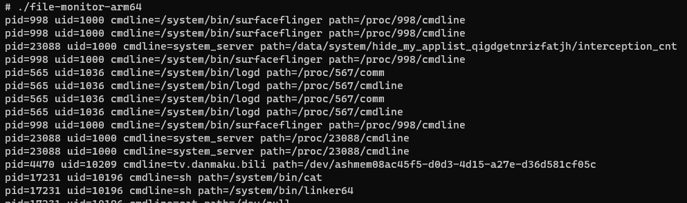
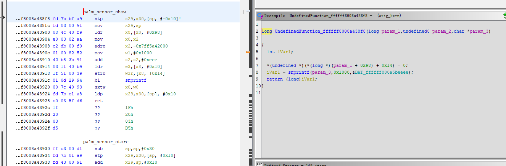
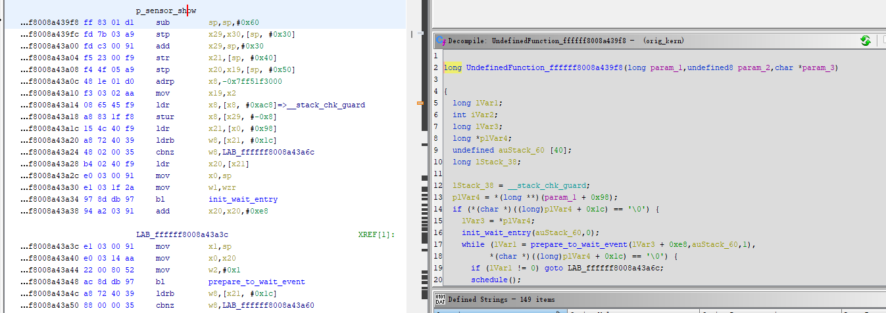
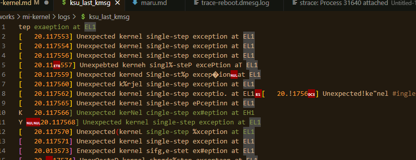
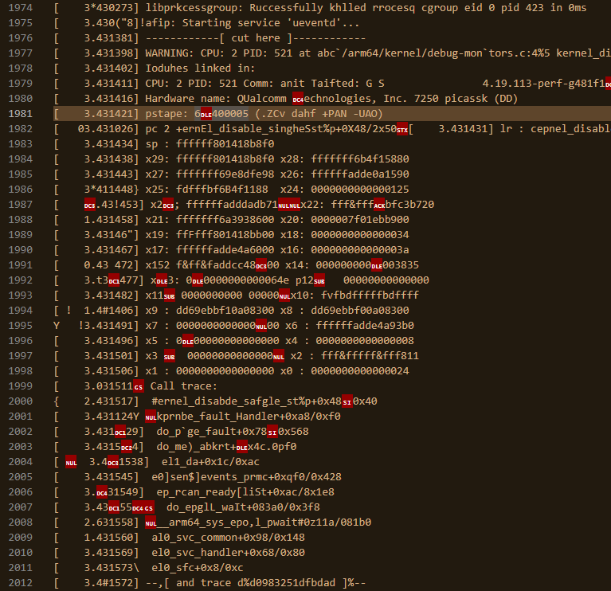
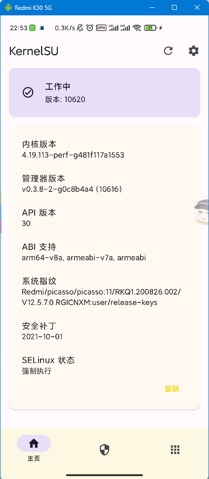
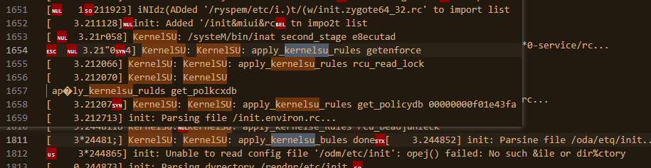
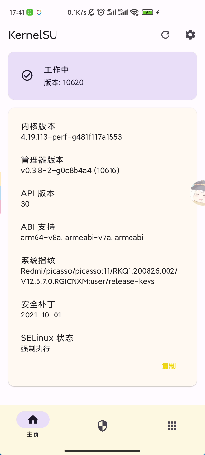
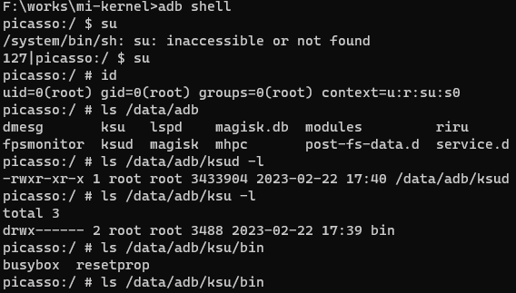

## 起因

最近看到 Weishu 发了一个 KernelSU 移植到旧版非 GKI 内核的视频。

https://www.bilibili.com/video/BV1ge4y1G7Dy/

我大概两年前折腾过内核，当时是为了弄出一个 unix diag 模块，最后用 hack 的手段搞定了（其实就是把内核的 symver 给倒出来，然后 patch 到模块的 symver 上去）。

如今那个模块因为内核版本更新也变得不能用了，原先 hack symvers 的手段虽然能够加载，但是不能正常使用，可能是源码中的结构体变化了导致的。

虽然早有耳闻屑 MIUI 的内核基本上是假开源，代码编译出来完全不能开机，但看到 weishu 那么顺利（？）地在同样是 MIUI 系统的内核里面植入了 KernelSU ，又让我有信心去折腾一番。

## 预备

[&#x5b;内核向&#x5d; 论如何优雅的刷入内核 - AKR社区](https://www.akr-developers.com/d/125)

[关于Image.xx-dtb 和 Image.xx + dtb的区别 - AKR社区](https://www.akr-developers.com/d/482)

[kernel dtb 与 dtbo - AKR社区](https://www.akr-developers.com/d/353)

[Pixel 3 AOSP 自编译内核 adb无法识别设备 - AKR社区](https://www.akr-developers.com/d/529-pixel-3-aosp-adb)

[Pixel3 Aosp自编译内核如何正确的驱动设备正常运行 - AKR社区](https://www.akr-developers.com/d/526-pixel3-aosp)

```
内核有自带了一个模块与内核本体是否匹配的判断，内核模块必须和内核来自于同一次编译才能被正确加载

同时使用这三个提交可以破除这一限制

https://github.com/luk1337/android_kernel_oneplus_sm8250/commit/153318ee16f44c26a8a3d2da6fecdb9f8c266c18

https://github.com/luk1337/android_kernel_oneplus_sm8250/commit/eaed1807d37a3201e1fcf31b3d148f4d3f39e27d

https://github.com/luk1337/android_kernel_oneplus_sm8250/commit/2ac459f2b93908c5418c7afa7643f290107196d9
```

编译内核还要考虑系统原有的模块（`/vendor/lib/modules`）能否加载，看了一下自己编译的和已有模块的 module_layout 之类的基本都不一致，所以可能要合上面三个补丁

不过还是要先编译出一个能开机的内核

## 官方

当前内核(12.5.7)：

```
Linux version 4.19.113-perf-g481f117a1553 (builder@c4-xm-ota-bd016.bj) (clang version 10.0.6 for Android NDK) #1 SMP PREEMPT Mon Oct 25 00:44:13 CST 2021
```

[MiCode/Xiaomi_Kernel_OpenSource at picasso-r-oss](https://github.com/MiCode/Xiaomi_Kernel_OpenSource/tree/picasso-r-oss)

[How to compile kernel standalone · MiCode/Xiaomi_Kernel_OpenSource Wiki](https://github.com/MiCode/Xiaomi_Kernel_OpenSource/wiki/How-to-compile-kernel-standalone)

从 Qualcomm 官网下的 SDLLVM 8.0.6 ，内置的 dtc (export DTC_EXT 去掉) -> 无法开机，fastboot boot 后仍然有连接

boot 镜像是用 magiskboot 制作的，直接把 kernel, dtb, 原 img 的 ramdisk 放到目录， `magiskboot repack <原 img>`

把原版 img 解包然后重打包，md5 是一样的，说明 magiskboot 应该不会有问题。

而直接拿现有的内核或者 stock 内核都可以通过 fastboot boot 引导进入系统（并且 boot 执行完成后和电脑的 fastboot 连接会断开），说明 fastboot boot 也没有问题。

进入系统想从 /sys/fs/pstore 拿点信息，但是似乎只有原先的启动记录

官方编译用的 10.0.6 ，但是只能找到 8.0.6 的下载，新的版本似乎要用专用的 Qualcomm Package Manager 下载，还要注册一大堆东西，并且是 GUI 界面的，wsl 不太好搞。

于是在这里找到了 SDLLVM 10.0.9 版本的第三方发布：

[xiangfeidexiaohuo/Snapdragon-LLVM: 高通Clang](https://github.com/xiangfeidexiaohuo/Snapdragon-LLVM)

[kernel dtb 与 dtbo - AKR社区](https://www.akr-developers.com/d/353/5)

另外这里说 dtc 可能有问题，必须要用 Android 魔改的，于是去 AOSP 下了一份源码

[refs/heads/android11-release - platform/external/dtc - Git at Google](https://android.googlesource.com/platform/external/dtc/+/refs/heads/android11-release)

[dtc编译错误 · Issue #1115 · MiCode/Xiaomi_Kernel_OpenSource](https://github.com/MiCode/Xiaomi_Kernel_OpenSource/issues/1115)

稍微改了一下可以 make 编译了，DTC_EXT 指定成编译后的 dtc 程序位置。

现在这样 10.0.9 + Android 11 dtc 还是没法开机

顺便贴上编译脚本：

```sh
export ARCH=arm64
export SUBARCH=arm64
export DTC_EXT=${PWD}/dtc/dtc
export CROSS_COMPILE=${PWD}/toolchain/bin/aarch64-linux-android-
REAL_CC='REAL_CC=${PWD}/toolchains/Snapdragon-LLVM-10.0.9/bin/clang'
CLANG_T='CLANG_TRIPLE=aarch64-linux-gnu-'

export LOCALVERSION=-g481f117a1553

make O=out $REAL_CC $CLANG_T picasso_user_defconfig
make -j$(nproc) O=out $REAL_CC $CLANG_T 2>&1 | tee kernel.log
```

## 第三方

[使用小米开源代码编译内核卡第一屏 - AKR社区](https://www.akr-developers.com/d/577)

看来官方内核源码靠不住，而自己又没那个本事弄出能开机的内核，还是找找第三方的碰碰运气吧

[Redmi K30 5G ROMs, Kernels, Recoveries, & Other D | XDA Forums](https://forum.xda-developers.com/f/redmi-k30-5g-roms-kernels-recoveries-other-d.9887/)

在 XDA 找了一下，发现这么些内核：

[Forenche/kernel_xiaomi_picasso: Moved to https://github.com/stormbreaker-project/kernel_xiaomi_picasso](https://github.com/Forenche/kernel_xiaomi_picasso)

[stormbreaker-project/kernel_xiaomi_picasso](https://github.com/stormbreaker-project/kernel_xiaomi_picasso)

前两个很久没维护了，并且 release 都写着这种警告：

> **NOTE: DO NOT FLASH ON MIUI**

下面这个最近才维护过，不过仓库也在近期 archive 了。

[EndCredits/android_kernel_xiaomi_sm7250: CAF rebased kernel based on MiCode/Xiaomi Kernel OpenSouce for Redmi K30 5G ( picasso ) | Thanks to @Hadenix @LynnrinChan](https://github.com/EndCredits/android_kernel_xiaomi_sm7250)

这个内核的小版本号甚至和官方的不一致

第三方内核的主要问题就是魔改太多，也不知道能不能用在官方的系统上。

……

## 转机

抱着试试的心态把自己编译的内核和原来的 dtb 放在一起打包，没想到可以开机

当然开机后 WIFI 不能正常工作，查看 `/proc/modules` 也是空的，已经预料到了。

于是手动把之前提到的三个提交合并进去，但启动后仍然无法加载模块，报错如下：

```
[    4.045536] init: starting service 'exec 2 (/vendor/bin/modprobe -a -d /vendor/lib/modules audio_q6_pdr audio_q6_notifier audio_snd_event audio_apr audio_adsp_loader audio_q6 audio_native audio_usf audio_pinctrl_lpi audio_swr audio_platform audio_hdmi audio_stub audio_wcd_core audio_tfa98xx audio_cs35l41 audio_wsa881x audio_wsa883x audio_bolero_cdc audio_wsa_macro audio_va_macro audio_rx_macro audio_tx_macro audio_wcd938x audio_wcd938x_slave audio_wcd937x audio_wcd937x_slave audio_machine_lito)'...
[    4.047025] init: SVC_EXEC service 'exec 2 (/vendor/bin/modprobe -a -d /vendor/lib/modules audio_q6_pdr audio_q6_notifier audio_snd_event audio_apr audio_adsp_loader audio_q6 audio_native audio_usf audio_pinctrl_lpi audio_swr audio_platform audio_hdmi audio_stub audio_wcd_core audio_tfa98xx audio_cs35l41 audio_wsa881x audio_wsa883x audio_bolero_cdc audio_wsa_macro audio_va_macro audio_rx_macro audio_tx_macro audio_wcd938x audio_wcd938x_slave audio_wcd937x audio_wcd937x_slave audio_machine_lito)' pid 553 (uid 0 gid 0+0 context u:r:vendor_modprobe:s0) started; waiting...
[    4.073236] q6_pdr_dlkm: version magic '4.19.113-perf-g481f117a1553 SMP preempt mod_unload modversions aarch64' should be '4.19.113-perf SMP preempt mod_unload modversions aarch64'
[    4.073452] q6_pdr_dlkm: version magic '4.19.113-perf-g481f117a1553 SMP preempt mod_unload modversions aarch64' should be '4.19.113-perf SMP preempt mod_unload modversions aarch64'
```

看上去还要 version magic 对应，我们的版本号后面没有那个看起来像是 commit hash 的东西。

参考 weishu 视频 `07:10` 的构建代码，似乎是加一个环境变量 `LOCALVERSION`

https://www.bilibili.com/video/BV1ge4y1G7Dy?t=430.9

```
LOCALVERSION=-g481f117a1553 ./build.sh
```

编译后可以看到已经有我们的版本号了。

```
strings out/vmlinux | grep 'perf-'
Linux version 4.19.113-perf-g481f117a1553 (five_ec1cff@LAPTOP-H42AMUM5) (clang version 10.0.9) #5 SMP PREEMPT Wed Jan 11 22:27:31 CST 2023
4.19.113-perf-g481f117a1553 SMP preempt mod_unload modversions aarch64
```

开机，速度似乎很慢，不过启动已经有模块能加载了。

```
rmnet_perf 36864 0 - Live 0x0000000000000000 (O)
rmnet_shs 114688 0 - Live 0x0000000000000000 (O)
wlan 6918144 0 - Live 0x0000000000000000 (O)
exfat 139264 0 - Live 0x0000000000000000 (O)
machine_dlkm 180224 0 - Live 0x0000000000000000 (O)
wcd937x_slave_dlkm 16384 0 - Live 0x0000000000000000 (O)
wcd937x_dlkm 98304 1 machine_dlkm, Live 0x0000000000000000 (O)
wcd938x_slave_dlkm 16384 0 - Live 0x0000000000000000 (O)
wcd938x_dlkm 110592 2 machine_dlkm, Live 0x0000000000000000 (O)
wcd9xxx_dlkm 57344 20 wcd937x_dlkm,wcd938x_dlkm, Live 0x0000000000000000 (O)
mbhc_dlkm 81920 2 wcd937x_dlkm,wcd938x_dlkm, Live 0x0000000000000000 (O)
tx_macro_dlkm 114688 1 mbhc_dlkm, Live 0x0000000000000000 (O)
rx_macro_dlkm 106496 0 - Live 0x0000000000000000 (O)
va_macro_dlkm 106496 0 - Live 0x0000000000000000 (O)
wsa_macro_dlkm 69632 1 machine_dlkm, Live 0x0000000000000000 (O)
swr_ctrl_dlkm 73728 4 tx_macro_dlkm,rx_macro_dlkm,va_macro_dlkm,wsa_macro_dlkm, Live 0x0000000000000000 (O)
bolero_cdc_dlkm 57344 6 machine_dlkm,tx_macro_dlkm,rx_macro_dlkm,va_macro_dlkm,wsa_macro_dlkm, Live 0x0000000000000000 (O)
wsa883x_dlkm 57344 1 machine_dlkm, Live 0x0000000000000000 (O)
wsa881x_dlkm 57344 1 machine_dlkm, Live 0x0000000000000000 (O)
cs35l41_dlkm 147456 0 - Live 0x0000000000000000 (O)
tfa98xx_dlkm 180224 1 - Live 0x0000000000000000 (O)
wcd_core_dlkm 32768 10 machine_dlkm,wcd937x_dlkm,wcd938x_dlkm,mbhc_dlkm,tx_macro_dlkm,rx_macro_dlkm,va_macro_dlkm,wsa_macro_dlkm,wsa883x_dlkm,wsa881x_dlkm, Live 0x0000000000000000 (O)
stub_dlkm 16384 1 - Live 0x0000000000000000 (O)
hdmi_dlkm 24576 1 - Live 0x0000000000000000 (O)
swr_dlkm 24576 7 wcd937x_slave_dlkm,wcd937x_dlkm,wcd938x_slave_dlkm,wcd938x_dlkm,swr_ctrl_dlkm,wsa883x_dlkm,wsa881x_dlkm, Live 0x0000000000000000 (O)
pinctrl_lpi_dlkm 24576 7 - Live 0x0000000000000000 (O)
usf_dlkm 57344 0 - Live 0x0000000000000000 (O)
native_dlkm 200704 0 - Live 0x0000000000000000 (O)
platform_dlkm 2965504 48 native_dlkm, Live 0x0000000000000000 (O)
q6_dlkm 1134592 12 machine_dlkm,wcd9xxx_dlkm,va_macro_dlkm,swr_ctrl_dlkm,bolero_cdc_dlkm,tfa98xx_dlkm,pinctrl_lpi_dlkm,usf_dlkm,native_dlkm,platform_dlkm, Live 0x0000000000000000 (O)
adsp_loader_dlkm 16384 0 - Live 0x0000000000000000 (O)
apr_dlkm 233472 4 usf_dlkm,platform_dlkm,q6_dlkm,adsp_loader_dlkm, Live 0x0000000000000000 (O)
snd_event_dlkm 16384 5 machine_dlkm,bolero_cdc_dlkm,pinctrl_lpi_dlkm,q6_dlkm,apr_dlkm, Live 0x0000000000000000 (O)
q6_notifier_dlkm 16384 2 pinctrl_lpi_dlkm,apr_dlkm, Live 0x0000000000000000 (O)
q6_pdr_dlkm 16384 1 q6_notifier_dlkm, Live 0x0000000000000000 (O)
```

因为之前没记录原来内核的 /proc/modules ，因此暂时无法比较。不过理论上来说应该都能加载。

看一看 proc version ，确实是自己编译的。

```
# cat /proc/version
Linux version 4.19.113-perf-g481f117a1553 (five_ec1cff@xxxxxx) (clang version 10.0.9) #5 SMP PREEMPT Wed Jan 11 22:27:31 CST 2023
```

WLAN，声音之类的都没问题，其他担心的项目如相机，指纹、存储、TEE 等也都正常，就是速度感觉慢了一些，也许是心理作用，先这么用一晚上看看效果。

新内核运行了一晚上，用起来和以前没什么两样，于是我决定加一些东西

defconfig 里面加上：

```
CONFIG_KPROBES=y
CONFIG_UNIX_DIAG=y
```

同时创建了 git 仓库，注意到这样会自动加上一个 hash 导致模块的 vermagic 又不对了，因此还要加一项：

```
CONFIG_LOCALVERSION_AUTO=n
```

编译好了，继续 fastboot boot 启动。然而这个内核并不像原先那么顺利，开机后无法进入系统。一开始是黑屏，怎么按电源键都没响应，后来才出现了 MIUI 图标，说明屏幕没有问题，但仍无法进入系统。

> 值得注意的是此时 scrcpy 能打开，但也是黑屏，这似乎只能证明 system server 和 SurfaceFlinger 正常工作

好在重启到原先的内核还是能正常使用的，重启前记录了 dmesg 和 logcat 。

先看日志，似乎看不出什么问题，于是看一看 tombstone

观察到那次启动后只有一个 tombstone ，是一个 `vendor.qti.hardware.display.composer-service` 进程，看起来与显示相关：

```
Build fingerprint: 'Redmi/picasso/picasso:11/RKQ1.200826.002/V12.5.7.0.RGICNXM:user/release-keys'
Revision: '0'
ABI: 'arm64'
Timestamp: 2023-01-12 20:08:45+0800
pid: 934, tid: 2478, name: LTM_THREAD  >>> /vendor/bin/hw/vendor.qti.hardware.display.composer-service <<<
uid: 1000
signal 6 (SIGABRT), code -1 (SI_QUEUE), fault addr --------
Abort message: 'Attempted to retrieve value from failed HIDL call: Status(EX_TRANSACTION_FAILED): 'DEAD_OBJECT: ''
    x0  0000000000000000  x1  00000000000009ae  x2  0000000000000006  x3  000000792c7574e0
    x4  0000000000000000  x5  0000000000000000  x6  0000000000000000  x7  000000000001601c
    x8  00000000000000f0  x9  14a87dbf0b025cb5  x10 0000000000000000  x11 ffffffc0ffffffdf
    x12 0000000000000001  x13 0000000000000062  x14 b40000793701b760  x15 0000000000080000
    x16 00000079bb29c948  x17 00000079bb27b390  x18 000000792bfa4000  x19 00000000000003a6
    x20 00000000000009ae  x21 00000000ffffffff  x22 000000792c758000  x23 0000000000000000
    x24 000000792c758000  x25 000000792d9ed970  x26 000000792c758000  x27 000000000000aa40
    x28 000000792d9ece28  x29 000000792c757560
    lr  00000079bb22eaa0  sp  000000792c7574c0  pc  00000079bb22eacc  pst 0000000000000000

backtrace:
      #00 pc 0000000000089acc  /apex/com.android.runtime/lib64/bionic/libc.so (abort+164) (BuildId: a790cdbd8e44ea8a90802da343cb82ce)
      #01 pc 00000000000062b0  /system/lib64/liblog.so (__android_log_default_aborter+12) (BuildId: 53286795d97fe56c1e70dca740895c84)
      #02 pc 0000000000012fa4  /apex/com.android.vndk.v30/lib64/libbase.so (android::base::LogMessage::~LogMessage()+320) (BuildId: 80f255c2fa17369bce8002e5e367ad65)
      #03 pc 0000000000045158  /apex/com.android.vndk.v30/lib64/libhidlbase.so (android::hardware::details::return_status::onValueRetrieval() const+236) (BuildId: 441744a3e8eac97619ec117a3898fc51)
      #04 pc 000000000008c1ac  /vendor/lib64/libdpps.so (AlsNative::AlsEnable()+368) (BuildId: 88e1d2eb7acbab67389d68e0866af277)
      #05 pc 00000000000b4214  /vendor/lib64/libdpps.so (DppsAlsSubject::Register(std::__1::basic_string<char, std::__1::char_traits<char>, std::__1::allocator<char> >&, DppsNotifyInterface<int>*)+344) (BuildId: 88e1d2eb7acbab67389d68e0866af277)
      #06 pc 00000000000ec034  /vendor/lib64/libdpps.so (ltmfeature::LtmOff::PostSetParam(LtmSwParams, LtmPayload const&, std::__1::vector<std::__1::function<int ()>, std::__1::allocator<std::__1::function<int ()> > >*, bool*)+768) (BuildId: 88e1d2eb7acbab67389d68e0866af277)
      #07 pc 00000000000eb708  /vendor/lib64/libdpps.so (ltmfeature::LtmOff::SetParameter(LtmSwParams, LtmPayload const&)+396) (BuildId: 88e1d2eb7acbab67389d68e0866af277)
      #08 pc 00000000000e3780  /vendor/lib64/libdpps.so (ltmfeature::LtmFeatureImp::SetParameter(LtmSwParams, LtmPayload const&)+116) (BuildId: 88e1d2eb7acbab67389d68e0866af277)
      #09 pc 00000000000d8ad8  /vendor/lib64/libdpps.so (DppsLtmClientImp::ProcessOnCommand(LTM::LtmCommandPayload<LTM::LtmCommand> const&)+184) (BuildId: 88e1d2eb7acbab67389d68e0866af277)
      #10 pc 00000000000d792c  /vendor/lib64/libdpps.so (DppsLtmClientImp::HandleQueueMsg(DppsEventRespPayload const&)+240) (BuildId: 88e1d2eb7acbab67389d68e0866af277)
      #11 pc 00000000000e00fc  /vendor/lib64/libdpps.so (LtmEventImp::HandleQueueMsg()+104) (BuildId: 88e1d2eb7acbab67389d68e0866af277)
      #12 pc 00000000000e15dc  /vendor/lib64/libdpps.so (LtmEventImp::ProcessNextEvent()+440) (BuildId: 88e1d2eb7acbab67389d68e0866af277)
      #13 pc 00000000000d6858  /vendor/lib64/libdpps.so (DppsLtmClientImp::Process()+468) (BuildId: 88e1d2eb7acbab67389d68e0866af277)
      #14 pc 00000000000d6644  /vendor/lib64/libdpps.so (DppsLtmClientImp::thread_handler(DppsLtmClientImp*) (.cfi)+112) (BuildId: 88e1d2eb7acbab67389d68e0866af277)
      #15 pc 00000000000db01c  /vendor/lib64/libdpps.so (void* std::__1::__thread_proxy<std::__1::tuple<std::__1::unique_ptr<std::__1::__thread_struct, std::__1::default_delete<std::__1::__thread_struct> >, void (*)(DppsLtmClientImp*), DppsLtmClientImp*> >(void*) (.cfi)+60) (BuildId: 88e1d2eb7acbab67389d68e0866af277)
      #16 pc 00000000000eb868  /apex/com.android.runtime/lib64/bionic/libc.so (__pthread_start(void*)+64) (BuildId: a790cdbd8e44ea8a90802da343cb82ce)
      #17 pc 000000000008ba88  /apex/com.android.runtime/lib64/bionic/libc.so (__start_thread+64) (BuildId: a790cdbd8e44ea8a90802da343cb82ce)
```

于是把 `CONFIG_KPROBES=y` 去掉，只保留 `CONFIG_UNIX_DIAG=y`

unix diag 是起作用了（主要就是用来获取 unix socket 的 peer 信息的）。不过观察到开机后软重启了数次，但之后就稳定下来，看日志也没看出有什么问题，tombstone 也没有产生相关的信息。

于是新的镜像又用了一天，似乎除了开机的时候的软重启再也没有别的问题了。

当我晚上第二次 boot 那个带有 KPROBES 的镜像后，屏幕又奇迹般地可以正常显示了——难道第一次是概率事件？然而仍然有开机后软重启的问题。

这一次的软重启比往常更加剧烈，并且开机后一些应用工作异常（如 Bilibili 无法打开直播等，表现为打开后就 ANR）。

**但这些问题在最后一次软重启后似乎一切又正常了。**

不过这一次我也有了准备，开机就抓取了日志，直到系统工作正常为止。

下面是第一次软重启(Zygote 重启)，原因是 system_server 死亡

```
01-13 23:52:24.556   763   763 E Zygote  : Zygote failed to write to system_server FD: Connection refused
01-13 23:52:24.557   763   763 I Zygote  : Process 1763 exited due to signal 9 (Killed)
01-13 23:52:24.557  8297  8397 E PowerKeeper.Sensor: setAppSensorsControlPolicyandroid.os.DeadObjectException
01-13 23:52:24.557   760   770 E IPCThreadState: attemptIncStrongHandle(23): Not supported
01-13 23:52:24.557   763   763 E Zygote  : Exit zygote because system server (pid 1763) has terminated
```

而 system_server 死亡的原因竟然是……自杀？

```
01-13 23:52:23.853  1763  2218 E Watchdog: First set of traces taken from /data/anr/anr_2023-01-13-23-51-43-395
01-13 23:52:23.899  1763  2218 E Watchdog: Second set of traces taken from /data/anr/anr_2023-01-13-23-52-13-704

01-13 23:52:23.968  1763  2218 E Watchdog: Triggering SysRq for system_server watchdog

01-13 23:52:24.352  1763  2219 D ActivityManager: report kill process: killerPid is:1763, killedPid is:1763
01-13 23:52:24.353  1763  2219 I Process : Sending signal. PID: 1763 SIG: 9
```


……

同样地，除了开机的几次软重启，之后一直都是稳定运行。

顺便找了个利用 bpf 和 kprobe 的工具测试了一下，看起来也能正常使用。

[Kr328/file-monitor: A simple cli tool to monitor the file opening of application processes.](https://github.com/Kr328/file-monitor)




之前的日志还不足以说明问题，于是我决定再重启一次，这次用 `logcat -b all` 抓取所有 buffers 的日志，以及 `dmesg` 。

此外还准备了一个 Xposed 模块，hook `ActivityManagerService.reportKillProcessEvent` （也就是那个自杀日志产生的方法，hook 仅仅是打印了 stack trace 确定来源）

重启后第一次进入系统，并没有很快触发软重启，直到我打开 bilibili 的任意直播间，触发 ANR ，随即重启。

之后在开机动画等待了很长的时间才重新进入系统，最后系统趋于正常。

从 log 找到了两次 system server 自杀，并被我们 hook 到的记录：

```
01-15 14:35:07.043 10612 10696 I LSPosed-Bridge: Kill self detected
01-15 14:35:07.043 10612 10696 E LSPosed-Bridge: java.lang.Throwable
01-15 14:35:07.043 10612 10696 E LSPosed-Bridge: 	at five.ec1cff.mysysteminjector.xposed.HookEntry$1.beforeHookedMethod(HookEntry.java:50)
01-15 14:35:07.043 10612 10696 E LSPosed-Bridge: 	at de.robv.android.xposed.XposedBridge$AdditionalHookInfo.callback(Unknown Source:79)
01-15 14:35:07.043 10612 10696 E LSPosed-Bridge: 	at LSPHooker_.reportKillProcessEvent(Unknown Source:22)
01-15 14:35:07.043 10612 10696 E LSPosed-Bridge: 	at java.lang.reflect.Method.invoke(Native Method)
01-15 14:35:07.043 10612 10696 E LSPosed-Bridge: 	at android.os.ProcessInjector.reportKillProcessEvent(ProcessInjector.java:24)
01-15 14:35:07.043 10612 10696 E LSPosed-Bridge: 	at android.os.Process.killProcess(Process.java:1146)
01-15 14:35:07.043 10612 10696 E LSPosed-Bridge: 	at com.android.server.Watchdog.run(Watchdog.java:920)
01-15 14:33:24.207  1806  2294 D ActivityManager: report kill process: killerPid is:1806, killedPid is:1806
```

这个自杀确实是从 Watchdog 出来的。

[Android Watchdog机制原理分析_xiaosayidao的博客-CSDN博客_android watchdog原理](https://blog.csdn.net/xiaosayidao/article/details/75453195)

[Documentation/sysrq.txt - kernel/common - Git at Google](https://android.googlesource.com/kernel/common/+/bcmdhd-3.10/Documentation/sysrq.txt)

反编译 framework.jar ，涉及到 `Triggering SysRq for` 的日志（有两处，这三行是一样的）

```java
// com.android.server.Watchdog
    Slog.e("Watchdog", "Triggering SysRq for system_server watchdog");
    this.doSysRq('w');
    this.doSysRq('l');
```

```
'w'	- Dumps tasks that are in uninterruptable (blocked) state.
'l'     - Shows a stack backtrace for all active CPUs.
```

向 `/proc/sysrq-trigger` 写入 `w` 会在 dmesg 中打印处于 Uninterruptable state （D 状态）的进程信息。

```
01-15 14:33:23.772  1806  2293 E Watchdog: First set of traces taken from /data/anr/anr_2023-01-15-14-32-43-200
01-15 14:33:23.825  1806  2293 E Watchdog: Second set of traces taken from /data/anr/anr_2023-01-15-14-33-13-555

01-15 14:33:23.883  1806  2293 E Watchdog: Triggering SysRq for system_server watchdog
01-15 14:33:24.207  1806  2294 D ActivityManager: report kill process: killerPid is:1806, killedPid is:1806
```

dmesg 中，相近的时间出现了这样的日志（感觉 3s 差得有点远），也就是 D 状态进程。

```
[Sun Jan 15 14:33:26 2023] sysrq: Show Blocked State
[Sun Jan 15 14:33:26 2023] task                        PC stack   pid father
[Sun Jan 15 14:33:26 2023] sensors@1.0-ser D    0   905      1 0x04000001
[Sun Jan 15 14:33:26 2023] Call trace:
[Sun Jan 15 14:33:26 2023] __switch_to+0x13c/0x158
[Sun Jan 15 14:33:26 2023] __schedule+0xb44/0xd98
[Sun Jan 15 14:33:26 2023] schedule_preempt_disabled+0x7c/0xa8
[Sun Jan 15 14:33:26 2023] __mutex_lock+0x444/0x660
[Sun Jan 15 14:33:26 2023] __mutex_lock_slowpath+0x10/0x18
[Sun Jan 15 14:33:26 2023] mutex_lock+0x30/0x38
[Sun Jan 15 14:33:26 2023] kernfs_fop_write+0x100/0x1d0
[Sun Jan 15 14:33:26 2023] __vfs_write+0x44/0x148
[Sun Jan 15 14:33:26 2023] vfs_write+0xe0/0x1a0
[Sun Jan 15 14:33:26 2023] ksys_write+0x6c/0xd0
[Sun Jan 15 14:33:26 2023] __arm64_sys_write+0x18/0x20
[Sun Jan 15 14:33:26 2023] el0_svc_common+0x98/0x148
[Sun Jan 15 14:33:26 2023] el0_svc_handler+0x68/0x80
[Sun Jan 15 14:33:26 2023] el0_svc+0x8/0xc
[Sun Jan 15 14:33:26 2023] sysrq: Show backtrace of all active CPUs
[Sun Jan 15 14:33:26 2023] sysrq: CPU6:
[Sun Jan 15 14:33:26 2023] Call trace:
```

看起来很多问题指向了这个进程：905 ，它仍然在系统中运行

```
system     905     1  0 06:31 ?        00:00:03 /vendor/bin/hw/android.hardware.sensors@1.0-service
```

dump 出来的两个 ANR 文件

```
----- Waiting Channels: pid 905 at 2023-01-15 14:33:14 -----
Cmd line: /vendor/bin/hw/android.hardware.sensors@1.0-service

sysTid=905       kernfs_fop_write
sysTid=1090      futex_wait_queue_me
sysTid=1091      futex_wait_queue_me
sysTid=1092      futex_wait_queue_me
sysTid=1093      palm_sensor_show
sysTid=1094      binder_ioctl_write_read
sysTid=1098      do_sys_poll
sysTid=2481      diagchar_read
sysTid=2483      futex_wait_queue_me
sysTid=2484      futex_wait_queue_me
sysTid=2485      futex_wait_queue_me
sysTid=2486      futex_wait_queue_me
sysTid=2487      futex_wait_queue_me
sysTid=2735      futex_wait_queue_me
sysTid=2736      do_sys_poll
sysTid=2737      do_sigtimedwait

----- end 905 -----
```

但是仔细查找日志，又发现了别的原因。这里似乎才是 Watchdog 自杀的原因。


```
01-15 14:33:13.178  1806  2294 I watchdog: Blocked in handler on ui thread (android.ui)
01-15 14:33:13.178  1806  2294 I Watchdog: Reporting stuck state to activity controller
01-15 14:33:13.178  1806  2294 W Watchdog: *** WATCHDOG KILLING SYSTEM PROCESS: Blocked in handler on ui thread (android.ui)
01-15 14:33:13.183  1806  2293 I android_os_HwBinder: HwBinder: Starting thread pool for getting: android.hidl.manager@1.0::IServiceManager/default
01-15 14:33:13.196  1806  2294 W Watchdog: android.ui annotated stack trace:
01-15 14:33:13.197  1806  2294 W Watchdog:     at android.os.BinderProxy.transactNative(Native Method)
01-15 14:33:13.197  1806  2294 W Watchdog:     at android.os.BinderProxy.transact(BinderProxy.java:540)
01-15 14:33:13.197  1806  2294 W Watchdog:     at android.app.IUidObserver$Stub$Proxy.onUidActive(IUidObserver.java:249)
01-15 14:33:13.197  1806  2294 W Watchdog:     at com.android.server.am.ActivityManagerService.dispatchUidsChangedForObserver(ActivityManagerService.java:3612)
01-15 14:33:13.197  1806  2294 W Watchdog:     at com.android.server.am.ActivityManagerService.dispatchUidsChanged(ActivityManagerService.java:3551)
01-15 14:33:13.197  1806  2294 W Watchdog:     at com.android.server.am.ActivityManagerService$UiHandler.handleMessage(ActivityManagerService.java:1791)
01-15 14:33:13.197  1806  2294 W Watchdog:     at android.os.Handler.dispatchMessage(Handler.java:106)
01-15 14:33:13.197  1806  2294 W Watchdog:     at android.os.Looper.loop(Looper.java:236)
01-15 14:33:13.197  1806  2294 W Watchdog:     at android.os.HandlerThread.run(HandlerThread.java:67)
01-15 14:33:13.198  1806  2294 W Watchdog:     at com.android.server.ServiceThread.run(ServiceThread.java:45)
01-15 14:33:13.198  1806  2294 W Watchdog:     at com.android.server.UiThread.run(UiThread.java:45)
01-15 14:33:13.198  1806  2294 W Watchdog: *** GOODBYE!
```

出现了一个诡异问题：IUidObserver 是一个 oneway aidl interface ，但是却阻塞了。

ANR 记录：

```
"android.ui" prio=5 tid=20 Native
  | group="main" sCount=1 dsCount=0 flags=1 obj=0x12c02368 self=0xb40000749ebe6c00
  | sysTid=2288 nice=-2 cgrp=default sched=0/0 handle=0x74470f5cc0
  | state=S schedstat=( 97450095 123653949 520 ) utm=6 stm=3 core=5 HZ=100
  | stack=0x7446ff2000-0x7446ff4000 stackSize=1043KB
  | held mutexes=
  native: #00 pc 0000000000086b4c  /apex/com.android.runtime/lib64/bionic/libc.so (syscall+28)
  native: #01 pc 000000000008a734  /apex/com.android.runtime/lib64/bionic/libc.so (__futex_wait_ex(void volatile*, bool, int, bool, timespec const*)+144)
  native: #02 pc 00000000000ec61c  /apex/com.android.runtime/lib64/bionic/libc.so (NonPI::MutexLockWithTimeout(pthread_mutex_internal_t*, bool, timespec const*)+216)
  native: #03 pc 000000000002d500  /system/lib64/libsensorservice.so (android::SensorService::onUidStateChanged(unsigned int, android::SensorService::UidState)+148)
  native: #04 pc 0000000000034c4c  /system/lib64/libsensorservice.so (android::SensorService::UidPolicy::onUidActive(unsigned int)+136)
  native: #05 pc 0000000000087aa8  /system/lib64/libbinder.so (android::BnUidObserver::onTransact(unsigned int, android::Parcel const&, android::Parcel*, unsigned int)+344)
  native: #06 pc 000000000004982c  /system/lib64/libbinder.so (android::BBinder::transact(unsigned int, android::Parcel const&, android::Parcel*, unsigned int)+232)
  native: #07 pc 000000000012b13c  /system/lib64/libandroid_runtime.so (android_os_BinderProxy_transact(_JNIEnv*, _jobject*, int, _jobject*, _jobject*, int)+304)
  at android.os.BinderProxy.transactNative(Native method)
  at android.os.BinderProxy.transact(BinderProxy.java:540)
  at android.app.IUidObserver$Stub$Proxy.onUidActive(IUidObserver.java:249)
  at com.android.server.am.ActivityManagerService.dispatchUidsChangedForObserver(ActivityManagerService.java:3612)
  at com.android.server.am.ActivityManagerService.dispatchUidsChanged(ActivityManagerService.java:3551)
  at com.android.server.am.ActivityManagerService$UiHandler.handleMessage(ActivityManagerService.java:1791)
  at android.os.Handler.dispatchMessage(Handler.java:106)
  at android.os.Looper.loop(Looper.java:236)
  at android.os.HandlerThread.run(HandlerThread.java:67)
  at com.android.server.ServiceThread.run(ServiceThread.java:45)
  at com.android.server.UiThread.run(UiThread.java:45)
```

> 线程信息输出的格式可参考 [`art/runtime/thread.cc:Thread::DumpState`](https://android.googlesource.com/platform/art/+/788d46a488364c37d38a96d7f2661d8e37561ea6/runtime/thread.cc#1956)

看起来实际上是同一个进程的 native 部分 sensorservice 注册了 IUidObserver ，binder 调用走到这里，导致的卡死（原来 oneway 到当前进程的调用的也是在当前线程进行的）

ANR 记录的 Waiting channels ：

```
sysTid=2288      futex_wait_queue_me
```

第二次崩溃则有所不同，不是 binder transact

```
01-15 14:34:57.991 10612 10696 I watchdog: Blocked in monitor com.android.server.power.PowerManagerService on foreground thread (android.fg), Blocked in handler on main thread (main)
01-15 14:34:57.992 10612 10696 W Watchdog: *** WATCHDOG KILLING SYSTEM PROCESS: Blocked in monitor com.android.server.power.PowerManagerService on foreground thread (android.fg), Blocked in handler on main thread (main)
01-15 14:34:57.994 10612 10696 W Watchdog: android.fg annotated stack trace:
01-15 14:34:57.995 10612 10696 W Watchdog:     at com.android.server.power.PowerManagerService.monitor(PowerManagerService.java:3902)
01-15 14:34:57.996 10612 10696 W Watchdog:     - waiting to lock <0x0d875e7f> (a java.lang.Object)
01-15 14:34:57.997 10612 10696 W Watchdog:     at com.android.server.Watchdog$HandlerChecker.run(Watchdog.java:398)
01-15 14:34:57.997 10612 10696 W Watchdog:     at android.os.Handler.handleCallback(Handler.java:938)
01-15 14:34:57.997 10612 10696 W Watchdog:     at android.os.Handler.dispatchMessage(Handler.java:99)
01-15 14:34:57.997 10612 10696 W Watchdog:     at android.os.Looper.loop(Looper.java:236)
01-15 14:34:57.998 10612 10696 W Watchdog:     at android.os.HandlerThread.run(HandlerThread.java:67)
01-15 14:34:57.998 10612 10696 W Watchdog:     at com.android.server.ServiceThread.run(ServiceThread.java:45)
01-15 14:34:57.998 10612 10695 I android_os_HwBinder: HwBinder: Starting thread pool for getting: android.hidl.manager@1.0::IServiceManager/default
01-15 14:34:58.036 10612 10696 W Watchdog: main annotated stack trace:
01-15 14:34:58.036 10612 10696 W Watchdog:     at android.hardware.SystemSensorManager$BaseEventQueue.nativeEnableSensor(Native Method)
01-15 14:34:58.036 10612 10696 W Watchdog:     at android.hardware.SystemSensorManager$BaseEventQueue.enableSensor(SystemSensorManager.java:767)
01-15 14:34:58.036 10612 10696 W Watchdog:     at android.hardware.SystemSensorManager$BaseEventQueue.addSensor(SystemSensorManager.java:692)
01-15 14:34:58.036 10612 10696 W Watchdog:     at android.hardware.SystemSensorManager.registerListenerImpl(SystemSensorManager.java:198)
01-15 14:34:58.037 10612 10696 W Watchdog:     - locked <0x089c3d42> (a java.util.HashMap)
01-15 14:34:58.037 10612 10696 W Watchdog:     at android.hardware.SensorManager.registerListener(SensorManager.java:823)
01-15 14:34:58.038 10612 10696 W Watchdog:     at com.android.server.display.SunlightController.setLightSensorEnabled(SunlightController.java:228)
01-15 14:34:58.038 10612 10696 W Watchdog:     at com.android.server.display.SunlightController.setLightSensorEnabledForNotification(SunlightController.java:182)
01-15 14:34:58.038 10612 10696 W Watchdog:     at com.android.server.display.SunlightController.shouldPrepareToNotify(SunlightController.java:176)
01-15 14:34:58.038 10612 10696 W Watchdog:     at com.android.server.display.SunlightController.updateSunlightModeSettings(SunlightController.java:168)
01-15 14:34:58.038 10612 10696 W Watchdog:     at com.android.server.display.SunlightController.<init>(SunlightController.java:111)
01-15 14:34:58.038 10612 10696 W Watchdog:     at com.android.server.display.DisplayPowerControllerInjector.<init>(DisplayPowerControllerInjector.java:52)
01-15 14:34:58.038 10612 10696 W Watchdog:     at com.android.server.display.DisplayPowerController.<init>(DisplayPowerController.java:578)
01-15 14:34:58.039 10612 10696 W Watchdog:     at com.android.server.display.DisplayManagerService$LocalService.initPowerManagement(DisplayManagerService.java:2624)
01-15 14:34:58.039 10612 10696 W Watchdog:     - locked <0x083c6153> (a com.android.server.display.DisplayManagerService$SyncRoot)
01-15 14:34:58.039 10612 10696 W Watchdog:     at com.android.server.power.PowerManagerService.systemReady(PowerManagerService.java:1097)
01-15 14:34:58.039 10612 10696 W Watchdog:     - locked <0x0d875e7f> (a java.lang.Object)
01-15 14:34:58.039 10612 10696 W Watchdog:     at com.android.server.SystemServer.startOtherServices(SystemServer.java:2299)
01-15 14:34:58.039 10612 10696 W Watchdog:     at com.android.server.SystemServer.run(SystemServer.java:612)
01-15 14:34:58.039 10612 10696 W Watchdog:     at com.android.server.SystemServer.main(SystemServer.java:422)
01-15 14:34:58.039 10612 10696 W Watchdog:     at java.lang.reflect.Method.invoke(Native Method)
01-15 14:34:58.039 10612 10696 W Watchdog:     at com.android.internal.os.RuntimeInit$MethodAndArgsCaller.run(RuntimeInit.java:656)
01-15 14:34:58.039 10612 10696 W Watchdog:     at com.android.internal.os.ZygoteInit.main(ZygoteInit.java:945)
01-15 14:34:58.039 10612 10696 W Watchdog: *** GOODBYE!
```

但是 waiting channels 是同样的：

```
"android.fg" prio=5 tid=19 Blocked
  | group="main" sCount=1 dsCount=0 flags=1 obj=0x15240bd0 self=0xb40000791b55d800
  | sysTid=10689 nice=0 cgrp=default sched=0/0 handle=0x78c4664cc0
  | state=S schedstat=( 9294067 10038702 171 ) utm=0 stm=0 core=0 HZ=100
  | stack=0x78c4561000-0x78c4563000 stackSize=1043KB
  | held mutexes=
  at com.android.server.power.PowerManagerService.monitor(PowerManagerService.java:3902)
  - waiting to lock <0x0d875e7f> (a java.lang.Object) held by thread 1
  at com.android.server.Watchdog$HandlerChecker.run(Watchdog.java:398)
  at android.os.Handler.handleCallback(Handler.java:938)
  at android.os.Handler.dispatchMessage(Handler.java:99)
  at android.os.Looper.loop(Looper.java:236)
  at android.os.HandlerThread.run(HandlerThread.java:67)
  at com.android.server.ServiceThread.run(ServiceThread.java:45)

sysTid=10689     futex_wait_queue_me
```

一开始怀疑是 futex 有问题，但是这个说法似乎站不住脚。因为我看了一下上一次启动的 log ，导致卡死的两个位置和现在这次几乎一致（不过上一次卡死了三次）。此外，除了开机那段时间有问题，之后就一直平稳运行。除非是开机的时候超过了某种资源限制，导致 futex 工作不正常。由于我对内核不了解，很难看出有什么问题。

于是怀疑的目光又回到 sensor 上，注意到这些调用似乎都与 sensor 有关，有可能确实是某个传感器出了问题。

在使用的时候观察到，距离传感器似乎一直处于失效状态。换回原厂内核则是正常的

观察到 anr 中并没有 905 (`android.hardware.sensors@1.0-service`) 的调用堆栈记录，其他进程都是有的，不知道是什么原因，也许是权限不足。这样我们难以确定问题 ，因此需要在 Watchdog 自杀的时候停下系统，以便我们检查 sensor 的问题。

在 Watchdog 的 run 的主循环中有这两段代码：

```java
// frameworks/base/services/core/java/com/android/server/Watchdog.java:run
    if (controller != null) {
        Slog.i(TAG, "Reporting stuck state to activity controller");
        try {
            Binder.setDumpDisabled("Service dumps disabled due to hung system process.");
            // 1 = keep waiting, -1 = kill system
            int res = controller.systemNotResponding(subject);
            if (res >= 0) {
                Slog.i(TAG, "Activity controller requested to coninue to wait");
                waitedHalf = false;
                continue;
            }
        } catch (RemoteException e) {
        }
    }

    // Only kill the process if the debugger is not attached.
    if (Debug.isDebuggerConnected()) {
        debuggerWasConnected = 2;
    }
    if (debuggerWasConnected >= 2) {
        Slog.w(TAG, "Debugger connected: Watchdog is *not* killing the system process");
    } else if (debuggerWasConnected > 0) {
        Slog.w(TAG, "Debugger was connected: Watchdog is *not* killing the system process");
    } else if (!allowRestart) {
        Slog.w(TAG, "Restart not allowed: Watchdog is *not* killing the system process");
    } else {
        Slog.w(TAG, "*** WATCHDOG KILLING SYSTEM PROCESS: " + subject);
        WatchdogDiagnostics.diagnoseCheckers(blockedCheckers);
        Slog.w(TAG, "*** GOODBYE!");
        Process.killProcess(Process.myPid());
        System.exit(10);
    }
```

有两种方案：

1. `am hang` 挂起系统，并且可以阻止 Watchdog 自杀。  
2. 注册一个 IActivityController , systemNotResponding 返回 1 ，阻止 Watchdog 杀死系统。  

我们采取第一种方案，选择恰当的时机调用 am hang ，然后 debuggerd 打印 sensor 进程的堆栈信息。

在打印之前，我们手动看一下当前系统中处于 D 状态的进程：

```
echo 'w' > /proc/sysrq-trigger && dmesg
```

确实是 sensor 进程，然后 `debuggerd pid` 。

等待一段时间后，得到了错误，debuggerd 竟然无法打印任何信息。

看上去处于 D 状态的进程不仅无法 kill ，甚至无法用 ptrace 检查。

不过当 sensor 进程的 D 状态结束后，又可以正常 dump ，此时重启系统也不会再软重启。

既然用户空间无法解决调试的问题，那么还必须借助内核，毕竟内核是我们可以掌握的，并且带有 kprobe 的内核是可以开机的。

```
/vendor/etc/init/android.hardware.sensors@1.0-service.rc
service vendor.sensors-hal-1-0 /vendor/bin/hw/android.hardware.sensors@1.0-service
    interface android.hardware.sensors@1.0::ISensors default
    class hal
    user system
    group system wakelock uhid input context_hub
    capabilities BLOCK_SUSPEND
    rlimit rtprio 10 10
```

[Kprobe-based Event Tracing — The Linux Kernel documentation](https://docs.kernel.org/trace/kprobetrace.html)

[Event Tracing — The Linux Kernel documentation](https://docs.kernel.org/trace/events.html)

经过尝试，发现还是 strace 好用。既然进程处于 D 状态的时候没法 attach ，那我们就在出问题之前 attach 不就行了？

首先 `stop` 停止系统服务，然后 kill 掉 sensor 进程，选择合适的时机立即 strace 上去。由于问题发生在主线程，我们也只需要 strace 主线程。

```
strace -p `pidof android.hardware.sensors@1.0-service`
```

可以观察到系统没启动的时候，sensor 正常，不会进入 D 状态。

`start` 启动系统，直到进入桌面后， sensor 进程才出现 D 状态，观察 write 的 fd ，是下面这一个路径：

```
writev(5, [{iov_base="\0\230{\220H\312c\206nq\3", iov_len=11}, {iov_base="\4", iov_len=1}, {iov_base="TouchSensor\0", iov_len=12}, {iov_base="TouchSensor sensors_activate han"..., iov_len=67}], 4) = -1 EAGAIN (Try again)
write(18, "0\0", 2
# D 状态结束后返回的值，看起来很正常
write(18, "0\0", 2)                     = 2

1|picasso:/ # ls -l /proc/31640/fd/18
lrwx------ 1 system system 64 2023-01-20 15:54 /proc/31640/fd/18 -> /sys/devices/virtual/touch/touch_dev/palm_sensor
```

我们来定位源代码。根据 sysrq 打印的 call trace:

```
[Sun Jan 15 14:33:26 2023] __switch_to+0x13c/0x158
[Sun Jan 15 14:33:26 2023] __schedule+0xb44/0xd98
[Sun Jan 15 14:33:26 2023] schedule_preempt_disabled+0x7c/0xa8
[Sun Jan 15 14:33:26 2023] __mutex_lock+0x444/0x660
[Sun Jan 15 14:33:26 2023] __mutex_lock_slowpath+0x10/0x18
[Sun Jan 15 14:33:26 2023] mutex_lock+0x30/0x38
[Sun Jan 15 14:33:26 2023] kernfs_fop_write+0x100/0x1d0
[Sun Jan 15 14:33:26 2023] __vfs_write+0x44/0x148
[Sun Jan 15 14:33:26 2023] vfs_write+0xe0/0x1a0
[Sun Jan 15 14:33:26 2023] ksys_write+0x6c/0xd0
[Sun Jan 15 14:33:26 2023] __arm64_sys_write+0x18/0x20
[Sun Jan 15 14:33:26 2023] el0_svc_common+0x98/0x148
[Sun Jan 15 14:33:26 2023] el0_svc_handler+0x68/0x80
[Sun Jan 15 14:33:26 2023] el0_svc+0x8/0xc
```

看一看 `kernfs_fop_write+0x100/0x1d0` 的具体位置

> 这个地址是 `符号名 + 偏移/函数总长度` 的形式

利用 addr2line 找到源码位置：

```
$ readelf -s out/vmlinux -W | grep kernfs_fop_write
 21381: ffffff8008367710   460 FUNC    LOCAL  DEFAULT    2 kernfs_fop_write
# 实际代码位置是 0xffffff8008367710 + 0x100 = 0xffffff8008367810
$ toolchains/Snapdragon-LLVM-10.0.9/bin/llvm-addr2line -e=out/vmlinux -a --verbose 0xffffff8008367810
0xffffff8008367810 
  Filename: /home/five_ec1cff/mi/Xiaomi_Kernel_OpenSource-picasso-r-oss/out/../fs/kernfs/file.c
Function start line: 273
  Line: 308
  Column: 29
```

```cpp
 273 static ssize_t kernfs_fop_write(struct file *file, const char __user *user_buf,
 274                 size_t count, loff_t *ppos)
 275 {
 276     struct kernfs_open_file *of = kernfs_of(file);

 303     /*
 304      * @of->mutex nests outside active ref and is used both to ensure that
 305      * the ops aren't called concurrently for the same open file.
 306      */
 307     mutex_lock(&of->mutex);
 308     if (!kernfs_get_active(of->kn)) {
```

尝试添加 `CONFIG_DEBUG_MUTEX` 和 `CONFIG_DETECT_HUNG_TASKS` ，但后者不知道什么原因没有输出到最终的 `.config` ，前者也没有什么有用的信息输出，还导致 Wifi 无法使用（也许是改变了 lock 的结构）

[Linux kernel: How to debug mutex deadlock 如何调试mutex死锁 - super119 - 博客园](https://www.cnblogs.com/super119/archive/2013/04/09/3010448.html)

既然这样，就自己修改 `kernel/locking/mutex.c` ，在 `__mutex_lock_slowpath` 加一段调试代码，打印当前 task 和 mutex owner task 的信息。

```c
1342 static noinline void __sched
1343 __mutex_lock_slowpath(struct mutex *lock)
1344 {
1345     // debug
1346     pr_info("mutex lock slowpath:");
1347     dump_stack();
1348     pr_info("owner stack:");
1349     sched_show_task(__mutex_owner(lock));
1350     // debug
1351     __mutex_lock(lock, TASK_UNINTERRUPTIBLE, 0, NULL, _RET_IP_);
1352 }
```

但是这样无法启动，应该是 kernel panic 了，重启看看 pstore ：

```
[    0.170177] owner stack:
[    0.170185] Unable to handle kernel NULL pointer dereference at virtual address 0000000000000ab8
[    0.170191] Mem abort info:
[    0.170195]   ESR = 0x96000005
[    0.170199]   Exception class = DABT (current EL), IL = 32 bits
[    0.170204]   SET = 0, FnV = 0
[     .7207M   EA = 0, S1PTW = 0
[    0.160211] Data abgrt info:
[ 
```

看起来这个 owner 不一定总是能转换成 task 的，此外，尝试 dump owner stack 还有这样的输出：

```
[    0.169433] owner stAck:
[    0.169436] kworker/u16:1   R  running task        0    80      2 0x00000008
[    0.169456] Workqueue: events_unbound async_run_entry_fn
[    0.169461] Call trace:
[    0.169466] The task:kworker/u16:1 is running on other cpu currently!
```

并没有 dump 出来，因此这个方法似乎也不怎么有效

那就换一个思路，上面的方法是在 mutex 处检查，实际上进入 slowpath 的概率还是很大的，有可能导致 dmesg flood ，因此我们还是看 `kernfs_fop_write`


[&#x5b;Kernel SU&#x5d; 一种很新的 ROOT 方式 -> Redmi K30 5G 编译教程_哔哩哔哩_bilibili](https://www.bilibili.com/video/av478167357/)


```
(gdb) file out/vmlinux
(gdb) ptype /o struct file
/* offset    |  size */  type = struct file {
/*   16      |    16 */    struct path {
/*   16      |     8 */        struct vfsmount *mnt;
/*   24      |     8 */        struct dentry *dentry;

                               /* total size (bytes):   16 */
                           } f_path;

(gdb) ptype /o struct dentry
/* offset    |  size */  type = struct dentry {
/*   40      |     8 */        const unsigned char *name;
```

`echo 'p:myprobe kernfs_fop_write name=+0(+40(+24(%x0))):string' > /sys/kernel/debug/tracing/kprobe_events`

[Linux 内核：设备驱动模型（1）sysfs与kobject基类 - schips - 博客园](https://www.cnblogs.com/schips/p/linux_device_model_1.html)


这回在 kernfs 的各个用到 `kernfs_open_file->mutex` 的代码加上了调试代码（包括 mutex_lock 和 mutex_unlock）：

```c
#define MY_DEBUG(N) do { \
if (of->file != NULL && strcmp(of->file->f_path.dentry->d_name.name, "palm_sensor") == 0) { \
pr_info(N" on mutex=%p", of->mutex);                                               \
dump_stack(); \
}                         \
} while (0)

	MY_DEBUG("kernfs_seq_start mutex_lock pre");
	mutex_lock(&of->mutex);
	MY_DEBUG("kernfs_seq_start mutex_lock post");
```

观察到这一次 write 的 mutex lock 进入后很长一段时间没有退出，也没有 mutex unlock

```
[Fri Feb 10 10:38:05 2023] kernfs_fop_write mutex_lock pre on mutex=0000000011f85b9c
[Fri Feb 10 10:38:05 2023] CPU: 7 PID: 908 Comm: sensors@1.0-ser Tainted: G S      W  O      4.19.113-perf-g481f117a1553 #12
[Fri Feb 10 10:38:05 2023] Hardware name: Qualcomm Technologies, Inc. 7250 picasso (DT)
[Fri Feb 10 10:38:05 2023] Call trace:
[Fri Feb 10 10:38:05 2023] dump_backtrace+0x0/0x278
[Fri Feb 10 10:38:05 2023] show_stack+0x14/0x20
[Fri Feb 10 10:38:05 2023] dump_stack+0xd4/0x10c
[Fri Feb 10 10:38:05 2023] kernfs_fop_write+0x280/0x320
[Fri Feb 10 10:38:05 2023] __vfs_write+0x44/0x148
[Fri Feb 10 10:38:05 2023] vfs_write+0xe0/0x1a0
[Fri Feb 10 10:38:05 2023] ksys_write+0x6c/0xd0
[Fri Feb 10 10:38:05 2023] __arm64_sys_write+0x18/0x20
[Fri Feb 10 10:38:05 2023] el0_svc_common+0x98/0x148
[Fri Feb 10 10:38:05 2023] el0_svc_handler+0x68/0x80
[Fri Feb 10 10:38:05 2023] el0_svc+0x8/0xc
```

而在它之前有一个 seq_start 获得了锁而没有释放，看起来是来自 sensor 的另一个线程的读操作：

```
[Fri Feb 10 10:38:00 2023] kernfs_seq_start mutex_lock pre on mutex=00000000899fe7c4
[Fri Feb 10 10:38:00 2023] CPU: 1 PID: 1031 Comm: sensors@1.0-ser Tainted: G S      W  O      4.19.113-perf-g481f117a1553 #12
[Fri Feb 10 10:38:00 2023] Hardware name: Qualcomm Technologies, Inc. 7250 picasso (DT)
[Fri Feb 10 10:38:00 2023] Call trace:
[Fri Feb 10 10:38:00 2023] dump_backtrace+0x0/0x278
[Fri Feb 10 10:38:00 2023] show_stack+0x14/0x20
[Fri Feb 10 10:38:00 2023] dump_stack+0xd4/0x10c
[Fri Feb 10 10:38:00 2023] kernfs_seq_start+0x130/0x160
[Fri Feb 10 10:38:00 2023] seq_read+0x16c/0x490
[Fri Feb 10 10:38:00 2023] kernfs_fop_read+0x6c/0x310
[Fri Feb 10 10:38:00 2023] __vfs_read+0x44/0x140
[Fri Feb 10 10:38:00 2023] vfs_read+0xb8/0x150
[Fri Feb 10 10:38:00 2023] __arm64_sys_pread64+0x80/0xc0
[Fri Feb 10 10:38:00 2023] el0_svc_common+0x98/0x148
[Fri Feb 10 10:38:00 2023] el0_svc_handler+0x68/0x80
[Fri Feb 10 10:38:00 2023] el0_svc+0x8/0xc
[Fri Feb 10 10:38:00 2023] kernfs_seq_start mutex_lock post on mutex=00000000899fe7c4
[Fri Feb 10 10:38:00 2023] CPU: 1 PID: 1031 Comm: sensors@1.0-ser Tainted: G S      W  O      4.19.113-perf-g481f117a1553 #12
[Fri Feb 10 10:38:00 2023] Hardware name: Qualcomm Technologies, Inc. 7250 picasso (DT)
[Fri Feb 10 10:38:00 2023] Call trace:
[Fri Feb 10 10:38:00 2023] dump_backtrace+0x0/0x278
[Fri Feb 10 10:38:00 2023] show_stack+0x14/0x20
[Fri Feb 10 10:38:00 2023] dump_stack+0xd4/0x10c
[Fri Feb 10 10:38:00 2023] kernfs_seq_start+0x158/0x160
[Fri Feb 10 10:38:00 2023] seq_read+0x16c/0x490
[Fri Feb 10 10:38:00 2023] kernfs_fop_read+0x6c/0x310
[Fri Feb 10 10:38:00 2023] __vfs_read+0x44/0x140
[Fri Feb 10 10:38:00 2023] vfs_read+0xb8/0x150
[Fri Feb 10 10:38:00 2023] __arm64_sys_pread64+0x80/0xc0
[Fri Feb 10 10:38:00 2023] el0_svc_common+0x98/0x148
[Fri Feb 10 10:38:00 2023] el0_svc_handler+0x68/0x80
[Fri Feb 10 10:38:00 2023] el0_svc+0x8/0xc
```

三分钟后 seq_stop 释放了锁，write 终于能够获得锁

```
[Fri Feb 10 10:41:01 2023] kernfs_seq_stop mutex_unlock on mutex=00000000d43305d5
[Fri Feb 10 10:41:01 2023] CPU: 1 PID: 1031 Comm: sensors@1.0-ser Tainted: G S      W  O      4.19.113-perf-g481f117a1553 #12
[Fri Feb 10 10:41:01 2023] Hardware name: Qualcomm Technologies, Inc. 7250 picasso (DT)
[Fri Feb 10 10:41:01 2023] Call trace:
[Fri Feb 10 10:41:01 2023] dump_backtrace+0x0/0x278
[Fri Feb 10 10:41:01 2023] show_stack+0x14/0x20
[Fri Feb 10 10:41:01 2023] dump_stack+0xd4/0x10c
[Fri Feb 10 10:41:01 2023] kernfs_seq_stop+0xbc/0xc8
[Fri Feb 10 10:41:01 2023] seq_read+0x38c/0x490
[Fri Feb 10 10:41:01 2023] kernfs_fop_read+0x6c/0x310
[Fri Feb 10 10:41:01 2023] __vfs_read+0x44/0x140
[Fri Feb 10 10:41:01 2023] vfs_read+0xb8/0x150
[Fri Feb 10 10:41:01 2023] __arm64_sys_pread64+0x80/0xc0
[Fri Feb 10 10:41:01 2023] el0_svc_common+0x98/0x148
[Fri Feb 10 10:41:01 2023] init: Untracked pid 11397 received signal 14
[Fri Feb 10 10:41:01 2023] el0_svc_handler+0x68/0x80
[Fri Feb 10 10:41:01 2023] el0_svc+0x8/0xc
[Fri Feb 10 10:41:01 2023] kernfs_fop_write mutex_lock post on mutex=0000000011f85b9c
[Fri Feb 10 10:41:01 2023] CPU: 7 PID: 908 Comm: sensors@1.0-ser Tainted: G S      W  O      4.19.113-perf-g481f117a1553 #12
[Fri Feb 10 10:41:01 2023] Hardware name: Qualcomm Technologies, Inc. 7250 picasso (DT)
[Fri Feb 10 10:41:01 2023] Call trace:
[Fri Feb 10 10:41:01 2023] dump_backtrace+0x0/0x278
[Fri Feb 10 10:41:01 2023] show_stack+0x14/0x20
[Fri Feb 10 10:41:01 2023] dump_stack+0xd4/0x10c
[Fri Feb 10 10:41:01 2023] kernfs_fop_write+0x2a8/0x320
[Fri Feb 10 10:41:01 2023] __vfs_write+0x44/0x148
[Fri Feb 10 10:41:01 2023] vfs_write+0xe0/0x1a0
[Fri Feb 10 10:41:01 2023] ksys_write+0x6c/0xd0
[Fri Feb 10 10:41:01 2023] __arm64_sys_write+0x18/0x20
[Fri Feb 10 10:41:01 2023] el0_svc_common+0x98/0x148
[Fri Feb 10 10:41:01 2023] el0_svc_handler+0x68/0x80
[Fri Feb 10 10:41:01 2023] el0_svc+0x8/0xc
```

有些怀疑是这个地方：

```c
// drivers/input/touchscreen/xiaomi/xiaomi_touch.c
static ssize_t palm_sensor_show(struct device *dev,
struct device_attribute *attr, char *buf)
{
	struct xiaomi_touch_pdata *pdata = dev_get_drvdata(dev);
	struct xiaomi_touch *touch_dev = pdata->device;

	wait_event_interruptible(touch_dev->wait_queue, pdata->palm_changed);
	pdata->palm_changed = false;

	return snprintf(buf, PAGE_SIZE, "%d\n", pdata->palm_value);
}
```

于是 strace

```
[pid 14288] ppoll([{fd=18</sys/devices/virtual/touch/touch_dev/palm_sensor>, events=POLLPRI|POLLERR}], 1, NULL, NULL, 0 <unfinished ...>
[pid 14288] <... ppoll resumed>)        = 1 ([{fd=18, revents=POLLPRI|POLLERR}])
 > /apex/com.android.runtime/lib64/bionic/libc.so(__ppoll+0x8) [0xd7b58]
 > /apex/com.android.runtime/lib64/bionic/libc.so(poll+0x5f) [0x95ba7]
 > /vendor/lib64/sensors.touch.so(_ZL12sensors_pollP21sensors_poll_device_tP15sensors_event_ti+0x157) [0x25c7]
 > /vendor/lib64/hw/android.hardware.sensors@1.0-impl.so(_Z10writerTaskPv+0x87) [0x9baf]
 > /apex/com.android.runtime/lib64/bionic/libc.so(_ZL15__pthread_startPv+0x43) [0xeb86b]
 > /apex/com.android.runtime/lib64/bionic/libc.so(__start_thread+0x43) [0x8ba8b]
[pid 14288] pread64(18</sys/devices/virtual/touch/touch_dev/palm_sensor>,  <unfinished ...>
```

卡住的同时，观察线程 14288 的内核栈（此时这个线程只是 sleep）：

```
picasso:/ # cat /proc/14288/stack
[<0>] __switch_to+0x13c/0x158
[<0>] palm_sensor_show+0x64/0xc0
[<0>] dev_attr_show+0x20/0x58
[<0>] sysfs_kf_seq_show+0x8c/0xf8
[<0>] kernfs_seq_show+0x28/0x30
[<0>] seq_read+0x1a4/0x490
[<0>] kernfs_fop_read+0x6c/0x310
[<0>] __vfs_read+0x44/0x140
[<0>] vfs_read+0xb8/0x150
[<0>] __arm64_sys_pread64+0x80/0xc0
[<0>] el0_svc_common+0x98/0x148
[<0>] el0_svc_handler+0x68/0x80
[<0>] el0_svc+0x8/0xc
[<0>] 0xffffffffffffffff
```

```
  Filename: out/../drivers/input/touchscreen/xiaomi/xiaomi_touch.c
Function start line: 202
  Line: 208
  Column: 2
```

确实是 `wait_event_interruptible` 这个调用

```c
static ssize_t palm_sensor_show(struct device *dev,
struct device_attribute *attr, char *buf)
{
	struct xiaomi_touch_pdata *pdata = dev_get_drvdata(dev);
	struct xiaomi_touch *touch_dev = pdata->device;

	wait_event_interruptible(touch_dev->wait_queue, pdata->palm_changed); // 208
	pdata->palm_changed = false;

	return snprintf(buf, PAGE_SIZE, "%d\n", pdata->palm_value);
}
```

发现 ptrace 似乎会导致间接的卡死，正常来说这个 D 状态等几分钟就能解除，但 strace 后一直卡着不动，导致 write 和 pread64 的堆栈看不到，退出 strace 之后才能解除 D 状态的卡死（但是堆栈还是看不到）


……

尝试合了下 EndCredits 的 picasso 内核的这两个 commit ：

[touchscreen: nt36672c: Fix unable to set xiaomi touch interface mode · EndCredits/kernel_xiaomi_sm7250@3f552d0](https://github.com/EndCredits/kernel_xiaomi_sm7250/commit/3f552d0a87834c206a5a1b2f90580802e049a911)  
[touchscreen: nt36672c: Return 0 if allocation fails in test_buff_init · EndCredits/kernel_xiaomi_sm7250@84adaa0](https://github.com/EndCredits/kernel_xiaomi_sm7250/commit/84adaa031e05ae61689642f8e587895055bb8888)  

第一次启动虽然观察到 block ，但不知为何很快就结束了，且没有重启。

喜出望外，以为解决了问题。然而再次重启，这次主动关闭屏幕后又打不开了，显然还是会 block 住，最后仍然需要经过三分钟的重启才正常。

……

在 `update_palm_sensor_value -> nvt_check_palm -> nvt_ts_work_func` 一路上都插了 log ，最后一条都没打出来

经过不少跟踪，我也大概看懂了整个卡死的流程。我现在没法理解一些问题：

1. sysfs 的 poll 到底怎么工作的，为什么对 palm_sensor 的第一次 poll 会很快返回，之后的 poll 就根本没返回，在源代码中也没看到 sysfs_notify 的调用  
2. 卡死最终是如何自动恢复的，没有任何日志指明问题  
3. 官方内核的日志和自己编译的出来的 nvt-ts-spi 日志内容几乎一模一样，都没有任何痕迹表明 `update_palm_sensor_value` 被调用  
4. read `palm_sensor` 在官方内核中很快返回了 0 ，自己编译的会一直卡在那；源码的 show 里面都有一个 wait_event_interrupted ，不知道为什么官方内核就能很快返回（假定那个中断只调用一次）  
5. 距离传感器到底怎么工作的，sensor 进程一直在 poll 这个 palm_sensor ，但是实际上触发的时候 poll 也没有返回  

难道这个 sysfs 里面的 palm_sensor 文件实际上其实根本没有功能？也许只有反编译官方的内核才能知道。

使用 ghidra 打开内核，由于没有符号信息，因此难以分析。

[反编译 Android 内核, 从 Boot.img 到 IDA Pro - AKR社区](https://www.akr-developers.com/d/343)

[nforest/droidimg: Android/Linux vmlinux loader](https://github.com/nforest/droidimg)

使用上面的脚本可以打印 kernel 的 kallsyms 相当于符号表。由于我们的内核有 KASLR ，因此需要先用它的修复程序：

```
git clone https://github.com/nforest/droidimg
gcc fix_kaslr_arm64.c -o fka
./fka kernel new_kernel
python vmlinux.py new_kernel > kallsyms.txt
```

最终我们得到了 kallsyms ，简单处理后即可导入 ghidra 。我们来到 `palm_sensor_show` 看一看：



看起来并没有任何和 wait_event 相关的东西，和源码不同，与 `p_sensor_show` 对比：



于是我们也修改：

```c
static ssize_t palm_sensor_show(struct device *dev,
struct device_attribute *attr, char *buf)
{
	struct xiaomi_touch_pdata *pdata = dev_get_drvdata(dev);
	pdata->palm_changed = false;
	return snprintf(buf, PAGE_SIZE, "%d\n", 0);
}
```

结果不出我所料，修改之后果然启动就不会出现卡死的现象了，并且距离传感器工作也正常了。

看来小米的开源根本没改这个地方，就这么一个简单的问题我竟然排查了一个月……

其他开源内核似乎也没改这个地方，难道它们的 `vendor.touch.so` 不是来自官方的？

总之既然解决了这个卡死的问题，就可以进一步探索了，早就期待用上 KernelSU 了。

## 集成 KernelSU

[How to integrate KernelSU for non GKI kernel? | KernelSU](https://kernelsu.org/guide/how-to-integrate-for-non-gki.html)

[KernelSU/setup.sh at main · tiann/KernelSU](https://github.com/tiann/KernelSU/blob/main/kernel/setup.sh)

考虑到我们自己就是一个 git 仓库，因此把 kernelsu 作为 submodule 

```
cd drivers
git submodule add https://github.com/tiann/KernelSU
ln -sf KernelSU/kernel kernelsu
echo "obj-y += kernelsu/" >> Makefile
```

编译后 boot ，等待开机，然而系统却自动重启了

再次开机后看看 pstore ，全都是这样的内容：



```
Unexpected kernel single-step exception at EL1
```

整个 pstore 都被它刷屏了，因此根本看不到问题发生前的日志，没法确定发生了什么

之前 kprobe event trace 的工作都是正常的，为什么 ksu 就出问题了？

既然如此，干脆注释掉这个 log ，在 `arch/arm64/kernel/debug-monitors.c` 里面。

再次重启，果然还是没法启动，抓取 pstore 



……

反复抓取了几次 ramoops ，每次的错误都很离谱，出现了一些似乎不该出现的调用链。此外 ramoops 的随机 bit 损坏也让人难以分析。

只好尝试把 `ksu_enable_ksud` 注释掉，碰碰运气，没想到这回成功启动了。

安装 KSU App ，也显示正常工作。



不过提示模块功能无法运作，但是 `cat /proc/filesystems` 是有 overlay 的。


KSU 和 Magisk 是可以共存的，从原理上不难理解。如果没有在 ksu 给权限，调用的 su 就是 magisk 的。

编译了一下 ksu 的 su ，然后在 manager 给权限，但仍然无法工作。查看 dmesg ：

shell 是这样的：

```
[ 1041.918518] type=1400 audit(1676646049.887:82356): avc: denied { execute } for comm="ksusu" name="sh" dev="dm-5" ino=1071 scontext=u:r:su:s0 tcontext=u:object_r:shell_exec:s0 tclass=file permissive=0
```

termux：

```
[ 1357.068468] type=1400 audit(1676646365.035:83577): avc: granted { execute } for comm="bash" name="ksusu" dev="sda34" ino=323776 scontext=u:r:untrusted_app_27:s0:c212,c256,c512,c768 tcontext=u:object_r:app_data_file:s0:c212,c256,c512,c768 tclass=file app=com.termux.api
[ 1357.070484] type=1400 audit(1676646365.035:83578): avc: granted { execute } for comm="bash" name="ksusu" dev="sda34" ino=323776 scontext=u:r:untrusted_app_27:s0:c212,c256,c512,c768 tcontext=u:object_r:app_data_file:s0:c212,c256,c512,c768 tclass=file app=com.termux.api
[ 1357.071445] type=1400 audit(1676646365.035:83579): avc: granted { execute_no_trans } for comm="bash" path="/data/data/com.termux/files/home/codes/ksusu/ksusu" dev="sda34" ino=323776 scontext=u:r:untrusted_app_27:s0:c212,c256,c512,c768 tcontext=u:object_r:app_data_file:s0:c212,c256,c512,c768 tclass=file app=com.termux.api
[ 1357.074739] type=1400 audit(1676646365.039:83580): avc: granted { execute } for comm="ksusu" path="/data/data/com.termux/files/home/codes/ksusu/ksusu" dev="sda34" ino=323776 scontext=u:r:untrusted_app_27:s0:c212,c256,c512,c768 tcontext=u:object_r:app_data_file:s0:c212,c256,c512,c768 tclass=file app=com.termux.api
[ 1357.081986] type=1400 audit(1676646365.051:83581): avc: granted { execute } for comm="ksusu" path="/data/data/com.termux/files/usr/lib/libtermux-exec.so" dev="sda34" ino=1651501 scontext=u:r:untrusted_app_27:s0:c212,c256,c512,c768 tcontext=u:object_r:app_data_file:s0:c212,c256,c512,c768 tclass=file app=com.termux.api
[ 1357.086884] KernelSU: ksu_handle_execveat_sucompat (null)
[ 1357.087200] type=1400 audit(1676646365.055:83582): avc: denied { dac_read_search } for comm="ksusu" capability=2 scontext=u:r:su:s0 tcontext=u:r:su:s0 tclass=capability permissive=0 app=com.termux.api
[ 1357.087528] type=1400 audit(1676646365.055:83583): avc: denied { dac_override } for comm="ksusu" capability=1 scontext=u:r:su:s0 tcontext=u:r:su:s0 tclass=capability permissive=0 app=com.termux.api
[ 1357.087797] type=1400 audit(1676646365.055:83584): avc: denied { dac_read_search } for comm="ksusu" capability=2 scontext=u:r:su:s0 tcontext=u:r:su:s0 tclass=capability permissive=0 app=com.termux.api
[ 1357.088873] type=1400 audit(1676646365.055:83585): avc: denied { dac_override } for comm="ksusu" capability=1 scontext=u:r:su:s0 tcontext=u:r:su:s0 tclass=capability permissive=0 app=com.termux.api
```

直接调用 sucompat 的 su 也不行。

查了一下源码，发现 ksu 的 selinux 规则注入是在 ksud.c 里面的，现在被我们关掉了，自然就没用了。因此还是要解决 ksud 没法开机的问题。

再次修改，这回只开启 ksud 而注释掉 sucompat 编译，无法开机，因此问题就出现在 ksud 的 hook 里面。

ksud 是临时的 probe ，会在完成后自动移除，因此我们怀疑内核可能就是在 stop 或者 unprobe 出现了问题。

只开 ksud 的 execveat hook 无法开机

只开 ksud 的 vfs read hook 可以开机

现在看来问题似乎是出在 execveat 上。

发现 kernelsu 的 execveat hook 表现并不正确，并没有成功判断 init second_stage 的位置，且在 init 进入 second stage 一段时间后才认为进入了 second stage


```
	if (!memcmp(filename->name, system_bin_init,
		    sizeof(system_bin_init) - 1)) {
		// /system/bin/init executed
		if (++init_count == 2) {
			// 1: /system/bin/init selinux_setup
			// 2: /system/bin/init second_stage
			pr_info("/system/bin/init second_stage executed\n");
			apply_kernelsu_rules();
		}
	}

	if (first_app_process &&
	    !memcmp(filename->name, app_process, sizeof(app_process) - 1)) {
		first_app_process = false;
		pr_info("exec app_process, /data prepared!\n");
		on_post_fs_data(); // we keep this for old ksud
		stop_execve_hook();
	}
```

sucompat 和 ksud 各有一个 execveat probe ，但是前者没事。

因此推测不可能是 memcmp 的问题，而 ksud 特有的还有 `apply_kernelsu_rules` 和 `on_post_fs_data`

注释掉 `apply_kernelsu_rules` ，可以正常启动了

又在 apply_kernelsu_rules 各处插桩，然后让 execveat 调用，如预想一样无法启动，但观察 pstore 却发现这个函数调用的时候没有发生任何异常。



还是梳理一下，为什么 ksu 的 init stage 判断错误。

首先我们的系统是 System as root ，而且有 initramfs ，因此 ramdisk 里面的 init 负责 chroot 到 system 。

ramdisk 中的 init （称作 first stage init）：

[`system/core/init/first_stage_init.cpp`](https://android.googlesource.com/platform/system/core/+/6072de17cd812daf238092695f26a552d3122f8c/init/first_stage_init.cpp#321)

这里最后执行的是 `/system/bin/init selinux_setup` ，此时 system 分区已经挂载且被 chroot 作为根目录。

[`system/core/init/selinux.cpp`](https://android.googlesource.com/platform/system/core/+/6072de17cd812daf238092695f26a552d3122f8c/init/selinux.cpp#698)

selinux_setup 结束后执行的是 `/system/bin/init second_stage` ，才真正启动 init ，加载 rc 等等。

而 Magisk 如何处理的呢？

> 因为到目前为止用的是自己编译的 magisk ，所以拿自己仓库的链接，虽然我没改 init 部分。

[native/src/init/twostage.cpp](https://github.com/5ec1cff/Magisk/blob/c5154045487ed66541fa391815290cce706008be/native/src/init/twostage.cpp#L23)

magisk 备份并替换了 ramdisk 的 init 程序，内核执行 `/init` 之后执行的是 magiskinit ，而 FirstStageInit 中复制自身到 `/data/magiskinit` ，还原了原来的 init ，并 patch ，将 `/system/bin/init` 替换成 `/data/magiskinit` ，从而使得原先的 init 执行 `/system/bin/init selinux_setup` 的时候变成了 `/data/magiskinit` 。

实际上系统每次传给 execve 的参数都是 `/system/bin/init` ，而 magisk 修改后有一次变成了 `/data/magiskinit` ，所以就有问题了。最后是 init 执行 subcontext 的时候，被 kernelsu 认为是 second stage 启动。

那么这个 stage 不对是否会导致了内核错误？

尝试把 init 次数从 2 改成 1 ，仍然无法启动。

因此只能怀疑是 magisk 的问题了，于是用原厂的 boot patch ，这回总算能启动了！



su 功能也是正常的，包括 prctl su 和 su compat 。



经过以上这么一段折腾，得到的教训就是，ksu 和 magisk 是没法兼容的，起码原版代码肯定不行。

但是究竟为什么导致 kernel panic 也还是不清楚，原因应该和 sepolicy 有关。

总之现在 ksu 已经可用了，也许该考虑迁移 magisk 到 ksu 了？是时候也该体验以下我参与了小部分开发的 ZygiskOnKernelSU ，最好还能提交点新代码，不然对不住空大师给我挂上去的名字。

