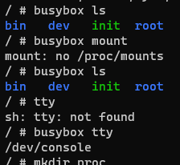
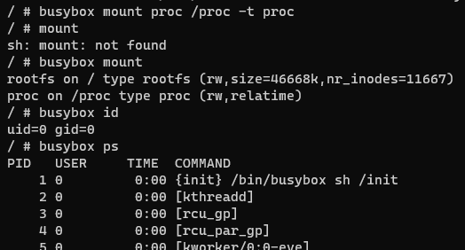
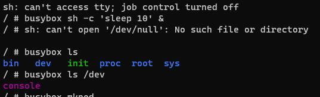

# 在 QEMU 上体验 Linux 最小系统

## 构建

[Building the Minimal Rootfs Using Busybox – Embedded learning](https://embeddedstudy.home.blog/2019/01/23/building-the-minimal-rootfs-using-busybox/)

[利用busybox构造linux rootfs - 知乎](https://zhuanlan.zhihu.com/p/409425657)

[使用busybox制作完成的最小rootfs - 王东力 - 博客园](https://www.cnblogs.com/ethandlwang/p/14789266.html)

Busybox rootfs img

[使用busybox制作根文件系统，并使用qemu加载_科技ing的博客-CSDN博客](https://blog.csdn.net/WMX843230304WMX/article/details/102869468)

[RootFS and Network of Qemu](http://zhiyisun.github.io/2015/04/10/rootfs-and-network-qemu.html)

## 获取最小系统

因为暂时不想研究构建，所以找了一个现成的用：

[系统调用和 UNIX Shell](https://jyywiki.cn/OS/2022/slides/13.slides#/1/1)

这是南京大学的操作系统课程（强烈推荐！）课件，PPT 第四页有一个 linux-minimal.zip 下载。

https://box.nju.edu.cn/f/3f67e092e1ba441187d9/?dl=1

这个 zip 包含了一个内核(vmlinuz)，一个 initramfs （只有一个 busybox 和一个 sh 写成的 init），以及一个 Makefile

```mk
.PHONY: initramfs run clean

$(shell mkdir -p build)

initramfs:
	@cd initramfs && find . -print0 | cpio --null -ov --format=newc | gzip -9 \
	  > ../build/initramfs.cpio.gz

run:
	@qemu-system-x86_64 \
	  -nographic \
	  -serial mon:stdio \
	  -m 128 \
	  -kernel vmlinuz \
	  -initrd build/initramfs.cpio.gz \
	  -append "console=ttyS0 quiet acpi=off"

clean:
	@rm -rf build
```

下面在 WSL 里面运行：

首先安装 qemu

```
apt install qemu-system
```

```
# 构建 initramfs
make
# 运行
make run
```

进入系统，发现甚至连 proc 都没有，还要自己 mount ；调用命令也必须要通过 busybox ：



```sh
/ # busybox mount proc /proc -t proc
/ # busybox mount
rootfs on / type rootfs (rw,size=46668k,nr_inodes=11667)
proc on /proc type proc (rw,relatime)
```



直接退出终端会导致 kernel panic ，需要使用 `Ctrl+A X` 退出 qemu


sh 想创建一个后台任务，结果居然打不开 /dev/null ，也要自己创建：



[linux - How to create /dev/null? - Unix & Linux Stack Exchange](https://unix.stackexchange.com/questions/27279/how-to-create-dev-null)

[null(4) - Linux manual page](https://man7.org/linux/man-pages/man4/zero.4.html)

```
/ # busybox mknod /dev/null c 1 3
/ # busybox ls
bin   dev   init  proc  root  sys
/ # busybox ls /dev
console  null
/ # busybox ls /dev -l
total 0
crw-------    1 0        0           5,   1 Nov  7 12:25 console
crw-r--r--    1 0        0           1,   3 Nov  7 12:25 null
/ # busybox chmod 666 /dev/null
```

# initrd & initramfs

[Linux内核Ramdisk(initrd)机制【转】 - sky-heaven - 博客园](https://www.cnblogs.com/sky-heaven/p/13856545.html)

[](https://www.kernel.org/doc/Documentation/filesystems/ramfs-rootfs-initramfs.txt)

# 其他

[在qemu环境中用gdb调试Linux内核 - wipan - 博客园](https://www.cnblogs.com/wipan/p/9264979.html)

[Initramfs 原理和实践 - wipan - 博客园](https://www.cnblogs.com/wipan/p/9269505.html)

[根文件系统挂载过程分析 - 知乎](https://zhuanlan.zhihu.com/p/347110313)

[linux创建init进程的3种实现方式原理分析【转】 - sky-heaven - 博客园](https://www.cnblogs.com/sky-heaven/p/16116574.html)
