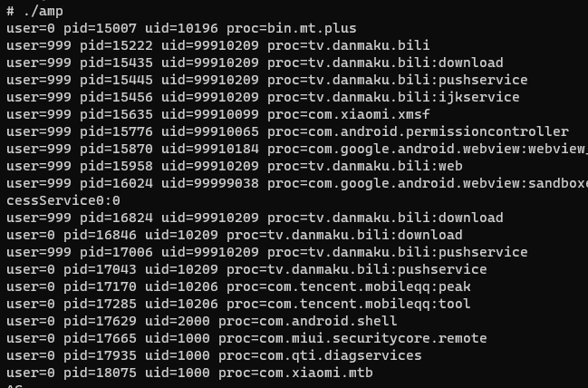
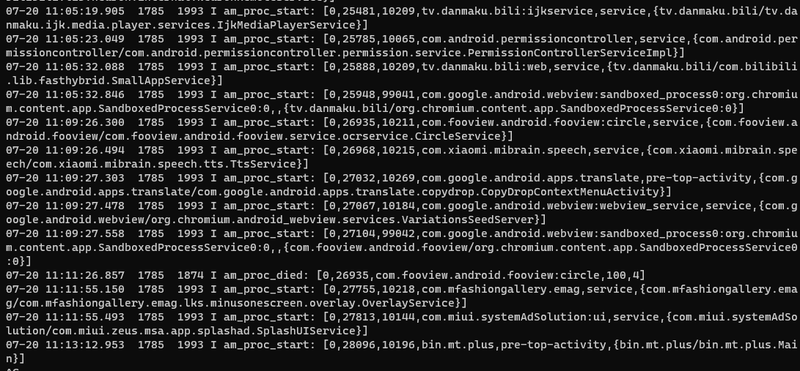

# 无侵入式的进程启动监视  

监视 Android 进程的启动，如果不侵入系统服务，往往需要借助 log ，SR 在非增强模式就是通过 logcat 监视进程启动的。但假如直接解析 logcat 程序的输出，对于不同系统版本，log 的格式也不一致，似乎很难做到兼容。

就在今天（2022.07.20），LSPosed 开发者之一 vvb2060 在其个人频道[发布](https://t.me/vvb2060Channel/743)了一个 github [gist](https://gist.github.com/vvb2060/a3d40084cd9273b65a15f8a351b4eb0e) ，提供了一种监视进程启动的实现，该方法不需要注入系统，也不需要创建 logcat 进程，完全使用 liblog 的 API 。

## 源码

```cpp
#include <unistd.h>
#include <string>
#include <cinttypes>
#include <android/log.h>
#include <sys/system_properties.h>

using namespace std;

extern "C" {

struct logger_entry {
    uint16_t len;      /* length of the payload */
    uint16_t hdr_size; /* sizeof(struct logger_entry) */
    int32_t pid;       /* generating process's pid */
    uint32_t tid;      /* generating process's tid */
    uint32_t sec;      /* seconds since Epoch */
    uint32_t nsec;     /* nanoseconds */
    uint32_t lid;      /* log id of the payload, bottom 4 bits currently */
    uint32_t uid;      /* generating process's uid */
};

#define LOGGER_ENTRY_MAX_LEN (5 * 1024)
struct log_msg {
    union [[gnu::aligned(4)]] {
        unsigned char buf[LOGGER_ENTRY_MAX_LEN + 1];
        struct logger_entry entry;
    };
};

[[gnu::weak]] struct logger_list *android_logger_list_alloc(int mode, unsigned int tail, pid_t pid);
[[gnu::weak]] void android_logger_list_free(struct logger_list *list);
[[gnu::weak]] int android_logger_list_read(struct logger_list *list, struct log_msg *log_msg);
[[gnu::weak]] struct logger *android_logger_open(struct logger_list *list, log_id_t id);

typedef struct [[gnu::packed]] {
    int32_t tag;  // Little Endian Order
} android_event_header_t;

typedef struct [[gnu::packed]] {
    int8_t type;   // EVENT_TYPE_INT
    int32_t data;  // Little Endian Order
} android_event_int_t;

typedef struct [[gnu::packed]] {
    int8_t type;     // EVENT_TYPE_STRING;
    int32_t length;  // Little Endian Order
    char data[];
} android_event_string_t;

typedef struct [[gnu::packed]] {
    int8_t type;  // EVENT_TYPE_LIST
    int8_t element_count;
} android_event_list_t;

// 30014 am_proc_start (User|1|5),(PID|1|5),(UID|1|5),(Process Name|3),(Type|3),(Component|3)
typedef struct [[gnu::packed]] {
    android_event_header_t tag;
    android_event_list_t list;
    android_event_int_t user;
    android_event_int_t pid;
    android_event_int_t uid;
    android_event_string_t process_name;
//  android_event_string_t type;
//  android_event_string_t component;
} android_event_am_proc_start;

}

void ProcessBuffer(struct logger_entry *buf) {
    auto *eventData = reinterpret_cast<const unsigned char *>(buf) + buf->hdr_size;
    auto *event_header = reinterpret_cast<const android_event_header_t *>(eventData);
    if (event_header->tag != 30014) return;
    auto *am_proc_start = reinterpret_cast<const android_event_am_proc_start *>(eventData);
    printf("user=%" PRId32" pid=%" PRId32" uid=%" PRId32" proc=%.*s\n",
           am_proc_start->user.data, am_proc_start->pid.data, am_proc_start->uid.data,
           am_proc_start->process_name.length, am_proc_start->process_name.data);
}

[[noreturn]] void Run() {
    while (true) {
        bool first;
        __system_property_set("persist.log.tag", "");

        unique_ptr<logger_list, decltype(&android_logger_list_free)> logger_list{
            android_logger_list_alloc(0, 1, 0), &android_logger_list_free};
        auto *logger = android_logger_open(logger_list.get(), LOG_ID_EVENTS);
        if (logger != nullptr) [[likely]] {
            first = true;
        } else {
            continue;
        }

        struct log_msg msg{};
        while (true) {
            if (android_logger_list_read(logger_list.get(), &msg) <= 0) [[unlikely]] {
                break;
            }
            if (first) [[unlikely]] {
                first = false;
                continue;
            }

            ProcessBuffer(&msg.entry);
        }

        sleep(1);
    }
}

int main(int argc, char *argv[]) {
    Run();
}
```

## 使用

我直接在 Termux 上用 g++ 编译了，注意要链接系统的 log 库，否则无法找到符号。

```sh
wget https://gist.github.com/vvb2060/a3d40084cd9273b65a15f8a351b4eb0e/raw/3e712a7e0d9e0bf5a5b87564aa7aa1b42bf70994/am_
proc_start.cpp
g++ am_proc_start.cpp -o amp -L/system/lib64/ -llog
```

在 root 下直接启动即可监视进程（当然 shell 下也可以）：



经过测试，这个程序在我的 Android 9 和 Android 11 上都可以运行。

## 分析

### logtags

cs 搜索 `am_proc_start` 找到这么一个 [logtags 文件](https://android.googlesource.com/platform/frameworks/base/+/407d531735419cb7139dde78e65102ae949618f4/services/core/java/com/android/server/am/EventLogTags.logtags)：

`frameworks/base/services/core/java/com/android/server/am/EventLogTags.logtags`

```
# See system/core/logcat/event.logtags for a description of the format of this file.

# ...

# Do not change these names without updating the checkin_events setting in
# google3/googledata/wireless/android/provisioning/gservices.config !!
#
# Application Not Responding
30008 am_anr (User|1|5),(pid|1|5),(Package Name|3),(Flags|1|5),(reason|3)

# Application process bound to work
30010 am_proc_bound (User|1|5),(PID|1|5),(Process Name|3)
# Application process died
30011 am_proc_died (User|1|5),(PID|1|5),(Process Name|3),(OomAdj|1|5),(ProcState|1|5)

# Application process has been started
30014 am_proc_start (User|1|5),(PID|1|5),(UID|1|5),(Process Name|3),(Type|3),(Component|3)
# An application process has been marked as bad
30015 am_proc_bad (User|1|5),(UID|1|5),(Process Name|3)
# An application process that was bad is now marked as good
30016 am_proc_good (User|1|5),(UID|1|5),(Process Name|3)
# Reporting to applications that memory is low
30017 am_low_memory (Num Processes|1|1)

# Kill a process to reclaim memory.
30023 am_kill (User|1|5),(PID|1|5),(Process Name|3),(OomAdj|1|5),(Reason|3)
```

每一行都定义了一些日志类型的 id 和对应的结构，不过不知道是什么意思。

文件顶上的注释的路径现在找不到了，不过在下面这个[同名的文件](https://android.googlesource.com/platform/system/logging/+/234f8d965769a4cf211b002b1bda19baaa9062f3/liblog/event.logtags)解释了这些结构：

`system/logging/liblog/event.logtags`

```
# The entries in this file map a sparse set of log tag numbers to tag names.
# This is installed on the device, in /system/etc, and parsed by logcat.
#
# Tag numbers are decimal integers, from 0 to 2^31.  (Let's leave the
# negative values alone for now.)
#
# Tag names are one or more ASCII letters and numbers or underscores, i.e.
# "[A-Z][a-z][0-9]_".  Do not include spaces or punctuation (the former
# impacts log readability, the latter makes regex searches more annoying).
#
# Tag numbers and names are separated by whitespace.  Blank lines and lines
# starting with '#' are ignored.
#
# Optionally, after the tag names can be put a description for the value(s)
# of the tag. Description are in the format
#    (<name>|data type[|data unit])
# Multiple values are separated by commas.
#
# The data type is a number from the following values:
# 1: int
# 2: long
# 3: string
# 4: list
#
# The data unit is a number taken from the following list:
# 1: Number of objects
# 2: Number of bytes
# 3: Number of milliseconds
# 4: Number of allocations
# 5: Id
# 6: Percent
# s: Number of seconds (monotonic time)
# Default value for data of type int/long is 2 (bytes).
```

看上去对每个 `()` 里面的内容，第一个参数是名字，第二个参数是类型，第三个参数没看出来什么用。我们只要第一个参数和第二个参数就能写出对应的结构体：

am_proc_start 的描述：

```
30014 am_proc_start (User|1|5),(PID|1|5),(UID|1|5),(Process Name|3),(Type|3),(Component|3)
```

对应的结构体：

```cpp
typedef struct [[gnu::packed]] {
    android_event_header_t tag;
    android_event_list_t list;
    android_event_int_t user;
    android_event_int_t pid;
    android_event_int_t uid;
    android_event_string_t process_name;
//  android_event_string_t type;
//  android_event_string_t component;
} android_event_am_proc_start;
```

实际上这些 logtags 最终都会放到 `/system/bin/event-log-tags` 。

### 日志缓冲区

Android 的日志系统实际上分为多个缓冲区，上面这些 event 日志都会被写入一个缓冲区 `events` （系统服务中的 `EventLog` 就是负责写入这里的），在 logcat 的帮助中有：

```
  -b, --buffer=<buffer>       Request alternate ring buffer(s):
                                main system radio events crash default all
                              Additionally, 'kernel' for userdebug and eng builds, and
                              'security' for Device Owner installations.
                              Multiple -b parameters or comma separated list of buffers are
                              allowed. Buffers are interleaved.
                              Default -b main,system,crash,kernel.
```

由于默认不包含 `events` ，因此平时看不到这些日志。

logcat 也可以查看 events buffer 中的内容：

```sh
logcat -b events
# 查看特定 tags
logcat -b events -s am_proc_start:* am_proc_died:*
```



### 使用 liblog 的非公开 API

系统提供的 api 并不包含读取日志，[头文件](https://android.googlesource.com/platform/system/logging/+/234f8d965769a4cf211b002b1bda19baaa9062f3/liblog/include/android/log.h)路径如下：

`system/logging/liblog/include/android/log.h`

因此上面的程序利用了 weak 符号声明这些不在头文件中的函数和结构体，运行时链接到 liblog 就可以使用。

```cpp
[[gnu::weak]] struct logger_list *android_logger_list_alloc(int mode, unsigned int tail, pid_t pid);
[[gnu::weak]] void android_logger_list_free(struct logger_list *list);
[[gnu::weak]] int android_logger_list_read(struct logger_list *list, struct log_msg *log_msg);
[[gnu::weak]] struct logger *android_logger_open(struct logger_list *list, log_id_t id);
```

这些函数和结构体 `logger_entry`, `log_msg` 的声明在[这里](https://android.googlesource.com/platform/system/logging/+/234f8d965769a4cf211b002b1bda19baaa9062f3/liblog/include/log/log_read.h)：`system/logging/liblog/include/log/log_read.h`

`android_event_` 开头的结构体声明在[这里](https://android.googlesource.com/platform/system/logging/+/234f8d965769a4cf211b002b1bda19baaa9062f3/liblog/include/private/android_logger.h)：`system/logging/liblog/include/private/android_logger.h`