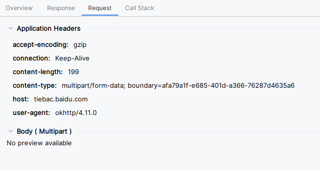
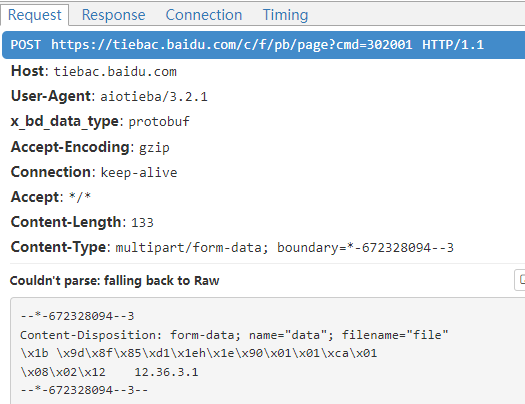
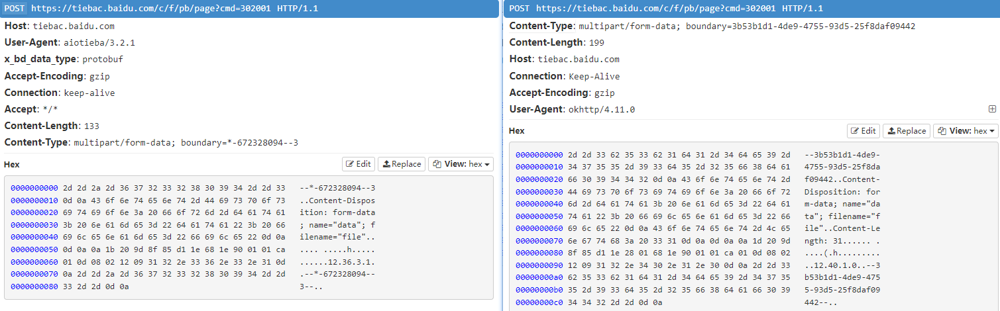
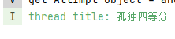
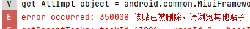

# RoTieba 开发之路

由于无法忍受 [TiebaLite](https://github.com/HuanCheng65/TiebaLite) 旧 UI 的拉跨，以及新 UI 使用 Jetpack Compose 导致开发及使用的性能骤降，在 TiebaLite 上维护个人分支已经难以满足需求，所以我决定按照自己的需求做一款全新贴吧 App ——

RoTieba ，即 Readonly Tieba ，只读贴吧（名称暂定）

RoTieba 是一款贴吧阅读器。由于个人并没有在贴吧互动的需求，且第三方回帖容易被封禁，因此计划只做阅读器，不支持发帖、回帖及其他互动操作，此外还会加入下载帖子的功能。

## 0x01 移植 aiotieba

[aiotieba](https://github.com/Starry-OvO/aiotieba) 是一个开源的贴吧 client ，使用 Python 编写。由于其使用了较新的来自贴吧 App 的 API ，因此具有很好的学习价值。

### 取得 proto

aiotieba 所用的 API 基本上都是 protobuf 格式的，相比贴吧 Lite 使用的 json API ，protobuf 开发起来相对方便。

有两种渠道获得 API 的 proto ，可以从 aiotieba 源码的 api 目录下的 _protobuf 目录获取，也可以从下面的仓库获取，里面包含了直接从 app dump 的原始 protobuf 定义文件。

https://github.com/n0099/tbclient.protobuf

经过考虑，决定还是使用 aiotieba 自带的 protobuf ，因为相对精简，去掉了不必要的业务数据的定义，比如广告。而且我们的请求逻辑也来自 aiotieba ，因此直接使用 aiotieba 的 proto ，可以确保一致性。

不过 aiotieba 的 proto 没有声明 package ，类与类的关系是扁平的，好在每个文件的第一行注释就是类名，因此我们可以处理一下，给 proto 加上 `option java_package` ，再加入我们的项目。

[Java Generated Code Guide | Protocol Buffers Documentation](https://protobuf.dev/reference/java/java-generated/)

### 配置 protobuf 依赖

直接参考 [BiliRoaming](https://github.com/yujincheng08/BiliRoaming/blob/a2d5a267e1b12a9f5019c897c2f550722a5a6dc5/app/build.gradle.kts) 。

protobuf gradle plugin 有个坑点，`0.9.2` 版本一直有问题，会导致 sync 失败，不过 `0.9.3` 已经修复了。

即使项目是纯 kotlin 项目，似乎也要生成 java 的 protobuf 类，因为生成的 kotlin 类依赖于 java 的。

### 第一个请求

把 aiotieba 的 get_posts 复刻到 kotlin 上：

```kt
fun getPosts() = runCatching {
    val client = OkHttpClient()
    val body = PbPageReqIdl.newBuilder()
        .setData(PbPageReqIdl.DataReq.newBuilder()
            .setCommon(CommonReqOuterClass.CommonReq.newBuilder()
                .setClientType(2)
                .setClientVersion(MAIN_VERSION)
            )
            .setTid(8223016861)
            .setPn(1)
            .setRn(30) // post count
            .setSort(0)
            .setOnlyThreadAuthor(1)
            .setWithComments(0)
            .setIsFold(0)
        ).build()
    val multipart = MultipartBody.Builder().setType(MultipartBody.FORM)
        .addFormDataPart("data", "file", body.toByteArray().toRequestBody())
        .build()
    val req = Request.Builder()
        .url("https://$APP_BASE_HOST/c/f/pb/page?cmd=302001")
        .post(multipart)
        .build()
    val resp = client.newCall(req).execute().let {
        PbPageResIdl.parseFrom(it.body!!.byteStream())
    }
    if (resp.errorOrNull?.errorno != 0) {
        Log.e(TAG, "error occurred: ${resp.error.errorno} ${resp.error.errmsg}")
    } else {
        Log.i(TAG, "thread title: ${resp.data.thread.title}")
    }
}.onFailure {
    Log.e(TAG, "failed to request:", it)
}
```

仅仅只是请求一个固定帖子 https://tieba.baidu.com/p/8223016861

然而解析请求的时候出现了问题，没法反序列化：

```
E  failed to request:
com.google.protobuf.InvalidProtocolBufferException: Protocol message end-group tag did not match expected tag.
    at com.google.protobuf.UnknownFieldSchema.mergeOneFieldFrom(UnknownFieldSchema.java:103)
```

尝试用 App Inspector 的 Network Inspector 抓包分析。但发现这玩意虽然自带 OkHttp 支持，然而过于拉跨，二进制内容根本没法查看：



### 抓包分析

使用 [mitmproxy](https://mitmproxy.org/)

mitmproxy 有 web ui ，输入 `mitmweb` 即可开启，当然不能和已有的 mitmproxy 实例同时开启（默认监听端口是相同的）

用 aiotieba 写一个简单的请求，并设置代理。

```py
import asyncio
import aiotieba
from yarl import URL


async def main():
    async with aiotieba.Client(proxy=(URL("http://localhost:8080"), None)) as client:
        ps = await client.get_posts(8223016861)
        print(ps)

if __name__ == '__main__':
    import platform

    if platform.system() == 'Windows':
        asyncio.set_event_loop_policy(asyncio.WindowsSelectorEventLoopPolicy())
    asyncio.run(main())
```

看上去 aiotieba 内部自动把 ssl 校验关掉了，或者说 mitmproxy 安装时已经自带了系统证书，https 竟然能直接抓



同样的套路放在 Android 上：

```kt
    val client = OkHttpClient.Builder()
        .proxy(Proxy(Proxy.Type.HTTP, InetSocketAddress("192.168.1.144", 8080)))
        .build()
```

这样显然会失败：

```
[16:31:04.924][192.168.1.143:41724] server connect tiebac.baidu.com:443 (198.18.1.219:443)
[16:31:05.023][192.168.1.143:41724] Client TLS handshake failed. The client does not trust the proxy's certificate for tiebac.baidu.com (OpenSSL Error([('SSL routines', '', 'sslv3 alert certificate unknown')]))
[16:31:05.025][192.168.1.143:41724] client disconnect
```

```
failed to request:
javax.net.ssl.SSLHandshakeException: java.security.cert.CertPathValidatorException: Trust anchor for certification path not found.
    at com.android.org.conscrypt.SSLUtils.toSSLHandshakeException(SSLUtils.java:362)
    at com.android.org.conscrypt.ConscryptEngine.convertException(ConscryptEngine.java:1134)
    at com.android.org.conscrypt.ConscryptEngine.readPlaintextData(ConscryptEngine.java:1089)
```

在 stackoverflow 找到一个好方法，可以让 OkHttpClient 信任所有证书，这样就能抓到包了：https://stackoverflow.com/a/59322754

```kt
fun OkHttpClient.Builder.ignoreAllSSLErrors(): OkHttpClient.Builder {
    val naiveTrustManager = object : X509TrustManager {
        override fun getAcceptedIssuers(): Array<X509Certificate> = arrayOf()
        override fun checkClientTrusted(certs: Array<X509Certificate>, authType: String) = Unit
        override fun checkServerTrusted(certs: Array<X509Certificate>, authType: String) = Unit
    }

    val insecureSocketFactory = SSLContext.getInstance("TLSv1.2").apply {
        val trustAllCerts = arrayOf<TrustManager>(naiveTrustManager)
        init(null, trustAllCerts, SecureRandom())
    }.socketFactory

    sslSocketFactory(insecureSocketFactory, naiveTrustManager)
    hostnameVerifier { _, _ -> true }
    return this
}
    val client = OkHttpClient.Builder()
        .proxy(Proxy(Proxy.Type.HTTP, InetSocketAddress("192.168.1.144", 8080)))
        .ignoreAllSSLErrors()
        .build()
```

来看一看问题，抓到的 response 居然是个 json：

```json
 {
  "logid":"2027643993","error_code":110001,"ctime":"0","server_time":1,"error_msg":"未知错误","time":1683707627
}
```

比较一下两个请求，左边是 aiotieba ，右边是 okhttp ：



看来少了个 header ，应该和服务端接受的数据类型有关，我们需要显式指定为 `protobuf` 。

加上去就 ok 了，这个不仔细看源码真的看不到：

https://github.com/Starry-OvO/aiotieba/blob/ed8867f6ac73b523389dd1dcbdd4b5f62a16ff81/aiotieba/core/http.py

再次执行，这次可以得到正确的标题：

```kt
.header("x_bd_data_type", "protobuf")
```



除此之外，请求返回的错误也能被正确汇报（下面请求了一个 tid=1 的帖子），说明基本上没问题了：




## ……

### Json API

实际上 aiotieba （或者说贴吧）仍然在使用很多 json api ，这些 API 也有不少坑，比如说要签名。

aiotieba 的签名实现竟然放在了 native 代码，实际上签名只需要简单的 md5 ，python 完全可以胜任，不知道作者怎么想的。

签名的具体过程：md5 依次更新每对 key 和 value 的 key , `=`, value 的 utf-8 字节，最后加上 `tiebaclient!!!` ，取 digest 。

似乎参数的顺序也有讲究，必须要按照字母升序排列。

## ……

### 表情

Tieba Lite 的表情是内置在资源文件的

从网页端找到的表情：

image_emoticon -> image_emoticon1

支持 https (PC web)：https://tb2.bdstatic.com/tb/editor/images/client/image_emoticon25.png

不支持 https (手机触屏 web)：http://static.tieba.baidu.com/tb/editor/images/client/image_emoticon25.png

但是这些表情都是旧版的，如果想要新版就麻烦了

EmojiAll 收录了一些，不过没有 emoji 名字的对应

https://www.emojiall.com/zh-hans/platform-baidu

最后发现表情其实是存在贴吧的 apk 里面的，因此可以直接提取

不过代码和资源有混淆，想要自动定位难度比较大
