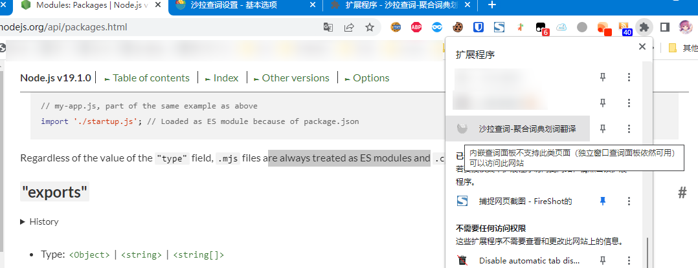
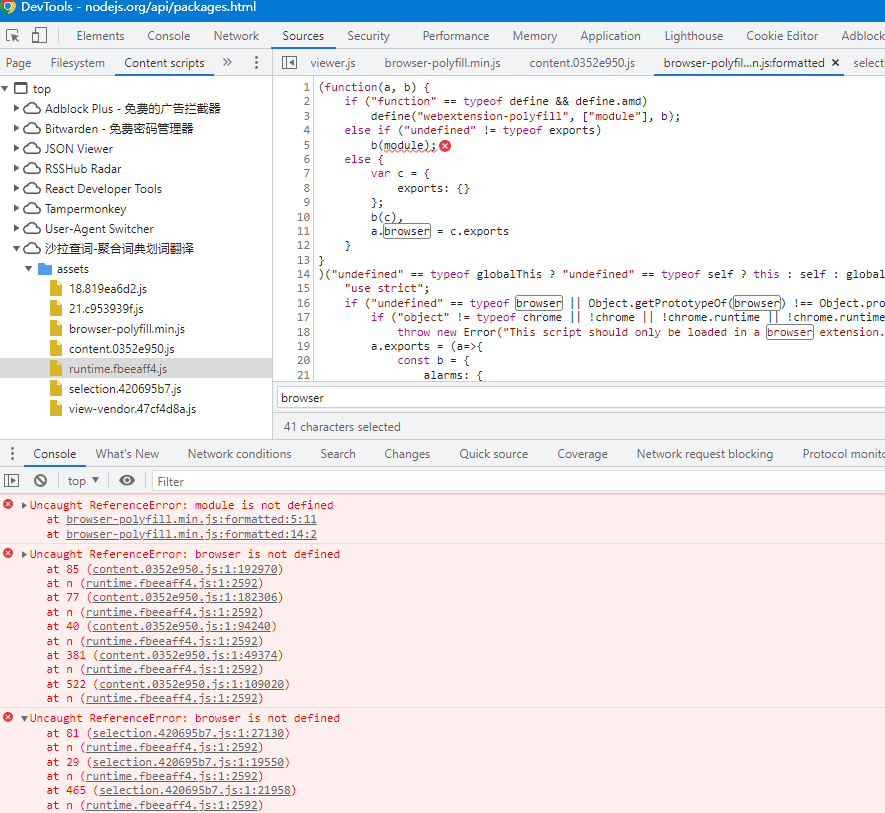
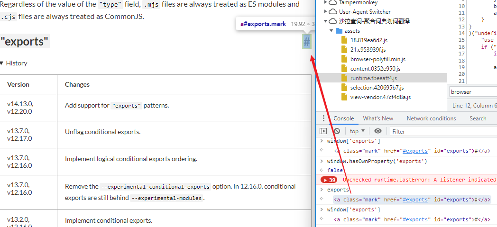
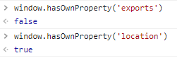
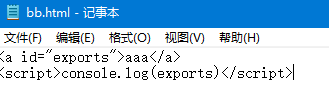
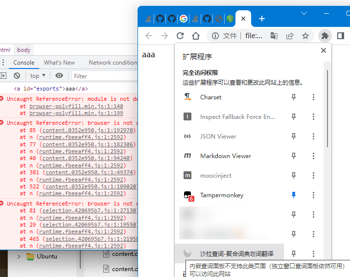

# 导致 saladict 扩展工作不正常的奇怪的问题

## 起因

由于本人破烂的英语，常常遇到不会的单词，因此安装了 [saladict](https://github.com/crimx/ext-saladict) ，方便划词翻译。

今天在查 nodejs 的英文文档，遇到单词也习惯性地划词，但奇怪地发现查词的小球没有如预期出现。

也许是 chrome 的扩展又日常抽风了吧，我想。毕竟前段时间 Tampermonkey 也常常发生漏注入的情况，刷新一下就好了。

> 页面是这个：
> [Modules: Packages | Node.js v19.1.0 Documentation](https://nodejs.org/api/packages.html)

然而在那个页面刷新了多次，扩展仍然不正常工作，而切去其他页面工作都是正常的。点开扩展程序面板一看，竟然显示「不支持」。



我就纳闷了，同样是 HTML 怎么你 nodejs.org 就不支持了呢？~~难道这是谁要刻意阻拦我这个英语渣渣学习 node 吗？~~

于是打开 console 一看，果不其然有大问题：



## 分析

出事的脚本是这一个：

`chrome-extension://cdonnmffkdaoajfknoeeecmchibpmkmg/assets/browser-polyfill.min.js`

这应该是 webextension-polyfill ，在 saladict 的 package.json 也有它的 dependency ：

[mozilla/webextension-polyfill: A lightweight polyfill library for Promise-based WebExtension APIs in Chrome](https://github.com/mozilla/webextension-polyfill)

发生问题的代码，似乎是处理 js 模块加载的部分。

```js
(function(a, b) {
    if ("function" == typeof define && define.amd)
        define("webextension-polyfill", ["module"], b);
    else if ("undefined" != typeof exports)
        b(module);
    else {
        var c = {
            exports: {}
        };
        b(c),
        a.browser = c.exports
    }
}
```

第一部分判断全局有没有 define ，这是 [amdjs](https://github.com/amdjs/amdjs-api/wiki/AMD) 模块的定义。

> [也有说是 requirejs 的](https://stackoverflow.com/questions/16950560/what-is-define-function-in-javascript)

接下来是 `exports` ，这应该是 CommonJS 模块，其中有我们熟知的 `require` 和 `module.exports` 。

> [Modules: CommonJS modules | Node.js v19.1.0 Documentation](https://nodejs.org/api/modules.html#exports)

最后是直接把模块导出到 global ，应该是浏览器正常应该走的分支。

然而现在在 `b(module)` 那报了个错，提示 `module` undefined 。

那么我们看看 exports 是什么：



竟然指向了一个 id 是 exports 的 DOM …… 这难道是什么奇怪的 feature 吗？

实际上 window 对象上似乎没定义这个 property ，作为对比，location 就是 window 上的 property 。



于是去搜索了一下，发现这个确实是 HTML 的规范「[named access on the window object](https://html.spec.whatwg.org/multipage/nav-history-apis.html#named-access-on-the-window-object)」，由 whatwg.org 制定，应该是很权威的。

> https://stackoverflow.com/a/11691401

我也随手写了一个 html 验证了想法，这样确实会破坏 saladict 的功能：





看上去就是这段处理模块的脚本的不对了，因为它除了判断 `exports` 是否为 object 外，没有做其他的判断。

在 UMD (Universal Module Definition) 的模板中是这么写的：

[umd/returnExports.js at 36fd1135ba44e758c7371e7af72295acdebce010 · umdjs/umd](https://github.com/umdjs/umd/blob/36fd1135ba44e758c7371e7af72295acdebce010/templates/returnExports.js)


```js
(function (root, factory) {
    if (typeof define === 'function' && define.amd) {
        // AMD. Register as an anonymous module.
        define(['b'], factory);
    } else if (typeof module === 'object' && module.exports) {
        // Node. Does not work with strict CommonJS, but
        // only CommonJS-like environments that support module.exports,
        // like Node.
        module.exports = factory(require('b'));
    } else {
        // Browser globals (root is window)
        root.returnExports = factory(root.b);
    }
}(typeof self !== 'undefined' ? self : this, function (b) {
    // Use b in some fashion.

    // Just return a value to define the module export.
    // This example returns an object, but the module
    // can return a function as the exported value.
    return {};
}));
```

这里是先判断 module 是否为 object ，然后再看 module 有没有 exports ，这样起码更加可靠一些。

但是我找不到这段问题代码到底出自哪里，webextension-polyfill 里面没有相关代码，因此可能是打包工具处理成这样的。saladict 似乎使用 webpack ，但是唯独这一个文件和其他打包的文件不太一样。

## To be continued


