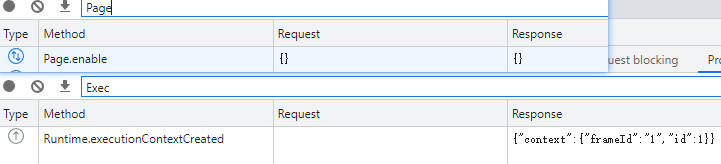
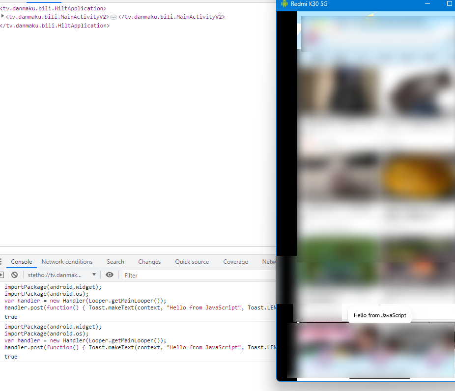

# 使用 Xposed 注入 Stetho

[facebook/stetho: Stetho is a debug bridge for Android applications, enabling the powerful Chrome Developer Tools and much more.](https://github.com/facebook/stetho)

Stetho 是 facebook 开源的一个借助 Chrome Devtools Protol 协议调试 Android app 的库，思路可谓清奇。虽然两年前就已经停止更新，不过也可以利用来调试。

[Chrome DevTools Protocol - latest (tip-of-tree)](https://chromedevtools.github.io/devtools-protocol/tot/)

前人已经做了利用 Xposed 注入 stetho 到应用的模块：https://gitlab.com/derSchabi/Stethox

体验了一把，就 View 调试方面来说，感觉完爆 AS 的 Layout Inspect ；我更期待的还是 js 反射 java ，这不就像 frida 一样么，感觉这么一组合起来，我之前写的半成品 frida 脚本 libview 也可以丢掉了。可惜原来的模块并没有实现，不知道为什么。

自己动手，丰衣足食，我们自己添加 stetho-rhino 依赖进去不就好了？

……

但是就算加入了 rhino 的依赖，Stetho 的 console 仍然无法执行 js 。

于是使用 CDP Monitor 发送 raw command:

```json
{"command":"Runtime.evaluate","parameters":{"expression": "1"}}
```

结果：

```json
{
    "exceptionDetails": {
        "text": "java.lang.NullPointerException: Attempt to invoke virtual method 'boolean java.lang.String.equals(java.lang.Object)' on a null object reference"
    },
    "result": {
        "className": "What??",
        "description": "NullPointerException",
        "objectId": "5",
        "type": "object"
    },
    "wasThrown": true
}
```

上调试器去找，发现问题在这里：

https://github.com/facebook/stetho/blob/7c4dc8de4deb28c012b199ef52b9b5c7ad626793/stetho/src/main/java/com/facebook/stetho/inspector/protocol/module/Runtime.java

```java
    public EvaluateResponse evaluate(RuntimeReplFactory replFactory, JSONObject params) {
      EvaluateRequest request = mObjectMapper.convertValue(params, EvaluateRequest.class);

      try {
        if (!request.objectGroup.equals("console")) {
          return buildExceptionResponse("Not supported by FAB");
        }

        RuntimeRepl repl = getRepl(replFactory);
        Object result = repl.evaluate(request.expression);
        return buildNormalResponse(result);
      } catch (Throwable t) {
        return buildExceptionResponse(t);
      }
    }
```

原来是我传参数没有加 `objectGroup` ，他这里要求必须是 `console`

重发一遍，得到了正确结果。

```json
{"command":"Runtime.evaluate","parameters":{"expression": "1", "objectGroup": "console"}}
```

```json
{
    "result": {
        "type": "number",
        "value": 1
    },
    "wasThrown": false
}
```

看起来 rhino 没有问题，协议的 evaluate 也没问题。

但是直接在 console 输入命令也无法触发 evaluate 的断点，说明是 devtools 本身的问题，或者是 stetho 没有实现协议的某些部分

https://github.com/ChromeDevTools/devtools-frontend/blob/80586f9a4612cac80102a0be1a0e152fd168e1e2/front_end/panels/console/ConsolePrompt.ts#L278

```ts
  private appendCommand(text: string, useCommandLineAPI: boolean): void {
    const currentExecutionContext = UI.Context.Context.instance().flavor(SDK.RuntimeModel.ExecutionContext);
    if (currentExecutionContext) {
      const executionContext = currentExecutionContext;
      const consoleModel = executionContext.target().model(SDK.ConsoleModel.ConsoleModel);
      if (consoleModel) {
        const message = consoleModel.addCommandMessage(executionContext, text);
        const expression = ObjectUI.JavaScriptREPL.JavaScriptREPL.wrapObjectLiteral(text);
        void this.evaluateCommandInConsole(executionContext, message, expression, useCommandLineAPI);
        if (ConsolePanel.instance().isShowing()) {
          Host.userMetrics.actionTaken(Host.UserMetrics.Action.CommandEvaluatedInConsolePanel);
        }
      }
    }
  }
```

需要一个 currentExecutionContext ，用调试器一看，果然是空的。

这应该和 `Runtime.ExecutionContextDescription` Event 有关，需要 backend 发送一个事件。

https://github.com/facebook/stetho/blob/7c4dc8de4deb28c012b199ef52b9b5c7ad626793/stetho/src/main/java/com/facebook/stetho/inspector/protocol/module/Page.java

stheto 中的 Page.enable 发送了该事件。

```java
  @ChromeDevtoolsMethod
  public void enable(JsonRpcPeer peer, JSONObject params) {
    notifyExecutionContexts(peer);
    sendWelcomeMessage(peer);
  }

  private void notifyExecutionContexts(JsonRpcPeer peer) {
    ExecutionContextDescription context = new ExecutionContextDescription();
    context.frameId = "1";
    context.id = 1;
    ExecutionContextCreatedParams params = new ExecutionContextCreatedParams();
    params.context = context;
    peer.invokeMethod("Runtime.executionContextCreated", params, null /* callback */);
  }
```

重新打开 devtools ，观察 Protocol Monitor ，frontend 确实调用了 `Page.enable` ，而 stetho 也回应了 `Runtime.executionContextCreated` ，但是 console 的 context 仍无法选择。



其实我很怀疑这个逻辑的正确性，因为 Runtime 也有一个 enable 方法，应该在这里产生事件才对，而 Stetho 并没有实现它。

移到 Runtime 里面，实现 enable ，然后编译成 aar 直接加入模块

```js
host.js:1 TypeError: Cannot read properties of undefined (reading 'toString') TypeError: Cannot read properties of undefined (reading 'toString')
    at Jt.fromString (common.js:1:53563)
    at kr.setLabelInternal (sdk.js:1:350735)
    at new kr (sdk.js:1:348382)
    at br.executionContextCreated (sdk.js:1:341250)
    at Ir.executionContextCreated (sdk.js:1:347528)
    at g.dispatch (protocol_client.js:1:7345)
    at z.dispatch (protocol_client.js:1:8336)
    at d.onMessage (protocol_client.js:1:4292)
    at Lr.dispatchMessage (sdk.js:1:356274)
    at At.dispatchEventToListeners (common.js:1:48112)
```

```js
     setLabelInternal(t) {
        if (t)
            return void (this.#pa = t);
        if (this.name)
            return void (this.#pa = this.name);
        const n = e.ParsedURL.ParsedURL.fromString(this.origin);
        this.#pa = n ? n.lastPathComponentWithFragment() : ""
    }
```

看起来要读一个 origin 属性，对比 devtools 自己的：

```json
{
    "context": {
        "id": 1,
        "origin": "devtools://devtools",
        "name": "",
        "uniqueId": "-8461912759144154757.-4584591039569730994",
        "auxData": {
            "isDefault": true,
            "type": "default",
            "frameId": "DB80B16589F6F2FD463D4997E5AB8D32"
        }
    }
}
```

于是再修改，这次总算可以正确执行 js 了。

执行官方的 toast example 也可以通过。

```js
importPackage(android.widget);
importPackage(android.os);
var handler = new Handler(Looper.getMainLooper());
handler.post(function() { Toast.makeText(context, "Hello from JavaScript", Toast.LENGTH_LONG).show() });
```




