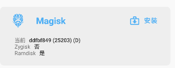

# 修改 Magisk 为 Zygisk 提供新启动方式  

一直对 zygisk 产生的那个[栈底的 `/dev/fd`](new-idea-detect-zygisk.md) 很在意，因为一般的 zygote 不可能通过 execveat 启动的，这自然是一个明显的特征，而 shamiko 之类的估计不好修复。因此，还需要修改 zygisk 的行为，让它真正 execve /system/bin/app_process 。

最近总算[配置好了](build-magisk-on-windows.md)在 windows 上开发 magisk 的环境，下面让我们试试吧！

下文以 app_process wrapper 称呼被 magisk 修改后的 app_process （本质上就是 magisk 主程序）

## 尝试一

一开始的思路是：

```
exec app_process wrapper -> umount app_process wrapper -> exec orig app_process
```

失败。linker 提示 appwidget 无法链接到 app_process

```
09-17 11:52:01.206 24482 24482 E linker  : library "/system/bin/app_process" ("/system/bin/app_process64") needed or dlopened by "/system/bin/appwidget" is not accessible for the namespace: [name="(default)", ld_library_paths="", default_library_paths="/system/lib64:/system_ext/lib64", permitted_paths="/system/lib64/drm:/system/lib64/extractors:/system/lib64/hw:/system_ext/lib64:/system/framework:/system/app:/system/priv-app:/system_ext/framework:/system_ext/app:/system_ext/priv-app:/vendor/framework:/vendor/app:/vendor/priv-app:/system/vendor/framework:/system/vendor/app:/system/vendor/priv-app:/odm/framework:/odm/app:/odm/priv-app:/oem/app:/product/framework:/product/app:/product/priv-app:/data:/mnt/expand:/apex/com.android.runtime/lib64/bionic:/system/lib64/bootstrap"]
```

起初以为是 LD_PRELOAD 失败了，app_process 无法加载位于 /system/bin 的 so 作为 preload 。看到 /data 是允许的路径，还尝试把 HIJACK_BIN 改成 /data/adb ，结果发现 zygote 没权限访问（以前一直以为可以访问的）。

不过再仔细一看，其实是 appwidget 链接到 app_process 出现了问题。

研究了一下源码，发现现在的加载机制改了：一阶段是一个独立的 zygisk-loader.so ，编译好后包含在 magisk 程序的一个数组里面。在 app_process wrapper 启动的时候发送给 magiskd ，然后接收并 mount 到 HIJACK_BIN 目录（64 位是 /system/bin/appwidget ，32 位是 /system/bin/bu ）。LD_PRELOAD 设置为 HIJACK_BIN ，随后 fexecve 执行原 app_process 。一阶段 loader 中会 dlopen `/system/bin/app_process` ，此处是强制重新打开(android_dlopen_ext flags=`ANDROID_DLEXT_FORCE_LOAD`)，因为这个 app_process 实际上是 app_process wrapper ，二阶段的入口就包含在里面。

而现在的问题就是 dlopen 出现了问题，至于为何打开原 app_process 会出现 namespace 的问题暂不追究，至少如果这个 app_process 是「zygisked」的，就能打开。

因此，假如我们希望直接 execve 原 app_process，我们 umount 后还要再 mount 回去。

另外，考虑到目前的操作都在全局挂载命名空间似乎不妥，而 zygote 启动后会 unshare ，且 remount root 为 slave ，于是还尝试了在 zygisk 启动阶段就主动 unshare + slave mount ，然而这样直接导致 zygote 崩溃：

```
Process uptime: 0s
Cmdline: zygote64
pid: 8465, tid: 8465, name: main  >>> zygote64 <<<
uid: 0
signal 6 (SIGABRT), code -1 (SI_QUEUE), fault addr --------
Abort message: 'JNI FatalError called: (system_server) Not allowlisted (5): /trace_marker'
```

看上去是某个奇怪的 fd 泄露了，但是 zygisk 的 fd 应该都好好关闭或者 CLOEXEC 了吧？搜索源码也没有这个 `trace_marker` 的痕迹。

检查 tombstone ，发现打开的 fd 在 /proc/self/fd 的路径有部分变得很奇怪：

```
open files:
    fd 0: /dev/null (unowned)
    fd 1: /dev/null (unowned)
    fd 2: /dev/null (unowned)
    fd 3: socket:[126612] (unowned)
    fd 4: /dev/pmsg0 (unowned)
    fd 5: /trace_marker (unowned)
    fd 6: /javalib/core-oj.jar (unowned)
    fd 7: /javalib/core-libart.jar (unowned)
    fd 8: /javalib/okhttp.jar (unowned)
    fd 9: /javalib/bouncycastle.jar (unowned)
```

其中 `/trace_marker` 就是 `/sys/kernel/tracing/trace_marker` 。这个路径的 fd 在 zygote 是允许的，然而现在变成了这样的名字，就没法允许了。下面的 /javalib 似乎来自 apex 。总之可能是两次 unshare + mount slave 导致的奇怪问题，不过自己没法复现，也不知道具体是哪里的原因。

## 尝试二

既然 zygisk 自己都是在全局命名空间处理 HIJACK_BIN 的卸载的，那我们也不必保证它的隔离性，毕竟不会同时有两个 zygote 启动（指同 64/32）

这次尝试不 umount ，而是直接把 orig app_process 又挂到原目录上，相当于挂了三层，进入之后再 umount 。

这样 linker 的问题也没了，但是 hook 却无法生效。检查发现，本应 hook app_process 的 setArgv0 却没 hook 到，导致后面的工作都无法进行；进一步发现，maps 中名为 app_process 的内存是 app_process wrapper 的，而真正的 app_process 名字却是 `/` （只能通过 inode 号查找了），由于 xhook 搜索 so 是通过 maps 进行的，这就导致无法找到正确的 app_process 。

> 对比了一下，正常执行的 zygisk ，在内存里面应该会有两个 app_process 文件的映射 **（这样真的不会对 xhook 有问题吗？）**

看上去是我们 umount 导致的路径变成 `/` ，自己写了个程序验证了一下，确实如此，也许和内核查找路径的方式有关。

## 终极尝试

看上去叠加 mount 并不好，最好还是 umount 掉 app_process wrapper ，execve orig，然后在 loader 中请求 magiskd mount app_process wrapper （因为 zygote 自己无法 mount）。

不过 loader 是独立于 magisk 其他部分的，写起来、调试起来并不方便，不过最后还是写出了一个可行的版本。

loader 中连接 magiskd socket 请求 mount ，这里也采用了 patch 方法，发送 loader 的同时 patch socket name （使用了和 MAIN_SOCKET 不同的魔数）。

> 突然想到，其实根本不用我们亲自 patch ，直接用和 MAIN_SOCKET 相同的魔数就好。因为 loader 自身也包含在 magisk 主程序中，patch 主程序的时候肯定会 patch 这部分的。

## 第一次终极尝试  

考虑到在 loader 中和 magiskd 通信较为麻烦，而且这样不可避免地要增加 Request code ，而这部分位于 C++ ，code 写在 enum 里面，不太好迁移到 C ，于是干脆使用更加原始的通信机制——信号。

具体思路是：app_process wrapper 将自己的某个信号阻塞，然后请求 magiskd umount app_process wrapper ，发送 loader 后不 close socket，直接 exec 。对面 magiskd read 等待回应，如果发现连接断开，认为 zygote 已经 exec （假如 exec 失败，app_process wrapper 会回应，以分辨是否成功），mount app_process wrapper 并发送信号给 zygote ，此时 loader 使用 sigsuspend 等待信号到来，之后直接执行 loader 逻辑。

观察 zygote 的 SIGBLK ，发现 SIGUSR1 一般是 blocked 的，因此适合作为我们需要的信号。

按照这个想法写了一下，确实成功了。不过这个做法似乎有些 ub ，因为我们不知道 exec 导致的 fd close 并通知到 magiskd mount 和内核加载对应的路径的程序到底谁先执行。

于是为了确保正确性，又增加了 stat ，首先 stat 原始 app_process 的 inode ，然后 execve 连接断开的时候在 3s 内 stat /proc/zygote/exe 的 inode ，如果是 app_process 才 mount 并发信号。

实现为 stat 一次等待 100ms ，共 30 次。不过从实际情况来看，基本都是第一次就成功了。

最后又给 loader 加了个 sigalrm ，确保 3s 内不成功能自杀（下一次就走正常 app_process 了）。刚好 Zygote 不 block SIGALRM ，因此不需要我们主动还原 mask 。

> 至于 Zygote 是不是真的有固定的信号 mask ，其实我也不太清楚……反正看了几个设备的 SigBlk 都是 `80001204`

## 感想

Android.mk 的项目写起来真的不方便，因为 AS 不提供语言支持（~~会不会是有能用的 IDE 我不知道呢~~）。所有的语法问题都只能等编译才能发现（毕竟我脱离了强大 IDE 的支持写代码就寸步难行了）。总之，开发 magisk 十分考验功底，很难不佩服创造者 wu 和其他 magisk 的开发者。

> 最近升级 Android Studio Dolphin （半个月前才发布的），发现竟然支持 Android.mk 了 …… 众所周知 Android Studio 的预览版比稳定版要早几年，所以应该早就支持了。难怪大佬们开发都不用稳定版。

## ……

## 第二次终极尝试：解决 attr prev 的问题？  

最近又发现了 `/proc/self/attr/current` 可能暴露 zygisk 的存在（正常是 `u:r:init:s0` ，zygisk wrapper 后变成 `u:r:zygote:s0`），于是尝试解决，然而并不顺利。

一开始的想法是：app_process label 换成 magisk_file ，然后 init 执行直接变成 magisk domain ，在这里就可以随心所欲了，并且我们可以稍后设置成 `u:r:init:s0` ，然后再 exec 原始 app_process 变成 zygote ，看上去天衣无缝。

结果 init 根本拒绝执行，给了个这样的 log ： `has incorrect label or no domain transition`

搜了一下发现源码在这里：`system/core/init/service.cpp` 的 `ComputeContextFromExecutable` 函数，会主动计算 init exec 的新进程的 domain ，如果 domain 不发生改变就会报这个错……

我们知道 magiskd 自己就是从 init 出来的，那它怎么没问题呢？原来 magiskd 显式声明了自己的 selinux label:

```cpp
// native/src/init/magiskrc.inc
"service %2$s %1$s/magisk --post-fs-data\n"
"    user root\n"
"    seclabel u:r:" SEPOL_PROC_DOMAIN ":s0\n"
"    oneshot\n"
"\n"
```

好吧，那就先让 magisk_file 被 init 执行 transition 成 magisk domain ：

```cpp
// native/src/sepolicy/rules.cpp
type_transition("init", SEPOL_FILE_TYPE, "process", SEPOL_PROC_DOMAIN);
```

然而 magisk 又被自己绊了一脚：magiskd 处理 zygisk socket 请求只认 zygote label ，magisk 自己的 label 被无情地拒绝了。

```cpp
    if (setcon("u:r:" SEPOL_PROC_DOMAIN ":s0")) {
        LOGE("FIVEC: failed to setcon to magisk");
    }

    if (int socket = zygisk_request(ZygiskRequest::SETUP); socket >= 0) {
        do {
            // ....

            if (setcon("u:r:init:s0")) {
                LOGE("FIVEC: failed to setcon to init");
            }

            if (execve(buf, argv, environ)) {
                LOGE("FIVEC:failed to exec %d %s", errno, strerror(errno));
                break;
            }
        } while (false);
        write_int(socket, 0);
        close(socket);
    }
```

这个好改，我们在鉴权部分允许 magisk context 即可，并且不能移除 zygote ，因为将来 zygisk 注入进去还要用。

这下总算可以了吧！结果 zygote 确实正常启动了，attr prev 的痕迹也被抹除，然而根本无法启动系统，system_server 吐出了大量错误：

```log
09-22 13:14:33.904  3497  3528 E ActivityManager: Failure starting process com.android.permissioncontroller
09-22 13:14:33.904  3497  3528 E ActivityManager: java.lang.RuntimeException: Starting VM process through Zygote failed
09-22 13:14:33.904  3497  3528 E ActivityManager:       at android.os.ZygoteProcess.start(ZygoteProcess.java:381)
09-22 13:14:33.904  3497  3528 E ActivityManager:       at android.os.Process.start(Process.java:679)
09-22 13:14:33.904  3497  3528 E ActivityManager:       at com.android.server.am.ProcessList.startProcess(ProcessList.java:2396)
09-22 13:14:33.904  3497  3528 E ActivityManager:       at com.android.server.am.ProcessList.handleProcessStart(ProcessList.java:2149)
09-22 13:14:33.904  3497  3528 E ActivityManager:       at com.android.server.am.ProcessList.lambda$startProcessLocked$0$ProcessList(ProcessList.java:2076)
09-22 13:14:33.904  3497  3528 E ActivityManager:       at com.android.server.am.ProcessList$$ExternalSyntheticLambda1.run(Unknown Source:22)
09-22 13:14:33.904  3497  3528 E ActivityManager:       at android.os.Handler.handleCallback(Handler.java:938)
09-22 13:14:33.904  3497  3528 E ActivityManager:       at android.os.Handler.dispatchMessage(Handler.java:99)
09-22 13:14:33.904  3497  3528 E ActivityManager:       at android.os.Looper.loopOnce(Looper.java:201)
09-22 13:14:33.904  3497  3528 E ActivityManager:       at android.os.Looper.loop(Looper.java:288)
09-22 13:14:33.904  3497  3528 E ActivityManager:       at android.os.HandlerThread.run(HandlerThread.java:67)
09-22 13:14:33.904  3497  3528 E ActivityManager:       at com.android.server.ServiceThread.run(ServiceThread.java:44)
09-22 13:14:33.904  3497  3528 E ActivityManager: Caused by: android.os.ZygoteStartFailedEx: Error connecting to zygote
09-22 13:14:33.904  3497  3528 E ActivityManager:       at android.os.ZygoteProcess.openZygoteSocketIfNeeded(ZygoteProcess.java:1093)
09-22 13:14:33.904  3497  3528 E ActivityManager:       at android.os.ZygoteProcess.startViaZygote(ZygoteProcess.java:787)
09-22 13:14:33.904  3497  3528 E ActivityManager:       at android.os.ZygoteProcess.start(ZygoteProcess.java:372)
09-22 13:14:33.904  3497  3528 E ActivityManager:       ... 11 more
09-22 13:14:33.904  3497  3528 E ActivityManager: Caused by: java.io.IOException: Permission denied
09-22 13:14:33.904  3497  3528 E ActivityManager:       at android.net.LocalSocketImpl.connectLocal(Native Method)
09-22 13:14:33.904  3497  3528 E ActivityManager:       at android.net.LocalSocketImpl.connect(LocalSocketImpl.java:259)
09-22 13:14:33.904  3497  3528 E ActivityManager:       at android.net.LocalSocket.connect(LocalSocket.java:148)
09-22 13:14:33.904  3497  3528 E ActivityManager:       at android.os.ZygoteProcess$ZygoteState.connect(ZygoteProcess.java:201)
09-22 13:14:33.904  3497  3528 E ActivityManager:       at android.os.ZygoteProcess.attemptConnectionToPrimaryZygote(ZygoteProcess.java:1047)
09-22 13:14:33.904  3497  3528 E ActivityManager:       at android.os.ZygoteProcess.openZygoteSocketIfNeeded(ZygoteProcess.java:1078)
09-22 13:14:33.904  3497  3528 E ActivityManager:       ... 13 more
```

看起来我们的 zygote socket 无法被连接，难道让 init 是计算出了 magisk 的 domain 导致出了问题？

检查了 `/dev/socket/zygote` ，发现 label 是对的。

继续看 init 源码，发现计算出来的 label 被传到了 CreateSocket 里面：

```cpp
// system/core/init/util.cpp
Result<int> CreateSocket(const std::string& name, int type, bool passcred, bool should_listen,
                         mode_t perm, uid_t uid, gid_t gid, const std::string& socketcon) {
    if (!socketcon.empty()) {
        if (setsockcreatecon(socketcon.c_str()) == -1) {
            return ErrnoError() << "setsockcreatecon(\"" << socketcon << "\") failed";
        }
    }

    android::base::unique_fd fd(socket(PF_UNIX, type, 0));
    if (fd < 0) {
        return ErrnoError() << "Failed to open socket '" << name << "'";
    }

    if (!socketcon.empty()) setsockcreatecon(nullptr);
    // ...
}
```

这个 `setsockcreatecon` 内部大概是写入了 `/proc/self/attr/socketcreate` 。

看起来这导致了创建出来的 socket 是 magisk 的 domain ，从而无法被 system_server 连接……

于是临时想了个解决办法：允许系统服务读 magisk socket 。

```cpp
allow("system_server", SEPOL_PROC_DOMAIN, "unix_stream_socket", ALL);
```

引入了两个恐怖的规则，系统总算可以启动了，然而……



…… zygisk 没了

仔细一想，exec 后 selinux domain 从 init 变成 zygote 这个过程算是权限转换，所以必然有 AT_SECURE ，因此 LD_PRELOAD 就被忽略掉了……

## 全 部 木 大

看起来 zygisk 的工作机制（无论是 exec wrapper 还是 ld_preload）确实导致了更多的痕迹，检测起来比 riru 更加容易。**或许该考虑一下用 native bridge 加载 zygisk 了？**
